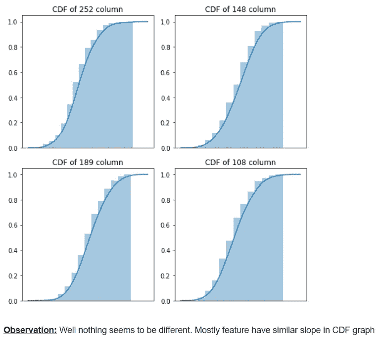

# 卡格尔竞赛-不要过度拟合 2

> 原文：<https://medium.com/analytics-vidhya/kaggle-competition-dont-overfit-ii-74cf2d9deed5?source=collection_archive---------4----------------------->


嗨伙计们！

我刚刚开始我的第一个 Kaggle 竞赛问题— *不要过度拟合 II* 。 **Kaggle** 网站很适合练习机器学习或深度学习问题，在那里你可以找到不同类型的问题，可以尝试不同的技术，并适应学习我们可以应用哪些技术的场景。

在继续写这篇博客之前，我列出了将要在这里解释的内容。让我们开始吧！

1.  Kaggle 问题
2.  相关著作
3.  我的方法除了相关的工作
4.  探索性数据分析
5.  特征工程
6.  我的第一次切入
7.  建模
8.  实验和结果
9.  结论
10.  未来的工作
11.  参考

# 1.Kaggle 问题

不要过度配合！II 是一个具有挑战性的问题，我们必须避免模型在给定非常少量的训练样本的情况下过度拟合(或以不正当的方式学习)。

正如卡格尔所说，

> “这是一场挑战普通人的比赛，仅使用 250 个训练样本就能模拟 20，000x200 的连续变量矩阵…而不会过度拟合。”

**数据来源—**

> 数据集可在此下载:
> 
> [https://www.kaggle.com/c/dont-overfit-ii/overview](https://www.kaggle.com/c/dont-overfit-ii/overview)

因此，在给定少量训练数据的情况下，我们必须仔细完成任务，以避免容易过度拟合。

***我们需要预测什么？*** 我们预测与包含 300 个连续特征值的每一行相关联的二进制目标值(二进制分类)。也不会过度拟合给定的最小训练样本集。

**评估—**

根据 Kaggle 问题陈述，将根据预测目标和实际目标之间的[**【AUROC】**](https://towardsdatascience.com/understanding-auc-roc-curve-68b2303cc9c5)**(受试者操作者特征下的区域)**来评估分数。

ROC —它计算二元分类在不同阈值下的性能度量。测量 ROC 后得到曲线，我们求出 ROC 曲线下的面积。这就是所谓的中华民国下的地区。

由于训练数据量很小，我们可以用**机器学习**模型轻松完成这项任务。

# 2.相关著作

1.  超参数调整(Blog:[https://towardsdatascience . com/hyperparameter-Tuning-c 5619 e 7e 6624)](https://towardsdatascience.com/hyperparameter-tuning-c5619e7e6624))—它使用岭、套索、弹性、套索(最小角度回归时套索模型拟合)、贝叶斯岭回归、逻辑回归和 SGD 分类器，用于机器学习模型，并评估平均交叉验证分数及其标准偏差。参数保持默认值。发现逻辑回归和 SGD 是最好的两个模型。然后，他们只在这些模型中应用调优策略(GridSearchCV 和 RandomSearchCV)。在逻辑回归模型中使用 GridSearchCV 得到的最佳 CV 分数(不是 Kaggle 分数): **0.789**
2.  只是不要过度拟合(博客:[https://medium . com/analytics-vid hya/just-Don-Overfit-e 2 fddd 28 EB 29)](/analytics-vidhya/just-dont-overfit-e2fddd28eb29))—它使用标准化来拟合训练数据中-1 和 1 之间的范围，并根据训练数据评估的平均值和标准偏差来转换测试数据。使用回归模型 LASSOCV(最小绝对收缩和选择运算符交叉验证)。该套索模型用于寻找超平面，该超平面通过具有绝对权重的附加收缩参数𝜆来减少残差，以避免过度拟合，并且他们使用不同的𝜆值进行交叉验证，以找到正确的超平面。测试数据得分: **0.843**
3.  不要过度配合！—如何防止在你的深度学习模型中过度拟合(Blog:[https://nilsschlueter . de/Blog/articles/don-over fit-% E2 % 80% 8A-% E2 % 80% 8A 如何防止在你的深度学习中过度拟合%C2%A0models/)](https://nilsschlueter.de/blog/articles/dont-overfit-%E2%80%8A-%E2%80%8Ahow-to-prevent-overfitting-in-your-deep-learning%C2%A0models/)) —它使用基本模型作为 MLP 深度学习，它包含两个隐藏层:128 个单元和 64 个单元。由于它是一个二元分类器，loss 使用了二元交叉熵和 Adam 优化器。Kaggle 评分: **59** %。接下来，他们创建了一个简化的模型，其中包含一个隐藏的第 8 层单元，并应用了辍学率为 0.4 的辍学层。此外，他们将早期回调置于 val_loss，耐心为 3。对于这款新车型，Kaggle 得分达到了 **80** %。
4.  如何不过度拟合(内核:[【https://www.kaggle.com/artgor/how-to-not-overfit】)](https://www.kaggle.com/artgor/how-to-not-overfit))—执行 EDA:绘制费用特征、特征之间的相关分数，并进行基本建模(逻辑回归)。得到了卡格尔分数: **0.7226。**使用 ELI5 工具，为模型赋予权重重要性。观察并提取了前 32 个重要性，并再次训练基本建模。卡格尔得分: **0.7486。**总之，在执行了各种特征选择技术(如置换重要性、SHAP 和 SequentialFeatureSelector)后，它并没有太大的改进。然后，他们使用超参数执行不同的模型—逻辑回归、高斯朴素贝叶斯、Adaboost、Extratrees、随机森林、高斯过程分类、支持向量分类(SVC)、kNN、伯努利朴素贝叶斯、SGD。融合 Logistic 回归和 SVC，Kaggle 评分: **0.831。**他们尝试了特征工程，如多项式特征、添加统计数据、通过 k=5 的 kNN 计算平均、最大和最小距离来添加距离特征。然后使用 sklearn 软件包执行几个特征选择，如百分位、选择最佳、RFE，并应用模型逻辑回归和 GLM。尽管如此，简历得分仍然低于 80%。

# 3.我的方法除了相关的工作

我又做了 5 处修改

1.  应用**特征工程**
2.  应用过采样技术: **SMOTE(合成少数过采样技术)**
3.  使用特性正向选择执行该型号的**最高重要性特性**并再次训练。
4.  使用 **PCA** 和**截断奇异值分解**应用降维技术
5.  校准模型

# 4.探索性数据分析

> **关于数据集**

关于 **train.csv** — 250 个样本和 300 个特征，1 个类别标签和 1 个 Id: (250，302)

关于 **test.csv** — 19750 个样本和 300 个特征以及 1 个 Id: (19750，301)


[Kaggle 源](https://www.kaggle.com/c/dont-overfit-ii/data)


> **描述培训数据**

```
df_train.describe()
```


训练数据的信息(只是为了检查是否有任何缺失值)

```
df_train.info()
```


> **概率密度函数(PDF) **

> 来自维基百科
> 
> 更准确地说，PDF 用于指定[随机变量](https://en.wikipedia.org/wiki/Random_variable)落在特定值范围内*的概率，而不是采用任何一个值。*

现在，让我们观察每个特征如何遵循哪种类型的分布。


让我们看看每个特征是如何相互重叠的。


让我们看看每个特性是如何根据目标值重叠的。


> **累积密度函数(CDF) **

> 来自维基百科
> 
> 在概率论和统计学中，实值随机变量 **X、**或只是 X 的分布函数的累积密度函数，评估为 **X** ，是 **X** 取值小于或等于 **x.** 的概率

让我们看看每个特性的 CDF。



让我们试着将 **CDF** 互相重叠，看看剧情的不同。


让我们看看每个特性是如何根据目标值重叠的。


> **箱线图**


> **小提琴情节**


> **散点图**


> **在 2D 可视化(使用 TSNE) **


在 3D 绘图中，


> **平衡数据集如何？不平衡还是平衡？**

注意非常重要！


这不是高度不平衡的数据，但还过得去。

# 5.特征工程

所有的特征都是连续的。因此，我创建了**基本统计数据**，如均值和标准差、**三角函数**、**双曲线函数、**和**指数函数**。

> **每个样品的平均值和标准偏差值**


> **三角函数**

在这里，我定义了 visual_fe 来绘制应用特征工程后的实际特征 vs

让我们看看将三角函数应用于实际特征数据后的图形，然后根据目标值进行比较。

对于 **sin(x)** 功能


对于 **cos(x)** 功能


对于 **tan(x)** 功能


之后，我们取每个三角函数'的'**平均值**


> **双曲线函数**

同样，看看它是如何转变的。

对于 **sinh(x)** 功能


对于 **cosh(x)** 功能


对于 **tanh(x)** 功能


同样，我们也取其双曲函数''的平均值'**。**


> **指数函数**

对于 **exp(x)** 函数，


对于 **exp(x)-1**


对于 **2^(x)** 功能


取**‘每个指数函数的平均值’**。


> **一些多项式运算**

像 x、x 和 x⁴，取**‘每个多项式运算的平均值’**


为了可视化

对于 **x** ，


对于 **x** ，


对于 **x⁴** ，


> **总结成单个函数**

# 6.我的第一次切入

到目前为止，我们研究了数据，如给定的训练样本的数量，每个特征如何遵循哪种类型的分布，数据集是平衡的还是不平衡的，等等。我们也看到一些使用基础数学的基本特征工程。

现在，“既然这是一个不平衡的数据集，我们必须先处理它”。

**我的第一点(或理解解决问题的方法):**

有两种方法[处理](https://towardsdatascience.com/methods-for-dealing-with-imbalanced-data-5b761be45a18)使用:**欠采样**和**过采样**技术。

**欠采样**是指通过重采样来减少多数类样本的数量。怎么会？我们从多数类中随机抽取' *n* '个样本，这样' *n* '就是相同数量的少数样本。


欠采样技术的图示和示例

缺点:我们丢失了多数类的一些信息(当从 990 个样本中重新采样只得到 10 个样本时，我们丢失了上图中目标类 1(或多数类)的 980 条信息)。

**过采样**是指我们**根据相似的特征或属性添加新的合成数据**或者创建**少数类的重复数据**以增加与多数类样本数量相同的样本数量。


过采样技术的图示和示例

[**SMOTE**](https://machinelearningmastery.com/smote-oversampling-for-imbalanced-classification/) **(合成少数过采样技术)**是过采样技术之一。

> 它是如何工作的？具体来说，首先从少数类中随机选择一个例子。
> 
> 2.然后找到该示例的最近邻居的' *k'* (通常 *k=5* )。
> 
> 3.选择随机选择的邻居，并且在特征空间中两个样本之间的随机选择点处创建合成样本。
> 
> 本[博客](http://rikunert.com/SMOTE_explained)中的示例和插图。

**第二点:**

因为我们知道这是一个不平衡的数据集，AUROC 是用作评估指标的正确方法。

> **注**:
> 
> 我们应该意识到为什么我们不能使用**精确度**作为衡量标准。现在，我们知道这个数据集是不平衡的，所以对于这种问题来说准确性不好。

**第三点**:

这个不平衡的数据集并不严重不平衡，但还过得去。所以，我们不知道哪个效果最好，所以我们将尝试用 SMOTE 做**，不用 SMOTE** 做**。**

**第四点**:

由于它是一个不平衡的数据集，我们不能将模型的预测引入**不确定性**。我们需要校准我们的模型。

**最后一个** **点**:

这类问题是一个**二元分类**，我们将从那些用于分类目的的模型中进行预测。

现在，我们必须将数据带入界限范围内，这也被称为**特征缩放**。有两种方法可以做到这一点:**规范化**和**标准化**。

**标准化**是一种挤压技术，将每个特征的所有值带入 0 到 1 之间的范围，每个特征的参数值为最大值和最小值。


**标准化**是一种挤压技术，将所有特征移动到一个平均位置，并从平均位置取一个标准偏差，即，将所有值从平均位置移动到范围-1 和 1。参数是平均值和标准偏差。


没有经验法则是最好的。因此，我们将尝试规范化和标准化。

# 7.建模

我用了 7 个带超参数的模型。

1.  k-最近邻
2.  逻辑回归
3.  支持向量分类
4.  随机森林
5.  XGBoost(优化分布式梯度增强)
6.  堆积分类器
7.  投票分类器

我用 sklearn 工具包提供的带分层目标变量的交叉验证的 GridSearchCV 来使用超参数。

建模与其他相关工作的不同之处在于**超参数调整后的每个模型都有一个“校准模型”**。因此，在拟合最佳超参数后，我将这些模型传递到[校准](https://scikit-learn.org/stable/modules/calibration.html)，因为我之前已经说过，“由于数据集是不平衡的数据集，它会将模型的预测引入**不确定性**”。(见下图)


我还展示了图 ROC 和每个模型的特征重要性。(在这里展示所有的情节是不可行的。可以查看结论部分末尾的代码)

在下面这段代码中，我创建了 4 个函数，在每个函数中，我还编写了 docstring 并解释了应该传递什么类型的变量以及将返回什么。

在继续“实验和结果”之前，让我们来看看我已经完成的一些其他操作:

# 最重要的功能:

为了找到最重要的特征。首先我训练了模型(特别是)。在同一个模型中，我通常会找到能够赋予该模型更多重要性的最佳特性。所以，我使用了**前进特征选择**。

这个想法很简单:

1.  初始化你渴望的最重要的特征的数量。
2.  迭代训练数据中的所有特征。
3.  当你期望的条件得到满足，或者添加新特性后交叉验证分数没有提高时，停止。

如下图所示:

<f f="" fn="">是特征列表，在模型中，一个用于基于特征训练数据，另一个用于测试数据以评估该特征的得分。</f>


下面是上述例子的截取代码。

# 降维技术:

1.  **PCA(主成分分析):**这是一种降维技术，它找到给出最大信息的轴(或 PCA 成分)的方向。组件的数量(或所需的尺寸 d’)可以通过绘制解释的方差比与 d(特征数量)的关系来确定


绘制解释方差比与 d 的关系图，找出 PCA 中的成分数

从上图中，我们可以得出结论，理想的维数 d' = 175 相当不错，它保留了大约 90–99%的数据。

2. **TruncatedSVD:** 它来源于矩阵分解的概念。SVD 代表单值分解，它试图将一个矩阵分解成矩阵的乘积。


其中 U 是左奇异矩阵，V 是右奇异矩阵，∑是对角矩阵。阅读 [pdf](https://www.cse.unr.edu/~bebis/CS791E/Notes/SVD.pdf) 了解更多信息。

在截断奇异值分解中，我们选择了 k 维而不是 d 维。考虑 k 尺寸后，见下图(移除显示的其余 d 尺寸数据)


为了找到正确的 **k** 维度，我们绘制了解释方差比与 d 维度的关系图。


我们认为 k=175 是数据约为 90–95%的维度。

# 8.实验和结果

> **1。SMOTE + FE +标准化+ ML 分类模型**


> **2。SMOTE + FE +归一化+ ML 分类模型**


> **3。SMOTE +标准化+ ML**


> **4。平滑+归一化+ ML**


> **5。标准化+带/不带顶级特性的 ML 分类模型**


> **6。具有/不具有顶级特性的标准化+ ML 分类模型**


> **7。FE +降维+标准化+ ML 分类模型(PCA d' = 100)**


> 8。FE +降维+标准化+ ML 分类模型(PCA d' = 175)


> 9。FE +降维+标准化+ ML 分类模型(TruncatedSVD d' = 175)


我迄今为止的最好成绩！


左栏是私人得分(0.833)，右栏是公共得分(0.839)

# 9.结论

1.  我们执行了 EDA，目标基础上的大多数功能是重叠的。人们认为任何模型都很难预测。
2.  我们使用基本统计、三角函数、双曲函数和指数函数执行特征工程，还显示了应用特征工程后实际特征与的关系图，以及基于目标标签的特征工程图。
3.  如果你观察实验 1、2 和 3、4，通过应用特征工程，我们得到了比没有应用特征工程更高的分数。
4.  我们应用前向特征选择来仅获得那些在实验 5 和 6 中给出更多 AUROC 分数的特征。我们得到了比考虑所有特征更高的分数。
5.  我们尝试降维，看看在实验 7、8 和 9 中可能会得到更好的结果。但是没有运气，比考虑所有特性还要差。

之后，我对结果不满意。我通过[讨论](https://www.kaggle.com/c/dont-overfit-ii/discussion/91883)了解到，通过使用 **LB 探查**策略，我们可以进入前 5-10%。然而，这种策略并不用于真实的案例场景，甚至不是学习这些类型的技术的好方法，因为这些技术不能应用于真实的业务问题。

不管怎样！没关系。重要的是解决不同类型的问题，尝试找到不同的方法、策略和实验(我所说的策略是指那些我们也可以应用于实际商业问题的策略。不像 LB 探测)。任何问题都没有单一的解决方案。要成为某个领域的专家，要做大量的项目，多练习，通过阅读研究论文学习新的方法，阅读几个博客，并不断尝试。

# 10.未来的工作

1.  尝试使用[递归特征消除](https://machinelearningmastery.com/feature-selection-in-python-with-scikit-learn/)来获得特征重要性。
2.  试着用和我一样的方法，但是不要校准它。然后比较经过校准的模型和未经校准的模型，哪一个性能更好？
3.  尝试[结合欠采样和过采样策略](https://machinelearningmastery.com/combine-oversampling-and-undersampling-for-imbalanced-classification/)。也就是说，多数阶级中的一个会减少，而少数阶级中的另一个会增加样本。它不需要与多个少数类样本或多数类样本相同。

# 11.参考

1.  超参数调优(多数投票博客:[https://towardsdatascience . com/hyperparameter-Tuning-c 5619 e 7 e 6624)](https://towardsdatascience.com/hyperparameter-tuning-c5619e7e6624))
2.  只是不要过度拟合(博客:[https://medium.com/analytics-vidhya/just-dontoverfit-](/analytics-vidhya/just-dontoverfit-)e 2 fddd 28 EB 29)
3.  不要过度配合！—如何防止深度学习模型中的过度拟合(Blog:[https://nilsschlueter . de/Blog/articles/don-overfit-% E2 % 80% 8A-](https://nilsschlueter.de/blog/articles/dont-overfit-%E2%80%8A-)% E2 % 80% 8A 如何防止深度学习中的过度拟合%C2%A0models/)
4.  如何不过度拟合(投票最多的内核:h[ttps://www . ka ggle . com/art gor/how to-](https://www.kaggle.com/artgor/howto-)不过度拟合)
5.  申请课程:【www.appliedaicourse.com 

感谢您的阅读！下面是我在 Github 中的 [Linkedin 简介](http://linkedin.com/in/sahil-40a621168)和[代码。](https://github.com/sahilsharma884/Dont_OverfitII)