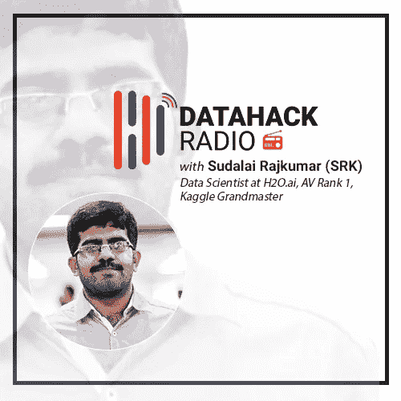

# Kaggle 大师 SRK 的旅程和对数据科学竞赛的建议

> 原文：<https://medium.com/analytics-vidhya/kaggle-grandmaster-srks-journey-and-advice-for-data-science-competitions-261c1581cb72?source=collection_archive---------0----------------------->

# 介绍

女士们，先生们，有请分析 Vidhya 的顶级社区成员和 Kaggle 大师——Sudalai Raj Kumar，又名 SRK！

他是数据科学界的一个灵感和谜。我有幸在 2018 年 DataHack 峰会上见到了他，并被他的谦逊和智慧所折服。我第一时间抓住机会让他上了我们的 DataHack 播客。

无论是他敏锐的分析能力，丰富的经验，还是脚踏实地的态度，我们都可以从 SRK 身上学到一些东西。在这一集里，我们将讲述:

*   SRK 的背景和他的第一次分析
*   他向数据科学的转变
*   参加数据科学竞赛的优势
*   竞争如何在日常行业中发挥作用
*   一位 Kaggle 大师给有抱负的数据科学家的建议

还有很多很多！

在这篇文章中，我挑选了 SRK 与库纳尔讨论的要点。快乐聆听！

DataHack Radio 现在出现在所有流行的播客平台上。今天就订阅，收听这一集和下面所有以前的剧集:

*   [**音云**](https://soundcloud.com/datahack-radio)
*   [**分析 Vidhya**](https://www.analyticsvidhya.com/blog/category/podcast/)
*   [**iTunes**](https://itunes.apple.com/in/podcast/datahack-radio/id1397786677?mt=2)
*   [**谷歌播客**](https://www.google.com/podcasts?feed=aHR0cDovL2ZlZWRzLnNvdW5kY2xvdWQuY29tL3VzZXJzL3NvdW5kY2xvdWQ6dXNlcnM6NDU5MzM1NzYwL3NvdW5kcy5yc3M%3D)

# SRK 的背景

> “在数据中寻找模式是我喜欢做的事情。”

SRK 的背景和数据科学之旅并不简单。他于 2010 年从 PSG 工程学院获得机械工程学士学位。在那里的最后一年，他收到了两份工作邀请——一份来自机械领域，另一份来自一家分析公司。

请记住，这是在“数据科学”这个术语还没有被创造出来的时候。这是普通的旧分析。在权衡了两个提议后，SRK 选择了分析选项。处理数据和寻找模式激起了他的好奇心，这导致他第一次涉足这一领域。

但他并没有马上开始从事分析项目。他更多的是一个软件工程的角色(相当多的我们的社区将涉及到这一点！).SRK 的职责包括编写代码，将分析师构建的模型投入生产。他当时与 Python 合作，正如他承认的那样，事后看来这是一个幸运的突破。

如今，我们可能已经熟悉了 *pandas* 和 *numpy* ，但在当时，SRK 专门处理原生 Python 函数(列表、元组、字典等)。).

# 从软件工程到数据科学的过渡

一年的工作足以让我问这样一个问题——我该何去何从？我们大多数人都经历过这种情况，SRK 在 2011 年勇敢地面对了这种情况。他在同一个组织内得到了一个机会，进入了一个分析角色。

当时哪些工具被认为是最先进的？你们中有经验的读者会记得，Python 和它现在的样子并不接近。我们现在使用的很多包装在八年前并不存在。相反，R 主要用于执行探索性分析和构建模型。当然，北欧航空也占有很大的市场份额。部署和生产是用 Python 完成的。任务分工明确，对吗？

在他的角色转换期间，SRK 在最初的一年左右和 R 一起工作。然后，他转而使用 Python 进行建模工作。

那时他的工作主要在金融领域。他研究过不同种类的信用风险模型、权重风险模型、营销模型等。最初，他的团队使用线性和逻辑回归模型。但焦点慢慢转移到更高级的机器学习技术，如随机森林和 GBMs。

这是深度学习开始渗透到主流应用的时期。鉴于他对模式和尝试新事物的偏好，SRK 开始使用像 Theano 和 PyBrain 这样的库来试验一些深度学习模型。

# 参加数据科学竞赛

在分析项目的第一年，SRK 开始在工作环境之外阅读和学习分析。他坦率地承认，在某一点上，他认为分析只是线性和逻辑回归！🙂显示了自学在我们的生活中起着多么大的作用。

他在学习阶段接触了机器学习算法的世界。但是除了建立线性模型，他的日常工作并不涉及其他任何事情。就在那时，SRK 发现了数据科学竞赛的用处。

与现在相比，那时参加这些比赛要困难得多。没有博客或 MOOCs 教人如何破解竞赛。SRK 依靠图书馆的官方文档页面和他自己的分析敏锐度来找出前进的方向。实验和学习确实花了很多时间，但这对他的学习帮助很大。

但是在这里，最好的和其他人是分开的——**SRK 平均每天下班后花 3-5 个小时学习新概念或重温旧概念。这是我们在这个领域取得成功所需的努力程度。**

# 参加数据科学竞赛对行业角色有帮助吗？

这个问题我们已经听过很多次了。有谁比卡格尔大师更适合回答这个问题呢？

SRK 在分析领域的第一个角色是在 R&D 方面。所以他有余地试验新的算法。他通过数据科学竞赛获得的知识和经验在这里派上了用场。它不再是在工作中学习，而是更多的是在工作中尝试。我们都可以为之奋斗的东西！

诚然，并不是所有人都有机会在日常工作中尝试新的算法。但是我们从这些黑客马拉松中获得的知识是无价的。它不仅限于应用新技术。批判性思维、头脑风暴、与数字打交道(数据直觉)、结构化思维、实验能力——这些特征将帮助你做出商业决策。你可能不会马上看到它发生，但耐心是成功的关键，尤其是在数据科学领域。

# 背后的秘密在比赛开始后几小时内提交了第一份材料

这一直吸引着我。每当分析网站 Vidhya 或 Kaggle 上出现新的竞争页面，SRK 通常会在几个小时内准备好他的第一份提交材料。这怎么可能呢？

事实证明，大多数经常参加这些比赛的人在数据集发布之前就已经准备好了通用代码库。他们只是根据问题陈述修改代码。超参数调整和所有其他实验都是在此之后完成的。

# 给有抱负的数据科学家的建议

*   **获得实践经验:**了解算法背后的理论和直觉固然很好，但获得实际操作经验才是金矿所在。尝试获取真实世界的数据集。看看你能从中挤出什么来。当你坐在面试环境中时，这将是无价的
*   **参加黑客马拉松:**参加竞赛有助于你了解自己在社区中的地位
*   尝试自己构思一个问题陈述:我真的很喜欢这个建议。我们无法在黑客马拉松的环境中获得行业经验。相反，你可以试着提出一个你觉得可能对某人有帮助的问题。然后在此基础上收集相关数据。解决问题，并通过博客或 GitHub 展示出来。这是一项艰苦的工作，但它会比你预期的更快地转化为成果
*   **挑选一个领域:**这很关键。如此多有抱负的数据科学家漫无目的地四处申请他们没有任何经验(甚至没有兴趣)的领域的工作。选择一个你感兴趣的领域，并尝试寻找数据集来工作

# 结束注释

赢得数据科学竞赛是一项艰巨的任务。在我参加的任何热门比赛中，我都努力进入前 10 名。在本期节目中，SRK 给了我们很多实用的建议，应该可以帮助你简化学习过程。

这一集你最喜欢的部分是什么？如果你有幸见过 SRK，我很想知道你的经历。

*原载于 2019 年 1 月 24 日*[*【www.analyticsvidhya.com】*](https://www.analyticsvidhya.com/blog/2019/01/datahack-radio-tips-crack-data-science-competitions-kaggle-grandmaster/)*。*