# [Kaggle]房价预测—最高 13%

> 原文：<https://medium.com/analytics-vidhya/kaggle-housing-price-prediction-top-13-393a52d914af?source=collection_archive---------1----------------------->


(来源:[https://www . biz journals . com/Columbus/news/2018/10/06/heres-why-m-I-thinks-Columbus-is-ready-for-denser . html](https://www.bizjournals.com/columbus/news/2018/10/06/heres-why-m-i-thinks-columbus-is-ready-for-denser.html)

在泰坦尼克号生存预测之后，我继续从事另一个具有更大数据集的项目，以提高我的数据处理和特征工程技能。在 Kaggle，房价预测比赛是另一个适合初学者的好项目。这一次预测是数字，不同于泰坦尼克号的生存预测是“是/否”。我们开始吧！

# 索引

1.  背景
2.  探索性数据分析
3.  缺失数据/异常值的插补
4.  数据差异/多重共线性
5.  数据转换
6.  特征创建
7.  歪斜
8.  模型
9.  提交

# 1.背景

**挑战**

请购房者描述他们梦想中的房子，他们可能不会从地下室天花板的高度或靠近东西向铁路开始。但是这个游乐场竞赛的数据集证明，影响价格谈判的远不止卧室的数量或白色尖桩栅栏。

有 79 个解释变量描述了(几乎)爱荷华州埃姆斯住宅的每个方面，这个比赛挑战你预测每个家庭的最终价格。

**练习技能**

1.  创造性特征工程
2.  高级回归技术，如随机森林和梯度推进

**确认**

Ames Housing 数据集由 Dean De Cock 编制，用于数据科学教育。对于寻找经常被引用的波士顿住房数据集的现代化和扩展版本的数据科学家来说，这是一个令人难以置信的替代方案。

# 2.探索性数据分析

导入库:

```
import numpy as np
import pandas as pd
import seaborn as sns
import warnings
from math import sqrt
from matplotlib import pyplot as plt, rcParams
from numpy import median
from scipy.special import boxcox1p
from scipy.stats import skew
from sklearn.feature_selection import VarianceThreshold
from sklearn.linear_model import Lasso, LassoCV
from sklearn.metrics import mean_squared_error
from sklearn.model_selection import cross_val_score, GridSearchCV, KFold
from sklearn.preprocessing import LabelEncoderwarnings.filterwarnings(‘ignore’)
```

导入数据:

```
df_train = pd.read_csv(‘train.csv’)
df_test = pd.read_csv(‘test.csv’)
```

数据结构:

```
df_train.info()Output:
<class 'pandas.core.frame.DataFrame'>
RangeIndex: 1460 entries, 0 to 1459
Data columns (total 81 columns):
Id               1460 non-null int64
MSSubClass       1460 non-null int64
MSZoning         1460 non-null object
LotFrontage      1201 non-null float64
LotArea          1460 non-null int64
Street           1460 non-null object
Alley            91 non-null object
LotShape         1460 non-null object
LandContour      1460 non-null object
Utilities        1460 non-null object
LotConfig        1460 non-null object
LandSlope        1460 non-null object
Neighborhood     1460 non-null object
Condition1       1460 non-null object
Condition2       1460 non-null object
BldgType         1460 non-null object
HouseStyle       1460 non-null object
OverallQual      1460 non-null int64
OverallCond      1460 non-null int64
YearBuilt        1460 non-null int64
YearRemodAdd     1460 non-null int64
RoofStyle        1460 non-null object
RoofMatl         1460 non-null object
Exterior1st      1460 non-null object
Exterior2nd      1460 non-null object
MasVnrType       1452 non-null object
MasVnrArea       1452 non-null float64
ExterQual        1460 non-null object
ExterCond        1460 non-null object
Foundation       1460 non-null object
BsmtQual         1423 non-null object
BsmtCond         1423 non-null object
BsmtExposure     1422 non-null object
BsmtFinType1     1423 non-null object
BsmtFinSF1       1460 non-null int64
BsmtFinType2     1422 non-null object
BsmtFinSF2       1460 non-null int64
BsmtUnfSF        1460 non-null int64
TotalBsmtSF      1460 non-null int64
Heating          1460 non-null object
HeatingQC        1460 non-null object
CentralAir       1460 non-null object
Electrical       1459 non-null object
1stFlrSF         1460 non-null int64
2ndFlrSF         1460 non-null int64
LowQualFinSF     1460 non-null int64
GrLivArea        1460 non-null int64
BsmtFullBath     1460 non-null int64
BsmtHalfBath     1460 non-null int64
FullBath         1460 non-null int64
HalfBath         1460 non-null int64
BedroomAbvGr     1460 non-null int64
KitchenAbvGr     1460 non-null int64
KitchenQual      1460 non-null object
TotRmsAbvGrd     1460 non-null int64
Functional       1460 non-null object
Fireplaces       1460 non-null int64
FireplaceQu      770 non-null object
GarageType       1379 non-null object
GarageYrBlt      1379 non-null float64
GarageFinish     1379 non-null object
GarageCars       1460 non-null int64
GarageArea       1460 non-null int64
GarageQual       1379 non-null object
GarageCond       1379 non-null object
PavedDrive       1460 non-null object
WoodDeckSF       1460 non-null int64
OpenPorchSF      1460 non-null int64
EnclosedPorch    1460 non-null int64
3SsnPorch        1460 non-null int64
ScreenPorch      1460 non-null int64
PoolArea         1460 non-null int64
PoolQC           7 non-null object
Fence            281 non-null object
MiscFeature      54 non-null object
MiscVal          1460 non-null int64
MoSold           1460 non-null int64
YrSold           1460 non-null int64
SaleType         1460 non-null object
SaleCondition    1460 non-null object
SalePrice        1460 non-null int64
dtypes: float64(3), int64(35), object(43)
memory usage: 924.0+ KBlen(df_test)Output:
1459
```

检查缺失数据大于 30%的要素:

```
PctMiss = df_train.isnull().sum()*100/len(df_train)
PctMiss.sort_values(ascending=False, inplace=True)PctMiss.head(10)Output:
PoolQC          99.520548
MiscFeature     96.301370
Alley           93.767123
Fence           80.753425
FireplaceQu     47.260274
LotFrontage     17.739726
GarageCond       5.547945
GarageType       5.547945
GarageYrBlt      5.547945
GarageFinish     5.547945
dtype: float64
```

前 4 个功能的缺失数据超过 70%。当然，我们必须移除它们。对于丢失了 47%数据的 FireplaceQu，我决定也删除它。

```
df_train.drop([‘Alley’, ‘FireplaceQu’, ‘PoolQC’, ‘Fence’, ‘MiscFeature’], axis=1, inplace=True)
df_test.drop([‘Alley’, ‘FireplaceQu’, ‘PoolQC’, ‘Fence’, ‘MiscFeature’], axis=1, inplace=True)
```

所以还剩下 74 个特征。让我们首先将它们分为数字特征和分类特征。

```
feature_num = df_train.drop([‘Id’,‘SalePrice’],axis=1).select_dtypes(include=[np.number]).columnsfeature_cat = df_train.select_dtypes(exclude=[np.number]).columnslen(feature_num)
len(feature_cat)Output:
36
38
```

**数字特征—分布图:**

```
nd = pd.melt(df_train, value_vars = feature_num)
n1 = sns.FacetGrid(nd, col=’variable’, col_wrap=4, sharex=False, sharey=False)
n1 = n1.map(sns.distplot, ‘value’)plt.savefig('feature_num.png') 
# due to large plot size, better save to file and open)
```

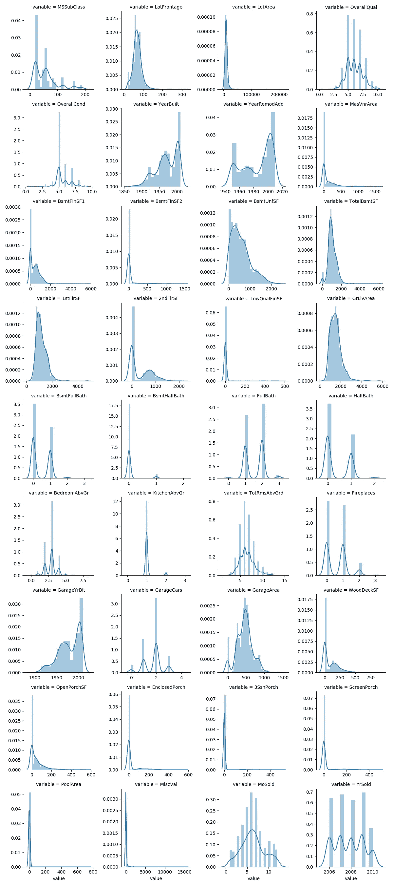

观察结果:

1.  左/右偏斜(例如 BsmtUnfSF、GarageYtBlt)
2.  异常值(例如 LotFrontage、LotArea、MasVnrArea、GrLivArea)
3.  低方差或几乎为零方差(例如，池面积、误增值)

**数字特征与销售价格—散点图:**

```
nd_num = pd.melt(df_train, id_vars=’SalePrice’, value_vars = feature_num)
n1 = sns.FacetGrid(nd_num, col=’variable’, col_wrap=4, sharex=False, sharey=False)
n1 = n1.map(sns.scatterplot, ‘value’, ‘SalePrice’)
plt.savefig('feature_num_vs_SalePrice.png')
```

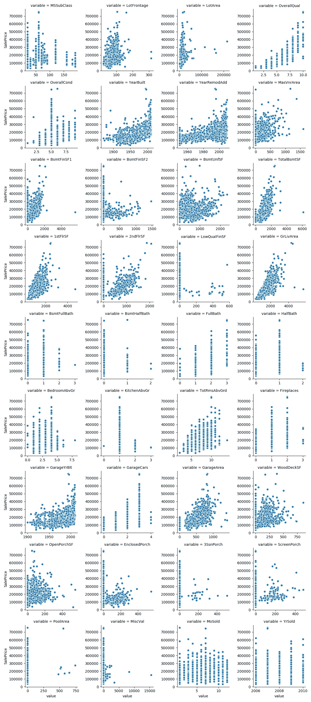

观察结果:

1.  与销售价格高度相关的特性(例如，总体质量、GrLivArea、1stFlrSF)
2.  一些具有大量零值，并且似乎与销售价格不相关(例如，LowQualFinSF、WoodDeckSF、ScreenPorch)。

**分类特征—计数图:**

```
nd_cat = pd.melt(df_train, value_vars = feature_cat)
n2 = sns.FacetGrid(nd_cat, col=’variable’, col_wrap=4, sharex=False, sharey=False)
n2 = n2.map(sns.countplot, ‘value’)plt.savefig('feature_cat.png')
```

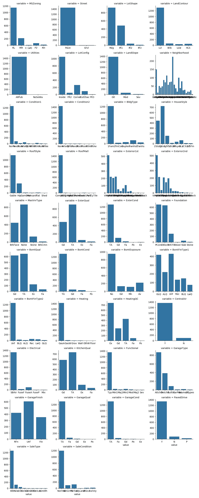

观察结果:

1.  巨大的多样性(例如邻里关系)
2.  低方差或几乎为零方差(例如，公用设施、条件 2、屋顶材料、供暖)

**分类特征与销售价格—箱线图:**

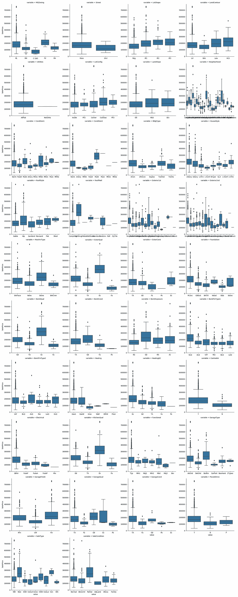

观察结果:

1.  具有销售价格指示力的特征(例如，ExterQual、Neighborhood)
2.  无销售价格指示能力的特征(例如，Landslope、BldgType、BsmtFinType2)

# 3.缺失数据/异常值的插补

**数字特征—缺失数据:**

```
PctMiss_num_train = df_train[feature_num].isnull().sum()*100/len(df_train)
PctMiss_num_train.sort_values(ascending=False, inplace=True)PctMis_num_train.head(10)Output:
LotFrontage     17.739726
GarageYrBlt      5.547945
MasVnrArea       0.547945
YrSold           0.000000
BsmtFinSF2       0.000000
LowQualFinSF     0.000000
2ndFlrSF         0.000000
1stFlrSF         0.000000
TotalBsmtSF      0.000000
BsmtUnfSF        0.000000PctMiss_num_test = df_test[feature_num].isnull().sum()*100/len(df_test)
PctMiss_num_test.sort_values(ascending=False, inplace=True)PctMis_num_test.head(10)Output:
LotFrontage     15.558602
GarageYrBlt      5.346127
MasVnrArea       1.028101
BsmtHalfBath     0.137080
BsmtFullBath     0.137080
GarageArea       0.068540
BsmtFinSF1       0.068540
BsmtFinSF2       0.068540
BsmtUnfSF        0.068540
TotalBsmtSF      0.068540
dtype: float64
```

**停车场**

由于 LotFrontage 有相当大一部分缺失数据(即 17.7%)，我决定根据某些相关的分类特征来估算缺失数据。根据数据描述，地段临街面是与物业相连的街道的直线英尺数。因此，地段临街似乎与邻里有联系。此外，从上述计数图来看，邻域具有很大的多样性。

```
lotfrontage_by_neighborhood = df_train.groupby(‘Neighborhood’).LotFrontage.median()plt.subplots_adjust(bottom=0.2)
plt.show()
```

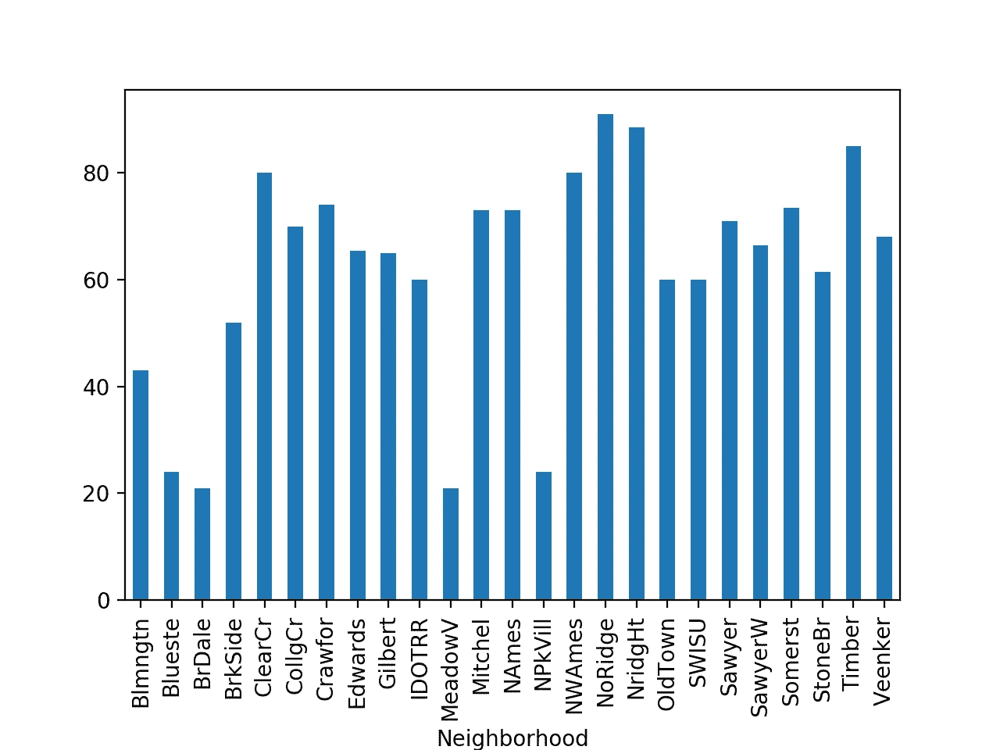

```
for ngh in lotfrontage_by_neighborhood.index:
 df_train.loc[(df_train.LotFrontage.isnull()) & (df_train.Neighborhood==ngh), [‘LotFrontage’]] = lotfrontage_neighborhood[ngh]
 df_test.loc[(df_test.LotFrontage.isnull()) & (df_test.Neighborhood==ngh), [‘LotFrontage’]] = lotfrontage_neighborhood[ngh]
```

对于其他人，只需将缺失数据估算为 0。

```
for x in feature_num:
 df_train[x].fillna(0, inplace=True)
 df_test[x].fillna(0, inplace=True)
```

**数字特征—异常值:**

```
df_train.drop(df_train[df_train.GrLivArea>4500].index, inplace=True)
df_train.drop(df_train[df_train.LotFrontage>300].index, inplace=True)
df_train.drop(df_train[df_train.LotArea>100000].index, inplace=True)
df_train.drop(df_train[df_train.MasVnrArea>1500].index, inplace=True)
df_train.drop(df_train[df_train.OpenPorchSF>500].index, inplace=True)
```

**分类特征—缺失数据:**

```
PctMiss_cat_train = df_train[feature_cat].isnull().sum()*100/len(df_train)
PctMiss_cat_train.sort_values(ascending=False, inplace=True)PctMiss_cat_train.head(10)Output:
GarageCond      5.547945
GarageQual      5.547945
GarageFinish    5.547945
GarageType      5.547945
BsmtFinType2    2.602740
BsmtExposure    2.602740
BsmtCond        2.534247
BsmtQual        2.534247
BsmtFinType1    2.534247
MasVnrType      0.547945
dtype: float64PctMiss_cat_test = df_test[feature_cat].isnull().sum()*100/len(df_test)
PctMiss_cat_test.sort_values(ascending=False, inplace=True)
PctMiss_cat_test.head(10)Output:
GarageCond      5.551748
GarageQual      5.551748
GarageFinish    5.551748
GarageType      5.551748
BsmtFinType2    2.604524
BsmtExposure    2.604524
BsmtCond        2.535984
BsmtQual        2.535984
BsmtFinType1    2.535984
MasVnrType      0.548321
dtype: float64
```

从上面的模式可以推断，缺失数据可能是由于缺少车库/地下室，因为在 Garagexxx/Bsmtxxx 中有相同数量的行存在缺失数据。因此，我决定将所有缺失的数据填写为“其他”，而不是简单地输入模式。

```
for x in feature_cat:
 df_train[x].fillna(‘Others’, inplace=True)
 df_test[x].fillna(‘Others’, inplace=True)
```

仔细检查丢失的数据。

```
df_train.isnull().sum().sum()
df_test.isnull().sum().sum()Output:
0
0
```

# 4.数据差异/多重共线性

在输入缺失数据后，让我们筛选出那些低方差(或高优势)的特征，以便为进一步的数据处理节省时间。

**数字特征—数据差异:**

```
constant_filter = VarianceThreshold(threshold=0.25) 
constant_filter.fit(df_train[feature_num])
constant_feature_num = [num for num in feature_num if num not in df_train[feature_num].columns[constant_filter.get_support()]]constant_feature_numOutput:
['BsmtHalfBath', 'KitchenAbvGr']
```

**分类特征—数据优势:**

```
constant_feature_cat = []
for x in feature_cat:
 if df_train[x].value_counts().max()/len(df_train[x]) > 0.9:
 constant_feature_cat.append(x)constant_feature_catOutput:
['Street', 'Utilities', 'LandSlope', 'Condition2', 'RoofMatl', 'Heating', 'CentralAir', 'Electrical', 'Functional', 'GarageCond', 'PavedDrive']
```

由于具有低方差/高优势的特征不具有指示能力，所以让我们将它们筛选出来，以节省进一步处理的时间。

```
for x in constant_feature_num:
 feature_num.remove(x)for x in constant_feature_cat:
    feature_cat.remove(x)
```

**数字特征-数据多重共线性:**

```
corr_matrix = df_train[feature_num + ['SalePrice']].corr()
sns.heatmap(corr_matrix, cmap=’coolwarm’, linewidths=.5, xticklabels=True, yticklabels=True)
plt.show()
```

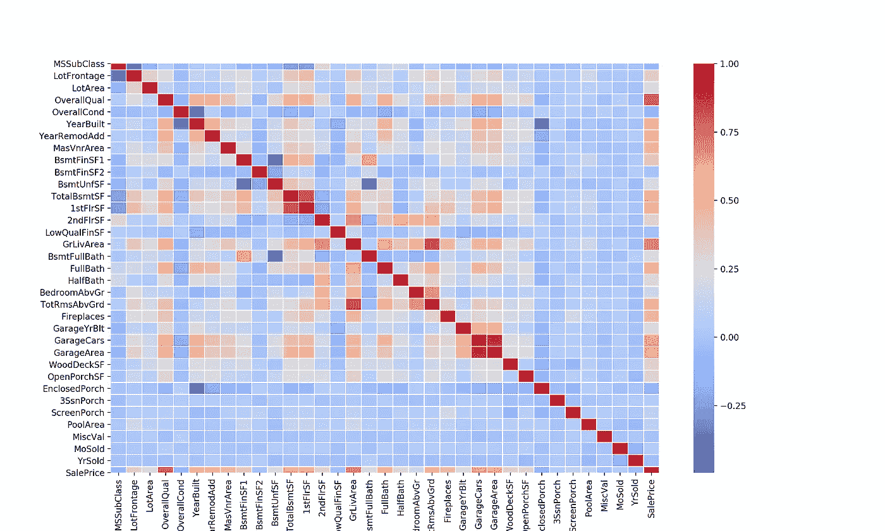

从热图中，我们可以看到一些功能彼此高度相关。由于多重共线性会影响模型精度，因此最好移除两个高度相关的要素中的一个。保留与销售价格关联度较高的。

```
def feature_corr(feature, corr_threshold):
    corr_matrix = df_train[feature + ['SalePrice']].corr()
    numToDrop = []
    numNotDrop = []
    for i in range(len(corr_matrix)):
        if corr_matrix.index[i] != 'SalePrice':
            row_corr_saleprice = abs(corr_matrix['SalePrice'][i])
            for j in range(i):
                if corr_matrix.columns[j] != 'SalePrice':
                    col_corr_saleprice = abs(corr_matrix['SalePrice'][j])
                    if abs(corr_matrix.iloc[i][j]) >= corr_threshold:
                       if row_corr_saleprice > col_corr_saleprice:
                           if corr_matrix.index[j] not in numToDrop:
                               numToDrop.append(corr_matrix.index[j])
                               numNotDrop.append(corr_matrix.index[i])
                       else:
                           if corr_matrix.index[i] not in numToDrop:
                               numToDrop.append(corr_matrix.index[i])
                               numNotDrop.append(corr_matrix.index[j])
    return numToDrop, numNotDropnumToDrop, numNotDrop = feature_corr(feature_num, 0.8)numToDrop
numToKeepOutput:
['1stFlrSF', 'TotRmsAbvGrd', 'GarageArea']
['TotalBsmtSF', 'GrLivArea', 'GarageCars']
```

由上可知，1stFlrSF 和 TotalBsmtSF 高度相关(即> 0.8)。由于 TotalBsmtSF 与 SalePrice 的相关性较高，我们将保留 TotalBsmtSF，去掉 1stFlrSF。其他两对也一样。

```
for x in numToDrop:
 feature_num.remove(x)
```

# 5.数据转换

**序数范畴特征**

对于分类特征，观察顺序特征。让我们将这些有序分类特征转换为数字。

```
qual_dict1 = {‘Others’: 0, ‘Po’: 1, ‘Fa’: 2, ‘TA’: 3, ‘Gd’: 4, ‘Ex’: 5}
df_train[‘ExterQual’] = df_train[‘ExterQual’].map(qual_dict1).astype(int)
df_test[‘ExterQual’] = df_test[‘ExterQual’].map(qual_dict1).astype(int)df_train[‘HeatingQC’] = df_train[‘HeatingQC’].map(qual_dict1).astype(int)
df_test[‘HeatingQC’] = df_test[‘HeatingQC’].map(qual_dict1).astype(int)

qual_dict2 = {‘Others’: 0, ‘Unf’: 1, ‘LwQ’: 2, ‘Rec’: 3, ‘BLQ’: 4, ‘ALQ’: 5, ‘GLQ’: 6}
df_train[‘BsmtFinType1’] = df_train[‘BsmtFinType1’].map(qual_dict2).astype(int)
df_test[‘BsmtFinType1’] = df_test[‘BsmtFinType1’].map(qual_dict2).astype(int)df_train[‘BsmtFinType2’] = df_train[‘BsmtFinType2’].map(qual_dict2).astype(int)
df_test[‘BsmtFinType2’] = df_test[‘BsmtFinType2’].map(qual_dict2).astype(int)qual_dict3 = {‘Others’: 0, ‘Unf’: 1, ‘RFn’: 2, ‘Fin’: 3}
df_train[‘GarageFinish’] = df_train.GarageFinish.map(qual_dict3).astype(int)
df_test[‘GarageFinish’] = df_test.GarageFinish.map(qual_dict3).astype(int)qual_dict4 = {‘Others’:0, ‘Reg’: 1, ‘IR1’:2, ‘IR2’:3, ‘IR3’: 4}
df_train[‘LotShape’] = df_train.LotShape.map(qual_dict4).astype(int)
df_test[‘LotShape’] = df_test.LotShape.map(qual_dict4).astype(int)feature_ordinal=[‘ExterQual’, ‘HeatingQC’, ‘BsmtFinType1’, ‘BsmtFinType2’, ‘GarageFinish’, ‘LotShape’]for x in feature_ordinal:
 feature_cat.remove(x)
```

**MSSubClass**

从数据描述中可以看出，MSSubClass 实际上是分类特征。让我们来看看 MSSubClass 的分布。

```
sns.countplot(df_train[‘MSSubClass’])
plt.show()
```

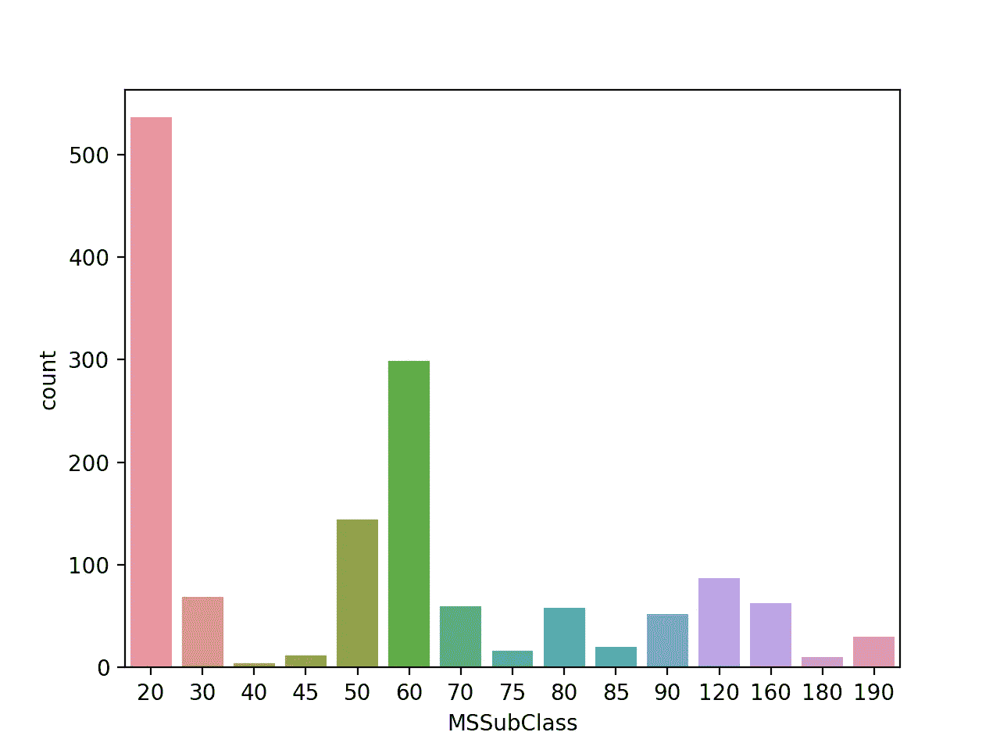

由于一些计数太少，最好将类别组合到某些组中。我决定根据销售价格的中位数对他们进行分组。

```
df_train.groupby([‘MSSubClass’])[‘SalePrice’].median().sort_values().plot(kind=’bar’)
plt.show()
```

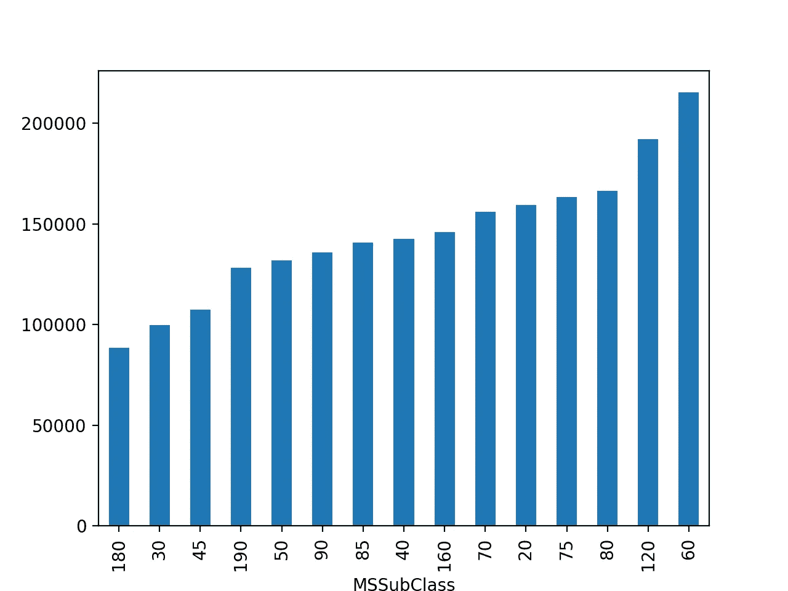

让我们把他们分成 5 组。

```
remap = {180: 1, 30: 1, 45: 1, 190: 2, 50: 2, 90: 2, 85: 2, 40: 2, 160: 2, 70: 3, 20: 3, 75: 3, 80: 3, 120: 4, 60: 5}
df_train['MSSubClass'].replace(remap, inplace=True)
sns.countplot(df_train['MSSubClass'])
plt.show()
```

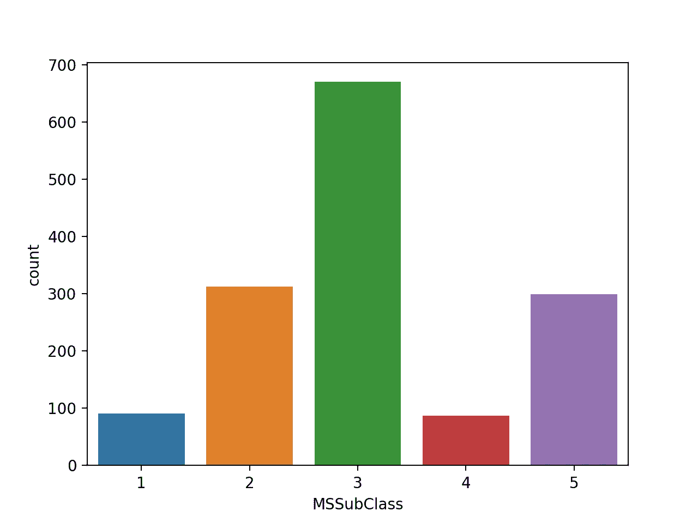

计数图看起来更适合预测。MSSubClass 现在成为序数特征。

```
feature_num.remove('MSSubClass')
feature_ordinal.append('MSSubClass')
```

对剩余的分类特征进行编码。

```
le = LabelEncoder()df_whole = df_train.append(df_test)for x in feature_cat:
    df_whole[x] = le.fit_transform(df_whole[x])df_train = df_whole[:len(df_train)]
df_test = df_whole[len(df_train):]
```

移除高度相关的特征，与之前相同。

```
catToDrop, catNotDrop = feature_corr(feature_cat, 0.8)
for x in catToDrop:
 feature_cat.remove(x)
```

# 6.特征创建

特征的加/减:

```
df_train[‘TtlPorchArea’] = df_train.OpenPorchSF + df_train.EnclosedPorch + df_train[‘3SsnPorch’] + df_train.ScreenPorch + df_train.WoodDeckSF
df_test[‘TtlPorchArea’] = df_test.OpenPorchSF + df_test.EnclosedPorch + df_test[‘3SsnPorch’] + df_test.ScreenPorch + df_test.WoodDeckSFdf_train[‘TtlFootage’] = df_train.GrLivArea + df_train.BsmtFinSF1 + df_train.BsmtFinSF2
df_test[‘TtlFootage’] = df_test.GrLivArea + df_test.BsmtFinSF1 + df_test.BsmtFinSF2df_train[‘TtlBath’] = df_train.FullBath + 0.5*df_train.HalfBath + df_train.BsmtFullBath + 0.5*df_train.BsmtHalfBath
df_test[‘TtlBath’] = df_test.FullBath + 0.5*df_test.HalfBath + df_test.BsmtFullBath + 0.5*df_test.BsmtHalfBathdf_train[‘Age’] = df_train[‘YrSold’] — df_train[‘YearBuilt’]
df_test[‘Age’] = df_test[‘YrSold’] — df_test[‘YearBuilt’]df_train[‘Remod_Age’] = abs(df_train[‘YrSold’] — df_train[‘YearRemodAdd’])
df_test[‘Remod_Age’] = abs(df_test[‘YrSold’] — df_test[‘YearRemodAdd’])df_train[‘RemodSinceBuilt’] = df_train[‘YearRemodAdd’] — df_train[‘YearBuilt’]
df_test[‘RemodSinceBuilt’] = df_test[‘YearRemodAdd’] — df_test[‘YearBuilt’]df_train[‘LivAndBsmt’] = df_train[‘GrLivArea’] + df_train[‘TotalBsmtSF’]*0.5
df_test[‘LivAndBsmt’] = df_test[‘GrLivArea’] + df_test[‘TotalBsmtSF’]*0.5feature_new_num = [‘TtlPorchArea’, ‘TtlFootage’, ‘TtlBath’, ‘Age’, ‘Remod_Age’, ‘RemodSinceBuilt’, ‘LivAndBsmt’]
for x in feature_new_num:
    feature_num.append(x)
```

二元特征:

```
df_train.loc[df_train.OpenPorchSF>0, ‘HasOpenPorch’] = 1
df_train[‘HasOpenPorch’].fillna(0, inplace=True)
df_test.loc[df_test.OpenPorchSF>0, ‘HasOpenPorch’] = 1
df_test[‘HasOpenPorch’].fillna(0, inplace=True)df_train.loc[df_train[‘2ndFlrSF’]>0, ‘Has2ndFlr’] = 1
df_train[‘Has2ndFlr’].fillna(0, inplace=True)
df_test.loc[df_test[‘2ndFlrSF’]>0, ‘Has2ndFlr’] = 1
df_test[‘Has2ndFlr’].fillna(0, inplace=True)df_train[‘HasPool’] = df_train.PoolArea.apply(lambda x: 1 if x > 0 else 0)
df_test[‘HasPool’] = df_test.PoolArea.apply(lambda x: 1 if x > 0 else 0)feature_new_cat = [‘HasOpenPorch’, ‘Has2ndFlr’, ‘HasPool’]
for x in feature_new_cat:
    feature_cat.append(x)
```

创建新要素后，再次检查任何多重共线性并将其移除。

```
numToDrop_2nd, numNotDrop_2nd = feature_corr(feature_num, 0.8)numToDrop_2nd
numNotDrop_2ndOutput:
['YearBuilt', 'YearRemodAdd', 'GrLivArea', 'TtlFootage']
['Age', 'Remod_Age', 'LivAndBsmt', 'LivAndBsmt']for x in numToDrop:
 feature_num.remove(x)
```

# 7.歪斜

```
df_whole = df_train.append(df_test)skewed = df_whole[feature_num + feature_ordinal].apply(lambda x: skew(x)
skewed.sort_values().plot(kind='bar')
plt.subplots_adjust(bottom=0.3)
plt.show()
```

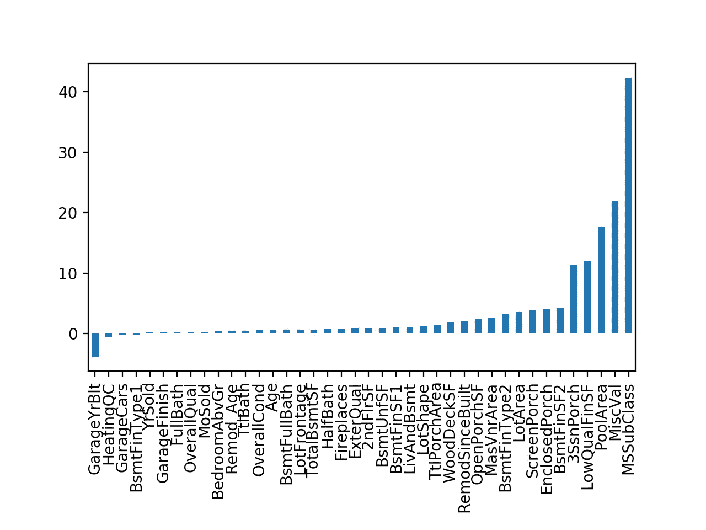

减少数字特征的偏斜度。

```
skewed_high = skewed[abs(skewed) > 0.5]
skewed_features = skewed_high.indexlam = 0.3
for x in skewed_features:
    df_whole[x] = boxcox1p(df_whole[x], lam)skewed_rev = df_whole[feature_num + feature_ordinal].apply(lambda x: skew(x))
skewed_rev.sort_values().plot(kind='bar')
plt.subplots_adjust(bottom=0.3)
plt.show()
```

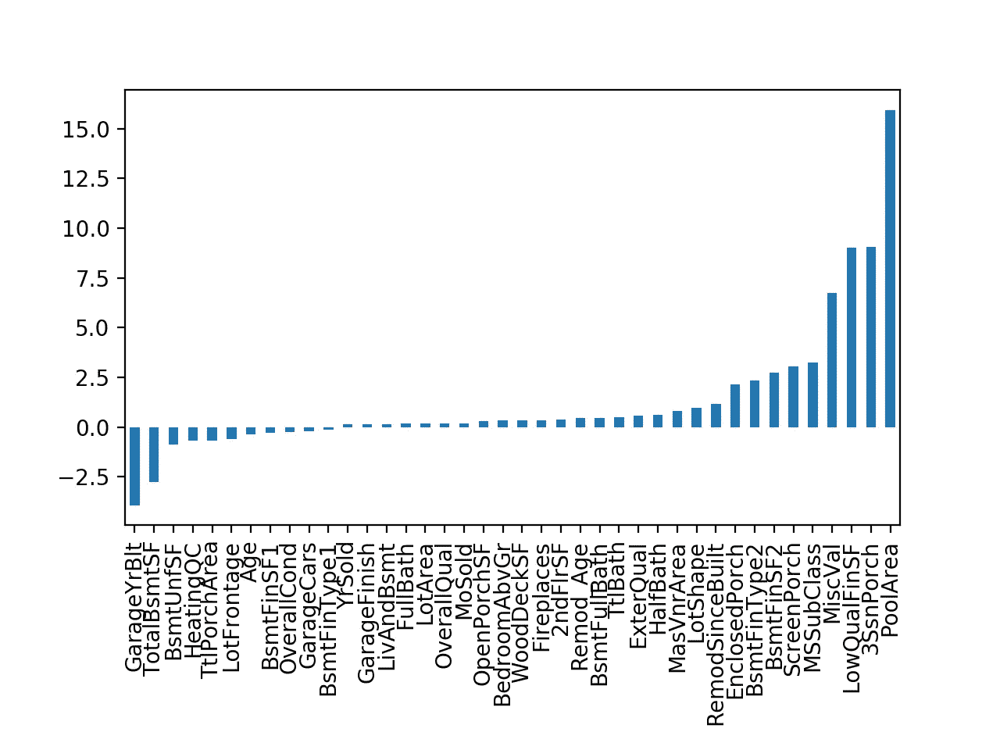

# 8.模型

最终确定用于预测的要素。

```
feature_total = feature_num + feature_ordinal + feature_cat + feature_new_bin
df_whole_final = df_whole[feature_total]
```

获取分类特征的模型。

```
df_whole_final = pd.get_dummies(df_whole_final, columns=feature_cat)df_train_final = df_whole_final[:len(df_train)]
df_test_final = df_whole_final[len(df_train):]
```

我们来看看 SalePrice 的分布。

```
sns.distplot(df_train.SalePrice)
plt.show()
```

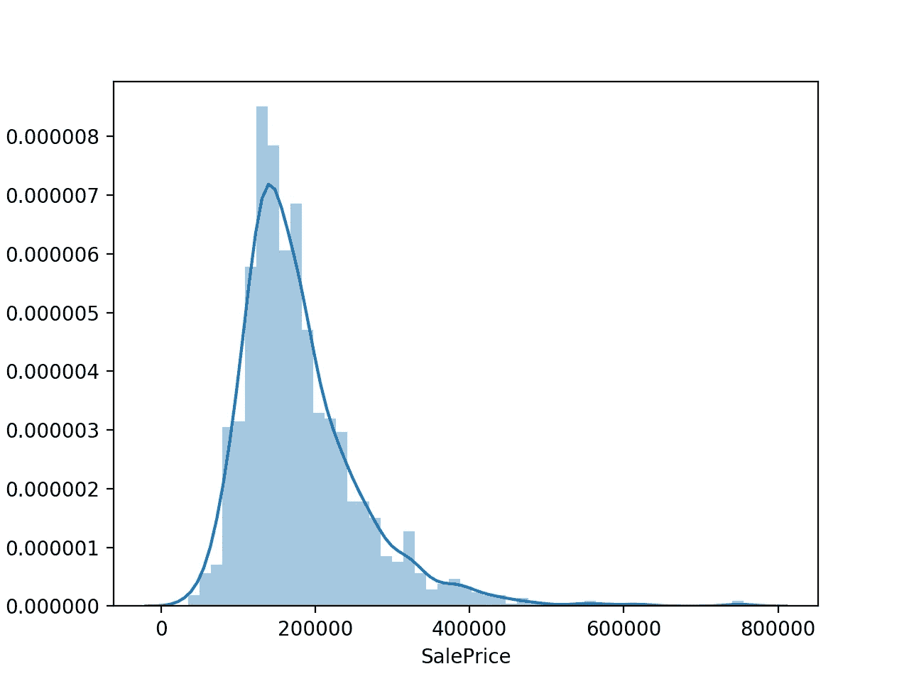

销售价格的分布是右偏的。为了提高模型预测精度，应该减少偏斜度。我选择在 SalePrice 上记录日志。取对数后，销售价格的分布看起来类似于正态分布。

```
X_train = df_train_final
y_train = np.log1p(df_train[‘SalePrice’])sns.distplot(df_train.SalePrice)
plt.show()
```

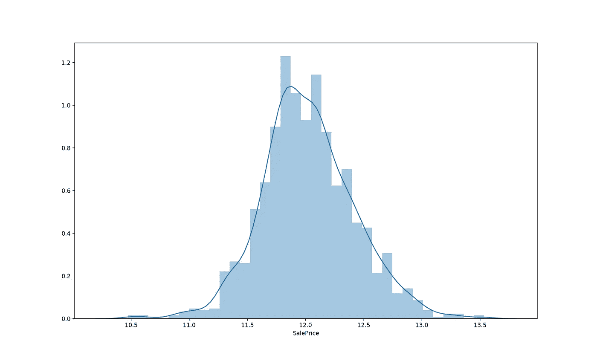

我选择了 Lasso 模型进行预测。它工作得很好，也更快。让；调整模型参数。

```
kfolds = KFold(n_splits=10, shuffle=True, random_state=42)model_Lasso = Lasso(random_state=42)grid_param_lasso = {‘alpha’: [0.0001, 0.0002, 0.0003, 0.0004, 0.0005]}gd_sr = GridSearchCV(estimator=model_Lasso,
 param_grid=grid_param_lasso,
 scoring=’neg_mean_squared_log_error’,
 cv=5,
 n_jobs=-1)gd_sr.fit(X_train, y_train)
best_parameters = gd_sr.best_params_
print(best_parameters)Output:
{'alpha': 0.0004}
```

让我们对训练数据集进行建模，并通过交叉验证生成预测得分。

```
model_Lasso = Lasso(alpha=0.0004, random_state=42)all_accuracies = np.sqrt(-cross_val_score(estimator=model_Lasso, X=X_train, y=y_train, scoring='neg_mean_squared_error', cv=kfolds))
print(all_accuracies.mean())Output:
0.10724677083241012
```

看看套索模型是如何挑选特征的。

```
coef = pd.Series(model_Lasso.coef_, index = X_train.columns)imp_coef = pd.concat([coef.sort_values().head(10),
 coef.sort_values().tail(10)])
rcParams[‘figure.figsize’] = (8.0, 10.0)
imp_coef.plot(kind = “barh”)
plt.title(“Coefficients in Lasso Model”)
```

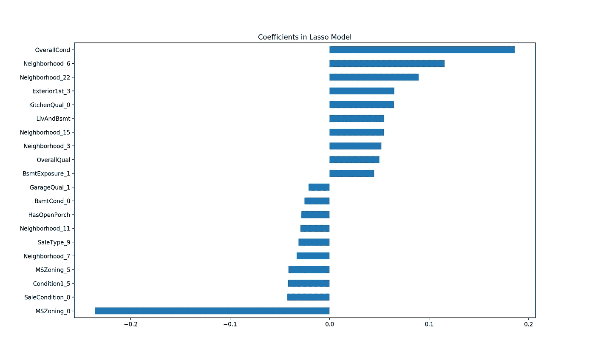

OverallCond 和 MsZoning_0 的系数最大。

```
print("Lasso picked " + str(sum(coef != 0)) + " features and eliminated the other " +  str(sum(coef == 0)) + " features")Output:
Lasso picked 91 features and eliminated the other 97 features
```

# 9.提交

```
model_Lasso.fit(X_train, y_train)
X_test = df_test_final
predictions = np.exp(model_Lasso.predict(X_test))
output = pd.DataFrame({‘Id’: df_test.Id, ‘SalePrice’: predictions.astype(float)})
output.to_csv(‘my_submission.csv’, index=False)
```

Kaggle 得分为 0.11627(前 13%)


感谢您的阅读:)