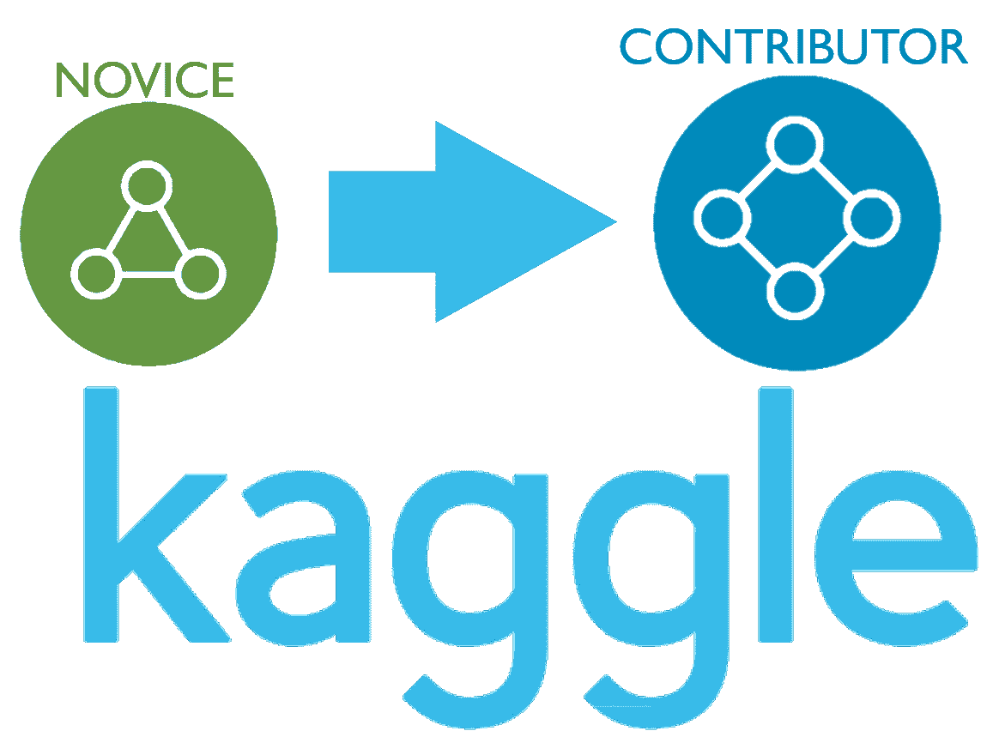
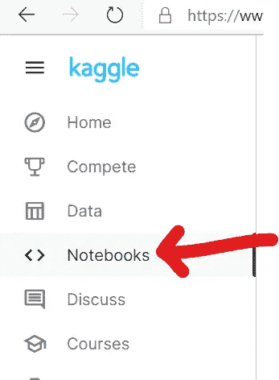
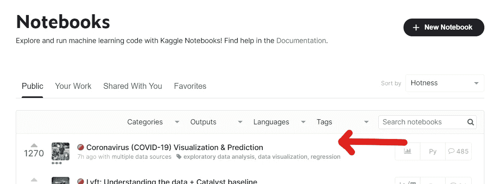
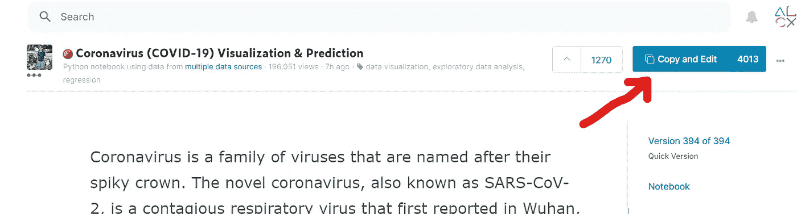
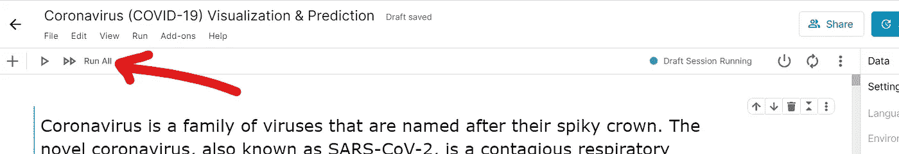
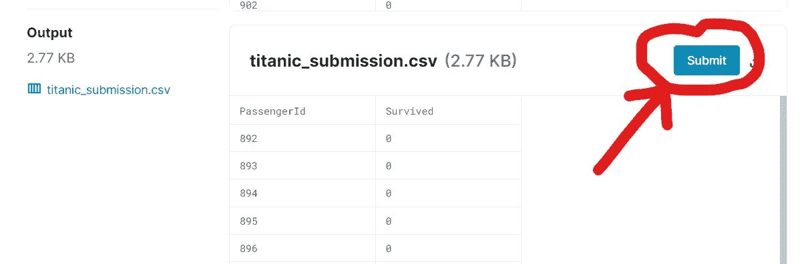

# Kaggle“新手”徽章到“贡献者”的 7 行代码

> 原文：<https://medium.com/analytics-vidhya/kaggle-novice-badge-to-contributor-in-7-lines-of-code-4ca0265d7b2c?source=collection_archive---------22----------------------->



# Kaggle =面向数据科学书呆子的社交媒体

听说过[Kaggle.com](https://www.kaggle.com/)吗？没有吗？那很好。我不会针对你，但既然你有，你必须检查一下。这个网站太大了，不能不参与进来(当然假设你有编码天赋和良知)。

你也会很快意识到你应该在很久以前就使用这个网站，所以关键是你要摆脱你名字旁边的“新手”徽章！你会问，怎么会？它们提供了一个方便的清单📜。

首先，更新你的个人资料。只需插入一个简短的简历，你的位置，职业和组织(如果你是学生，你的学校也可以)。验证您的电话号码，投赞成票，写评论，✔✔✔简单的东西！

运行一个笔记本或者脚本是一个需求，但是如果你以前从来没有使用过 Jupyter 笔记本的话，可能会稍微复杂一点(但是如果你喜欢 R 或者 Python，你会喜欢这些的！).转到“笔记本”选项卡:



选择您感兴趣的笔记本:



点击“复制和编辑”:



这将带您到用于为有问题的笔记本生成分析的代码。运行就行了(有按钮)！卡格尔会把这个算作满足你下一个徽章✔.的最低要求



最后，你必须提交一份参赛作品。敦敦敦敦。这并没有听起来那么难，我们将用 7 行代码来完成。

如果你在这个网站上呆过一段时间，你会看到 Kaggle 在努力推动这个巨大的竞争。在这个游戏中，他们会给你泰坦尼克号乘客的基本信息，尽可能准确地猜测他们是生是死就成了我们的工作。哇，天黑得真快。报名参加比赛，然后创建一个新的笔记本(更具体地说，是一个脚本)。

现在，我们将编写我们的“代码”——我们在这里要做的事情非常简单。泰坦尼克号上的大多数人没能成功(31.6%😢)，所以通过提交假设没人做的代码，我们应该期望 68%的准确性，在变化范围内。

下面是我最初的投稿，用 Python 写的:[https://www . ka ggle . com/alexaugenstein/asa 55-泰坦尼克号-比赛？scriptVersionId=43567606](https://www.kaggle.com/alexaugenstein/asa55-titanic-competition?scriptVersionId=43567606)

或者你可以复制并粘贴下面的秘制酱:

```
import numpy as np
import pandas as pd

data_test = pd.read_csv('/kaggle/input/titanic/test.csv')
data_submission = pd.DataFrame()data_submission['PassengerId'] = data_test['PassengerId']
data_submission['Survived'] = pd.Series(np.zeros(data_submission.size).astype(int))data_submission.to_csv('/kaggle/working/titanic_submission.csv', index = False)
```

这段代码准备了一个包含两列的 Pandas DataFrame 对象:第一列包含由 Kaggle 提供的乘客 ID，第二列包含我们对该乘客是否幸存的猜测(因此为 0😢)

作为 Kaggle 成员，您可以在云的某个地方获得一些存储空间。提供的代码将它放在名为`/kaggle/working/titanic_submission.csv`的 Kaggle 目录中。

Kaggle 当然知道这个文件的存在，并把输出与你的竞争对手联系起来。要提交，请进入笔记本→您的作品→[无论您如何命名您的泰坦尼克号竞赛提交]，向下滚动，直到您看到我们生成的数据:



单击提交。

准确率将达到 62.2%。可能会更好，但嘿，你会看到你的个人资料，你现在是一个认证贡献者🎉🎈 🎇！当然，在 Kaggle 上你还可以做更多的事情，这只是皮毛，但是你已经在路上了，现在你知道做贡献需要什么了。

今天干得不错。今天，我们讨论了数据科学社区入门。但是要编写正确的生产软件(对于数据科学或其他方面)需要做很多工作——所以下次我们将更多地讨论用 Docker 实现开发环境的容器化。希望在那里见到你！