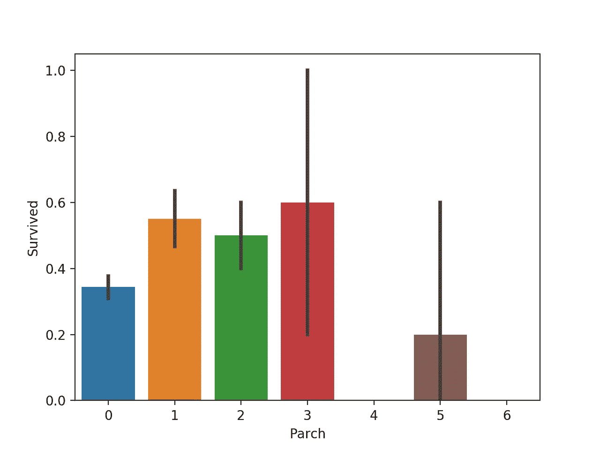
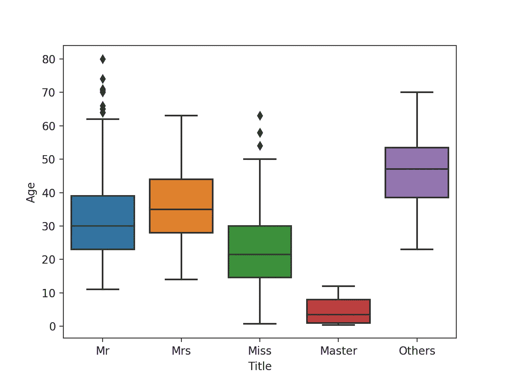

# 泰坦尼克号生存预测-前 3%

> 原文：<https://medium.com/analytics-vidhya/kaggle-titanic-survival-prediction-top-3-ea6c8dcc9b6c?source=collection_archive---------1----------------------->


(来源:[https://www.britannica.com/story/the-unsinkable-titanic](https://www.britannica.com/story/the-unsinkable-titanic))

在学习了一个月的 Python 之后，我计划在项目中应用我的知识。Kaggle 是一个举办机器学习比赛并提供真实世界数据集的伟大平台。作为我的第一次尝试，我在这个项目上总共花了 10 天时间。感谢在线资源，如 Stackoverflow 和 Medium 的文章，它们帮助很大！

# 索引

1.  背景
2.  探索性数据分析
3.  缺失数据/异常值的插补
4.  数据转换
5.  特征创建
6.  特征选择
7.  模型
8.  提交

# 1.背景

## 挑战

泰坦尼克号的沉没是历史上最臭名昭著的海难之一。

1912 年 4 月 15 日，在她的处女航中，被广泛认为是“不沉”的皇家邮轮泰坦尼克号在与冰山相撞后沉没。不幸的是，没有足够的救生艇容纳船上的每个人，导致 2224 名乘客和船员中的 1502 人死亡。

虽然幸存有一些运气成分，但似乎某些群体比其他群体更有可能幸存。

在这个挑战中，我们要求你建立一个预测模型来回答这个问题:“什么样的人更有可能生存？”使用乘客数据(如姓名、年龄、性别、社会经济阶层等)。

## 概观

数据被分成两组:

*   训练集(train.csv)
*   测试集(test.csv)

训练集应该用于构建您的机器学习模型。对于训练集，我们为每个乘客提供结果(也称为“地面真相”)。你的模型将基于“特征”，如乘客的性别和阶级。你也可以使用[特征工程](https://triangleinequality.wordpress.com/2013/09/08/basic-feature-engineering-with-the-titanic-data/)来创建新的特征。

测试集应该用于查看您的模型在看不见的数据上的表现。对于测试集，我们不为每个乘客提供地面实况。预测这些结果是你的工作。对于测试集中的每个乘客，使用您训练的模型来预测他们是否在泰坦尼克号沉没时幸存。

我们还包括 gender_submission.csv，这是一组假设所有且只有女性乘客幸存的预测，作为提交文件的示例。

## 数据字典

variabledefinitionkeysurvivalsurvival 0 = No，1 = YespclassTicket class1 = 1st，2 = 2nd，3 = 3rdsexSexAgeAge in yearssibsp #兄弟姐妹/配偶在泰坦尼克号上的人数父母/子女在泰坦尼克号上的人数

## 可变音符

pclass:社会经济地位(SES)的代表
1 日=上层
2 日=中层
3 日=下层

年龄:如果小于 1，年龄是分数。如果估计年龄，是 xx.5 的形式吗

sibsp:数据集这样定义家庭关系……
兄弟姐妹=兄弟、姐妹、继兄弟、继姐妹
配偶=丈夫、妻子(情妇和未婚夫被忽略)

帕奇:数据集是这样定义家庭关系的……
父母=母亲，父亲
孩子=女儿，儿子，继女，继子
一些孩子只和保姆一起旅行，因此帕奇=0。

## 目标

你的工作是预测泰坦尼克号沉没时是否有乘客幸存。
对于测试集中的每个变量，您必须预测该变量的 0 或 1 值。

## 公制的

你的分数是你正确预测的乘客百分比。这就是所谓的[精度](https://en.wikipedia.org/wiki/Accuracy_and_precision#In_binary_classification)。

# **2。探索性数据分析**

导入库:

```
import numpy as np
import os
import pandas as pd
import seaborn as sns
from matplotlib import pyplot as plt
from sklearn import metrics
from sklearn.ensemble import RandomForestClassifier
from sklearn.feature_selection import RFECV
from sklearn.linear_model import LogisticRegression
from sklearn.metrics import accuracy_score
from sklearn.model_selection import cross_val_score, GridSearchCV
from sklearn.preprocessing import LabelEncoder
import warningswarnings.filterwarnings(‘ignore’)
```

导入数据:

```
train_data = pd.read_csv(‘train.csv’)
test_data = pd.read_csv(‘test.csv’)
```

数据结构:

```
train_data.info()Output:
<class 'pandas.core.frame.DataFrame'>
RangeIndex: 891 entries, 0 to 890
Data columns (total 12 columns):
PassengerId    891 non-null int64
Survived       891 non-null int64
Pclass         891 non-null int64
Name           891 non-null object
Sex            891 non-null object
Age            714 non-null float64
SibSp          891 non-null int64
Parch          891 non-null int64
Ticket         891 non-null object
Fare           891 non-null float64
Cabin          204 non-null object
Embarked       889 non-null object
dtypes: float64(2), int64(5), object(5)
memory usage: 83.7+ KBtest_data.info()Output:
<class 'pandas.core.frame.DataFrame'>
Int64Index: 418 entries, 0 to 417
Data columns (total 13 columns):
Age            332 non-null float64
Cabin          91 non-null object
Embarked       418 non-null object
Fare           417 non-null float64
Name           418 non-null object
Parch          418 non-null int64
PassengerId    418 non-null int64
Pclass         418 non-null int64
Sex            418 non-null object
SibSp          418 non-null int64
Survived       0 non-null float64
Ticket         418 non-null object
Title          418 non-null object
dtypes: float64(3), int64(4), object(6)
memory usage: 45.7+ KB
```

1.  总行数:891 用于训练，418 用于测试数据集。
2.  客舱:数据缺失> 70%。
    由于少于 30%的数据无法提供意义信息，客舱数据可以忽略。

```
train_data.drop([‘Cabin’], axis=1, inplace=True)
test_data.drop([‘Cabin’], axis=1, inplace=True)
```

**幸存**

```
sns.countplot(train_data.Survived)
plt.show()
```


总存活概率约为 38%

**Pclass**

```
sns.countplot(train_data.Pclass)
plt.show()
```


```
sns.barplot(x=’Pclass’, y=’Survived’, data=train_data)
plt.show()
```


1.Pclass 1(上层阶级)的乘客生还的可能性更大。

2.Pclass 是一个很好的生存预测特征。

**性**

```
sns.countplot(train_data.Sex)
plt.show()
```


```
sns.barplot(x=’Sex’, y=’Survived’, data=train_data)
plt.show()
```


1.男女比例:约 2/3 对约 1/3

2.男性存活的可能性要小得多，存活几率只有 20%。对于女性来说，存活几率超过 70%。

3.显然，性别是预测生存的一个重要特征。

**年龄**

```
plt.hist(train_data.Age, edgecolor=’black’)
plt.xlabel('Age')
plt.ylabel('count')
plt.show()
```


```
sns.boxplot(x=’Survived’, y=’Age’, data=train_data)
plt.show()
```


1.乘客年龄主要在 20-40 岁之间。

2.年轻的乘客更容易幸存。

**SibSp**

```
sns.countplot(train_data.SibSp)
plt.show()
```


```
sns.barplot(x=’SibSp’, y=’Survived’, data=train_data)
plt.show()
```


1.大多数乘客与一个兄弟姐妹/配偶一起旅行。

2.与没有兄弟姐妹/配偶的乘客相比，有一个兄弟姐妹/配偶的乘客更有可能幸存。

3.对于那些超过 1 个兄弟姐妹/配偶的人，信息不足以提供任何见解。

**烤干**

```
sns.countplot(train_data.Parch)
plt.show()
```


```
sns.barplot(x=’Parch’, y=’Survived’, data=train_data)
plt.show()
```



1.> 70%的乘客没有父母/子女陪伴。

2.和父母/孩子一起旅行的乘客比没有父母/孩子的乘客更有可能幸存。

**票**

```
train_data.Ticket.head(10)Output:
0 A/5 21171
1 PC 17599
2 STON/O2\. 3101282
3 113803
4 373450
5 330877
6 17463
7 349909
8 347742
9 237736
Name: Ticket, dtype: object
```

**票价**

```
sns.distplot(train_data.Fare)
plt.show()
```


1.  这种分布是右偏的。观察到异常值。
2.  对于那些幸存下来的人来说，他们的票价相对较高。

**着手进行**

```
sns.countplot(train_data.Embarked)
plt.show()
```


```
sns.barplot(x=’Embarked’, y=’Survived’, data=train_data)
plt.show()
```


1.超过 2/3 的乘客在 c 港上船。

2.在 C 港上船的乘客生还的可能性更大。

# **3。缺失数据/异常值的插补**

**年龄**

```
train_data.Name.head(10)Output:
0 Braund, Mr. Owen Harris
1 Cumings, Mrs. John Bradley (Florence Briggs Th…
2 Heikkinen, Miss. Laina
3 Futrelle, Mrs. Jacques Heath (Lily May Peel)
4 Allen, Mr. William Henry
5 Moran, Mr. James
6 McCarthy, Mr. Timothy J
7 Palsson, Master. Gosta Leonard
8 Johnson, Mrs. Oscar W (Elisabeth Vilhelmina Berg)
9 Nasser, Mrs. Nicholas (Adele Achem)
Name: Name, dtype: object
```

让我们从乘客的名字中提取头衔(先生/夫人/小姐/主人)。对于训练和测试数据集都可以这样做。

```
whole_data = train_data.append(test_data)
whole_data['Title'] = whole_data.Name.str.extract(r'([A-Za-z]+)\.', expand=False)
whole_data.Title.value_counts()Output:
Mr          757
Miss        260
Mrs         197
Master       61
Dr            8
Rev           8
Col           4
Ms            2
Major         2
Mlle          2
Countess      1
Jonkheer      1
Don           1
Sir           1
Dona          1
Capt          1
Mme           1
Lady          1
Name: Title, dtype: int64
```

常见的称呼是(先生/小姐/夫人/主人)。一些头衔(女士/女士/先生…等。)可以归入普通标题。剩下的未分类的标题可以放在“其他”中。

```
Common_Title = [‘Mr’, ‘Miss’, ‘Mrs’, ‘Master’]
whole_data[‘Title’].replace([‘Ms’, ‘Mlle’, ‘Mme’], ‘Miss’, inplace=True)
whole_data[‘Title’].replace([‘Lady’], ‘Mrs’, inplace=True)
whole_data[‘Title’].replace([‘Sir’, ‘Rev’], ‘Mr’, inplace=True)
whole_data[‘Title’][~whole_data.Title.isin(Common_Title)] = ‘Others’
```

让我们看看训练数据集中的标题和年龄之间的关系。

```
train_data = whole_data[:len(train_data)]
test_data = whole_data[len(train_data):]sns.boxplot(x='Title', y='Age', data=train_data)
plt.show()
```



找出每个题目中年龄的中位数。
(备注:仅使用训练数据集以避免数据泄露)

```
AgeMedian_by_titles = train_data.groupby(‘Title’)[‘Age’].median()
AgeMedian_by_titlesOutput:
Title
Master     3.5
Miss      21.5
Mr        30.0
Mrs       35.0
Others    47.0
Name: Age, dtype: float64
```

根据标题估算缺失的年龄值。

```
for title in AgeMedian_by_titles.index:
    train_data['Age'][(train_data.Age.isnull()) & (train_data.Title == title)] = AgeMedian_by_titles[title]
    test_data['Age'][(test_data.Age.isnull()) & (test_data.Title == title)] = AgeMedian_by_titles[title]
```

**登船**

对于训练数据集，只有 2 个值缺失。简单地估算模式。

```
train_data[‘Embarked’].fillna(train_data.Embarked.mode()[0], inplace=True)
```

**票价**

对于测试数据集，只有 1 个值缺失。简单地估算中间值，

```
test_data[‘Fare’].fillna(test_data[‘Fare’].median(), inplace=True)
```

对于训练数据集，有 3 个异常值(即 512.3292)。

```
For train dataset, there are outliers observed. Replace them with median.train_data.Fare.sort_values(ascending=False).head(5)Output:
679 512.3292
258 512.3292
737 512.3292
341 263.0000
438 263.0000
```

应处理异常值，以免扭曲分布，从而使模型更加稳健。

离群值可以替换为最大上限、中值，或者您可以简单地删除它们。

我选择用第二个更高的票价(即 263 英镑)来代替异常值。

```
train_data.loc[train_data.Fare>512, ‘Fare’] = 263
train_data.Fare.sort_values(ascending=False).head(5)Output:
341    263.0
438    263.0
88     263.0
679    263.0
258    263.0
Name: Fare, dtype: float64
```

检查丢失的数据。

```
train_data.info()Output:
<class 'pandas.core.frame.DataFrame'>
Int64Index: 891 entries, 0 to 890
Data columns (total 12 columns):
Age            891 non-null float64
Embarked       891 non-null object
Fare           891 non-null float64
Name           891 non-null object
Parch          891 non-null int64
PassengerId    891 non-null int64
Pclass         891 non-null int64
Sex            891 non-null object
SibSp          891 non-null int64
Survived       891 non-null float64
Ticket         891 non-null object
Title          891 non-null object
dtypes: float64(3), int64(4), object(5)
memory usage: 90.5+ KBtest_data.info()
<class 'pandas.core.frame.DataFrame'>
Int64Index: 418 entries, 0 to 417
Data columns (total 12 columns):
Age            418 non-null float64
Embarked       418 non-null object
Fare           418 non-null float64
Name           418 non-null object
Parch          418 non-null int64
PassengerId    418 non-null int64
Pclass         418 non-null int64
Sex            418 non-null object
SibSp          418 non-null int64
Survived       0 non-null float64
Ticket         418 non-null object
Title          418 non-null object
dtypes: float64(3), int64(4), object(5)
memory usage: 42.5+ KB
```

# **4。数据转换**

将字符串编码为数字以进行建模。

**性**

```
train_data[‘Sex_Code’] = train_data[‘Sex’].map({‘female’:1, ‘male’:0}).astype(‘int’)
test_data[‘Sex_Code’] = test_data[‘Sex’].map({‘female’:1, ‘male’:0}).astype(‘int’)
```

**登船**

```
train_data['Embarked_Code'] = train_data['Embarked'].map({'S':0, 'C':1, 'Q':2}).astype('int')
test_data['Embarked_Code'] = test_data['Embarked'].map({'S':0, 'C':1, 'Q':2}).astype('int')
```

将数据分组到箱中，以使模型更加稳健并避免过度拟合。

**年龄**

```
train_data['AgeBin_5'] = pd.qcut(train_data['Age'], 5)
test_data['AgeBin_5'] = pd.qcut(test_data['Age'], 5)sns.barplot(x='AgeBin_5', y='Survived', data=train_data)
plt.show()
```


**票价**

```
train_data[‘FareBin_5’] = pd.qcut(train_data[‘Fare’], 5)
test_data[‘FareBin_5’] = pd.qcut(test_data[‘Fare’], 5)
```


将年龄和费用箱编码成用于建模的数字。

```
label = LabelEncoder()
train_data['AgeBin_Code_5'] = label.fit_transform(train_data['AgeBin_5'])
test_data['AgeBin_Code_5'] = label.fit_transform(test_data['AgeBin_5'])label = LabelEncoder()
train_data[‘FareBin_Code_5’] = label.fit_transform(train_data[‘FareBin_5’])
test_data[‘FareBin_Code_5’] = label.fit_transform(test_data[‘FareBin_5’])
```

# **5。特征创建**

**单独**

SibSp 和 Parch 都与家族成员有关。为了简单起见，我决定将它们合并成一个单一的特性，即 FamilySize。

```
train_data[‘FamilySize’] = train_data.SibSp + train_data.Parch + 1
test_data[‘FamilySize’] = test_data.SibSp + test_data.Parch + 1sns.countplot(train_data.FamilySize)
plt.show()
```


由于家庭大小=1 的比例占主导地位，它可能不能提供足够的预测能力。我决定把他们组织起来，然后决定是否单独旅行。

```
train_data[‘Alone’] = train_data.FamilySize.map(lambda x: 1 if x == 1 else 0)
test_data[‘Alone’] = test_data.FamilySize.map(lambda x: 1 if x == 1 else 0)sns.countplot(train_data.Alone)
plt.show()
```


```
sns.barplot(x=’Alone’, y=’Survived’, data=train_data)
plt.show()
```


据观察，独自旅行生存的可能性更小(约 30%对约 50%)。

**标题**

标题是为年龄缺失值的插补而创建的。它也可以作为一个新的功能。

```
sns.countplot(train_data.Title)
plt.show()
```


```
sns.barplot(x=’Title’, y=’Survived’, data=train_data)
plt.show()
```


很明显先生这个头衔比起其他人来说存活的可能性要小得多。

让我们为建模对特征进行编码。

```
train_data[‘Title_Code’] = train_data.Title.map({‘Mr’:0, ‘Miss’:1, ‘Mrs’:2, ‘Master’:3, ‘Others’:4}).astype(‘int’)
test_data[‘Title_Code’] = test_data.Title.map({‘Mr’:0, ‘Miss’:1, ‘Mrs’:2, ‘Master’:3, ‘Others’:4}).astype(‘int’)
```

**连通生存**

从《泰坦尼克号》电影中，幸存者通常都是家庭成员。他们互相帮助寻找出路。此外，家庭通常有孩子，这是第一优先发送到安全的船只。当然，应该有父母来照顾孩子。

要搞清楚家庭群体，除了乘客的姓氏(可能有同姓，但家庭不同)，我们还要看车票。

```
train_data[[‘Name’, ‘Ticket’]].sort_values(‘Name’).head(20)Output:
845                              Abbing, Mr. Anthony           C.A. 5547
746                      Abbott, Mr. Rossmore Edward           C.A. 2673
279                 Abbott, Mrs. Stanton (Rosa Hunt)           C.A. 2673
308                              Abelson, Mr. Samuel           P/PP 3381
874            Abelson, Mrs. Samuel (Hannah Wizosky)           P/PP 3381
365                   Adahl, Mr. Mauritz Nils Martin              C 7076
401                                  Adams, Mr. John              341826
40    Ahlin, Mrs. Johan (Johanna Persdotter Larsson)                7546
855                       Aks, Mrs. Sam (Leah Rosen)              392091
207                      Albimona, Mr. Nassef Cassem                2699
810                           Alexander, Mr. William                3474
840                      Alhomaki, Mr. Ilmari Rudolf    SOTON/O2 3101287
210                                   Ali, Mr. Ahmed  SOTON/O.Q. 3101311
784                                 Ali, Mr. William  SOTON/O.Q. 3101312
730                    Allen, Miss. Elisabeth Walton               24160
4                           Allen, Mr. William Henry              373450
305                   Allison, Master. Hudson Trevor              113781
297                     Allison, Miss. Helen Loraine              113781
498  Allison, Mrs. Hudson J C (Bessie Waldo Daniels)              113781
834                           Allum, Mr. Owen George                2223
```

看来同姓的乘客有相同的票名。

让我们提取姓氏和票名，找出重复的。训练和测试数据集中可能有来自相同家庭的乘客。所以，我决定整体来做。

```
whole_data = train_data.append(test_data)
whole_data['Surname'] = whole_data.Name.str.extract(r'([A-Za-z]+),', expand=False)
whole_data['TixPref'] = whole_data.Ticket.str.extract(r'(.*\d)', expand=False)
whole_data['SurTix'] = whole_data['Surname'] + whole_data['TixPref']
whole_data['IsFamily'] = whole_data.SurTix.duplicated(keep=False)*1sns.countplot(whole_data.IsFamily)
plt.show()
```


大约 1/3 的乘客与家人一起旅行。

接下来，我们把有孩子的家庭挖出来。简单地列出那些有家庭和孩子的“SurTix”。

```
whole_data['Child'] = whole_data.Age.map(lambda x: 1 if x <=16 else 0)
FamilyWithChild = whole_data[(whole_data.IsFamily==1)&(whole_data.Child==1)]['SurTix'].unique()len(UniqueFamilyTixWithChild)Output:
66
```

有 66 个家庭有一个或多个孩子。

对每个有孩子的家庭进行编码(例如，为其他家庭分配 0)。

```
whole_data['FamilyId'] = 0x = 1
for tix in UniqueFamilyTixWithChild:
 whole_data.loc[whole_data.SurTix==tix, ['FamilyId']] = x
 x += 1
```

让我们看看每个有孩子的家庭的生存数据

```
whole_data[‘SurvivedDemo’] = whole_data[‘Survived’].fillna(9)
pd.crosstab(whole_data.FamilyId, whole_data.SurvivedDemo).drop([0]).plot(kind=’bar’, stacked=True, color=[‘black’,’g’,’grey’])
plt.show()
```


据观察，这些家族通常都存活(即全绿)或不存活(即全黑)。这一发现证明了关联生存的概念。对于上述每个家庭，如果至少有一个幸存，我们假设其他人也能幸存。

```
whole_data[‘ConnectedSurvival’] = 0.5 Survived_by_FamilyId = whole_data.groupby(‘FamilyId’).Survived.sum()
for i in range(1, len(UniqueFamilyTixWithChild)+1):
 if Survived_by_FamilyId[i] >= 1:
 whole_data.loc[whole_data.FamilyId==i, [‘ConnectedSurvival’]] = 1
 elif Survived_by_FamilyId[i] == 0:
 whole_data.loc[whole_data.FamilyId==i, [‘ConnectedSurvival’]] = 0train_data = whole_data[:len(train_data)]
test_data = whole_data[len(train_data):]sns.barplot(x='ConnectedSurvival', y='Survived', data=train_data)
plt.show()
```


对于以下乘客，生还的可能性要高得多:

1.  与家人一起旅行
2.  家中有一个或多个孩子的
3.  家庭中有一名或多名幸存者

# **6。功能选择**

```
train_data.columnsOutput:
Index(['Age', 'Embarked', 'Fare', 'Name', 'Parch', 'PassengerId', 'Pclass', 'Sex', 'SibSp', 'Survived', 'Ticket', 'Title', 'Sex_Code', 'AgeBin_5', 'FareBin_5', 'AgeBin_Code_5', 'FareBin_Code_5', 'FamilySize', 'Alone', 'Title_Code', 'Surname', 'TixPref', 'SurTix', 'IsFamily', 'Child', 'FamilyId', 'ConnectedSurvival'],
dtype='object')
```

首先，删除那些未使用的列

```
X_train = train_data.drop([‘Age’, ‘Embarked’, ‘Fare’, ‘Name’, ‘Parch’, ‘PassengerId’, ‘Sex’, ‘SibSp’, ‘Survived’, ‘Ticket’, 'Title', ‘AgeBin_5’, ‘FareBin_5’, ‘FamilySize’, ‘Surname’, ‘TixPref’, ‘SurTix’, ‘IsFamily’, ‘Child’, ‘FamilyId’], axis=1)y_train = train_data[‘Survived’]
```

将模型指定为 RandomForestClassifier。

```
model = RandomForestClassifier(n_estimators=200, random_state=2)
```

让我们看看特性的重要性。

```
model.fit(X_train,y_train)
importance = pd.DataFrame({‘feature’:X_train.columns, ‘importance’: np.round(model.feature_importances_,3)})
importance = importance.sort_values(‘importance’, ascending=False).set_index(‘feature’)importance.plot(kind='bar', rot=0)
plt.show()
```


选择用于建模的前 5 个重要特征(即 Title_Code、Sex_Code、Connected _ Survivial、Pclass 和 FareBin_Code_5)。始终保持最小数量的特征，以避免过度拟合。

```
final = [‘Title_Code’, ‘Sex_Code’, ‘ConnectedSurvival’, ‘Pclass’, ‘FareBin_Code_5’]
```

# **7。型号**

调整模型参数。

```
grid_param = {
 ‘n_estimators’: [100, 200, 300],
 ‘criterion’:[‘gini’, ‘entropy’],
 ‘min_samples_split’: [2, 10, 20],
 ‘min_samples_leaf’: [1, 5],
 ‘bootstrap’: [True, False],
}gd_sr = GridSearchCV(estimator=model,
 param_grid=grid_param,
 scoring=’accuracy’,
 cv=5,
 n_jobs=-1)gd_sr.fit(X_train[final], y_train)
best_parameters = gd_sr.best_params_
print(best_parameters)Output:
{'bootstrap': True, 'criterion': 'entropy', 'min_samples_leaf': 5, 'min_samples_split': 2, 'n_estimators': 300}
```

调整后设置模型参数。

```
model = RandomForestClassifier(n_estimators=300, bootstrap=True, criterion= 'entropy', min_samples_leaf=5, min_samples_split=2, random_state=2)
```

使用 5 重交叉验证计算预测的准确性。

```
all_accuracies = cross_val_score(estimator=model1, X=X_train, y=y_train, cv=5)all_accuracies
all_accuracies.mean()Output:
[0.86592179 0.84357542 0.83707865 0.80898876 0.88700565]
0.8485140544303522
```

精确度平均值为 0.8485

# **8。提交**

```
X_test = test_data[final]model.fit(X_train[final],y_train)
prediction = model.predict(X_test)
output = pd.DataFrame({‘PassengerId’: test_data.PassengerId, ‘Survived’: prediction.astype(int)})
output.to_csv(‘my_submission.csv’, index=False)
```

Kaggle 得分为 0.82296(前 3%)


谢谢大家！