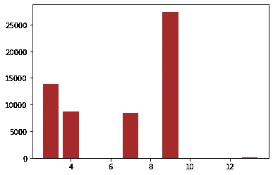
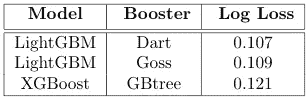

# Kaggle 前 4%解决方案:WSDM-KKBOX 的流失预测

> 原文：<https://medium.com/analytics-vidhya/kaggle-top-4-solution-wsdm-kkboxs-churn-prediction-fc49104568d6?source=collection_archive---------10----------------------->

图片由[皮克斯拜](https://pixabay.com/?utm_source=link-attribution&utm_medium=referral&utm_campaign=image&utm_content=1607164)的 Gerd Altmann 提供

在这篇文章中，我简要介绍了我对两年前结束的 [Kaggle 挑战](https://www.kaggle.com/c/kkbox-churn-prediction-challenge/overview)的解决方案，该挑战主要由参与者共享的功能驱动。带有逐行输出的完整代码是初学者友好的，可在[这里](https://github.com/G-pravin-shankar/Kaggle-Top-4-percent-Solution-WSDM-KKBOX-Churn-Prediction)获得。

# 桌子

1.  概观
2.  商业问题
3.  数据
4.  绩效指标
5.  现有解决方案
6.  探索性数据分析
7.  首次切割方法
8.  最终模型
9.  未来的工作
10.  真实世界的情况
11.  参考

# 概观

人们习惯于公司如何营销来获得新客户。首次购买优惠和免费试用期经常被广告所利用。然而，客户保持是不受欢迎的，一个更重要和有效的能力，当企业利用不足将是一个巨大的打击。

留住现有客户至关重要，因为它比获得新客户更便宜、更省时，而且还有助于通过口碑带来更多客户，因为用户评论比广告更可靠。

如果大部分客户离开公司，花在获取客户上的钱就变得不可持续。此外，不满意的客户会损害声誉，这进一步降低了任何吸引客户的努力的效率。

建立客户忠诚度可确保长期成功，组织越来越多地通过社交媒体、提供超出承诺的服务、收集定期反馈、个性化、在线聊天、电子邮件和电话支持，在竞争性定价中重塑客户体验。

尽管如此，客户流失是不可避免的，永远不应该被忽视。公司一般会从离开的消费者那里收集原因，并对其进行审查，以改善客户体验；这造成了显著的差异。

流失预测无非是预测在特定时期将要离开的用户。整个商业社会的改善是为了避免高流失率。一旦预测到极有可能流失的用户，就可以通过解决可能的原因来阻止他们在未来这样做。

# 商业问题

KKBOX 是东南亚一家流行的音乐流媒体服务提供商，是一种基于订阅和广告的商业模式。主要是每月订阅是收入的主要来源，用户可以在他们认为合适的任何时候取消他们的订阅。因此，提高客户流失预测对 KKBOX 的发展是不可或缺的。

任务是预测用户是否会在 30 天内不购买订阅，这是一个二元分类问题。

# 数据

KKBOX 提供了几个月的交易、日志和会员信息。交易详细信息包括支付方式、订购持续时间、日期、会员到期日、订购取消，用户日志包含持续时间总数、独特歌曲数以及基于用户收听歌曲持续时间的特征。

用户日志和交易细节仅在 3 月前可用。对于订阅在 4 月 1 日到期的用户，整个历史是开放的，但是对于在 4 月 30 日到期的用户，最近的活动是不可访问的。进一步的解释和数据可在[这里](https://www.kaggle.com/c/kkbox-churn-prediction-challenge/data)获得。

# 绩效指标

原木损失是竞赛中使用的评估指标。

[损失函数](https://en.wikipedia.org/wiki/Cross_entropy)

# 现有解决方案

[**预测客户流失:时间数据的极端梯度推进**](https://arxiv.org/pdf/1802.03396.pdf) **作者布莱恩·格雷戈里(第一名):**

选择这个挑战的主要意图是专注于人工特征工程，第一名的获胜者只使用了传统的机器学习模型，这暗示了它的意义。

大多数特征都是通过使用数学运算(如平均值或总和)在不同时间或整个时间内进行聚合和比较而提取的。总共使用了 76 个特征，并且共享了 10 个最有用的特征。权重为 0.88 的 XGBoost 和权重为 0.12 的 LightGBM 是用于预测的模型。

[布莱恩·格雷戈里的十大重要特征](/@bryan.gregory1/predicting-customer-churn-extreme-gradient-boosting-with-temporal-data-332c0d9f32bf)(XGBoost 模型)

[**解**](https://www.kaggle.com/c/kkbox-churn-prediction-challenge/discussion/46078) **乘无穷翼(第 17 位条目)**:

LightGBM、XGboost 和 CatBoost 模型用于重新标记的数据，并对预测进行平均。提供了特性及其重要性。

[无限机翼的重要特征](https://www.kaggle.com/c/kkbox-churn-prediction-challenge/discussion/46078)(light GBM 模型)

# 探索性数据分析

## 城市

城市(非流失)

城市(流失)

大约一半的用户来自城市“1 ”,但他们只占搅动用户的 30%。因此，这些用户不太可能流失。

## 年龄

对于许多用户来说，年龄要么被破坏，要么丢失

基于第 99.9 个百分位数，范围 10 和 85 之外的值将替换为-1。

## 性别

性别(非流失)

性别(流失)

女性流失的可能性略低，但性别特征看起来并不乐观。

## 通过注册

通过注册(非流失)

通过(客户流失)注册

这个特性对我们的分类任务很有用。通过“7”注册的用户比其他人更忠诚。

## 注册日期

最近的用户支配着训练数据

有些日期是未来的事

讨论部分提到之前的 members.csv 文件泄露信息，被移除。目前的版本也有一些不准确之处。例如，测试集中的一个用户的注册日期是未来 23 天，但不是私人排行榜的一部分。

# 首次切割方法

即使在现实生活中，客户流失预测也没有低延迟限制，这使得探索众多功能以提高准确性变得可行。由于用户日志文件的大小很大，它被分割成块进行处理。

为火车数据提供的一些标签不正确，所以我从事务细节生成数据。成员资格在 1 月和 2 月到期的用户分别用作训练集和 CV 集。由于没有 4 月份的交易，3 月份到期的标签是不完整的，因此被忽略了。占主导地位的阶层，而不是流失率，抽样不足。

大多数订阅计划是按月而不是按天进行的，因此我对客户流失的定义与 Kaggle 对 Train 和 CV 数据集的定义略有不同，也就是说，如果用户在到期的一个月内重新订阅，则认为他没有流失。这是因为一些用户可能会跳过一个月，再次重新订阅，而测试集四月有 30 天。我还尝试了 InfiniteWing 的[代码](https://github.com/InfiniteWing/Kaggle/blob/master/KKBOX%20churn/code/labeler_v2_final.py)来生成标签，但是它增加了 0.003 的日志损失。

代码保存不流失的数据点。

## 用户日志

除了最后一天的日志之外，还使用了过去 15 天、上个月、上个月的前 15 天以及截止日期之前的整个时间段的用户日志的总和、平均值、计数和标准偏差。截止日期不过是最近的可访问日期，12 月 31 日为训练数据，3 月 31 日为测试数据。

从用户日志中提取上月特征的代码

## 成员

使用了所有成员功能。

## 处理

最后 5 次未流失、流失计数、未流失计数、流失率、总取消和交易计数与折扣、每日价格、付款计划天数、付款方式 id、是否取消、是否自动续订、会员资格到期日期、实际支付金额、计划标价、计划天数以及最终交易和最终交易前的交易日期一起使用。

由于它们的时间性质，日期特征从截止日期开始被正常编码。例如，最终登录日期转换为“自最终登录后的天数”。

提取最后 5 个非流失特征的代码

# 最终模型

到目前为止看到的所有特征都用在了比赛中。我添加了最近 5 天的价格、折扣、实际支付金额和付款计划天数的总和及平均值。此外，还包括截止日期后剩余的到期天数、到期日期与交易日期之间的差异(到期交易间隔)以及到期交易间隔与付款计划天数之间的差异。

具有 dart booster 的 LightGBM 比 XGBoost 表现更好，并且将非主导类的权重减少 30%提高了交叉验证分数。

在 KKBOX 同时主办的另一场比赛中，几乎没有提供会员的订阅截止日期。这是外部来源的数据泄漏，但在比赛中是允许的。

最后，将概率乘以 0.75，显著提高了私人和公共排行榜的分数。这可能是因为与测试数据相比，训练数据的流失率较高(排行榜)。

32 大重要特性

模型中的一棵树

排行榜得分

# 未来的工作

我手动更新了成员资格到期日期与外部成员文件中的到期日期相同的用户的概率，这仅占泄露信息的 1%，其余的数据并没有提高性能，需要特征工程来表示隐式信息，这将改善预测。

最近 5 次客户流失、总客户流失和非客户流失计数以及客户流失率需要更新，因为他们可能遗漏了“is _ cancel”= 1 个交易，我仅针对最终交易和最后一个之前交易功能进行了更正。

此外，由于一开始对问题陈述的误解，我错过了会员有效期为 1 月 1 日的用户，将他们添加到训练数据将进一步细化预测。

# 真实世界的情况

## 回忆

在应用情况下，即使以精确度或误报率为代价，召回所有将要流失的用户也是很重要的，因为公司不能失去他们的客户。由于流失率的时间变化，ROC AUC 和混淆矩阵是合适的指标。

预测(阈值为 0.5)

当只有小于 0.5 的预测概率被认为是流失时，超过三分之二被遗漏。

ROC AUC 曲线

在我们的例子中，最佳阈值 0.959 是曲线上的点，超过该点，召回的增益(真阳性率)小于 FPR(假阳性率)。

预测(阈值为 0.959)

现在有 76.8%的已经搅动的用户预测正确，12.1%没有搅动的用户预测不正确。如果错过 25%的搅动对业务不利，我们可以提高门槛；但是 FPR 的增量会更多。

## 可解释性

公司必须了解特定用户为什么会流失，并解决这个问题，或者根据客户的终身价值提供个性化的服务。即使特征是不言自明的，集合模型也不容易解释。

[局部可解释模型不可知解释(LIME)](https://arxiv.org/abs/1602.04938v3) 是一种推理模型预测的方法，通过一次考虑一个数据点，并通过分析其值的变化如何影响输出来权衡特征。这是每个数据点的线性近似值。然而，它有助于理解模型的复杂决策。

a.)示例非流失数据点

b.)示例流失数据点

由于这是一个二元分类问题，并且类别是矛盾的，我们可以将它们解释为对预测影响最大的特征。

例如，在“b”的情况下，最终交易的 auto_renew 为“0 ”,这是交易概率的主要贡献者，KKBOX 将使用该信息通过提供折扣来说服用户启用自动支付。如果宁滨工作的话，理解连续特征可能会很简单。

这不是用于 Kaggle 挑战的模型，因此特性的重要性可能不同。

## 渗漏

与竞争产品相比，一个根本的区别是没有泄漏的空间，事实上，泄漏会严重降低性能。

应该通过评估前几个月的流失率趋势来应用特征工程，而不是通过探查公共排行榜分数来修改概率。这将有助于模型不仅在 4 月，而且在未来几个月高效运行。

# 结论

选择这个挑战是一次真正的学习经历，因为它涉及时间信息和特征工程。此外，探索讨论区和实现参与者揭示的功能提高了我的信心。我希望读者也是如此。

**随时和我联系** [**LinkedIn**](https://www.linkedin.com/in/g-pravin-shankar-825049184) **。**

# 参考

*   [https://www . Applied ai course . com/course/11/Applied-Machine-learning-course](https://www.appliedaicourse.com/course/11/Applied-Machine-learning-course)
*   [https://marcotcr . github . io/Lime/tutorials/Lime % 20-% 20 basic % 20 usage % 2C % 20 two % 20 class % 20 case . html](https://marcotcr.github.io/lime/tutorials/Lime%20-%20basic%20usage%2C%20two%20class%20case.html)
*   [https://towards data science . com/understanding-model-predictions-with-lime-a 582 fdff 3a 3b](https://towardsdatascience.com/understanding-model-predictions-with-lime-a582fdff3a3b)
*   [https://www . oreilly . com/content/introduction-to-local-可解释-模型不可知-解释-lime/](https://www.oreilly.com/content/introduction-to-local-interpretable-model-agnostic-explanations-lime/)
*   [https://arxiv.org/abs/1602.04938v3](https://arxiv.org/abs/1602.04938v3)
*   [https://www.profitwell.com/blog/churn-prediction](https://www.profitwell.com/blog/churn-prediction)
*   [https://blog . hubspot . com/service/how-to-reducing-customer-churn](https://blog.hubspot.com/service/how-to-reduce-customer-churn)
*   [https://www.superoffice.com/blog/reduce-customer-churn/](https://www.superoffice.com/blog/reduce-customer-churn/)
*   [https://en.wikipedia.org/wiki/Customer_support](https://en.wikipedia.org/wiki/Customer_support)