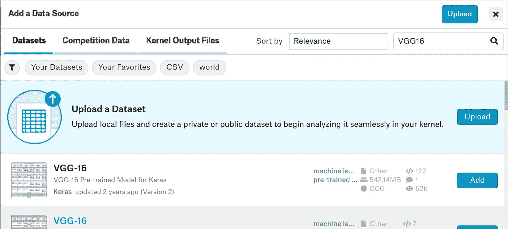
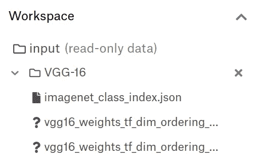
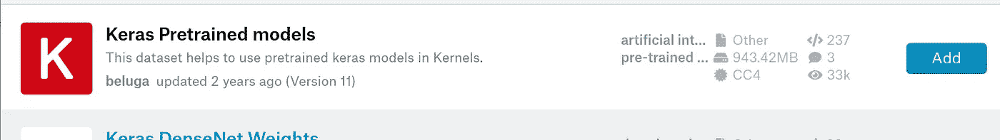

# Kaggle 技巧—向内核添加新数据集

> 原文：<https://medium.com/analytics-vidhya/kaggle-tricks-add-new-dataset-to-kernel-ab8e0601e5a1?source=collection_archive---------3----------------------->

您可以将 Keras 中一些流行的 DNN 模型的预训练权重添加到 Kaggle 内核中。为此，请单击添加数据集按钮


您将看到以下窗口。输入一些流行的 DNN 型号的名称，如 VGG16



然后单击添加。再过一段时间就会得到名为 VGG16 的新目录



有两个. h5 文件。这些文件是预先训练好的权重，可以在内核中使用。

现在让我们创建一个 VGG16 模型并加载预训练的重量:

```
base_model = VGG16(weights=None, input_shape=(img_size,img_size,3), include_top=False)
base_model.load_weights(‘../input/vgg16/vgg16_weights_tf_dim_ordering_tf_kernels_notop.h5’)
```

您可以添加名为 Keras 预训练模型的数据集



其中包含了一系列针对 Keras 中流行的 DNN 模型的预训练权重，如 InveptionV3、ResNet50、Xception 等。

现在你可以在你的 Kaggle 内核中执行迁移学习，并赢得任何比赛:)。享受 Kaggle 上的机器学习，祝 kaggling 好运！