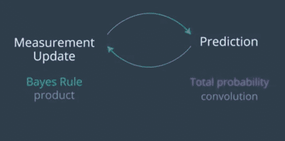

# 卡尔曼滤波器:python 中的分步实施指南

> 原文：<https://medium.com/analytics-vidhya/kalman-filters-a-step-by-step-implementation-guide-in-python-91e7e123b968?source=collection_archive---------0----------------------->

## *本文将为您简化卡尔曼滤波器。希望，当你谷歌卡尔曼滤波器时，你会了解并解开所有这些你在维基百科上找到的神秘事物。*

***那么我们开始吧！***

要了解卡尔曼滤波器，我们需要得到的基本知识。在卡尔曼滤波器中，分布由所谓的高斯分布给出。

> 什么是高斯分布？

高斯是位置空间上的连续函数，下面的面积总和为 1。

图中的高斯

高斯由两个参数定义，平均值(通常缩写为希腊字母μ)和高斯宽度(通常称为方差(适马平方))。因此，我们在公共阶段的工作是保持阿木和适马广场，作为我们试图寻找的物体位置的最佳估计。

显示均值和方差的图表

确切的公式是二次函数的指数，其中我们取表达式的指数。现在在下面的等式中，如果 x 等于μ，那么分子变成 0，如果 x 为 0，也就是 1。结果是我们必须用一个常数来归一化，1 除以 2π适马平方的平方根。

高斯方程

> **什么是方差？**

方差是高斯分布的度量(即曲线下面积的分布)。较大的方差对应于较短的高斯分布。
方差也是确定性的度量；如果您试图以最大的确定性查找类似汽车位置的内容，您将需要一个均值为汽车位置且具有最小不确定性/扩散的高斯分布。

高斯函数的代码实现

> **如何转移均值？**

在卡尔曼滤波器中，我们迭代测量(测量更新)和运动(预测)。并且更新将使用贝叶斯规则，该规则不是别的，而是乘积或乘法。在预测中，我们使用全概率，这是一个卷积或简单的加法。

测量更新和预测周期

根据 Udacity 的计算机视觉课程，测量周期和预测周期的实施如下:

1.  假设您正在本地化另一个车辆，并且您有一个如下所示的先验分布:这是一个非常广泛的高斯均值。这是一个例子，在我们之前，我们对位置相当不确定，但测量告诉我们相当多的车辆在哪里。
2.  最终的平均值在两个旧平均值之间移动，这两个旧平均值是先前的平均值和测量值的平均值。它在测量方面稍微更进一步，因为测量对于车辆的位置比先前更确定。我们越确定，就越往确定答案的方向拉均值。

平均值的定位(绿色)

> **如何更新参数？**

1.  假设我们将两个高斯函数相乘，如贝叶斯规则，一个先验概率和一个测量概率。先验具有μ的均值和适马平方的方差，测量具有μ的均值和 r 平方的协方差。
2.  那么，新的均值μ素数就是旧均值的加权和。μ用 r 平方加权，μ用适马平方加权，用加权因子之和归一化。新的方差项将是适马平方素数。
3.  显然，先验高斯具有高得多的不确定性，因此，适马平方更大，这意味着 nu 的加权远大于μ。所以，这个意思会比 mu 更接近 nu。有趣的是，**方差项不受实际均值**的影响，它只是使用之前的方差。

更新功能

它的代码实现如下:

> **如何实现高斯运动？**

1.  新的平均值是旧的平均值加上通常称为 u 的运动，因此，如果你在 x 方向移动 10 米，这将是 10 米，你知道σ平方是旧的σ平方加上运动高斯的方差。这是你需要知道的全部，这只是一个补充。
2.  预测步骤中产生的高斯只是将这两个量相加，μ加 u 和σ平方加 r 平方。

运动更新/预测功能

它的代码实现如下:

所以现在让我们把所有的东西放在一起。让我们写一个主程序，它采用这两个函数，更新和预测，并输入一系列的测量和运动。在我选择的例子中:
测量值为 5。, 6., 7., 9.，和 10。
运动为 1。, 1., 2., 1., 1.

如果最初的估计值是 5，这一切都会很好地完成，但是我们将它设置为 0，不确定性非常大，为 10，000。
我们假设:
测量不确定度为常数 4，
运动不确定度为常数 2。

当你运行这个时，你对头寸的第一次估计应该基本上变成 5–4.99，原因是你的初始不确定性太大，估计被第一次测量所支配。你的不确定度缩小到 3.99，比测量不确定度略好。
你然后预测你加 1，但是不确定度增加到 5.99，也就是 2 的运动不确定度。你基于度量 6 再次更新，你得到你的估计值 5.99，差不多是 6。你再移动 1。你的尺寸是 7。你移动 2。你的尺寸是 9。你移动 1。你量 10，你移动最后一个 1。最终结果出来了，仓位的预测值是 10.99，也就是你的 10 个仓位移动了 1，不确定性——剩余不确定性是 4。

输出

通过循环遍历一系列 x 值并创建高斯值的结果列表来绘制高斯图，将得到:

图表

**想用代码检查一下吗？**

*   点击这里: [**卡尔曼滤波器！**](https://github.com/Garima13a/Kalman-Filters)

**参考:**

*   [Udacity 的计算机视觉纳米度](https://www.udacity.com/course/computer-vision-nanodegree--nd891)