# 卡鲁赫-库恩-塔克(KKT)条件

> 原文：<https://medium.com/analytics-vidhya/karuch-kuhn-tucker-kkt-conditions-16057fcdb34b?source=collection_archive---------0----------------------->

# **简介**:

KKT 条件是一阶导数测试(必要条件)的一个解决方案是最优的。这些条件推广了拉格朗日乘子的概念，它们不仅允许包含等式约束。

# **数学描述**

当我们的目标是在给定的约束下最小化函数 f(x)时，考虑约束优化问题:

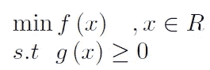

为此，我们使用拉格朗日乘数法。拉格朗日量由下式给出:

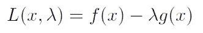

KKT 条件给出如下，其中该问题的最优解 x*必须满足**所有**条件:

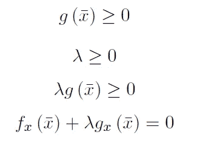

第一个条件称为“对偶可行性”，第二个条件称为“原始可行性”，第三个条件称为“互补松弛”，最后一个条件是“平稳性”。

互补松弛度(3)意味着最优解有两种情况:

1.  无效约束，其中:

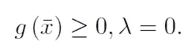

这意味着约束问题的解等于无约束问题的解。

2.活动(绑定)约束，其中:

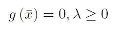

该约束强制解决方案位于输入空间中区域之间的边界上，其中 g 改变其符号。

# 例子

考虑下面的函数和约束。证明它们满足 KKT 条件并找到最优解。

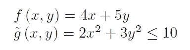

首先，让我们适当地制定约束条件:

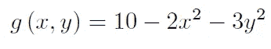

现在，我们必须构造拉格朗日函数，并像在常规优化问题中那样导出它:

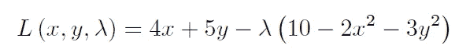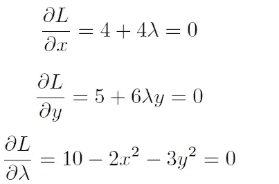

通过求解这些方程，我们获得了候选的最优解:

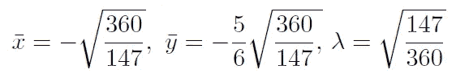

现在。让我们评估我们的候选人，以批准其最优性:

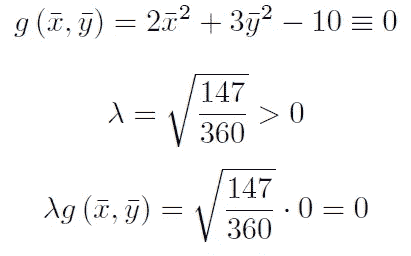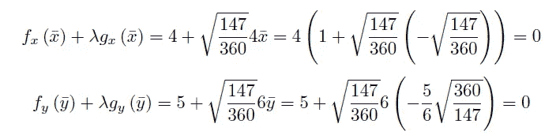

我们获得所有必要的条件都得到满足。注意，KKT 条件是找到最优解的必要条件。注意:它们不一定是足够的。如果所有的约束函数都是凸的，这些 KKT 条件也是充分的。

如果您从这篇文章中学到了什么，我将非常感谢您通过按👏按钮。感谢阅读！