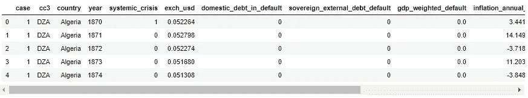
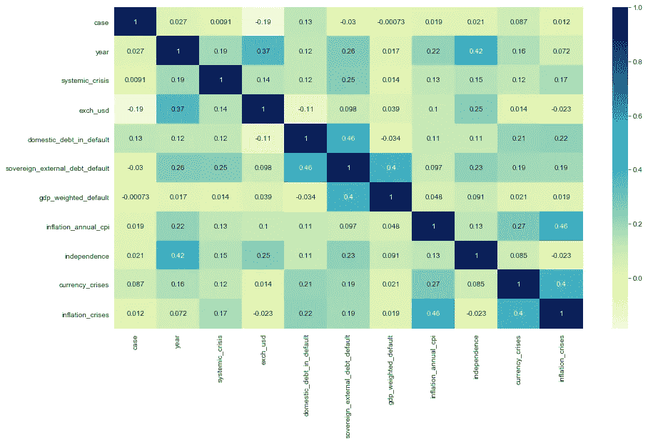

# 肯德尔等级相关性 Python

> 原文：<https://medium.com/analytics-vidhya/kendall-rank-correlation-python-19524cb0e9a0?source=collection_archive---------1----------------------->


用 python 实现肯德尔秩相关，如何实现？？

你对肯德尔秩相关有足够的了解吗？— [希望这能增加你的知识。](/@joseph.magiya/kendall-rank-correlation-explained-dee01d99c535)对我来说，这是一个非常令人兴奋的项目，尤其是因为它有助于揭示你的数据集中变量之间复杂和未知的关系，而这些关系你仅仅通过查看数据是无法知道的。+这样节省了很多时间。万岁！🙌

我将直接讨论我们如何用 python 来做这件事。

我们将使用 dataframe.corr()。如果你需要这方面的快速介绍——看看我对 [dataframe.corr()](/@joseph.magiya/pearson-coefficient-of-correlation-using-pandas-ca68ce678c04) 的解释。

# 我们开始吧！

> 对于我们在做之前必须学习的事情，我们通过做来学习。**亚里士多德，尼各马科伦理学**

首先，我们导入我们需要的包——先决条件或头文件。你想怎么称呼他们都行，但我们需要他们

## 导入先决条件

```
import pandas as pd
from pylab import rcParams
import seaborn as sb
from scipy.stats.stats import kendalltau
```

## **数据可视化设置**

```
# Data Visualisation Settings 
%matplotlib inline
rcParams['figure.figsize'] = 5,4
sb.set_style('whitegrid')
```

## 数据源


图片来源

现在我们已经准备好了这些，我们需要一些数据。为此，我选择了一个简单但有趣的数据，这是我在 Kaggle 上看到的。你可以在这里阅读并下载[。](https://www.kaggle.com/chirin/africa-economic-banking-and-systemic-crisis-data)

该数据集特别关注 1860 年至 2014 年发生在 13 个非洲国家的银行、债务、金融、通胀和系统性危机，包括:阿尔及利亚、安哥拉、中非共和国、科特迪瓦、埃及、肯尼亚、毛里求斯、摩洛哥、尼日利亚、南非、突尼斯、赞比亚和津巴布韦。

## 加载并预览数据

让我们读取数据，将其放入数据帧并预览:

```
# Import the data
african_crises = pd.read_csv("african_crises.csv")
african_crises.head()
```

预览数据；它太长了，不适合截图



预见非洲危机

banking_crisis 列是文本，让我们将其改为数字，这样我们就可以做一些关联—只是为了好玩。
但首先让我们看看列中的唯一值

```
african_crises.banking_crisis.unique()
```

这给了我们这个结果— array(['crisis '，' no_crisis']，dtype=object)

对此，我们只有两个唯一的值，1 表示危机，0 表示无危机

```
african_crises['banking_crisis'] = african_crises['banking_crisis'].map({'crisis': 1, 'no_crisis': 0})
```

## 肯德尔等级相关使用。更正()

Pandas `**dataframe.corr()**`用于查找数据帧中所有列的成对相关性。如果你需要这方面的快速介绍——看看我对 [dataframe.corr()](/@joseph.magiya/pearson-coefficient-of-correlation-using-pandas-ca68ce678c04) 的解释。

```
corr = african_crises.corr(method='kendall')
```

## 使用热图可视化

```
rcParams['figure.figsize'] = 14.7,8.27
sb.heatmap(corr, 
           xticklabels=corr.columns.values, 
           yticklabels=corr.columns.values, 
           cmap="YlGnBu",
          annot=True)
```



相关的热图

在 GitHub 上查看[笔记本](https://github.com/JosephMagiya/Kendall-Rank-Correlation-Python/blob/master/Kendall%20Rank%20Correlation.ipynb)

# 结论

在对数据进行任何类型的分析之前，关联变量将节省数据忍者的时间。在我看来，这更像是对数据的 x 光透视。在任何项目中执行这种关联都是关键——您可能会发现一些有用的东西，也可能会一无所获，不管是哪种情况，您都会对数据有所了解！

您还可以查看:

*   [肯德尔等级相关性解释](/@joseph.magiya/kendall-rank-correlation-explained-dee01d99c535)
*   [皮尔逊相关系数解释](/@joseph.magiya/pearson-coefficient-of-correlation-explained-369991d93404)
*   [皮尔逊相关系数- python](/@joseph.magiya/pearson-coefficient-of-correlation-using-pandas-ca68ce678c04)
*   [我的个人资料了解更多数据](/@joseph.magiya)