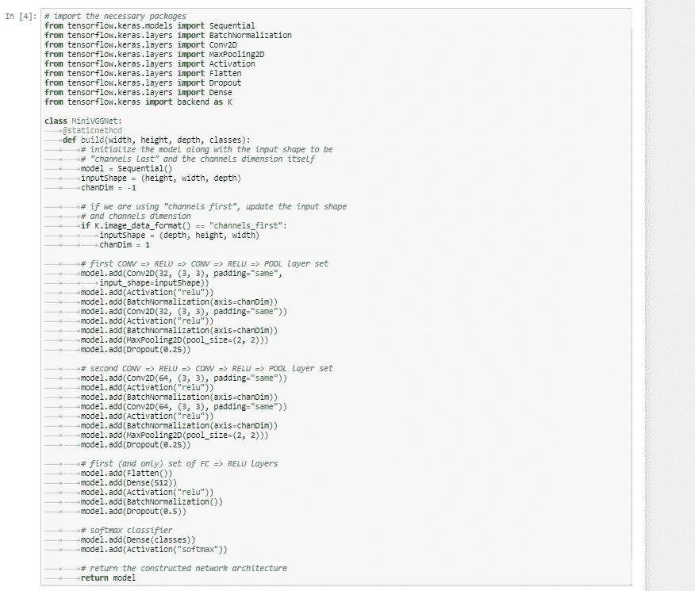
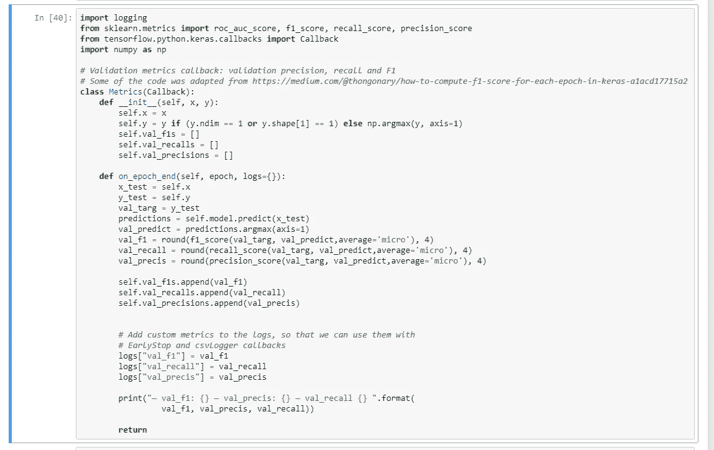
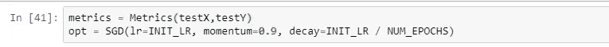
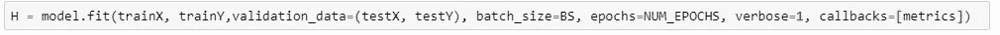
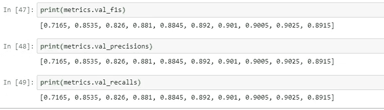

# Keras[TF 2.0]自定义回调—了解模型在不同阶段如何训练的关键功能

> 原文：<https://medium.com/analytics-vidhya/keras-custom-callbacks-key-feature-to-understand-how-model-trains-at-various-stages-111fb838d37c?source=collection_archive---------18----------------------->

来源:[https://apisyouwonthate . com/blog/open API-callbacks-and-web hooks](https://apisyouwonthate.com/blog/openapi-callbacks-and-webhooks)

在 Keras 中，回调是一个强大的功能，可以让你了解你的神经网络是如何训练的。它可以让您在训练的不同阶段执行这些功能，例如在每次训练的开始和结束、每个时期或批次。使用此功能，您可以编写自定义回调，让您在每个时期/批次结束时计算 F1 分数、精确度和召回率，从而了解您的训练是如何进行的。

在这篇博客中，我将展示我们如何编写自定义回调函数来监控前面提到的“时尚 MNIST”数据集的图像分类问题的指标。我们将利用迷你 VGG 网络作为我们的 CNN 网络来执行这项行动。

这段代码是作为 TF 2.0 中可用的 Keras 的一部分编写的。有很多博客描述了旧版本 keras 的这一功能，但是在互联网上很少发现新版本的参考文献。

让我们开始吧，你可以在这里找到这个博客[的 python 笔记本](https://github.com/VVasanth/MachineLearning/tree/master/KerasCustomCallbacks)。

用于图像分类的迷你 VGGNet 来源:pyimagesearch.com

我们首先将迷你 VGG 网络定义为我们的 CNN 网络。这来源于 pyimagesearch，您可以在参考资料部分找到网络的更多详细信息。

在笔记本的其余部分，我们将从 keras 加载时尚 MNIST 数据集，并执行所需的处理以将数据输入网络。

然后定义自定义回调类，如下所示:

自定义回调函数来计算每个时期的 F1 分数

自定义回调是一个抽象基类，具有“on_train_begin”、“on_train_end”、“on_epoch_begin”、“on_epoch_end”、“on_batch_begin”和“on_batch_end”等方法。一旦我们扩展了基类并实现了对各个阶段的调用，我们就能够在定义的阶段跟踪模型的性能。

在这篇博客中，我们仅利用“on_epoch_end”来衡量关键指标，如 F1、每个 epoch 结束时的精度。此外，请注意，我们使用构造函数“init”来初始化值，并且我们将在定义“metrics”类时将验证测试作为参数传递给构造函数，如下所示:

在启动网络的“Fit”操作时，将定义的自定义回调对象传递给“Callback”参数:

现在，网络将接受训练，并在每个时期结束时计算 F1 分数和相关指标。

您可以在培训后检索指标值，并使用它们进行分析，如下所示:

如果没有这个特征，我们将被限制于仅使用默认的度量来监控网络的训练过程，例如在每个时期结束时的“准确性”和“损失”。但这一功能甚至可以让我们定义自定义指标和培训的各个阶段。

参考资料:

 [## Keras 自定义回调| TensorFlow 核心

### 自定义回调是一个强大的工具，可以在训练、评估或其他过程中自定义 Keras 模型的行为

www.tensorflow.org](https://www.tensorflow.org/guide/keras/custom_callback)  [## Keras 回调指南和代码

### 更新:这篇文章是为 Keras 1.x 写的。事情变化不大，但回购对 Keras 来说是最新的…

keunwoochoi.wordpress.com](https://keunwoochoi.wordpress.com/2016/07/16/keras-callbacks/)  [## 时尚 MNIST 与 Keras 和深度学习

### 在本教程中，你将学习如何训练一个简单的卷积神经网络(CNN)与时尚的 Keras

www.pyimagesearch.com](https://www.pyimagesearch.com/2019/02/11/fashion-mnist-with-keras-and-deep-learning/)