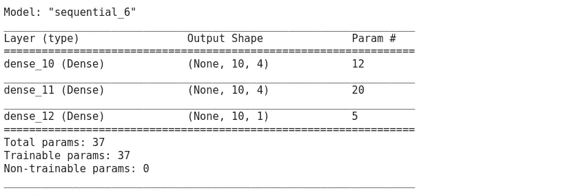

# Keras 模型顺序 API 与功能 API

> 原文：<https://medium.com/analytics-vidhya/keras-model-sequential-api-vs-functional-api-fc1439a6fb10?source=collection_archive---------7----------------------->

Keras 深度学习库有助于快速轻松地开发神经网络模型。在 Keras 中有两种建立模型的方法——顺序的和功能的。让我解释一下。

凯文·Ku 在 [Unsplash](https://unsplash.com?utm_source=medium&utm_medium=referral) 上的照片

# 顺序 API

顺序 API 允许您通过堆叠模型来逐层创建模型。它的局限性在于，它不允许您创建共享层或具有多个输入或输出的模型。

示例代码:

结果

现在让我们使用 keras utils 绘制您的模型。

喀拉斯图模型

如您所见，顺序 API 创建模型并一层一层地将它们堆叠在一起。顺序 API 在大多数情况下非常容易创建深度学习模型。

# 功能 API

Keras functional API 提供了更大的灵活性，因为您可以轻松地定义模型，其中的层不仅仅连接到上一层和下一层，您还可以将层连接到任何其他层。因此，您可以创建复杂的网络，如残余网络。

示例代码:

结果

使用 keras utils 绘制功能模型。

喀拉斯图模型

正如你所看到的，函数式 API 让我们可以让层更加灵活。

# 模型子类化

如果你熟悉面向对象编程(OOP)，那么这种方法是最有效的方式。通过子类化`Model`类:在这种情况下，你应该在`__init__`中定义你的层，并且你应该在`call`中实现模型的向前传递。

示例代码:

模型子类化示例

# 结论

# 顺序 API

优点:

1.  简单易用。
2.  允许您通过堆叠模型来逐层创建模型。

CONS:

1.  难以制作具有多输入、多输出或共享层的模型。对于需要合并层、连接层、添加层网络不灵活。

# 功能 API

优点:

1.  灵活的模型架构(每层可以成对连接)。
2.  可以创建复杂网络，如残差网络。

CONS:

1.  在顶部需要一个独立的“输入”层来指定输入形状。

# 模型子类化

优点:

1.  比功能或顺序更灵活。
2.  可以创建多个层块。

CONS:

1.  熟悉 OOP。

# 谢谢你