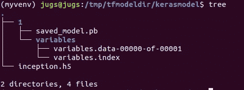
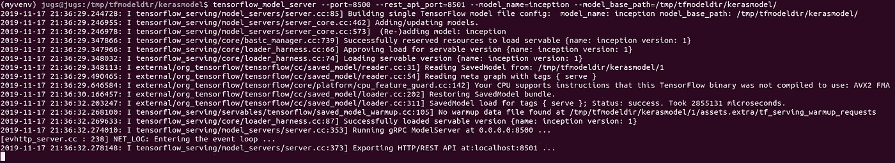

# Keras 模型到冻结模型

> 原文：<https://medium.com/analytics-vidhya/keras-model-to-frozen-model-36514eadf3ec?source=collection_archive---------2----------------------->


萨法尔·萨法罗夫在 [Unsplash](https://unsplash.com?utm_source=medium&utm_medium=referral) 上拍摄的照片

在 Keras 上的 Stackoverflow 或 Github repository 中，被问得最多的一个问题是模型转换。为了快速测试和容易获得图像分类器的预训练模型，大多数开发人员/研究人员倾向于使用 Keras。使用 Keras 库可以轻松下载 VGG16/19、Inception、Resnet 等图像分类器模型。在大多数情况下，这些模型被用作主干架构。诸如图像定位和图像分割(Mask RCNN)的计算机视觉任务使用图像分类器模型作为骨干架构。

来自 Keras 的图像分类器模型只能以 h5 格式保存，即 Keras 模型的原生格式。但是，当这个模型必须用于推理时，它应该是 proto buffer 格式[注意* h5 模型可以使用 flask]。

让我们直接进入代码。导入可以下载 Keras 模型(Inception)的 Keras 模块。

```
import keras
import json
import os
import sys
import tensorflow as tf
from keras.applications.inception_v3 import InceptionV3
from keras.layers import Input
```

让我们创建一个目录，以 Keras 格式保存模型，以便稍后导入 h5 模型。这将说明在 Keras 中保存到模型和加载模型的方法。

```
base_path = "/tmp/tfmodeldir/kerasmodel"
inception_model = InceptionV3(weights=’imagenet’,    input_tensor=Input(shape=(299, 299, 3)))
inception_model.save(os.path.join(base_path,’inception.h5'))
```

您可以转到 base_path 目录，查看模型是否已经保存。

现在，我们将从您的磁盘中加载保存的 h5 格式的模型，并检查初始模型的概要(大型网络如此巨大的层概要)。

```
model = tf.keras.models.load_model(os.path.join(base_path, ‘inception.h5’))
model.summary()Model: "inception_v3"
__________________________________________________________________________________________________
Layer (type)                    Output Shape         Param #     Connected to                     
==================================================================================================
input_2 (InputLayer)            [(None, 299, 299, 3) 0                                            
__________________________________________________________________________________________________
conv2d_95 (Conv2D)              (None, 149, 149, 32) 864         input_2[0][0]                    
__________________________________________________________________________________________________
batch_normalization_95 (BatchNo (None, 149, 149, 32) 96          conv2d_95[0][0]
.     .    .      .    .      .        .        .      .       .
.     .    .      .    .      .        .        .      .       .
avg_pool (GlobalAveragePooling2 (None, 2048)         0           mixed10[0][0]                    
__________________________________________________________________________________________________
predictions (Dense)             (None, 1000)         2049000     avg_pool[0][0]                   
==================================================================================================
Total params: 23,851,784
Trainable params: 23,817,352
Non-trainable params: 34,432
```

同时，您可以检查加载的模型是否可以对输入图像进行预测。

```
**from** keras.applications.inception_v3 **import** decode_predictionsimage = load_img(**'/tmp/elephant.jpg'**, target_size=(224, 224))
image = img_to_array(image)
image = image.reshape(1, image.shape[0], image.shape[1], image.shape[2])
image = preprocess_input(image)y_ = model.predict(image)

label = decode_predictions(y_)
print(label[0][0])>>('n02504458', 'African_elephant', 0.71297616)
```

Keras 模型以 71.298%的置信度预测“非洲象”。

```
tf.keras.backend.set_learning_phase(0)export_dir = os.path.join(‘/tmp/tfmodeldir/kerasmodel’, ‘1’)with tf.keras.backend.get_session() as sess:
 tf.saved_model.simple_save(sess, export_dir, 
                      inputs= {“keys”:model.input},
                      outputs= {t.name: t for t in model.outputs})
```

要转换 Keras model tp proto buffer (Pb)格式，让我们创建模型版本为“1”的输出路径，因为 Tensorflow serving 会查找版本号。



图:保存的 incepetion _ v3 冻结模型

我们可以使用 saved_model_cli 检查保存的模型的签名定义。

```
$ saved_model_cli show --dir /tmp/tfmodeldir/kerasmodel/1/ --allsignature_def[‘serving_default’]:
 The given SavedModel SignatureDef contains the following input(s):
 inputs[‘keys’] tensor_info:
 dtype: DT_FLOAT
 shape: (-1, 299, 299, 3)
 name: input_3_2:0
 The given SavedModel SignatureDef contains the following output(s):
 outputs[‘predictions_4/Softmax:0’] tensor_info:
 dtype: DT_FLOAT
 shape: (-1, 1000)
 name: predictions_4/Softmax:0
 Method name is: tensorflow/serving/predict
```

默认情况下，签名定义为“serving_default”。现在我们可以使用 tensorflow_serving 来服务冻结模型(inception_v3 pb 模型)。



图:服务 TensorFlow serving 中的 Inception_v3 模型

现在，如果服务运行良好，我们可以编写客户端部分。在这种情况下，我们不能只使用 curl，不像在其他部分，我们可以使用 curl 从服务器进行推理。这里，我们需要图像特征提取，所以需要使用库来获取图像的特征。

```
from keras.preprocessing.image import load_img
from keras.preprocessing.image import img_to_array
from keras.applications.vgg16 import preprocess_input
from keras.applications.vgg16 import decode_predictions
import requestsimage = load_img(‘/tmp/elephant.jpg’, target_size=(224, 224))
image = img_to_array(image)
image = image.reshape(1, image.shape[0], image.shape[1], image.shape[2])
image = preprocess_input(image)endpoint = “[http://localhost:8501/v1/models/inception:predict](http://localhost:8501/v1/models/inception:predict)"
headers = {“content-type”:”application-json”}
instances = image.tolist()
data = json.dumps({“signature_name”:”serving_default”,”instances”: instances})
response = requests.post(endpoint, data=data, headers=headers)
prediction = json.loads(response.text)[‘predictions’]
prediction[0].index(max(prediction[0]))>>916
```

输出是 916，我们可以从 inception class dictionary 中导入类/标签，看看 key 916 的标签名称(值)是否是“African Elephant ”,就像上面的例子一样。