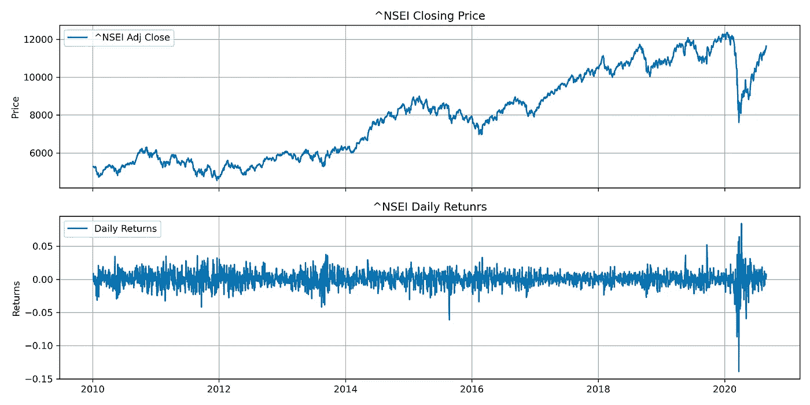
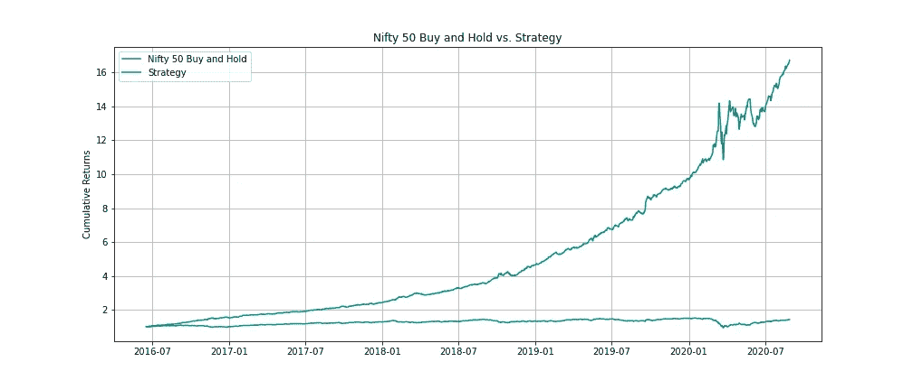
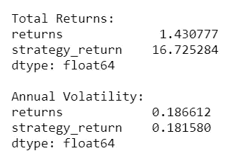
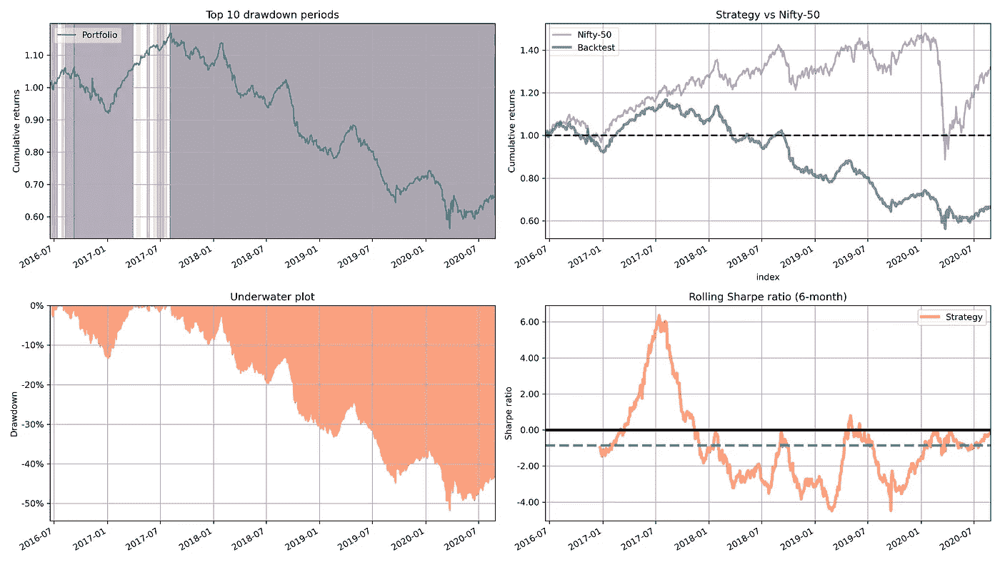
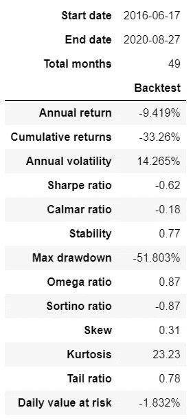

# Keras & TensorFlow 使用 Backtrader 预测市场走势和回测

> 原文：<https://medium.com/analytics-vidhya/keras-tensorflow-to-predict-market-movements-and-backtest-using-backtrader-d51b0b3e9070?source=collection_archive---------1----------------------->

在我的上一篇文章— [预测市场运动的 ML 分类算法和回溯测试](/analytics-vidhya/ml-classification-algorithms-to-predict-market-movements-and-backtesting-2382fdaf7a32?source=friends_link&sk=28adc30998b92ce65f5ad14c883a2621)中，我们使用了多种基于 scikit-learn 的分类算法来预测股票运动的方向。在本文中，让我们使用 Keras & TensorFlow 和一些附加功能，看看我们是否可以获得更好或可比的结果。你可以在我的 [Github](https://github.com/sabirjana/blog/tree/master/Deep_Learning) 页面上找到本文使用的相关 Jupyter 笔记本。我们的方法如下:

1.  收集历史定价数据。
2.  特征工程。
3.  深度学习模型的建立和应用。
4.  使用反向交易者进行策略反向测试。

**收集历史定价数据**

我们将继续使用 Nifty-50 指数进行分析。我们将借助`[yfinance](https://github.com/ranaroussi/yfinance)` python 库下载每日收盘价格数据，计算每日日志回报，并在此基础上得出市场方向。我们将可视化收盘价和每日回报，以快速检查我们的数据。由于代码与我上一篇文章中的相同，我们就不在这里重复了。



每日定价和日志回报

**特征工程**

除了之前使用的五天滞后回报，让我们也使用一些额外的技术指标，如 RSI(相对强度指数)，布林线，移动平均线收敛发散(MACD)指标。我已经用 python 库 [ta-lib](https://github.com/mrjbq7/ta-lib) 计算过技术指标。这一部分的 python 代码如下:

```
# define the number of lags
lags = [1, 2, 3, 4, 5]# compute lagged log returns
cols = []
for lag in lags:
    col = f'rtn_lag{lag}'
    stock[col] = stock['returns'].shift(lag)
    cols.append(col)
stock.head(2)# RSI - Relative Strenght Index
stock['rsi'] = RSI(stock.close)# append to feature columns list
cols.append('rsi')
stock.tail(2)# Compute Bollinger Bands
high, mid, low = BBANDS(stock.close, timeperiod=20)
stock = stock.join(pd.DataFrame({'bb_high': high, 'bb_low': low}, index=stock.index))# append to feature columns list
cols.append('bb_high')
cols.append('bb_low')# Compute Moving Average Convergence/ Divergence
stock['macd'] = MACD(stock.close)[0]# append to feature columns list
cols.append('macd')
```

代码注释:

1.  定义一个函数来计算 5 天的滞后回报以及一个列表变量- `cols`。我们使用这个变量来附加将用于模型的所有特性列名。
2.  计算 RSI 指数，作为我们的`stock`数据框架的附加列。
3.  同样，添加布林线和 MACD 指标的列。

**深度学习模型的建立和应用**

我们将使用 Keras & TensorFlow API 的深度神经网络模型。我们的方法是 API 狩猎，这意味着什么和如何使用 API，而不是进入数学解释。有关 Keras & TensorFlow 的更多信息，请参考{ [链接](https://keras.io/) }。这一部分的 python 代码如下:

```
# split the dataset in training and test datasets
train, test = train_test_split(stock.dropna(), test_size=0.4, shuffle=False)# sort the data on date index
train = train.copy().sort_index()
test = test.copy().sort_index()# define a function to create the deep neural network model
def create_model():
    np.random.seed(100)
    tf.random.set_seed(100)
    model = Sequential()
    model.add(Dense(64, activation='relu', input_dim=len(cols)))
    model.add(Dense(64, activation='relu'))
    model.add(Dense(1, activation='sigmoid'))
    model.compile(loss='binary_crossentropy', optimizer='adam', 
                  metrics=['accuracy'])
    return model# normalized the training dataset
mu, std = train.mean(), train.std()
train_ = (train - mu) / mu.std()# create the model
model = create_model()# map market direction of (1,-1) to (1,0)
train['direction_'] = np.where(train['direction'] > 0, 1, 0)%%time
# fit the model for training dataset
r = model.fit(train_[cols], train['direction_'], epochs=50, verbose=False)# normalized the test dataset
mu, std = test.mean(), test.std()
test_ = (test - mu) / std# map market direction of (1,-1) to (1,0)
test['direction_'] = np.where(test['direction'] > 0, 1, 0)# evaluate the model with test dataset
model.evaluate(test_[cols], test['direction_'])# predict the direction and map it (1,0)
pred = np.where(model.predict(test_[cols]) > 0.5, 1, 0) 
pred[:10].flatten()
```

代码注释:

1.  将上一节创建的`stock`数据帧分割成训练和测试数据集。我保留了参数`shuffle=False`和参数`test_size=0.4`。这意味着我们将使用最初的 60%数据集进行训练，剩下的 40%将用于测试。
2.  使用日期时间索引对定型和测试数据集进行排序，并定义一个函数来构建模型。参数`input_dim=len(cols)`是特征列的数量。我使用了`activation=’relu’`作为输入层和密集层，不过你可以探索其他选项。输出层的激活函数必须是“sigmoid ”,因为我们试图解决一个分类问题。由于这是一个分类问题，损失函数必须是“binary_crossentropy ”,但是对于优化器，您可以进行试验。
3.  接下来，我们规范化训练数据集，并通过调用上一步中创建的函数来创建模型。
4.  将定型数据集的市场方向(1，-1)映射到(1，0)，并使用 x 作为规范化特征列，y 作为市场方向来拟合模型。
5.  接下来，标准化测试数据集，并将测试数据集的市场方向(1，-1)映射到(1，0)，并使用测试数据集评估模型。
6.  使用规范化测试数据集的特征列预测市场方向，并根据预测值是大于还是小于 0.5 将预测值映射到(1，0)。

现在，根据我们的预测，我们将计算投资组合头寸和策略回报，并将买入并持有的累积回报与策略回报进行可视化。

```
# based on prediction calculate the position for strategy
test['position_strategy'] = np.where(pred > 0, 1, -1)# calculate daily returns for the strategy
test['strategy_return'] = test['position_strategy'] * test['returns']# calculate total return and std. deviation of each strategy
print('\nTotal Returns:')
print(test[['returns', 'strategy_return']].sum().apply(np.exp))
print('\nAnnual Volatility:')
print(test[['returns', 'strategy_return']].std() * 252 ** 0.5)# number of trades over time for the strategy
print('Number of trades = ', (test['position_strategy'].diff()!=0).sum())# plot cumulative returns
fig, ax = plt.subplots(1, 1, sharex=True, figsize = (14,6))
ax.plot(test.returns.cumsum().apply(np.exp), label = 'Nifty 50 Buy and Hold')
ax.plot(test.strategy_return.cumsum().apply(np.exp), label = 'Strategy')
ax.set(title = 'Nifty 50 Buy and Hold vs. Strategy', ylabel = 'Cumulative Returns')
ax.grid(True)
ax.legend()
plt.savefig('images/chart2');
```

代码注释:

1.  计算投资组合头寸，如果预测大于零，我们做多(1)，否则做空(-1)。
2.  通过将头寸乘以实际日回报来计算投资组合回报。
3.  计算总回报、年标准差和交易者数量。
4.  想象 Nifty-50 的累积策略与买入并持有回报的关系。



Nifty 50 买入并持有与策略



总回报和年度标准差

哇！结果看起来相当令人印象深刻。我们策略的总回报是“买入并持有”策略的数倍。然而，正如我在上一篇文章中所讨论的，这是一个书面的回报，没有考虑任何约束。

**使用 Backtrader 对策略进行回溯测试**

让我们在[反向交易者](https://www.backtrader.com/docu/)的帮助下，给反向测试添加一些约束和现实。我将保持回测策略与上一篇文章中使用的策略相同— [ML 分类算法预测市场走势和回测](/analytics-vidhya/ml-classification-algorithms-to-predict-market-movements-and-backtesting-2382fdaf7a32?source=friends_link&sk=28adc30998b92ce65f5ad14c883a2621)，因此不会从头再来一遍方法和代码。回顾一下总结:

1.  我们从 100，000 英镑的初始资本和 0.1%的交易佣金开始。
2.  当`predicted`值为+1 时，我们买入，当预测值为-1 时，我们卖出(仅当持有股票时)。
3.  全进策略——在创建买入订单时，尽可能多地买入股票。
4.  不允许卖空。



战略与基准(买入并持有)



测试数据的策略性能

让我们分析一下我们策略的性能。年回报率为负，累计回报率为-33.26%，相比之下，向量化回测期间观察到的回报率超过 16 倍。如果我们将其他一些参数可视化，我们可以看到，在“禁止卖空”和交易佣金的限制下，我们的策略表现不佳。总之，在没有限制的情况下，事情在纸面上可能看起来很好，但是当我们考虑到现实市场中的限制和策略可行性时，现实可能完全不同。

祝投资愉快，请在文章中留下您的评论！

*请注意:此分析仅用于教育目的，作者不对您的任何投资决策负责。*

参考资料:

1.  [Python for Finance 2e:掌握数据驱动的金融](https://www.amazon.in/Python-Finance-2e-Yves-Hilpisch/dp/1492024333)作者 Yves Hilpisch
2.  [Python for Finance 食谱:将现代 Python 库应用于金融数据分析的 50 多个食谱](https://www.amazon.in/Python-Finance-Cookbook-libraries-financial-ebook/dp/B083KG9DC7/ref=sr_1_2?dchild=1&keywords=Python+for+Finance+Cookbook&qid=1597938216&s=books&sr=1-2)作者 Eryk Lewinson
3.  Stefan Jansen 的《算法交易的机器学习》
4.  请在我的 [Linkedin](https://www.linkedin.com/in/sabirjana/detail/recent-activity/shares/) 页面或 [Medium](/@sabirh.jana) 查看我关于量化金融的其他文章/帖子。