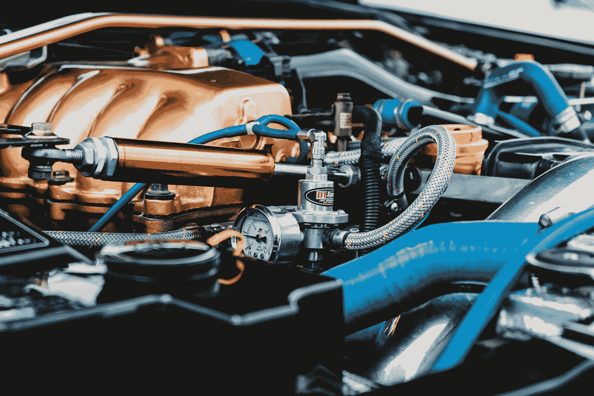

# Keras 调谐器:简化超参数调谐

> 原文：<https://medium.com/analytics-vidhya/keras-tuner-hyperparameter-tuning-made-easy-50cf050ac6e3?source=collection_archive---------11----------------------->



由[朱利安·霍格桑](https://unsplash.com/@julianhochgesang?utm_source=medium&utm_medium=referral)在 [Unsplash](https://unsplash.com?utm_source=medium&utm_medium=referral) 上拍摄的照片

在我们的日常 CNN 和图像分类或检测任务中，为我们的网络选择正确的超参数和层成为一项繁琐的任务。为了获得更好的精度和性能，使用超参数对神经网络进行正确的优化涉及大量的手动实验和使用不同层数、不同参数等的训练。这真的很忙乱和费时。好吧，等等！有没有简单的方法？是的，Keras 调谐器可以拯救你的一天。所以，不要浪费太多时间，让我们开始吧。

# 使用 Keras-Tuner

我们将对时尚 MNIST 数据集进行超参数调整。

**要求:**

*   Python 3.6
*   张量流 2.0

**安装:**

```
pip install -U keras-tuner
```

从源安装

```
git clone https://github.com/keras-team/keras-tuner.git 
cd keras-tuner 
pip install .
```

对于使用时尚 MNIST 数据的多类分类，我们必须加载训练和测试数据集。

导入所有依赖项

```
from tensorflow import keras 
from tensorflow.keras.layers import Conv2D, MaxPooling2D, Dense, Flatten, Activation
from kerastuner.tuners import RandomSearch
```

装载时尚 MNIST

```
fashion_mnist **=** keras**.**datasets**.**fashion_mnist

(train_images, train_labels), (test_images, test_labels) **=** fashion_mnist**.**load_data()
```

在 0 和 1 之间缩放图像。

```
train_images **=** train_images **/** 255.0
test_images **=** test_images **/** 255.0
```

现在，重塑测试和训练数据以便更好地输入到模型中。

```
train_images **=** train_images**.**reshape(len(train_images), 28, 28, 1)
test_images **=** test_images**.**reshape(len(test_images), 28, 28, 1)
```

我们将使用随机搜索来执行超参数调整。让我们定义一个名为 create_model 的函数，它接受一个参数 **hp。**

```
def create_model(hp):
 model = keras.models.Sequential() model.add(Conv2D(hp.int("input_units",min_value=32,max_value=256,step=32),(3,3) ,input_shape=train_images[1:]))
 model.add(Activation('relu'))
 model.add(MaxPooling2D(pool_size=(2, 2)))for j in range(hp.Int("no_layers",1,4)):
  model.add(Conv2D(32, (3, 3)))
  model.add(Activation('relu'))model.add(Flatten())model.add(Dense(10))
 model.add(Activation("softmax"))model.compile(optimizer="adam",
              loss="sparse_categorical_crossentropy",
              metrics=["accuracy"])return model
```

接下来，我们将实例化一个调谐器。我们指定模型构建函数、要优化的目标的名称(对于内置的指标，是最小化还是最大化是自动推断的)、要测试的试验总数(`max_trials`)以及应该为每个试验构建和适合的模型数量(`executions_per_trial`)。

定义一个测试目录来存储日志。

```
log_dir = "logs"tuner = RandomSearch( create_model, objective=’val_accuracy’, max_trials=5, executions_per_trial=3, directory=’log_dir’)
```

现在，我们开始最佳调整模型的超参数搜索。

```
tuner.search(x=train_images, y=train_labels,epochs=5,batch_size=64,validation_data=(test_images, test_labels))
```

现在运行模型，您将获得产生最佳精确度的参数。

希望你喜欢这本书！不断学习。