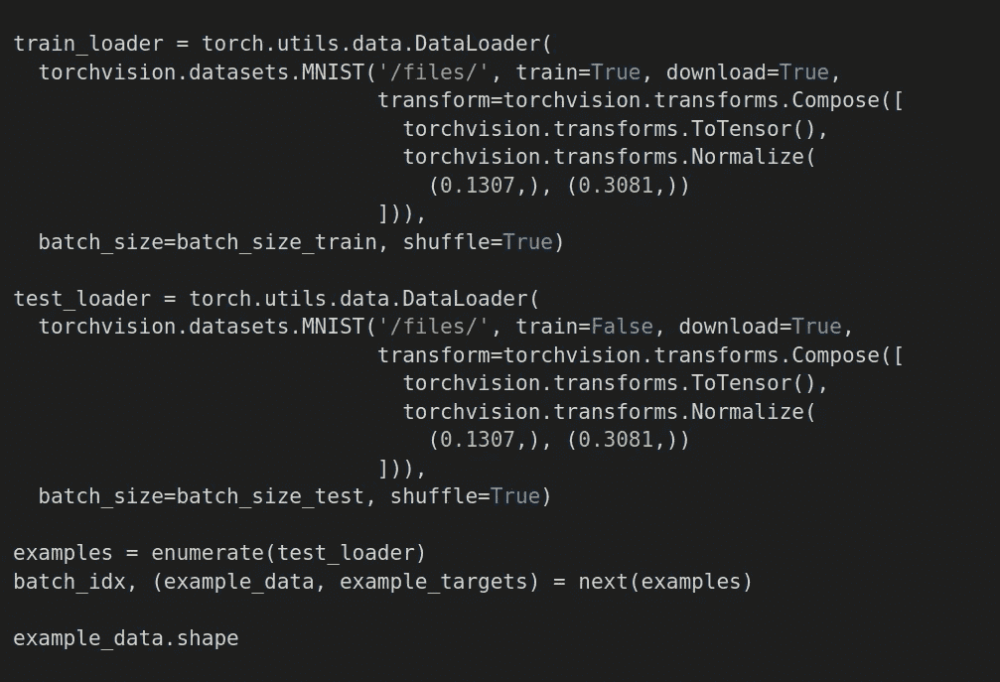
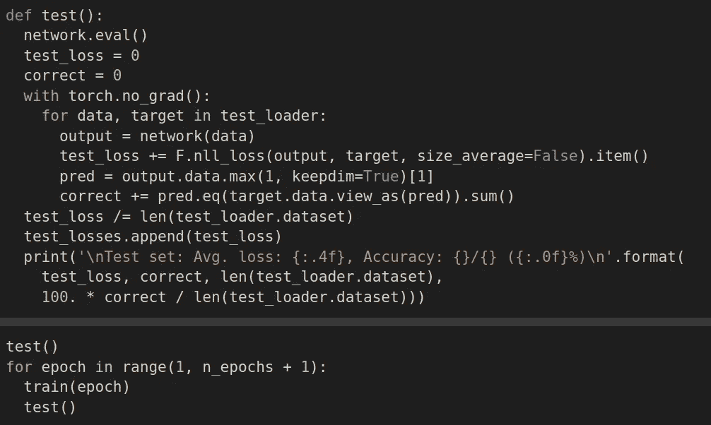

# Keras Vs PyTorch 困境

> 原文：<https://medium.com/analytics-vidhya/keras-vs-pytorch-dilemma-dc434e5b5ae0?source=collection_archive---------8----------------------->

选哪个？

所以你决定学习深度学习，但还有一个问题是要学习哪些工具。深度学习有很多框架或者库。在本文中，我将比较两个库 Keras 和 Pytorch，因为我认为这两个库是很好的开始。因为他们学习曲线低。初学者可以很容易地学会它们。在这篇文章中，我将分享一种处理这种困境的方法，以及如何选择一种方法。

选择一种并感觉良好的最好方法是浏览一下每种框架编码风格。开发任何解决方案时，首要的是您的工具。在开始任何项目之前，你必须正确地设置你的工具，一旦你开始了项目，你就不应该继续改变你的工具。会影响你的生产力。作为一个初学者，你应该尝试不同的工具并找到适合自己的工具，但是当你在做一个严肃的项目时，这些事情应该提前计划好。

每天都有新的框架和工具进入市场。对你来说最好的工具是在定制和抽象之间提供平衡的工具。工具应该与你的思维和编码风格同步。那么如何找到适合自己的工具呢？为此，你必须尝试不同的工具。

让我们使用 Keras 和 PyTorch 来训练一个简单的模型。如果你是深度学习的新手，不能理解一些概念，不要担心。现在，只需关注框架中的编码风格，并尝试想象哪一种最适合你。这样你会很舒服，也很容易适应。

两者的主要区别在于 PyTorch 默认处于 eager 模式，而 Keras 工作在 TensorFlow 和其他框架之上。但现在它主要与 TensorFlow 一起使用。默认情况下，这是在图形模式下。TensorFlow 的最新版本提供了类似 PyTorch 的急切模式，但速度较慢。如果您熟悉 NumPy，那么您可以将 PyTorch 视为具有 GPU 支持的 NumPy。有各种各样的具有高级 API 的库，比如 Keras 在后端使用 PyTorch。比如:Fastai(也免费提供很棒的讲座，一定要去看看)、Lightning、Ignite 等。也看看这些。如果你觉得它们很有趣，那么你会有更多的理由选择 PyTorch。

在这两个框架中有不同的方法来实现模型。让我们来看看这两个框架中的一个简单实现。我会提供谷歌 Colab 的链接。打开它们，试验代码。这也会帮助你找到最适合你的。

我不会说得太详细，因为我们的目的是看看代码的结构，并对这两个框架的风格略知一二。

# Keras 中的模型实现

下面是数字识别的实现。代码很容易理解。您必须检查 colab 并试验代码。至少自己跑一趟。

Keras 附带了一些样本数据集。MNIST 数字数据集就是其中之一。上面的代码将加载数据。图像采用 NumPy 数组格式。它还做了一些图像预处理，为我们的模型准备好数据。

上面的代码描述了我们的模型。在 Keras(TensorFlow)中，我们必须首先定义我们想要使用的东西，然后立即运行它们。我们不能当场不做实验，但是我们可以在 PyTorch 做。

上述代码将开始训练和评估模型。我们可以使用 *save()* 方法保存模型，稍后使用 *load_model()* 方法加载它。*使用 predict()* 方法得到测试数据上的输出。

这给了我们一个 Keras 基本模型实现的概述。现在让我们来看看 PyTorch。

# PyTorch 中的模型实现

研究人员大多使用 PyTorch，因为它的灵活性和实验性的编码风格。您可以在 PyTorch 中调整任何内容。你将拥有完全的控制权。随着控制而来的是责任:)。实验在其中很容易。因为您不必首先定义所有内容，然后运行它。我们可以很容易地测试一个步骤。因此它比 Keras 更容易调试。让我们看看一个简单的数字识别模型的实现。

上面这段代码导入了所需的库并定义了一些变量。你看到的变量有 *n_epochs* ，*动量*，*，*等等。是超参数，我们必须设置它们。这里就不细说了。我们的目的是理解代码的结构。

上述代码用于声明数据加载器，这些数据加载器用于为训练批量加载数据。有各种方法下载数据，它不是特定于框架的。如果你刚刚开始深度学习，上面的代码可能看起来很复杂。

这里我们已经定义了我们的模型。这是创建网络一般方式。我们扩展 *nn。模块*。在正向传递期间调用 *forward()* 方法。PyTorch 的实现非常简单，可以根据需要进行调整。

在上面这段代码中，我们定义了我们的训练和测试函数。在 Keras 中，我们调用 *fit()* 方法，一切都为我们完成了。但是在 PyTorch 中，我们必须手动完成这些步骤。像 Fastai 这样的高级 API 库使它变得简单，并且需要更少的代码来训练。

最后保存并加载模型，用于再次训练或预测。这部分没有太大变化。PyTorch 型号通常具有延伸 pt 或 pth。

# 我个人的建议

如果你学习了一种模式并理解了它的概念，那么从一种模式转换到另一种模式并不困难。这是几天的工作。我给你的建议是你应该两者都学。但是你不需要深入学习这两者。您应该从一个框架开始，并在该框架中编写您的模型，但是您还应该了解另一个框架。因为它会帮助你阅读别人在另一个框架中的代码。你永远不要被你的框架所束缚。虽然两者都很好。我从 Keras 开始。现在我在工作中使用 PyTorch。因为 PyTorch 适合实验作品。我喜欢 PyTorch 的 pythonic 风格。从你认为适合你的人开始，然后试着再学一个。如果你找到另一个更舒服的，那就赶紧去。因为 PyTorch 和 Keras 的大部分核心概念都差不多。从 PyTorch 到 Keras 或 Keras 到 PyTorch 的过渡很容易。

祝你的深度学习之旅好运。把你的注意力更多地放在概念上，以及它们在现实世界中是如何使用和实现的。

Colab 链接:

*   [使用 PyTorch 进行数字识别](https://colab.research.google.com/drive/1irYr0byhK6XZrImiY4nt9wX0fRp3c9mx?usp=sharing)
*   [使用 Keras 进行数字识别](https://colab.research.google.com/drive/1QH6VOY_uOqZ6wjxP0K8anBAXmI0AwQCm?usp=sharing)

# 快乐学习！！！

 [## Karan Jakhar -数据科学家-改造系统| LinkedIn

### 查看 Karan Jakhar 在全球最大的职业社区 LinkedIn 上的个人资料。Karan 有 3 份工作列在他们的…

www.linkedin.com](https://www.linkedin.com/in/karan-jakhar/)