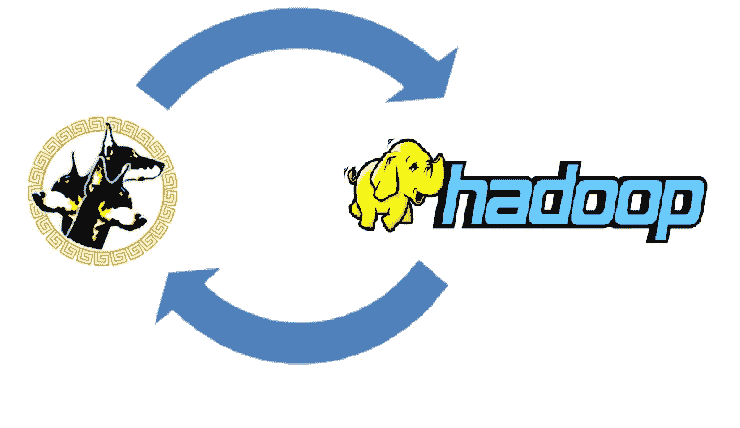

# Kerberos 和 Hadoop

> 原文：<https://medium.com/analytics-vidhya/kerberos-and-hadoop-c8bdd7f1c7f3?source=collection_archive---------5----------------------->



使用 Kerberos 的 Hadoop 集群身份验证

每当您在企业集群中的 Hadoop 环境或数据湖中工作时，您一定会遇到以下错误::*org . Apache . Hadoop . security . accesscontrolexception:需要身份验证或 org . Apache . Hadoop . IPC . remote exception(javax . security . sasl . saxlexception):GSS 启动失败*

该错误可能有多种原因，但其中一个主要原因是您没有有效的 Kerberos 票证。在本文中，我们将讨论什么是 Kerberos，为什么需要它，以及如何在 Hadoop 集群中使用它。

**什么是 Kerberos？**

Kerberos 是麻省理工学院开发的一种网络认证机制/协议。它基于标签系统工作，该系统允许用户/服务/流程与分布式系统或集群中的其他用户/服务/流程进行身份通信。使用有效的 Kerberos 票证和主体，用户甚至 Hadoop 服务都可以对自己进行身份验证。票证有一个有限的生命周期，比如说 10 个小时后它将过期并需要更新。

KDC(密钥分发中心)存储和控制主体(用户/服务的身份)和领域(认证管理域)。Principal 的典型约定是:user@realm。KDC 的主要组成部分有:

*   Kerberos 认证服务—认证用户/服务
*   票证授予系统—验证和授予票证

**为什么是 Kerberos？**

为了对用户和服务进行身份验证，Hadoop 集群将通过检查用户的身份证明(即本例中的 Kerberos 票证)来验证该用户是否就是他/她所说的那个人。Kerberos 只对用户进行身份验证，而不授权用户使用 HDFS/集群服务。

【Kerberos 如何？

在使用 HDFS 或任何 Hadoop 服务之前，您应该有一个有效的 Kerberos 票证。使用 *klist* 命令查看您是否有有效票证:

```
$ klist
No credentials cache found (ticket cache FILE:/tmp/krb5cc_5000$klist
 Ticket cache: FILE:/tmp/krb5cc_1234
 Default principal: s_user@WORLD.ENTERPRISE Valid starting Expires Service principal
 12/13/19 08:53:39 12/13/19 18:53:39  krbtgt/WORLD.ENTERPRISE@WORLD.ENTERPRISE
  renew until 12/14/19 08:53:39
```

klist 显示了您的 Kerberos 票证的有效性，以及票证缓存和主体的过期时间。

如果你没有票或者票过期了，你可以使用 *kinit* 命令得到它。Kinit 将获取并缓存该主体的票。

```
$ kinit username@Principal
```

该命令将询问特定用户名和主体的密码。你可以使用一个二进制加密文件作为你的密码，而不是用户每次手动输入密码或程序更新票证。确保使用正确的措施保护 Keytabs，因为它允许用户在不知道密码的情况下获得票证。

```
$ kinit -kt user.keytab username@Principal
```

当您注销系统或切换到其他用户，并希望通过删除凭证缓存来销毁您的活动 Kerberos 票证时，请使用 *kdestoy* 。

```
$ kdestroy
```

为了获得已安装的 Kerberos 库的详细信息，可以使用 krb5-config 命令。

```
$ krb5-config --all
 Version: Kerberos 5 release 1.15.1
 Vendor: Massachusetts Institute of Technology
 Prefix: /usr
 Exec_prefix: /usr
```

这就是 Kerberos 如何为分布式系统中的用户和服务提供强大的身份验证框架。Kerberos 不提供授权。Hadoop 授权一般由基于租户的 ACL 和用户+用户组模型(类似于 Unix 文件系统)来维护。为了更加安全，静态数据在 HDFS 被加密，而动态数据在 T2 被加密。