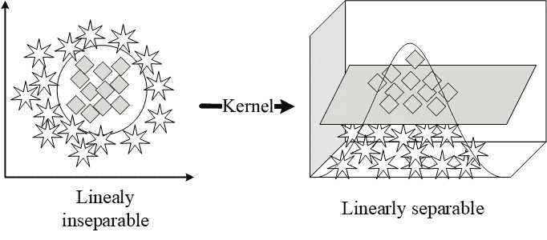
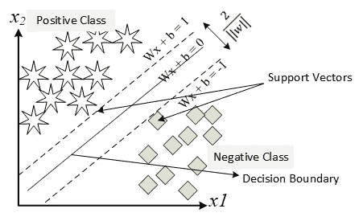
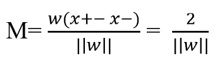
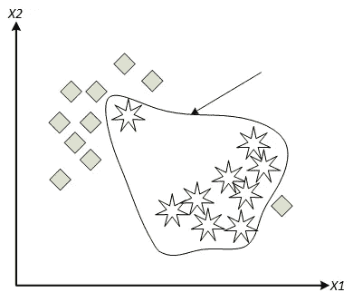
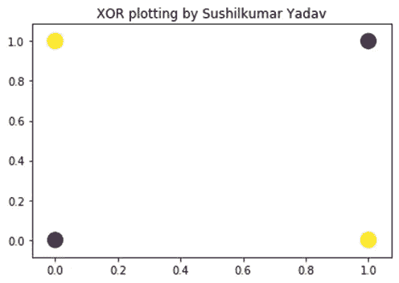
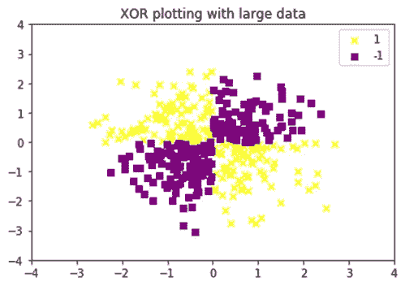
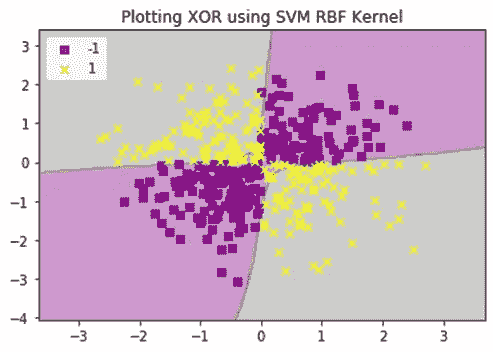

# 机器学习中基于核的方法

> 原文：<https://medium.com/analytics-vidhya/kernel-based-approaches-in-machine-learning-aaf174bdf49a?source=collection_archive---------5----------------------->

核是一种使用线性分类器来解决非线性问题的方法，这是通过将线性不可分的数据转换为线性可分的数据来完成的。

举个例子，我们要对以下几个类进行分类，这几个类是线性不可分的，所以要让这两个类都是线性可分的，就要用到核的技巧。我们将使用一些核心技巧将二维非线性观测映射到三维。

内核技巧

在机器学习中，有不同类型的基于核的方法，如正则化径向基函数(Reg RBFNN)，支持向量机(SVM)，核-费舍尔判别(KFD)分析，正则化 Adaboost (Reg AB)等。在所有这些算法中，广泛使用的方法是 SVM。

让我们详细讨论 SVM，并尝试使用感知器方法对不能线性分离的异或逻辑进行分类。

基本上，支持向量机是用于使用具有一些优雅特性的二进制学习机的二进制分类。

这个想法可以总结为

*给定一个训练样本，主要目标是构建一个超平面作为决策边界，使得决策边界和支持向量之间的距离最大化，即正负样本之间的分离裕度最大化*

线性 SVM

有两种类型的 SVM

1.线性 SVM

2.非线性 SVM

**线性 SVM 处理二元分类，考虑监督学习，用训练样本(*、【易】)*其中*、*是输入模式，*易*是目标输出。假设有 2 个类； *yi* = +1 和 *yi* = -1，它们是线性可分的，那么分离这两个类的判定边界的方程变成**

***(Wx+)* + b =1 — — — —为正类**

***(Wx-)* + b =-1 — — — —为否定类**

**w 是重量，b 是偏差**

**从 1 中减去等式 2，我们得到，**

***W(x+-x-)*= 2 = M———>M =两个等级之间的最佳间隔值，因此等式变为**

****

***上述等式表明，二元类之间的分离裕度相当于最小化权重向量 W 的欧几里德范数| | W | | ***

****使用**直线 SVM** 时需要检查两个条件****

***1。**+b = 1 表示正类，w *Wx* + b = -1 表示负类***

****2。* || *W* ||(欧几里德范数)应该是最小值***

***有一种方法叫做**拉格朗日方法(L)** ，可以总结为***

***对于支持向量，L 必须通过改变拉格朗日乘数(αi)来最大化***

***远离边界的图案。对他们来说，αi 太小了***

***接近判定边界的模式，对它们来说αi 将太大***

******这种技术也被称为最大边距分隔符或硬边距分隔符******

******

***过度拟合***

***当出现过拟合情况时，我们不能使用硬边距分隔符，为此，我们必须使用软边距分隔符***

*****软边距分隔符**在不同标签的数据混淆时使用，然后使用软边距分隔符，我们必须考虑边距板内的样本来绘制最佳分隔线***

***如果数据点(*yi)*违反以下条件，则类之间的分离界限被称为软的，***

****di(Wx+* + b) > = +1***

***对于不可分离的数据点，我们使用一组非负标量变量，ξi 进入分离超平面(决策边界)的定义如图所示，***

****di(Wx+* + b) > = 1 — ξi***

***ξi 被称为**松弛变量**。它们测量数据点与模式可分性理想条件的偏差***

*****非线性支持向量机**是使用核技巧的地方，其中发生模式从较低维度到较高维度的映射，并且为了进行该映射，使用了核技巧。***

***核方法的基本思想是处理线性不可分的数据，并创建原始特征的非线性组合，以通过映射函数(ϕ()将它们投影到更高维的空间，在那里它变得线性可分。***

***用于 SVM 的最常用的核是 RBF 核或高斯核***

***在非线性 SVM 中，C(用户指定的正参数)，ξi 需要变化。ξi 值越大，适合的噪波越多。***

***让我们使用 SVM 核技巧对异或逻辑进行线性分类，使用感知器方法无法对其进行线性分离。***

******

***异或问题——不能线性分离***

***现在让我们取 400 个样本，其中 200 个属于第 1 类，200 个属于第 1 类，查看代码和输出***

******

***大数据的异或绘图***

***使用 SVM 径向基函数核，我们得到了下面的结果，它能够画出一个分离数据的非线性决策边界，***

******

***为了比较不同类型的基于核的方法，我们研究了一篇名为“**基于核的高光谱图像分类方法**的研究论文，以下是我们注意到的要点***

***SVM-保利和 SVM-RBF 给出了最好的整体表现。***

***当附加噪声(高斯、均匀和脉冲)被添加到测试集时，信噪比在 16 和 40 dB 之间变化，获得的结果如下，当引入中等噪声(SNR >25dB)时，SVM-RBF 显示出比 KFD 更高的总体精度，然而在复杂情况下，(SNR < 25db)模拟，KFD 显示出比 SVM-RBF 更好的精度，但不如 SVM-Poly。***

***比较不同组训练数据集的结果，结果记录如下:***

***分析五种不同的情况，原始训练样本的 0.25%、5%、10%、25%和 100%，并从训练集中随机选择，以训练模型并评估它们在总测试集上的准确性。这些情况对应于分别由 12，229，459，1147，4588 个样本组成的训练集。当考虑 12 个样本作为训练集时，SVM(两个内核)显示出比其他模型更好的性能，尽管总体精度非常低(50%)，随着训练样本比率的增加，SVMs 和 Reg-AB 相对于 KFD 和 Reg-RBFNN 总是具有 3%到 8%的更高精度。然而，KFD 在大多数情况下表现不佳，并且随着样本的增加需要昂贵的计算成本。***

***当考虑高光谱数据的特定特征时，稀疏解决方案主要是首选的，因为在训练过程中，算法选择最相关的样本进行分类，并在解决方案中为它们分配权重。SVM 给出的解决方案本质上是稀疏的，但是为了从 SVM 获得更好的结果，至少需要 40%的训练样本(支持向量)。在 Reg- RBFNN 和 Reg-AB 的情况下，稀疏性是通过选择分别由隐藏神经元和假设的数量给出的最合适的权重数量来施加的。SVM 和 Reg-AB 在高维特征空间中工作，并且都导致不同空间中的稀疏解。KFD 考虑了所有的训练样本。***

***从本文中可以得出以下结论:***

***支持向量机(两种内核)在计算成本方面产生了极好的结果。准确性，对普通噪声水平的鲁棒性，并确保稀疏性。SVM 的缺点是不容易产生概率输出。***

***Reg-AB 生成了与 SVMs 相当的结果，提高了 Reg-RBFNN 的鲁棒性，并有效地处理了少量的标记样本。***

***仅当考虑正常条件时，KFD 给出了良好的精度。还应注意，这种方法计算效率低。***

***Reg-RBFNN 在精度和计算成本之间提供了一个特殊的折衷，但是在所有测试中的精度都低于其他非线性模型提供的精度。***

***从结果中，我们可以得出结论，与所有其他核方法相比，支持向量机更好，因为它具有较高的整体精度，以低得多的计算成本确保了稀疏性。***

***参考资料:***

***[1] scikit 机器学习支持向量机(SVM)[https://www . bogotobogo . com/python/sci kit-learn/sci kit _ machine _ learning _ Support _ Vector _ Machines _ SVM _ 2 . PHP](https://www.bogotobogo.com/python/scikit-learn/scikit_machine_learning_Support_Vector_Machines_SVM_2.php)***

***[2]基于核的高光谱图像分类方法[https://ieeexplore.ieee.org/document/1433032](https://ieeexplore.ieee.org/document/1433032)***

***要了解更多关于机器学习算法的信息，请阅读我之前的文章***

*** [## 机器学习算法综述

### 机器学习是让计算机在没有程序员明确编程的情况下行动的科学。它…

媒介](/analytics-vidhya/an-overview-of-machine-learning-algorithms-4a9a881a1a4b)***