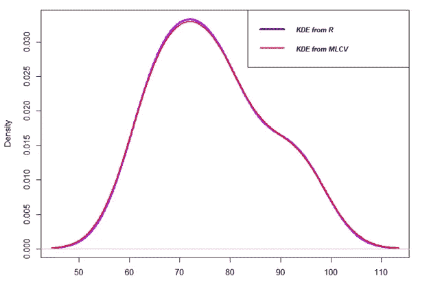

# 核密度估计

> 原文：<https://medium.com/analytics-vidhya/kernel-density-estimation-kernel-construction-and-bandwidth-optimization-using-maximum-b1dfce127073?source=collection_archive---------2----------------------->


[王子阿比德](https://unsplash.com/@princeabid708?utm_source=unsplash&utm_medium=referral&utm_content=creditCopyText)在 [Unsplash](https://unsplash.com/s/photos/baby-chicken?utm_source=unsplash&utm_medium=referral&utm_content=creditCopyText) 上的照片

## 使用最大似然交叉验证的核构造和带宽优化

本文通过一个例子详细介绍了核函数的基本原理及其在核密度估计中的应用。高斯核用于密度估计和带宽优化。最大似然交叉验证方法是一步一步解释带宽优化。所有的计算都是用 R 从头开始编写的，代码在文章的最后一节提供。

# **什么是内核？**

内核只是一个满足下面提到的三个特性的函数。核函数用于估计随机变量的密度，在非参数回归中用作权函数。该函数也在机器学习中用作执行分类和聚类的核心方法。

1.  核函数的第一个性质是**它必须是对称的**。这意味着+u 和–u 的核函数值是相同的，如下图所示。这在数学上可以表示为 K (-u) = K (+u)。核函数的对称性质使得函数的最大值( *max(K(u)* )位于曲线的中间。


2.函数曲线下的**面积必须等于一个**。从数学上来说，这种属性表示为


高斯密度函数被用作核函数，因为高斯密度曲线下的面积是 1，并且它也是对称的。

3.核函数值，也就是密度，**不能为负**，K(u) ≥ 0 为 all∞<u<∞。

# 构造内核

在这篇笔记中，我将使用高斯核函数来估计核密度，并使用示例数据集来优化带宽。高斯核的等式是:


其中 ***xi*** 为观察数据点。 ***x*** 是计算核函数的值， ***h*** 称为带宽。

## 例子

比方说，我们有六个学生在某一科目上取得的分数。我将使用高斯核函数在每个数据点构建核。

***xi*** = {65，75，67，79，81，91}

***x1*** = 65，***x2***= 75…****X6***= 91。*

*需要三个输入来形成围绕数据点的核心曲线。它们是:*

*一、观察数据点是哪个***【Xi】****

*二。**的值*h****

*三。一系列线性间隔的数据点，包含估计了 *K* 值的观察数据点。 ***Xj*** = {50，51，52 …99}*

*计算出 ***K*** 值为所有 ***Xj*** 值为给定值**h 如下表所示；其中 ***xi*** = 65 而****h***= 5.5。****

****

*****Xj*** 和 ***K*** 绘制如下，以形象化内核。**

****

**类似地，在所有六个观察到的数据点，内核值被估计为如表中所示并绘制在下面。**

****

**从表中可以看出，对于***【Xj】***与***【Xi】***相差甚远的值，核函数值接近 0。例如，当*= 65 时，***【Xj】****= 99 处的内核密度值为零。****

******

## *****核密度估计(KDE)*****

***到目前为止，我们讨论了计算数据点上的单个内核。现在，计算整个数据集的复合密度值。简单的把所有 ***Xj*** 的核值( *K* )相加就可以估算出来。参照上表，将所有行值相加得到整个数据集的 *KDE* 。然后，通过除以数据点的数量(在本例中为 6)对总和进行归一化。归一化是为了使 KDE 曲线下的面积为 1。因此，计算 *KDE* 的方程式对于每一个***Xj*** 表示为:***

****

**其中 ***n*** 是数据点的个数。添加所有六个归一化核后的 ***KDE*** 如下图所示。**

****

# ****带宽优化****

**内核函数的带宽( ***h*** )对于恰当地拟合数据起着重要的作用。带宽的低值估计了具有大量方差的密度，而 ***h*** 的高值产生大偏差。因此，对最佳值 ***h*** 的估计对于构建最有意义和最准确的密度非常重要。如下图所示，三个不同的带宽值会产生三条不同的曲线。黑色的给出了很多密度值的变化，看起来不真实，而紫色的没有通过隐藏信息来解释实际的密度。**

**研究人员提出了几种方法来优化核密度估计中的带宽值。其中之一是**最大似然交叉验证**方法。在这篇文章中，更多关于这种方法的解释是清楚的，并应用于一个示例数据集。**

****

## ****最大似然交叉验证(MLCV)****

**这种方法是由霍贝马、赫尔曼斯和范·登布鲁克(1971 年)和杜恩(1976 年)提出的。在该方法中，基于**留一交叉验证方法**，在 ***Xj*** 的子集上估计核函数。最大化 MLCV 的目标函数表示为:**

****

**这个等式看起来很复杂，但通过举例详细解释每个术语，它就变得很简单了。**

****期限 1:****

****

**计算前面部分中讨论的核函数值。这里在 ***x1*** *，* ***K*** 值是在*范围内对某个 ***h*** 计算的，其中不包括****Xj***。将 **K** 的值相加，最后计算和的对数。****

## **例子**

**考虑***h***= 3(***h***得优化。我取了 ***h*** = 3 只是为了解释优化函数是如何计算的)。**

*****xi*** = {65，75，67，79，75，63，71，83，91，95}**

****

*****Xj***=***Xi***的值 ***K*** 被设置为零，以确保它们在求和时被排除在外。**

****期限二:****

****

**在这个例子中， ***n*** = 10 而 ***h*** = 3。我们可以很容易地将该项估计为:**

****

**目标函数(MLCV)的最终值通过从项 1 中减去项 2 所获得的差值的平均值来计算，如下表所示。**

****

**对于带宽，目标函数值即 MLCV 为-2.3438539， ***h*** = 3。通过选择不同的 ***h*** 的值重复相同的过程，使得 MLCV 值接近有限的最大值来优化 ***h*** 。黄金分割搜索优化算法中的*优化 R 中的*函数用于最大化 MLCV 函数。**

**本例中 ***h*** 的优化值为 **6.16** ，目标函数值为 ***-2.295783*** 。**

**使用优化带宽(= 6.16)估计并绘制 KDE，并与使用 R 中的*密度*函数获得的 KDE 进行比较。如下图所示，使用优化的*h 的 KDE 非常接近使用 R *密度*函数绘制的 KDE。***

****

# **r 代码**

***KDE***

```
**#KDE
data <- c(65, 75, 67, 79, 81, 91)
plot(NA,NA,xlim = c(50,120),ylim = c(0,0.04),xlab = 'X',ylab = 'K (= density)')h = 5.5
kernelpoints <- seq(50,150,1)
kde <- NULLfor(i in 1:length(data)){
  z <- (kernelpoints-data[i])/h
  multi <- 1/(sqrt(2*pi))
  kerneld <- ((multi)*exp(-0.5 * z^2))/(length(data)*h)
  lines(kernelpoints,kerneld, lwd = 3)
  kde <- cbind(kde,kerneld)
}
kde_sum<- rowSums(kde)
lines(kernelpoints,kde_sum, lwd = 3, col = 'red')
grid(20,20)**
```

**MLCV —带宽优化**

```
**#MLCV
x <-  c(65, 75, 67, 79, 75, 63, 71, 83, 91, 95)
y <- seq(50,100,1)x <- sort(x)
n <- length(x)
u = outer(y,x,"-")fmlcv <- function(h) {
  D <- (1/sqrt(2*pi))*exp(-0.5 *(u/h)^2)
  colnames(D) <- x
  rownames(D) <- y
for(i in 1:n){
    kk <- which(rownames(D)==colnames(D)[i])
    D[kk,i] <- 0 }
  D1 <- log(colSums(D))
  D2 <- log((n-1)*h)
  Fx <- D1-D2
  mean(Fx)}lower = 1
upper = 10
tol = 0.01#Using optimize function in R
obj <- optimize(fmlcv ,c(lower,upper),tol=tol,maximum = TRUE)
print(obj)
plot(density(x), lwd = 4, col = 'purple') #From R library
lines(density(x, bw = obj$maximum), lwd = 2, col = 'red', lty = 1)
legend("topright",legend=c("KDE from R", "KDE from MLCV"),
       col=c("blue","red"),lty=1, cex=0.8, lwd = c(4,2),text.font=4)
print(obj$maximum)**
```

# **参考**

**密度及其导数的核估计量和带宽选择**

**密度估计:日元-陈驰的直方图和核密度估计器(2018 年)**