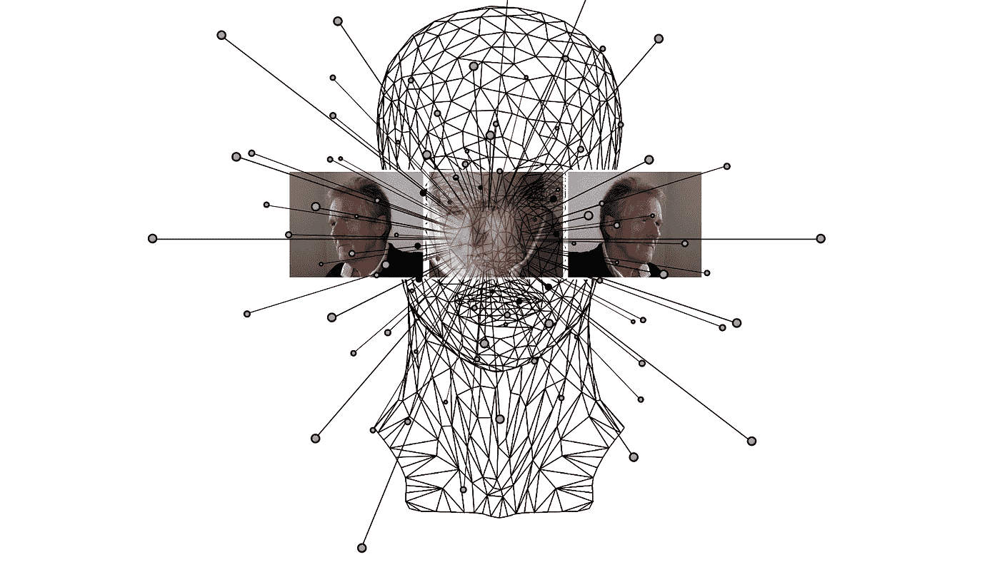
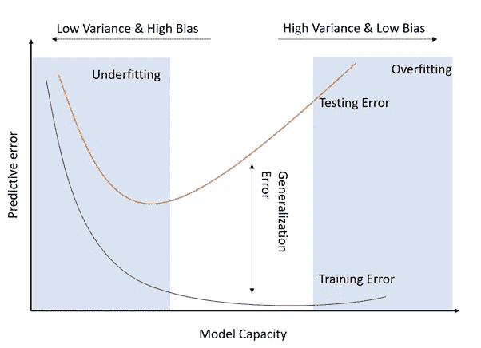
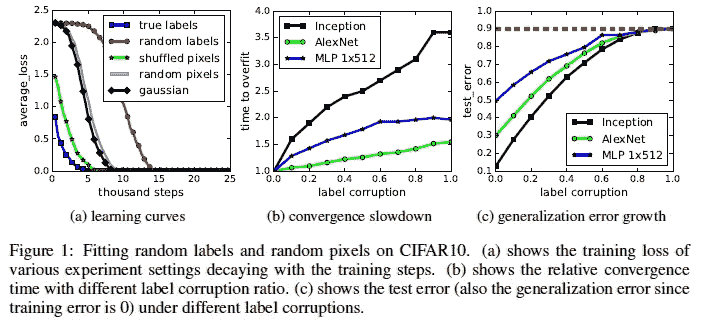
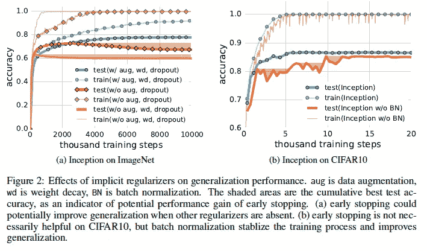

# 来自 2017 年最佳论文的关键学习和见解—“理解深度学习需要重新思考一般化”张等人(2017)

> 原文：<https://medium.com/analytics-vidhya/key-learning-insights-from-iclrs-best-paper-2017-understanding-deep-learning-requires-2dba67cdf4d1?source=collection_archive---------30----------------------->

这项工作的研究主要集中在一个问题上，

> "那么，是什么将泛化能力强的神经网络和泛化能力差的神经网络区分开来呢？"。

泛化，模型容量和正则化是一些重要的技术用于这项研究工作。泛化误差被定义为训练误差和测试误差之差。随着模型在越来越多的数据集上得到训练，训练误差和测试误差之间的差异不断增加。这就导致了过度拟合的问题。

作者还谈到了模型容量，这意味着网络的灵活性&它可以容纳所有类型的输入。这一点的重要出发点是通用逼近定理，该定理指出，

> 具有包含有限数目神经元的单一隐藏层的前馈网络，可以逼近欧几里得空间的紧致子集上的任何连续函数。

名为[乔治·西本科](https://www.dartmouth.edu/~gvc/)的科学家为 sigmoid 激活函数证明了这个定理。但唯一的问题是，这个定理没有给出任何关于这些参数的算法可学性的信息。这意味着我们可以用单层近似任何可能的连续函数，但我们可能无法非常有效地学习该层的权重。Vapnik-Chervonenkis 理论(VC 维度)是另一个重要的理论，它指出

> 具有某个参数向量θ的分类模型 f 据说粉碎了一组数据点(x1，x2，…)。xN)如果，对于这些点的所有标签分配，存在θ，使得模型 f 在评估该组数据点时不产生误差”。

模型 f 的 VC 维是可以排列的数据点的最大数量，以便 f 粉碎它们。因此，模型 f 可以标记的最大数据点数，将是我们模型的 VC 维，这就是它与模型容量的关系。VC 维可以帮助计算测试误差的概率上限。这有助于减少泛化错误的问题。有一个数学公式可以更好地解释这一点。只有当参数的数量远小于样本的数量时，这种关系才成立。但当涉及到神经网络时，我们的参数远远高于样本数量。因此，这种关系不具备任何强有力的有效性。本文还讨论了正则化及其各种技术，如显式(权重衰减、丢失、数据增加)和隐式正则化(早期停止)。在 L2(权重衰减)正则化中，我们将在标准权重更新公式中添加另一个参数，称为权重衰减参数。这导致标准权重更新过程的额外减法，从而降低权重。因此，它被称为权重衰减，因为层权重变小。退出正则化是另一种重要的技术，其中某些神经元被随机地从网络的层中退出。这消除了对单个神经元的依赖，使计算速度更快。这也有助于模型学习冗余，并使它们更少地依赖每一个单独的神经元。

另一种类型的正则化是数据扩充，它是对输入数据的域特定变换。例如，如果模型是在一组具有完全相同条件的人脸原始图像上训练的，那么如果输入图像被高度放大、翻转或旋转，它将无法在测试阶段给出准确的结果。为了解决这个问题，应该在各种输入上训练模型。这可以减少误差并提高准确性。

在实验发现中，当我们进行随机化测试时，有各种方法来分类标签，如真实标签、部分损坏的标签、随机标签、混洗像素、随机像素和高斯技术，其中我们可以评估训练的模型。这些测试的结果表明，只对真正标记的数据集保持了准确性，并且当我们尝试标记被破坏、打乱或随机分配的其他技术时，准确性开始逐渐下降。在高斯技术中，研究人员从图像的高斯分布中提取随机噪声，并绘制显示相似噪声分布的输出。

图像来源:原始论文

这个实验的结果分为三个部分，

1.学习曲线(average_loss v/s 千步),其中真实标签易于拟合，并在几步后显示可忽略的损失，然后对于混洗、随机和高斯，结果几乎相似，因为这三者遵循相似的趋势。令人惊讶的事实是，经过几千步后，模型甚至有可能符合随机标签，这需要更长时间，但这是可能的。

2.收敛速度减慢(溢出 v/s 标签损坏的时间)，在这个标签损坏中，我们在右侧有完全随机的标签，在左侧有完全完美的标签。《盗梦空间》选择的神经网络，AlexNet & MLP 1x512。据观察，即使标签是随机的，研究人员也能够在更短的时间内以零训练误差拟合图像来校正标签，并且所有参数都以某个常数因子变化。

3.泛化错误增长(test_error v/s 标签损坏)。在这种情况下，y 轴精确地代表了泛化误差。对于这个地块，研究人员采用了相同的参数。这有助于他们理解网络的选择在影响泛化误差结论方面起着巨大的作用&来自该实验的暗示表明深度神经网络可以容易地拟合随机标签。

神经网络的有效容量足以记忆整个数据集。甚至观察到随机标签的优化很容易，这意味着学习新的输入和记忆这些输入花费相同的时间。

图像来源:原始论文

在显式正则化测试中，测试有两个部分，一个是 ImageNet 上的 Inception，另一个是 CIFAR10 上的 Inception。使用正则化和完全不使用正则化之间的泛化应该差别较小。正规化当然有所帮助，但没有他们想象的那么大。他们注意到的另一件事是，使用或不使用批量标准化对泛化的影响很小。唯一的问题是，没有批量标准化的训练会更吵。这帮助他们认识到增加数据比重量衰减更有效，他们注意到通过改变模型结构可以获得更大的收益。这意味着显式正则化可能会提高泛化能力，但它既不必要也不充分。隐式正则化发现表明，早期停止可能会提高泛化能力，这意味着在运行迭代时保持耐心有助于获得更好的结果。另一个观察结果是，尽管批处理规范化的主要功能并不是作为一种正则化技术来设计的，但是它提高了泛化能力。作者的结论是，显式和隐式正则化都有助于提高泛化性能。然而，正则项不太可能是一般化的根本原因。本文证明了即使没有正则化子，该模型也能给出良好的性能。

作者还谈到了两个旁注，一个是神经网络的有限样本表达能力，它谈到了在有限数量的数据上提供更好的性能，而以前的文献更多地谈到了群体水平，其中深度 K 网络通常比深度 K-1 网络更强大。因此，给定一个有限的样本大小 n，一旦参数 p 的数量超过输入样本 n，即使一个两层神经网络也可以表示任何函数。作者还讨论了一个定理，该定理陈述:存在一个具有 ReLU 激活和 2n+d 权重的两层神经网络，它可以在 d 维中表示大小为 n 的样本上的任何函数。这个定理是通用逼近定理的推广。另一个旁注是关于线性模型的讨论，因为它们易于映射和理解，这在为其他模型设计架构时很有帮助。假设有 n 个数据点(x，y ),其中 x 是 d 维特征向量，y 是标签，因此在这种情况下，我们将权重矩阵与输入 x 和 y 相乘。这有助于最小化和计算乘法和标签之间的损失。SGD 有助于求解上述方程，为此，权重矩阵必须位于数据点的跨度内。SGD 为我们找到全局最小值提供了一个独特的解决方案。在该推导中，作者进一步讨论了核矩阵，该核矩阵实际上恰好是 Xw=y 的最小 l2 范数解。因此，SGD 收敛于具有最小范数的解，但是唯一的问题是最小范数不能预测泛化性能。

本文的最终结论是，它使我们对神经网络的有效容量有了更深刻的理解。神经网络的代表能力强到足以成功地粉碎训练数据，即使没有正确的或没有标签。即使泛化能力很差，优化仍然很容易。作者还讨论了 SGD 如何通过收敛到具有最小 l2 范数的解来使用隐式正则化。最后一点是，模型复杂性的传统衡量标准难以解释大型神经网络的泛化

谢谢大家！

原作者信息:

[张](http://www.pluskid.org/) *，[萨米本吉奥](http://bengio.abracadoudou.com/)，[莫里茨哈特](https://www.mrtz.org/)，[本杰明雷希特](https://people.eecs.berkeley.edu/~brecht/)，[奥里奥尔维亚尔斯](https://research.google/people/OriolVinyals/)

[链接到原论文](https://arxiv.org/abs/1611.03530)