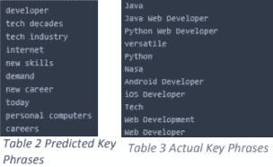

# 媒体文章的关键词抽取和掌声预测

> 原文：<https://medium.com/analytics-vidhya/key-phrase-extraction-applause-prediction-7b397c7ad76d?source=collection_archive---------14----------------------->

*自动 ML 工具，用于对媒体在线文章的原始数据文件执行 ML 技术

> *机器学习最佳项目奖获得者*@ IIITD 2019–2020

> ***摘要****——随着互联网上内容可用性的增加，很难引起注意。对于博客作者来说，获得一些关于他们作品的反馈以确信他们文章的影响力已经成为最重要的事情。我们正在训练一个机器学习模型来学习流行的文章风格，以使用各种单词嵌入的向量空间表示的形式，以及它们基于点击和标签的流行度。*

1.  **动机**

当今世界充满了在线内容，每天都有更多的内容产生。媒体是传播几乎所有社会领域的信息和知识的顶级平台之一。它被大量用于发布计算机科学领域的内容和文章，如 ML、AI、数据工程等。在互联网上越来越受欢迎。

**2。简介**

一篇文章的写作和获得人气是一项艰巨的任务。对于不太知道如何获得人气的新作者来说，问题来了。我们把直觉发展成了做一篇有趣的、有意思的媒介文章。我们不是纯粹依赖猜测理论，而是希望使用数据科学和机器学习来测试我们的理论。作为一名数据科学家，我们一直对创造力和自动化充满好奇。此外，我们相信我们的文章和在这个模型上的努力结合了科学的两个方面来预测最佳媒体文章。我们介绍我们的工作，像 Medium 这样的工作平台有自己的指标来评估内容，让读者鼓掌以示赞赏。此外，这些平台提供了添加一些最能提供内容主题的关键词的功能。

现在，它成为一个必要的作家获得一些援助的最佳可能的关键短语，使文章排名上升，并初步流行的新文章。我们在这个项目中的目标是在媒体上训练一个模型。

**3。文献调查**

关键短语提取是一个很大的领域，已经有很多人致力于此。我们有许多预先训练好的模型，如 Bert 和 pke rake 等。这有助于提取关键短语。尽管我们在文本分类方面有了很多的进步，但是只有一小部分研究人员探索了整个文章性能问题。pke 是一个基于 python 的开源关键短语提取工具包。它提供了一个端到端的关键短语提取管道，其中的每个组件都可以很容易地修改或扩展，以开发新的模型。pke 还允许对最先进的关键短语提取模型进行简单的基准测试，并附带在 SemEval-2010 数据集上训练的监督模型。[1], [2].Sahrawat 等人[8]使用伯特和 bi-lstm 等神经网络模型从学术文章中提取关键短语，作为使用 BiLSTM-CRF 解决的序列标注任务，其中输入文本中的单词使用深度上下文化嵌入来表示。

**4。使用的数据集**

我们用于这个项目的数据集正在被废弃，使用的是官方 Medium 网站上 JSON 字符串形式的硒。到目前为止，我们有超过 2574 篇不同受欢迎程度的文章。我们正在收集更多的数据，但是因为注释验证需要时间，所以我们将在最后的演示中总结这一点。为了进行预处理，我们删除了所有非 ASCII 字符和空格或特殊字符。然后我们把数字转换成它们的英语等价物。随后是拼写纠正和引理。

我们的数据有很多新的文章没有掌声，所以我们删除这些，以避免误导。最后进行 doc2vec 嵌入，得到一个数字文档向量。

**5 .数据刮取**

网络抓取也称为“爬行”或“蜘蛛爬行”，是一种从在线来源(通常是网站)自动收集数据的技术。虽然网络抓取是一种在相对短的时间内获取大量数据的简单方法，但它会给源所在的服务器增加压力。我们废弃了使用硒的培养基的数据。数据挖掘或收集数据是数据科学生命周期中非常原始的一步。根据业务需求，可能需要从 SAP 服务器、日志、数据库、API、在线存储库或 web 等来源收集数据。像 Selenium 这样的网页抓取工具可以在相对较短的时间内抓取大量数据，如文本和图像。

Selenium 是一个开源的基于网络的自动化工具。硒主要用于工业测试，但也可用于刮网。我们会使用 Chrome 浏览器，但是你可以在任何浏览器上尝试，几乎是一样的。[5]我们通过以下步骤报废了:

*   搜索带有给定标签集的文章的 URL，只捕获与领域相关的文章。
*   从每个网页中删除有用的数据。
*   将抓取的文章数据保存在 json 对象中。

**6 .预处理**

自然语言预处理的步骤是将每个句子转换成等价的处理过的单词表示[1]、[2]、[7]、[8]。

用于处理每个单词的技术有:

1.  标点去除:*'。",?~!< @#$% & *)*
2.  空格删除: *\n \t \a*
3.  非 Ascii 字符:*非键盘，表情符号*
4.  标记化:*'你好'，'世界'*
5.  数字转换: *1* 到*‘一’*
6.  停用词移除:*是，是，是*
7.  拼写更正: *thro，teling，forgt*
8.  分词: *haveto，whynot*
9.  词汇化:*老鼠*到*老鼠*
10.  扩展缩写:*我已经，不会*
11.  缩放:*【1，90，99】*到*【0.1，0.9，0.99】*

文本数据不适合输入到 ML 模型中，所以我们使用 Glove 和 doc2vec，结合通过 text_to_sequence 方法从*Keras*tokenizer 获得的序列。

**8。特征提取**

概括了问题的长度后，我们剩下的是包含大量相关信息(或多或少)的长向量。由于长度与 vocab 的大小成正比，正如 *Zip 定律*【10】，【11】中提到的，所以只提取感兴趣的特征是至关重要的。我们尝试了 PCA 和 LDA 特征提取[12]。单词嵌入也有帮助，最终得到 23 个顶级特征应用 ML 算法。多于或少于 23 个特征会导致我们模型的性能降低。这就是为什么我们只捕捉与这组功能最相关的信息。降维还有助于可视化顶层数据组件，以便更好地理解，如图 3 所示。为了从博客文章的文本数据中提取特征，我们使用了 doc2vec，它能够为相应的文档(一篇完整的文章)生成一个向量。我们使用 RFE 和 chi2，最终根据特性的重要性对其进行排序。

**9。推荐型号**

我们尝试了几种方法和组合来得出最终的结论。但是，所有的预处理步骤都是相同的。对于回归任务和关键字预测任务，预处理是不同的。

**9.1 掌声预测**

我们已经使用线性回归对数据进行了回归，我们还建议使用 KNN 在向量空间中找到与我们的测试文档最接近的相似数据点。回归给出了 MSE，即我们计算了预测结果与实际地面真实结果的偏差。这是为了得到每个文档的鼓掌系数。我们得到的初始 MSE 大约是 13000，这在使用 Doc2vec 作为特性时是很大的。使用 KNN 回归，我们将能够将 MSE 进一步降低到大约 4000，精确度为 37%。为此，我们有大约 2345 篇中型文章。

我们稍微修改了我们的任务，从对掌声的回归到流行度分数预测，因为我们无法进一步降低 mse。

我们试图删除更多的数据。因此，最终的数据集大小现在是 7421 篇文章。我们更新了 1-5 范围内的标签值，其中 1 表示最不受欢迎，5 表示最受欢迎。分数分配是在掌声计数的帮助下完成的。因此，这就变成了一个有五个类别的多标签分类任务，其中我们能够得到 48%的准确率。对于流行、不流行和流行的二元分类任务，其中我们为低于 50 的一些掌声分配了不流行的标签，否则我们能够获得 94%的准确度。

*   在使用线性回归和 knn 的掌声预测中，我们能够减少大约 4000 mse 的损失。
*   这仍然是巨大的！对吗？因此，我们稍微修改了任务，以获得给定文章的流行度分数预测。我们将掌声分为五个等级(1-5)。
*   然后，我们进一步尝试通过仅分配两个标签 0 和 1 来分别表示流行或不流行。

**9.2 关键短语提取**

生物标记方案

9.2.1 深度学习模型

深度学习已经被证明可以解决很多难题。我们已经计划使用像 RoBERTa 这样的深度学习模型来获得优化的结果，用于我们对文章受欢迎与否的模型最终预测。我们计划使用生物标签来表示每个文档，以便提取关键短语。这是一种常见的格式，类似的自然语言处理任务，如 NER。然后使用深度神经网络来预测作为标签的生物标签。

深度学习模型(最佳)

**10。性能提升**

*是什么提高了我们的绩效，为什么？*

1.  TfIdf:性能优于 doc2vec，因为它捕获了次线性关系。
2.  停用词:在我们的例子中，停用词毫无价值，因为它们在每个文档中都经常出现，只是误导了分类。
3.  降维是有效的:我们的向量表示有很多特征，将这些特征输入模型会增加时间并隐藏重要信息。
4.  添加特性:选中的单词嵌入为我们提供了 23 个足够的特性。添加或删除功能会降低性能，因为相关信息会受到损害。
5.  缩放特征有助于获得更好的准确性，尤其是在 svm 的情况下。
6.  Smote: Smote 有助于解决数据不平衡问题。这反过来有助于提高性能。
7.  转换任务:将掌声预测的任务转换为 1-5 的分数分类。因为分类模型能够获得比回归模型的最佳拟合线更好的决策边界。

模型架构和背景故事

*什么没有奏效，为什么？*

1.  拼写纠正:大多数问题没有任何拼写错误。假设用户知道该语言。
2.  缩放:问题的矢量表示已经被缩放。进一步扩展不再有帮助。
3.  所有嵌入:嵌入通常捕获大部分信息。组合 gensim 嵌入并不能解决问题。
4.  添加特性:选中的单词嵌入为我们提供了 23 个足够的特性。添加或删除功能会降低性能，因为相关信息会受到损害。
5.  减少向量大小:它改善了训练时间，但代价是降低了性能。
6.  增加时期:增加 doc2vec 训练的时期不能给出任何更好的特性。
7.  变化回归:将简单回归改为 lasso，ridge aur elastic 未能提供更好的性能。
8.  超参数调优:由于数据本身是有偏差的，所以超参数未能在很大程度上提高性能。

**11。结果**

对于回归任务，我们使用线性回归来绘制线性决策边界，并估计新文章的掌声。此外，我们建议在文档相似性方面使用 knn，以在多维向量空间中找到与新文档最近的 k 个文档，并取这些文档片段的平均值。优化超参数显示了很大的改进。我们正在为这两个任务规划特定于任务的微调。

**11.1 掌声预测**

这些结果是在模型经过严格的特定于任务的微调后获得的。内核、激活、深度、平滑参数、迭代次数、过拟合和欠拟合正则化子是几个例子。

掌声预测表演

*   在文章中加入作者、阅读时间、图片数量等特征后，我们能够减少 mse。
*   在多类任务中，我们将能够获得 0.48 的精度。
*   在流行度任务中，我们得到的最终最佳准确率是 0.94。
*   损失和准确性线性地依赖于数据量。
*   拥有多种方法使我们的应用能够接触到更广泛的受众，因为并不是每个人都希望获得更详细的结果。

**11.2 关键短语提取**

对于关键短语抽取任务，我们初始化了主题级关键短语抽取模型，并使用 spacy 进行预处理。关键短语候选选择作为名词和形容词的序列出现(即`(名词|形容词)* `)。然后使用随机游走算法进行候选加权。最后，提取 N 个最佳关键短语，即得分最高的候选短语作为(关键短语，得分)元组。

深度学习有它自己的好处。它有时可能过拟合，但严格的微调给了我们有希望的结果。对于关键短语提取，在 tfidf 嵌入上训练的双向 LSTM 产生了有希望的结果。这项任务非常不平衡，因此我们报告了基于 f1 分数的指标。

12。用户界面

我们制作了一个基于 HTML、python、flask 和 JQuery 的交互式 web 应用程序，使用 ajax API 调用从性能最佳的模型集合中检索 top k 文档。它有两种操作模式，即文本和音频(7)。

音频和文本输入/输出的用户界面

文本:从键盘输入

音频接口的代码片段

*   音频:通过默认麦克风和扬声器与 web 应用程序进行语音交互。用户可以在 web 应用程序屏幕中看到前 5 个结果，并允许应用程序将 k 个结果存储在“temp.txt”文件中以供以后参考。图 6 和图 7 分别显示了为查询“我们在板球中的表现”和“罗纳尔多”创建的 web 应用程序的用户界面。
*   TTS 是一个很好的工具来改善你的用户体验的影响，这可以通过以下步骤整合到你的界面中。

15。结论

我们的目标是为初露头角的研究人员提供端到端的解决方案，让他们写出成功的文章。该系统将接受文本形式的输入，并根据当前趋势给出作者是否达标。深度学习有它自己的好处。它有时可能过拟合，但严格的微调给了我们有希望的结果。对于关键短语提取，在 tfidf 嵌入上训练的双向 LSTM 产生了有希望的结果。这项任务非常不平衡，因此我们报告了基于 f1 分数的指标。

**14。未来工作**

这项任务的关键问题是数据不是线性可分的，它有很多重叠。因此，如果我们去寻找一般的文章，而不是特定领域的媒体博客，这将是更有益的。另一个问题是，数据集高度偏向于 claps 0，1，因为具有良好 claps 计数的文章非常少。我们最初建议用 KNN 来预测拍手的次数，但是在超参数调整和特征工程之后，我们仍然没有得到任何更好的 mse。在掌声回归中，我们计划加入其他具有更大权重的特征，如出版日期、作者姓名等。我们将考虑使用深度学习模型来捕捉嵌入的上下文的上下文化单词嵌入。

# **15。作者投稿**

克里希纳·亚达夫(MT19039) [ [LinkedIn](https://www.linkedin.com/in/krishna1432/)

1.  数据清理和预处理
2.  数据注释
3.  数据分析和可视化
4.  关键短语提取
5.  基线结果
6.  深度学习模型
7.  分析和结论

拉克希亚·乔杜里(MT19067) [ [LinkedIn](https://www.linkedin.com/in/lakshya-choudhary-7b160612a/) ]

1.  数据爬虫
2.  数据注释
3.  特征选择
4.  左后 KNN |参数调谐
5.  基线结果
6.  微调的 ML 模型
7.  分析和结论

# 参考

[1][https://github.com/boudinfl/pke.](https://github.com/boudinfl/pke.)

[2][https://arxiv.org/abs/1810.04805.](https://arxiv.org/abs/1810.04805.)

[3] Z. Liu，X. Lv，K. Liu，S. Shi，《与其他文本分类方法的比较研究》，*第二届教育技术与计算机科学国际研讨会，2010* ，2010 年，第 1 卷，第 219–222 页，doi: 10.1109/ETCS.2010.248

[4]https://monkeylearn.com/keyword-extraction/.

[5][https://www . analyticsvidhya . com/blog/2020/08/we B- scraping-selenium-with-python/。](https://www.analyticsvidhya.com/blog/2020/08/web-scraping-selenium-with-python/.)

[6] M. S. Phyu 和 K. T. Nwet，“缅甸文本分类的联合深度学习模型研究”，载于 *2020 年 IEEE 计算机应用会议，ICCA 2020* ，2020 年 2 月，doi:10.1109/icca 49400 . 2020 . 9022809

[7]毕，梁，唐，杨，“软件体系结构中文本分析技术的系统映射研究”，*。Softw。*，第 144 卷，8 月号，2018 年第 533–558 页，doi: 10.1016/j.jss.2018.07.055。

[8] Sahrawat D .等人(2020)使用语境化嵌入将关键短语提取作为序列标记。载于:Jose J .等人编的《信息检索进展》。ECIR 2020。计算机科学讲义，第 12036 卷。斯普林格，查姆。[https://doi.org/10.1007/978-3-030-45442-5_41.](https://doi.org/10.1007/978-3-030-45442-5_41.)

[9][https://towardsdatascience . com/extracting-key phrases-from-text-rake-and-gensim-in-python-eefd 0 fad 582 f。](https://towardsdatascience.com/extracting-keyphrases-from-text-rake-and-gensim-in-python-eefd0fad582f.)

[10] S. T. Piantadosi，《自然语言中的 Zipf 词频定律:评论与未来方向》， *Psychon。公牛。修订版*，第 21 卷，第 5 期，第 1112–1130 页，2014 年 10 月，doi:10.3758/s 13423–014–0585–6。

[11] L. Adamic，B. H.-声门计量法和 undefined 2002，“齐夫定律和互联网。”访问时间:2020 年 5 月 13 日。【在线】。可用:[http://www . ram-verlag . de .](http://www.ram-verlag.de.)

[12]闫，郭，兰，程，“短文本的双主题模式”，*中国英语学习网，2013 — Proc .22 日国际。糖膏剂环球网*，2013 年，第 1445–1455 页，doi:10.1145/24888851386

# ***鸣谢***

> 特别感谢教授和助教们
> 
> ***导师-*** *坦莫博士* [*网站*](https://www.iiitd.ac.in/tanmoy)*】*[*领英*](https://www.linkedin.com/in/tanmoy-chakraborty-89553324/)*】*[*脸书*](https://www.facebook.com/chak.tanmoy)*】*
> 
> ***导读*** - [普拉加·斯里瓦斯塔瓦(M.Tech，IIITD)](https://www.linkedin.com/in/pragya-srivastava-742896136/) [ [领英](https://www.linkedin.com/in/pragya-srivastava-742896136/) ]
> 
> 所有助教:查维·贾恩，尼兰·迪万，希夫·库马尔·盖洛特，康查·维韦克·雷迪，什卡·辛格。