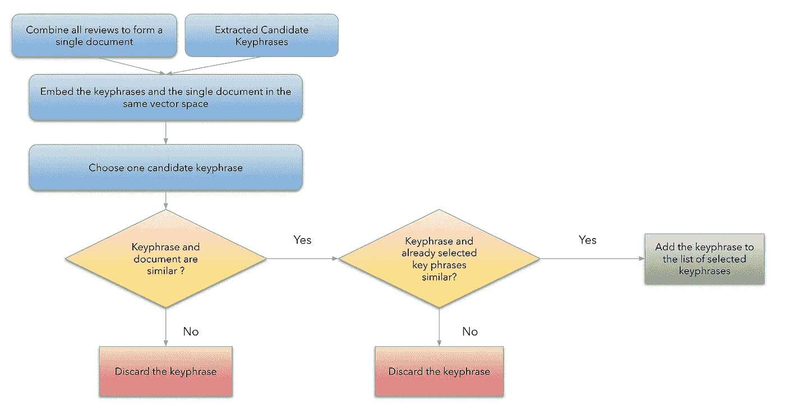
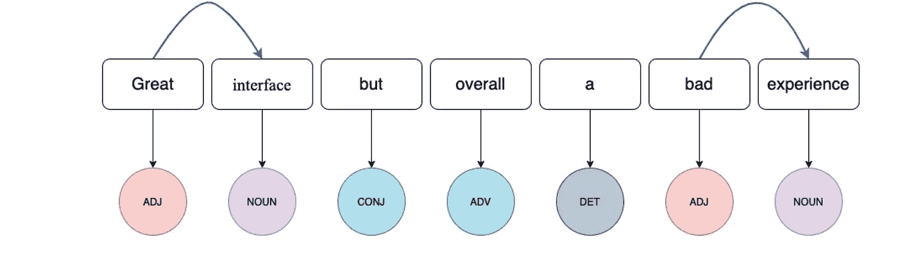
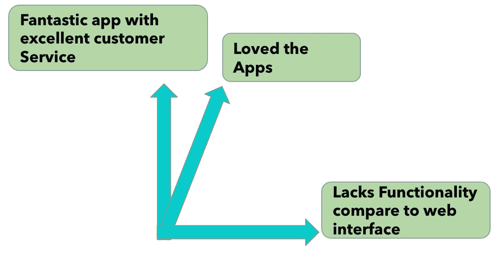
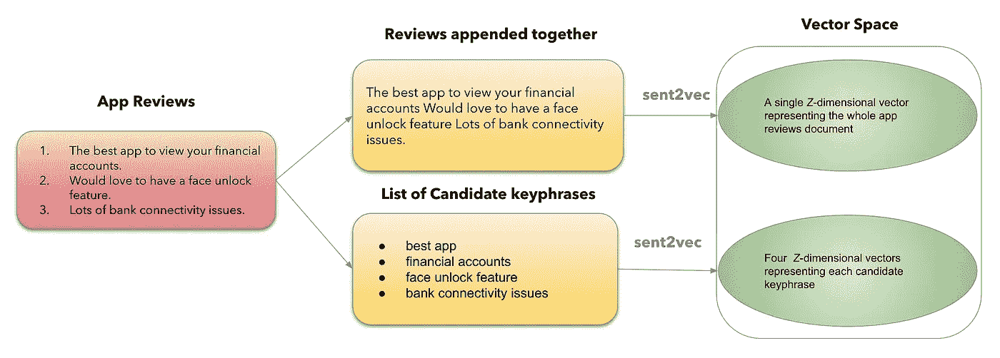
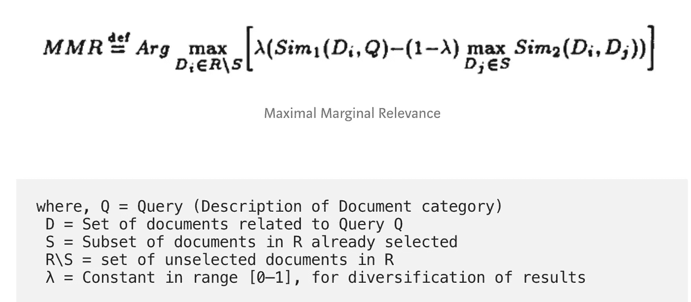
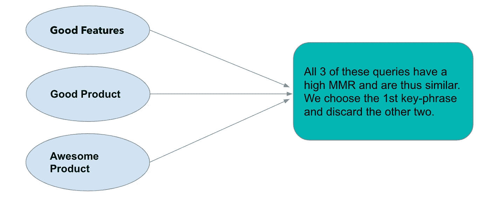
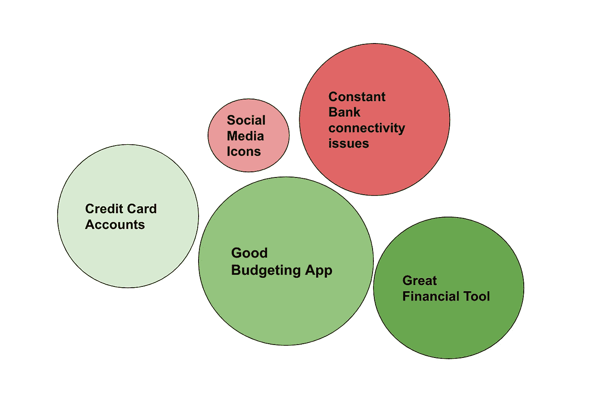

# 使用句子嵌入提取关键短语(无监督学习)

> 原文：<https://medium.com/analytics-vidhya/keyphrase-extraction-using-sentence-embeddings-unsupervised-learning-21cc5a296396?source=collection_archive---------10----------------------->

O **我们的用例:**是从评论中生成关键短语(二元或三元)，而不是生成一个单词的主题。1 单词主题并不能给出市场上正在谈论的产品的全貌，但是一个短语可以帮助我们更好地了解这些单词是被正面谈论还是被负面谈论。我从使用 n-grams 的主题建模开始，并尝试使用 tf-idf 和 Rake 生成高频词，但没有生成实际捕捉高频短语的短语。

因此，我决定从头开始构建，而不是像在这篇[论文](https://arxiv.org/pdf/1801.04470.pdf)中讨论的那样使用库和嵌入。

在这里，我已经详细讨论了我们的整个方法。希望对你有帮助。

**架构**

体系结构

**预处理**

我只做了有限的预处理

1.  删除所有标点和符号。
2.  将所有评论转换成小写字母。

**候选关键词**

然后，我使用简单的基于规则的匹配创建了所有候选关键短语的列表。我使用 spacy 的 *en_core_web_lg* 模型来获取每个单词的词性标签。我提取了由零个或多个形容词后跟一个或多个名词或专有名词组成的短语。

*示例*:

词性标注和选择 ADJ 名词短语

**句子嵌入**

现在我有了所有候选关键短语的列表，我需要选择那些表示经常使用的短语的评论。这里的主要困难是同义词。像“好的，坏的”这样的词表示相同的意思，但不会被选为相同的关键短语，从而为所选短语添加冗余。我通过计算向量空间中的余弦相似度和 MMR 来解决这个问题。我用 Sent2Vec 把句子转换成向量。Sent2Vec 是 Word2vec 的扩展，可以方便地将任意长度的英语句子表示为一个 *Z* 维向量。当在相应的向量上使用标准的相似性度量时，它反映了句子之间的语义相关性。

*例子*

句子间的语义相关度

我在结合了 **wiki 二元模型数据** (wiki_bigrams.bin)和来自我们的评论语料库的二元模型的基础上训练了 sent2vec 模型。这有助于模型不仅学习正式的维基百科语言风格，还学习写评论的非正式风格。所有的评论组合在一起形成一个文档，然后放入与 wiki 二元模型数据相同的向量空间中。

*示例*

例如，对于 Sent2Vec

然后，我逐一比较了每个候选关键短语与文档向量的余弦相似度。如果余弦相似度很高，我会检查它与已经选择的其他关键短语的余弦相似度。如果短语与文档向量的余弦相似度很高，并且它也不接近任何其他选择的短语，我就保留它。否则，如果它接近任何其他短语，我就放弃这个短语。这种技术被称为 MMR。

如果 2 个短语的 MMR 非常高，我只保留第一个短语，并丢弃所有与第一个短语相似的短语。

*例子*

现在，如果您想要将评论链接回关键短语，您可以遵循您之前所做的相同方法。把评论向量换成关键词向量就行了。

*   用**给出的关键词**替换 app 评论的单个文档
*   将候选关键词列表替换为**评论列表**
*   在没有 MMR 的情况下，应用与之前**相同的技术——因为我们确实需要冗余。**

关键短语的最终列表

**参考文献**

1.  [https://www.aclweb.org/anthology/K18-1022/](https://www.aclweb.org/anthology/K18-1022/)
2.  [https://spacy.io/usage/linguistic-features](https://spacy.io/usage/linguistic-features)