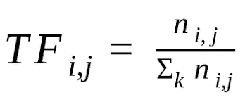
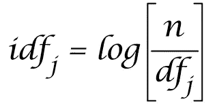
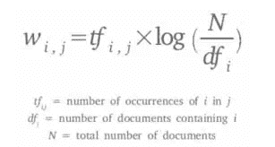
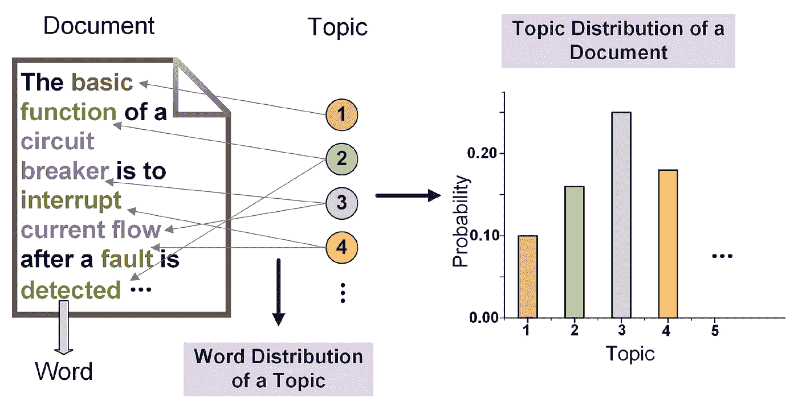
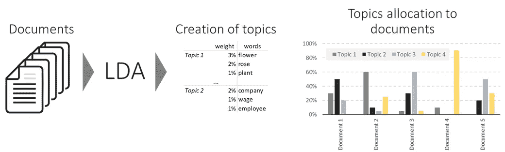
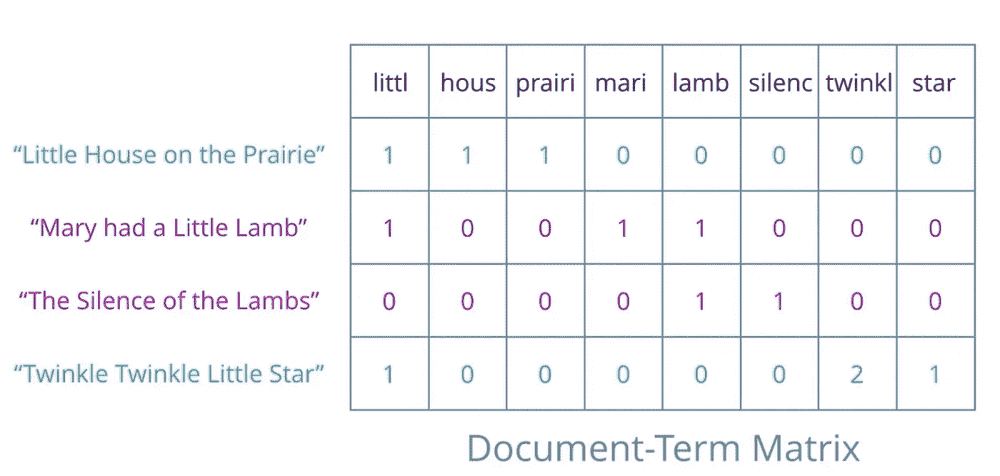

# 使用 Python 的关键词提取技术

> 原文：<https://medium.com/analytics-vidhya/keyword-extraction-techniques-using-python-edea5fc35678?source=collection_archive---------6----------------------->


罗曼·维涅斯在 [Unsplash](https://unsplash.com?utm_source=medium&utm_medium=referral) 上的照片

我们将深入讨论 TF-IDF 和 LDA。

K 关键词提取的任务是自动识别最能描述文档主题的术语。关键字是表示文档中包含的最相关信息的术语。
自动关键词提取的方法可以是监督式、半监督式或无监督式。在研究新闻文章时，关键字是一个重要的组成部分，因为它们提供了文章内容的简明表达。

写这篇文章的想法是打破常规，在现有信息的基础上分享一些额外的信息。文章以问答的形式撰写，涵盖了所有相关的话题以及关于这个话题的常见问题。

在本文中，我们将讨论一种监督方法:TF-IDF 和一种非监督方法:LDA。

**先决条件:**对 Sklearn 库的基本了解将是一个额外的好处。但是仍然给出了代码示例，以便更好地理解主题。

对于我们的监督学习方法，需要理解某些概念。已经用代码示例对它们进行了深入的解释。*现在，要从纯文本中提取关键字，我们需要* ***对每个单词进行标记，并对单词进行编码，以构建一个词汇表*** *，这样就可以开始提取了。因此解释了某些概念，以便您对主要方法有更好的了解。*

**词袋的概念** 根据 wiki 词袋是一种简化的表示，用于[自然语言处理](https://en.wikipedia.org/wiki/Natural_language_processing)和[信息检索](https://en.wikipedia.org/wiki/Information_retrieval) (IR)。在这个模型中，一个文本(比如一个句子或者一个文档)被表示为它的单词的[包(multiset)](https://en.wikipedia.org/wiki/Multiset) ，不考虑语法甚至词序，但是保持[多样性](https://en.wikipedia.org/wiki/Multiplicity_(mathematics))。示例:

“那是最糟糕的时代”= [1，1，1，0，1，1，0，0]
“那是智慧的时代”= [1，1，1，0，1，0，0，1，0]
“那是愚蠢的时代”= [1，1，1，0，0，0，1]

**计数矢量器的概念**
**计数矢量器**提供了一种简单的方法，既可以标记一组文本文档，构建已知单词的词汇表，还可以使用该词汇表对新文档进行编码。

```
text = [“The quick brown fox jumped over the lazy dog.”]
# create the transform
vectorizer = CountVectorizer()# tokenize and build vocab
vectorizer.fit(text)print("output = ",vectorizer.vocabulary_)
output = {‘dog’: 1, ‘fox’: 2, ‘over’: 5, ‘brown’: 0, ‘quick’: 6, ‘the’: 7, ‘lazy’: 4, ‘jumped’: 3}# encode document
vector = vectorizer.transform(text)print(vector.shape)
(1, 8)print('output = ',vector.toarray())
output = [[1 1 1 1 1 1 1 2]]
```

**问:为什么我们不能使用计数矢量器方法提取关键词？**“它”这个词与“平等”有同样的重要性。但是单词“它”并没有给出关于文档的任何额外信息。

# **1。TF-IDF**

TF-IDF 代表项频率和逆项频率。这种方法有助于理解文档中某个单词的重要性。
维基对 TF-IDF 的定义是，它是一个数字统计，旨在反映一个单词对集合中的[文档](https://en.wikipedia.org/wiki/Document)或[语料库](https://en.wikipedia.org/wiki/Text_corpus)的重要性。在信息检索的搜索、[文本挖掘](https://en.wikipedia.org/wiki/Text_mining)和[用户建模](https://en.wikipedia.org/wiki/User_modeling)中，它经常被用作[权重因子](https://en.wikipedia.org/wiki/Weighting_factor)。

现在让我们把它分解一下:

**1.1。** **词频(TF)
词频**是给定的**词**或查询在文档中出现的次数。其计算方法如下:



检索词频率

这里 n 代表该术语出现的次数，除以文档中的总术语数。

**1.2。逆文档频率(IDF)** 它被计算为语料库中**文档**的数量的对数除以特定术语出现的**文档**的数量。其计算方法如下:



综合资料的文件（intergrated Data File）

这里 n 是文档总数，除以包含该术语的文档数。

**1.3 .词频-逆文档频率(TF-IDF)** 就是上面给定的两个词的相乘。它的代表是:



TF-IDF

但是 TF-IDF 是如何帮助关键词提取的呢？为什么 TF 或 IDF 本身的效率不足以提取关键词？
答:通过一个例子可以更好地理解 TF-IDF 在关键词提取中的工作:
让我们假设有 10 个关于足球的文档。这里面会有很多常见的词，比如“a”、“the”等等，还会有“Pele”，可能会有一些不太常用的词，比如“supercalifragilisticecialidocious”，这是一个“神奇的或难以置信的”术语。

现在，如果我们通过关键词提取的术语频率，显然术语 a 的计数会高于 Pele 或稀有词。例如:

> 术语频率:
> a-100
> Pele-12
> supercalifilisticiexpalidocious-1
> **因此术语频率本身对提取关键字没有帮助，因为通过这种方法，单词“a”获得了最大的重要性**

一个有趣的想法可能是，如果我们把这些文件颠倒过来，那么单词“Pele”的重要性就会增加，所以让我们试试 IDF:

> 逆项频率:
> a-log(10/10)= 0
> Pele-log(10/4)= 0.397
> supercalifilisticelidiocious-log(10/1)= 1
> **因此 IDF 本身对提取关键字没有帮助，因为它会重视很少使用的词。因此，TF 和 IDF 本身的效率并不高。**

但现在让我们看看他们如何作为 TF-IDF 共同工作:

> TF-IDF = TF * IDF
> TF-IDF:
> a-100 * 0 = 0
> Pele-12 * 0.397 = 4.775
> supercalifilisticepalidocious-1 * 1 = 1
> **在这里我们可以看到，通过 TF-TDF，像“贝利”这样的词变得更加重要，因为文件都在谈论足球。因此，TF-IDF 在关键词提取方面是有效的。**

为了更好地理解使用 TF-IDF 的关键字提取，请查看此[代码](https://github.com/AjayJohnAlex/Keyword-Extraction/blob/master/model.py)。要查看其实施情况，请访问此处的。

# 2.潜在狄利克雷分配

LDA 代表潜在狄利克雷分配，用于主题建模。现在，主题建模是使用无监督学习来提取出现在文档集合中的主要主题(表示为一组单词)的任务。因此，使用 LDA 提取的主要主题将是我们的关键词。

问:什么是 LDA？
A .根据定义:
***潜在狄利克雷分配(Latent Dirichlet allocation)是一种生成统计模型，它允许用未观察到的组来解释多组观察值，从而解释为什么数据的某些部分是相似的*** *。*
用更简单的话来说:
***LDA 想象一组固定的话题。每个主题代表一组单词。而 LDA 的目标是将所有文档以某种方式映射到主题，使得每个文档中的单词大部分被那些虚构的主题*** 捕获。
现在 LDA 的工作有两个假设:
1。主题是由经常一起使用的单词集合构成的。
2。这些文档是由多个主题混合而成的。然后，这些主题根据它们的概率分布生成单词。由于 LDA 是一种无监督学习方法，所以主题由我们来解释。

## **LDA 假设→每个文档→混合主题→每个主题→混合单词**



*如果你仍然困惑，请在评论区添加它，如果你正在寻找视频解释，请观看* [*这个*](https://youtu.be/3mHy4OSyRf0) *。但是如果你明白…让我们继续。*

问:LDA 是如何工作的？



A.现在让我们通过一个例子来理解这一点。现在，如果我们的输入是 1000 个文档的 dataframe 列，例如:df['Description']，那么使用 Count Vectoriser 或 TF-IDF vector ser，我们会得到一个文档术语矩阵。

```
cv = CountVectorizer(max_df=0.9,min_df=2, stop_words='english')
dtm  = cv.fit_transform(df['Description'])
```

***什么是文档术语矩阵(dtm)？*** DTM 是一个矩阵，描述了术语在文档集合中出现的频率。



一旦创建了 dtm，我们就得到一个(1000，no_of_unique_words)的形状。然后，我们可以使用 scikit learn 的潜在 Dirichlet 分配库来指定我们认为文档可能具有的组件(主题)的数量。使用 LDA 的拟合方法，我们得到(无主题，无唯一单词)的形状。

通过使用循环中的**，我们提取了每个主题中的热门词汇。这些热门词汇是每个主题的关键词。这些关键词给了我们关于这些文件的信息。因此，如果我们有一份关于动作电影评论的文件，最热门的词将是**

```
**from** **sklearn.decomposition** **import** LatentDirichletAllocation
lda = LatentDirichletAllocation(n_components=5,random_state=101)

lda_fit  = lda.fit(dtm)
 *# understanding each topics top 10 common words* 
**for** id_value, value **in** enumerate(lda_fit.components_):
   print(f"The topic would be **{id_value}**") 
  print([cv.get_feature_names()[index] **for** index **in** value.argsort()   [-10:]])
   print("**\n**")
```

执行这段代码后，我们得到 5 个列表，每个列表的长度为[no_of_unique_words],从主题中最重要的单词到最不重要的单词排序。因此，我们可以从所有主题中获取主题词来创建我们的关键词。有关 LDA 的更深入的文章，请参考[和](https://towardsdatascience.com/the-complete-guide-for-topics-extraction-in-python-a6aaa6cedbbc)。

LDA 也用于分类。一个例子可以在这个[代码](https://github.com/AjayJohnAlex/NaturalLanguageProcessing/blob/master/LDA_with_nlp.ipynb)中看到。

如果对这篇文章有任何疑问，请在评论区添加。我很乐意尽快回答他们。我也会相应地对文章进行充分的修改。