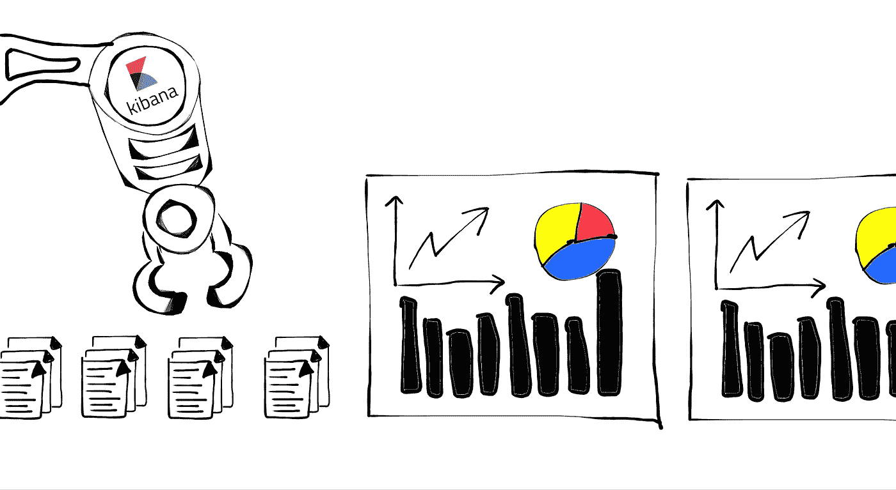

# Kibana 将数据带入生活

> 原文：<https://medium.com/analytics-vidhya/kibana-brings-the-data-to-life-7c0e528507c0?source=collection_archive---------14----------------------->

Kibana 是 ELK 的数据可视化工具。作为 KLK 的初学者，你不可避免地要知道这个工具。然而，Kibana 并不是可视化弹性搜索结果的唯一工具。还有许多其他工具，像 Grafana 和其他人会帮助你，如果你更熟悉他们的话。在这篇文章中，我们将走进 Kibana 的世界，试图了解什么是 Kibana，以及如何使用它。

## 概述