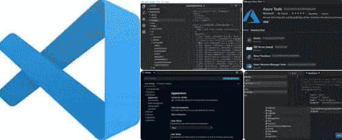
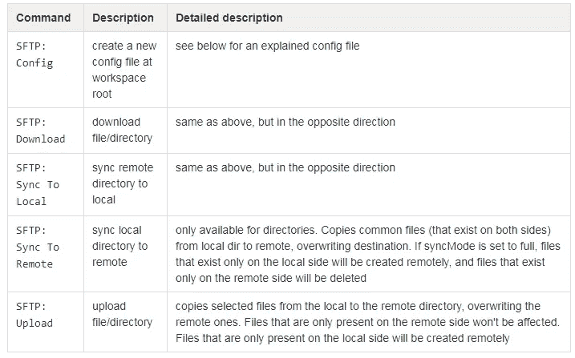
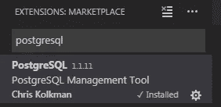
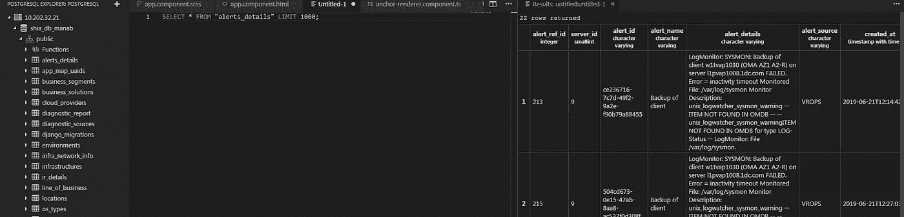

# 在 3 分钟内启动 Visual Studio 代码

> 原文：<https://medium.com/analytics-vidhya/kick-start-visual-studio-code-in-5-minutes-65673ccd8be4?source=collection_archive---------22----------------------->

如果您不熟悉 Visual Studio 代码，我可以帮助您从哪里开始以及如何有效地使用它



# 装置

根据[https://code.visualstudio.com/docs/setup/windows](https://code.visualstudio.com/docs/setup/windows)，你可以通过安装程序和可移植(推荐)方法安装或使用 Visual Studio 代码。

对于便携式方法:

1.  你只需要从官方网站下载可移植文件
2.  提取相同的内容并开始工作。

# 技巧

1.  预览模式选项卡不会保持打开状态。当您从侧边栏打开另一个文件时，将使用现有的预览模式选项卡(如果存在)。
2.  转到文件->首选项→设置
3.  打开设置文件后(设置文件应该位于右侧)，添加“workbench.editor.enablePreview”属性，并将其值设置为 false。
4.  要在 IDE 中选择不同的主题
    CTRL k + CTRL t 在 windows/Linux 上打开调色板，从列表中选择你想要的主题。

# 有用的扩展

*   sftp([https://github.com/liximomo/vscode-sftp](https://github.com/liximomo/vscode-sftp)
*   更漂亮—代码格式化程序([https://marketplace.visualstudio.com/items?itemName = es benp . prettle-vs code](https://marketplace.visualstudio.com/items?itemName=esbenp.prettier-vscode)
*   PostgreSQL(出版商:克里斯·科尔克曼)
*   Python(发布者:微软)
*   有角度的 V6 代码片段
*   自动导入
*   CSS 自动前缀
*   Chrome 调试器
*   npm 智能感知
*   HTML 片段

您可以在下面查看更多关于如何安装或使用上述几个扩展的详细信息:

# sftp([https://github.com/liximomo/vscode-sftp](https://github.com/liximomo/vscode-sftp))

1.  从发布者 liximomo 安装 sftp
2.  在本地创建一个目录
3.  从 VSCode 打开创建的文件夹
4.  在 Windows/Linux 上 Ctrl+Shift+P 打开命令面板，运行 **SFTP: config** 命令。
5.  上述步骤将创建**。vscode** 目录和 vscode 目录中的一个 **sftp.json** 文件。然后进行如下配置:

**。vscode/sftp.json**

```
{ "host": "<hostname>",   "port": 22, "username": "<username>", "password": "<password>", "protocol": "sftp", "interactiveAuth": **true**, "remotePath": "/remote/path", "uploadOnSave": **true**, "syncMode": "update", "ignore": [ "**/.vscode/**", "**/.git/**", "**/.DS_Store" ]}
```



# 更漂亮—代码格式化程序([https://marketplace.visualstudio.com/items?itemName = es benp . prettle-vs code](https://marketplace.visualstudio.com/items?itemName=esbenp.prettier-vscode)

1.  CTRL + Shift + P ->文档格式

运筹学

1.  选择要修饰的文本
2.  CTRL + Shift + P ->格式选择

# PostgreSQL(出版商:克里斯·科尔克曼)

您可以在下面找到 PostgreSQL:



安装相同的，你可以打开 postgres 浏览器

1.  CTRL + Shift + p
2.  然后键入“postgreSQL explorer:关注 postgreSQL 视图”

然后，您可以像下面这样轻松地浏览数据库:



关于 https://marketplace.visualstudio.com/items?的更多细节 itemName = ckolkman . vs code-postgres