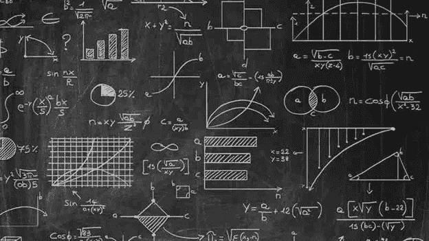
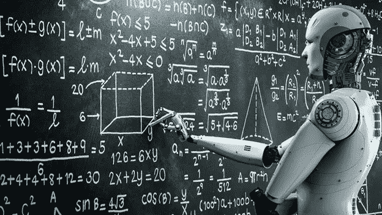
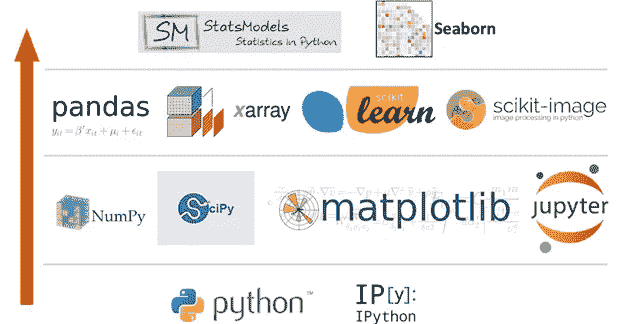

# 启动你的 ML 之旅

> 原文：<https://medium.com/analytics-vidhya/kick-starting-your-ml-journey-be84010b80e6?source=collection_archive---------12----------------------->

你有没有想过，坐在一堂单调的代数课上——“在我的生活中，我要去哪里利用这些代数废话，我的意思是谁真的想找到 x？”

好吧，我终于有了答案！

机器学习是线性代数、统计和微积分实现的完美例子。

人工智能是一个多学科领域，由软件工程、测量、神经生物学和控制假说的融合和合作而成。它的兴起在一些领域承担了重要的工作，并在非常基础的层面上改变了编程的视野。

如果以前的问题是如何给计算机编程，那么现在的问题变成了计算机如何给自己编程。因此，很明显，机器学习是一种允许计算机拥有自己智能的方法。

但是当谈到机器学习的应用时，人们往往会跳过最难的部分，数学，然后马上跳到动手部分！

**那么，数学为什么重要？**

1.选择正确的算法，包括考虑准确性、训练时间、模型复杂性、参数数量和特征数量。

2.选择参数设置和验证策略。

3.识别欠拟合和过拟合。

4.调整模型以获得理想的精度。

5.估计正确的置信水平和不确定性。

事实上，数学有时确实会变得很难，会有一些课程浏览它，给你一个关于这个主题的“实践”体验，但在本质上，当谈到它时，机器学习更像是一个数学学科，而不是计算机科学学科。

没有数学，你可以想出如何写代码，但这就像想出如何在不理解语法的情况下写出一种语言的句子。

你能做它，但是它和猜测结果一样好！

总而言之，即使不是数学奇才，也有可能成为一名功能数据科学家。现实是，在这个行业中，数据科学家花费大量时间进行数据清理、数据探索和数据收集。实际上，他们中 80%的人都忙于信息感知和信息作战。

**编程入门:**

从编程开始:对于新手来说，编写计算机程序在某些情况下是很难学会的。正常情况下，一开始可能会很吓人，很麻烦。在任何情况下，通过标准的实践，这种能力从长远来看是可以获得成功的。说到 ML 中的编程方言，Python 因其在编码中的适应性和直接性而独树一帜。不同的方言，例如 R，Julia 和 Java，也有助于构建 ML ventures。

●从 Python 编程的基础课程开始。

●从 Numpy，Pandas，Matplotlib，Sklearn 这样的基础库开始。

●从头开始计算算法，建立基础。

●在各种数据集上练习，测试你的知识。

资源:

1.在 [Datacamp](https://www.datacamp.com/) 或 [Coursera](https://www.coursera.org/) 、 [Udemy](https://www.udemy.com/join/login-popup/?next=/course/machinelearning/learn/lecture/6087180#overview) 、 [Udacity](https://classroom.udacity.com/courses/ud090) 等网站上学习实际操作。

2.查找文档。

3.在[凸轮](http://kaggle.com)上练习。

**应用机器学习:**

1.获取数据(网页抓取、API 调用、图库):编码后台。

2.清除/管理信息。这种公平需要一些混乱的编码基础。

3.调整你的算法。调整你的模型上所有的花里胡哨，努力得到一个好的整体模型(用准确度、召回率、精确度、f1 分数等来衡量——你应该查找这些)。然后用交叉验证的方法检查过度拟合/欠拟合等(再次，查找这个):数学背景。

4.视觉化！这是你的编码背景回报更多的地方，因为你现在知道如何绘制图表，以及什么样的图表函数可以做什么，这给了你一个数据科学的概念。

5.扩展您对不同算法及其实现的知识。

一旦你深入研究机器学习，你会发现有很多领域可以探索，你读得越多，学得越多，它就变得越有趣！

快乐学习😃