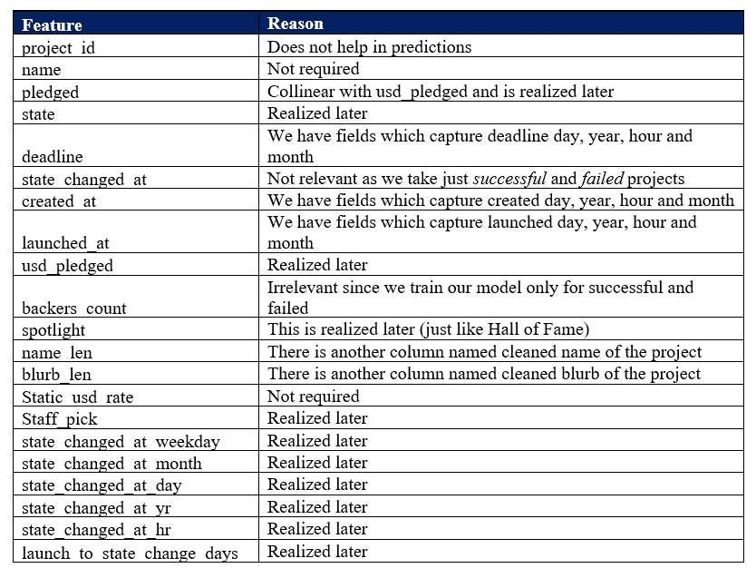
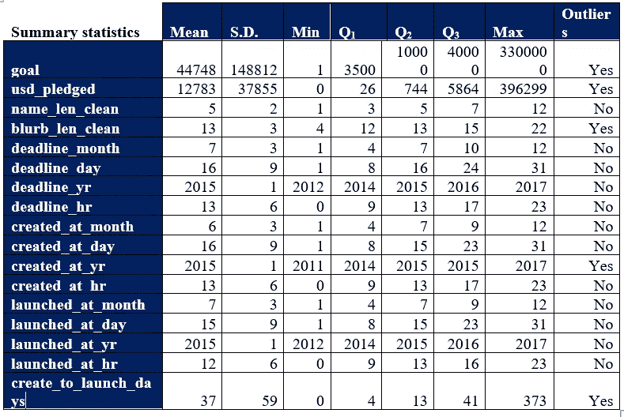
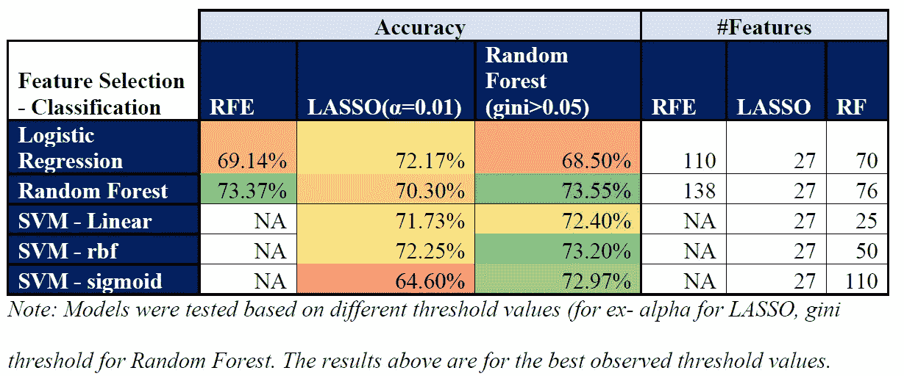
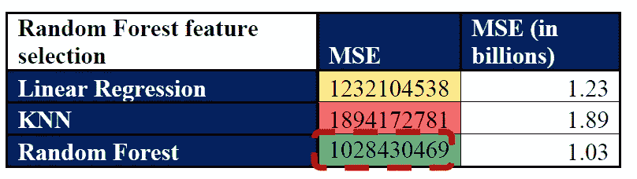
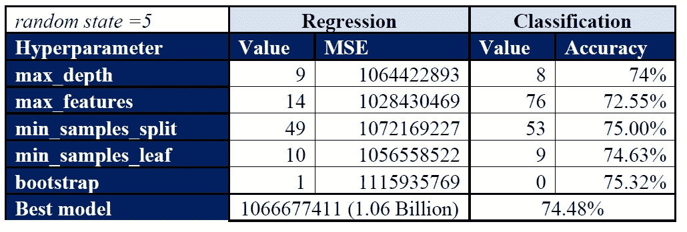
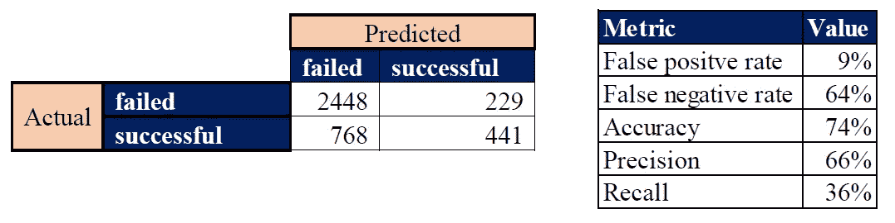

# Kickstarter —预测分析

> 原文：<https://medium.com/analytics-vidhya/kickstarter-predictive-analytics-fdbec545bde0?source=collection_archive---------11----------------------->

# **简介**

Kickstarter 是一家美国公益公司，维护着一个专注于创意和商品销售的全球众筹平台。项目创建者选择一个截止日期和一个最低资助目标。如果在截止日期前没有达到目标，就不会筹集到资金。

这个项目的目标是构建两个监督学习模型，预测项目的承诺金额以及项目是否会成功。

# **数据描述和预处理**

**第一步:**原始数据集有 45 个变量(包括预测值和目标值)。在将它们纳入我们的模型之前，其中一些已被删除，下面的列表将讨论它们:

**第二步:**只过滤成功和失败的项目。(删除了 2973 行)

**步骤 3:** 删除具有任何 NA 值的行。此操作在删除启动状态更改天数列(具有 70% NA 值)后执行。删除了 1471 行

**步骤 4:** 删除所有数值列的异常值。(删除了 1261 行)

**步骤 5:** 为日期列的小时和日列创建了存储桶(截止日期，已创建和已启动。分桶有助于编写高效的代码，并且可以将特定的小时/天分组以构建良好的模型。天数基于周(0–7 天、7–14 天、14–21 天和 21 天以上)划分时段。根据一天中的 0-8 小时、8-16 小时、16 小时以上划分时段

**第 6 步:**目标列中有以项目所在国家货币表示的目标金额。为了让所有项目保持相同的规模，我们将其乘以 static_usd_rate

**第 7 步:**按照前面的步骤选择相关列

**步骤 8:** 对分类变量进行虚拟化

**第 9 步:**运行相关性测试，找出完全相关的列。删除的列:货币

**第十步:**对于分类任务，Y 变量为 state，对于回归任务，Y 变量为 usd _ pledged。X 变量取决于特征选择。

# **汇总统计**

在我们讨论特征选择之前，理解如下所示的入围 X 变量的汇总统计数据是很重要的:

# **功能选择**

接下来，进行特征选择以选择在更好地解释 X 和 Y 之间的变化中起重要作用的预测因子。有 3 种方法进行特征选择。对于每种方法，我们调整参数值以获得最佳特征集(例如:RFE 依赖于模型，LASSO 依赖于α，随机森林依赖于基尼阈值)。

**分类任务的特征选择结果:**

**回归任务的特征选择结果(仅适用于随机森林选择方法)**

# **最终型号选择**

显然，随机森林模型似乎是使用随机森林要素选择方法选择要素的赢家。找到最佳超参数后，获得的最佳精度为 74.48%，均方误差为 10.6 亿。见下文:

考虑到时间限制，完成了模型选择。以下算法未运行:

回归:SVM(通常在回归方面表现不佳)，人工神经网络(耗时)

分类:KNN(不跑 RFE)，安(耗时)

由于随机森林通常比决策树执行得更好，因此没有运行后者。

# **结论及业务解读**

基于训练数据集，构建了两个监督模型来预测 Kickstarter 上某个项目的承诺金额，并预测该项目是否会成功。

**回归模型:**回归模型的 R 平方值— 0.16。该模型解释了 target(USD _ classed)变量中 16%的变化。MSE 为 10.2 亿美元，因此误差为 31，937 美元，这意味着回归模型能够预测项目的承诺金额，误差为+31，937 美元和-31，937 美元。]

**分类模型:**使用混淆矩阵(如下所示)，计算 5 个指标(如下所示)以获得模型的统计和业务解释(代码中的 3.2.3.2 部分):

将上面显示的指标翻译成业务语言(保持相同的顺序)

在失败的项目中，算法将它们识别为成功的概率为 9%

在成功的项目中，算法将它们识别为失败的概率为 64%

在所有项目中，正确预测其状态的概率为 74%

如果算法将客户识别为成功的项目，则算法正确的概率为 66%

在成功的项目中，算法将它们识别为成功的概率为 36%

对于像 Kickstarter 这样的企业来说，模型应该具有高精度但低召回率是可取的，因为公司花费时间和资源来宣传成功几率更高的好项目。因此，高精度和低召回率将确保公司能够最大限度地投资于更有可能成功的好项目。

总之，有了给定的数据，最终模型能够以较高的准确度预测 Kickstarter 上项目的状态。最终的模型解决了过度拟合和欠拟合的问题，同时准确地捕捉了数据集的全部本质。

# **代码**

[https://github . com/chandravenky/Kickstarter-Predictive-Analytics-using-Python](https://github.com/chandravenky/Kickstarter-Predictive-Analytics-using-Python)