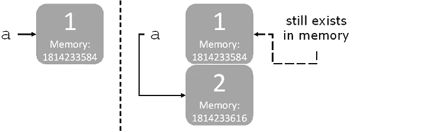
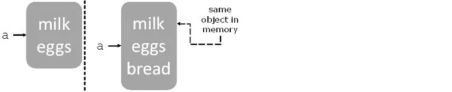

# Python 中的对象种类(可变-不可变)

> 原文：<https://medium.com/analytics-vidhya/kind-of-objects-in-python-mutables-immutables-c1a1348af08b?source=collection_archive---------22----------------------->


如果您是 python 的新手，并且花了一些时间阅读过这方面的内容，可能您已经看到或听说过 Python 中的一切都是对象，这是事实，但是正如这个概念很重要一样，Python 中的可变和不可变概念也很重要，关于它的一些基础知识可能会帮助您轻松地学习 Python。

因此，我将尝试简要解释 python 中什么是可变的和不可变的，以及与它们相关的一些主题。

# 可变和不可变

python 中的每个变量保存一个对象的实例。每当实例化一个对象时，都会分配一个唯一的对象 id，并且它的类型将在运行时定义，之后将不能更改。Python 中有两种类型，不可变类型和可变类型。

不可变类型的对象不能被改变。任何修改对象的尝试都将导致创建副本。

一个可变类型的对象可以被改变，并且它被原地改变*。不进行隐式复制。*

> *像( **bytes、int、float、bool、str、tuple、unicode、complex** )这样的内置类型的对象是**不可变的**。像( **list、set、dict、array、bytearray** )这样的内置类型的对象是**可变的**。自定义类是可变的。*

*不可变对象被创建，并被赋予一个值，然后在内存中分配一些空间。绑定到对象的变量名指向内存中的那个位置。*

**

*使用表达式`a = 1`和`a = 2`分配给新对象的相同变量。值为 1 的对象仍然存在于内存中，但是您已经失去了对它的绑定。*

*当你修改一个可变对象时，你保持相同的变量绑定，并且在相同的内存位置的对象被直接修改。*

**

*列表( **a)** 在内存中，然后在列表中添加另一项，同一内存位置的对象直接被修改。*

# *什么是 id()和 type()？*

*函数 **id** ()是一个内置函数，它以整数的形式返回对象的标识*

```
*>>> a = 1
>>> id(a)
140128142243264*
```

*正如我们所见，该函数接受单个参数，并用于返回对象的标识。在对象的生命周期中，这个标识必须是唯一的和不变的。生存期不重叠的两个对象可能具有相同的 id()值。*

***type()** 函数要么返回对象的类型，要么根据传递的参数返回新的类型对象。如果一个单独的对象被传递给`type()`，该函数将返回它的类型。*

```
*>>> y = 3
>>> type(y)
<class: ‘int’>
>>> x = "Street"
>>> type(x)
<class: 'string'>*
```

*在 python 中，赋值过程给变量赋值，但有时变量也会引用。*

***分配**操作总是从右向左进行。变量在赋值前引用的对象现在被取消引用。*

```
*>>> a = 10
>>> a = 5
>>> a
5*
```

*多重赋值也遵循从右向左的规则。考虑下面的例子:*

```
*>>> a = b = c = 10
>>> a
10
>>> b
10
>>> c
10*
```

*首先将整数 10 赋给变量 c，然后将 c (10)的值赋给 b，b 赋给 a。对该表达式求值后，所有变量**引用**同一个对象——整数 10。*