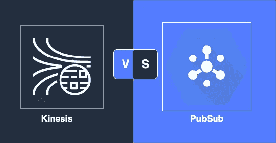
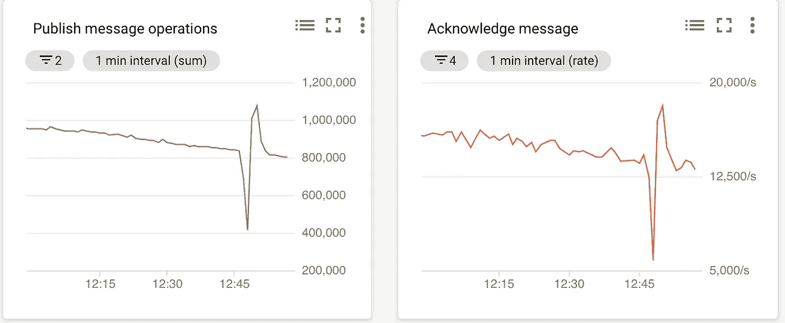
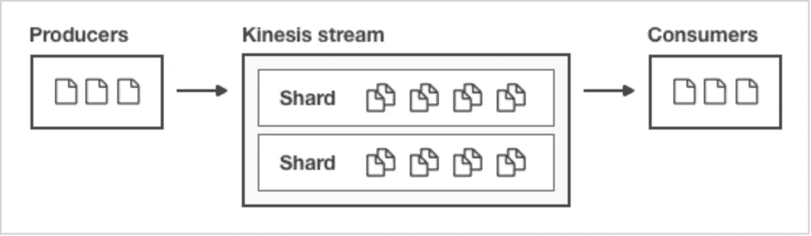
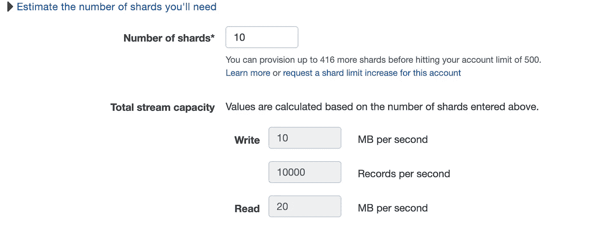
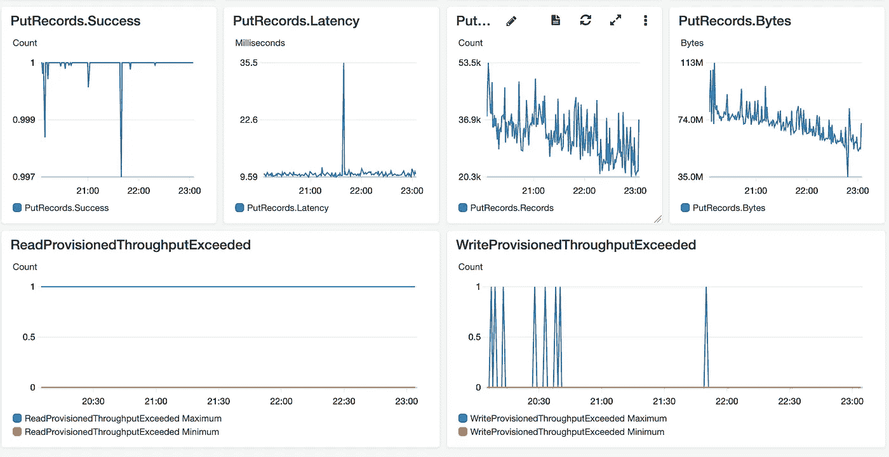

# Kinesis(AWS) vs. PubSub (GCP)以及他们如何站在卡夫卡旁边

> 原文：<https://medium.com/analytics-vidhya/kinesis-aws-vs-pubsub-gcp-and-how-they-stand-near-kafka-c55a309598?source=collection_archive---------1----------------------->

在过去的一年里，我在这两个管理流上做了大量工作，让我们了解每一个，它的能力，概念和弱点，最后将两个云解决方案与 Kafka 进行比较。

# GCP 公共订阅

## 这里的组件是谁？

1.话题
2。订阅。

数据发布到主题，主题可以有多个订阅，每个订阅服务一个消费者。
不用说，任何订阅都是相互独立的，它只是为任何消费者设置流状态。

## 缩放:

您不必担心缩放，PubSub“知道”根据发布消息的速率来调整自己。没有必要用碎片/隔板“弄脏你的手”，GCP 正在为你安排。

## 监视

您可以使用 StackDriver 度量来监视 PubSub，您可以在主题级别或订阅级别进行监视。

这两个指标表明订阅有不能及时确认的消息。

在下面的指标中，您可以看到发布消息率与确认率，在这种情况下，它们是相同的，表明确认过程运行良好，没有瓶颈。

## 数据顺序

尽力而为，使用系统提供的`publishTime`属性按照消息发布的顺序传递消息。云发布/订阅不保证一次性或有序交付。

## 一次性保证

尽最大努力，PubSub 不保证只交付一次。

# 运动学:

## 这里的组件是谁？

1.  溪流
2.  碎片

这个流类似于 PubSub 中的" Topic ",一个记录流，一个必须配置分片号的流，这将定义它的容量:

> 碎片是吞吐量的单位。每个碎片每秒接收 1MB 和 1000 条记录，每秒发出 2MB。为了适应更高或更低的吞吐量，可以在创建 Kinesis 流之后修改碎片的数量。

当你创建你的流时，你必须选择碎片的数量。非常重要的是要记住:你要按小时付费！如果你有几个小时，你预计你的流量增加，你需要设置碎片数为最高流量，即使你不需要它的其余时间…

创建流时，AWS 会帮助您计算所需的分片数:

## 当我有尖峰时会发生什么？

然后你会得到:“`Rate exceeded for shard shardId-000000000052 in stream [some stream name] under account…`”
如果是临时的 spike，这可能是有效的，因为生产者库( [KPL](https://docs.aws.amazon.com/streams/latest/dev/developing-producers-with-kpl.html) )曾经再次重试，被 spike 的记录会在下一次重试时被摄取。
AWS 还建议实施背压机制，以避免这种峰值。

## 当我必须增加碎片数量时会发生什么？还是减少？

您可以增加碎片的数量，只能是其当前大小的两倍，或者如果您想要更少，则可以将其减少，但只能是当前大小的一半，这种限制会导致您在多次迭代中执行此过渡。

一旦你改变了碎片的数量，Kinesis 为你处理重新分片，零停机时间。

## 分区键:

对于你发送到 Kinesis 的任何记录，你应该指定它的分区键，这个键用于在可用的分片上平衡记录的负载。
我通常做`UUID.*randomUUID*().toString()`。

## 监控:

你可以在 CloudWatch 中，在分片级别和流级别对其进行监控。也支持警报。

而如果要由消费者来监控呢？这有点挑战性，你必须确保你的消费者将指标发送到 CloudWatch，(并且你为每个 API 调用付费)。在这里阅读更多。

您还需要监视“`WriteProvisionedThroughputExceeded”`和“`ReadProvisionedThroughputExceeded`”，它们向您显示了超过碎片限制的读/写情况。

您可以在下面的指标中看到，有时`WriteProvisionedThroughputExceeded,`这可能与传入数据的峰值相关。

## 定量

Kinesis 支持记录的批处理，它有专门的 API 用于“腐败记录”，而不是“腐败记录”。

> 每个腐败记录请求最多可以支持 500 条记录。请求中的每个记录最大可达 1 MB，整个请求的最大限制为 5 MB。

需要记住的是，当在一个 API 调用中生成聚合记录时，您还需要在消费它时解聚合它们。点击阅读更多[。](https://docs.aws.amazon.com/streams/latest/dev/kinesis-kpl-consumer-deaggregation.html)

## 数据顺序

可以在分片级别实现排序，因为生产者必须发送包括其分区键在内的任何记录来确定分片。此外，任何记录都有一个序列号。因此，当消费者读取数据时，它将通过分片并按顺序接收数据。

## 一次性保证

一条记录可以多次交付给消费者，因此应用程序必须强制执行恰好一次语义。有关更多信息，请参见亚马逊 Kinesis 数据流文档中的[处理重复记录](https://docs.aws.amazon.com/streams/latest/dev/kinesis-record-processor-duplicates.html)。

# 将云解决方案与 Kafka(最流行的)进行比较:

## 缩放:

Kafka 不支持自动缩放，当你需要向主题中发送更多数据时，你必须增加分区、代理、复制等等。

最后，集群中有大量的维护工作和多个需要增强的相关组件。

使用 Kinesis/PubSub 时不需要这些操作。即使说 Kinesis 不是自动放大/缩小的，它仍然比在卡夫卡中更容易做到。

## 订单:

Kafka 可以在分区级别支持有序消息，用户从分区中读取数据，因此它将得到有序的消息。

## 供应商锁:

选择 Kafka 时，您不会被云供应商锁定，并且您可以在不接触任何代码/基础架构的情况下更改云提供商。
卡夫卡，因为越来越受欢迎，拥有强大的生态系统，无数的工具和第三方连接器/接收器/提供者，让你轻松与外部世界融合。

## 托管服务:

卡夫卡设计过像[汇合](https://www.confluent.io/confluent-cloud/?utm_medium=sem&utm_source=google&utm_campaign=ch.sem_br.nonbrand_tp.prs_tgt.kafka_mt.xct_rgn.emea_lng.eng_dv.all&utm_term=kafka%20managed%20service&creative=367725579988&device=c&placement=&gclid=EAIaIQobChMI0oXR683q5QIVSbTtCh1FMwEGEAAYASAAEgIRsvD_BwE)、[艾文](https://aiven.io/kafka?utm_expid=.r7Ehyfv2TDiN_-_Ue3zzqQ.0&utm_referrer=https%3A%2F%2Faiven.io%2F)等解决方案。
他们可以在任何云上为你构建集群:Aws/GCP/Azure。
这个值得一查，因为 Kafka 自有实力，托管服务解决了集群维护部分。现在，您可以受益于其他 Kafka 功能:Kafka 流、消息持久性、事务、消息排序、仅一次保证…

# SumUp:

**发布订阅**:

*   **零运算**，无需定义分区和分片。
*   **缩放**是内置的，不需要任何操作(至少检查一下你没有达到一些配额限制)。
*   **只为使用付费**。
*   **监控**友好简单。
*   **生产者代码**是直截了当的，没有处理分区/分片错误/反压力。

**驱动力**

*   **扩展**也是受管理的，但是你必须知道你的预期用途，并相应地操作扩大/缩小，这不会自动发生。
*   你需要为你打开的碎片付费，即使你并没有使用所有的碎片。
*   监控并不总是免费的，以防你不得不发送自定义指标(每个消费者)。
*   **生产者代码**可能很复杂，建议使用 KPL 库，(仅限 java)

**Kafka** ，一方面有强大的生态系统，丰富的功能，而且它在不断成长和完善，它是开源的，有一个很大的社区，你也不会被云厂商锁定。
但另一方面，它带来了高昂的维护成本，更好的是，如果你可以购买托管的 Kafka 服务，并将维护/扩展委托给外部服务，专注于你的逻辑和业务，那么你就可以享受两个世界的好处。