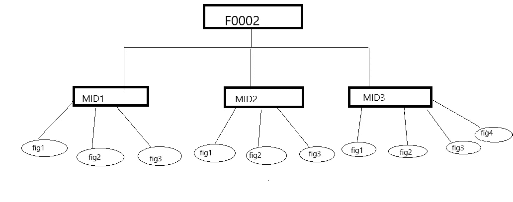
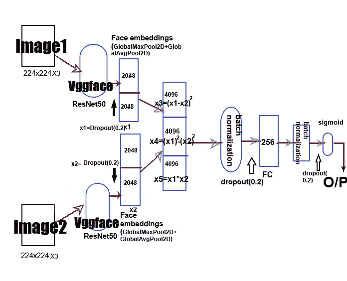

# 计算机视觉难题

> 原文：<https://medium.com/analytics-vidhya/kinship-classification-using-faces-7cc81610079b?source=collection_archive---------13----------------------->

# 基于人脸的亲属分类


不幸的是，人类甚至很难仅凭他们的脸来预测两个人是否是血亲，但机器不再是这种情况。

人脸图像的亲属分类是模式识别和计算机视觉中的一个新问题，它在现实世界中有许多潜在的应用，包括社交媒体分析和儿童收养。

# 1.关于这个问题

这是一个由东北大学微笑实验室通过 Kaggle 主办的比赛。数据由 Families In the Wild (FIW)提供，这是最大、最全面的自动亲属识别图像数据库。[点击此处](https://www.kaggle.com/c/recognizing-faces-in-the-wild/overview)了解详情

> **问题陈述**

给定图像对，更具体地说是人脸，任务是确定两个图像是否有任何血缘关系。所以这是一个分类问题。关系可以是父亲-女儿/儿子、母亲-女儿/儿子、祖父-孙子以及兄弟姐妹之间的关系。

注意，夫妻之间即使同属一个家庭，也没有血缘关系。

标签:相关对为 1 或 0

> **评估指标**

选择的度量是预测和观察标记之间的 AUC-ROC。

它告诉我们模型在多大程度上能够区分不同的类。AUC 越高，模型预测 0 为 0 和 1 为 1 的能力越强。以此类推，AUC 越高，该模型在区分患病和未患病患者方面就越好。

> **利用深度学习解决这个问题:**


因为我们需要分类图像对是否是血缘亲属，这涉及通过输入两个图像并学习预测输出的函数 f 来训练模型。在深度学习的帮助下，模型可以学习函数 f，并将输入映射到期望的输出。

# 让我们开始吧…

> E **现有方法**

这个问题可以用很多方法解决，但事实是，数据越多，结果越好。这个特定问题的现有方法是使用数据生成器来解决的，该数据生成器可能不能确保使用所有可用的图像，即数据生成器简单地使用样本和选择来获取图像。这引起了数据重复的问题，并且可能无法确认使用所有可用的图像。这种方法的主要问题是，由于我们使用预先训练的权重，模型往往会过度拟合训练数据，因此无法在看不见的数据上表现得更好。

> 我的**方法**

我的主要意图是使用每一个图像，使模型能够在看不见的地方表现得更好。生成带有标签(0 或 1)的列形式的影像路径数据框，并使用数据生成器将模型拟合到影像上。

# 2.电子设计自动化(Electronic Design Automation)

首先，让我们阅读所有必要的文件

```
# Reading all neccessary files requiredtrain_file_path='recognizing-faces-in-the-wild/train_relationships.csv'train_folders_path='train/'train_csv=pd.read_csv(train_file_path)
train_csv.head()
```


这里提供的数据只包含相关对，但我们的主要任务是生成非相关对。在此之前，我们先来看一下这个问题提供的数据。图像存储在' *train_folders_path'* 文件夹中，并在 csv 文件中给出一对一的关系。下图是所给数据中 Id 为 F0002 的一个系列的示例。

F0002 是主系列文件夹，具有 ID 为 MID1、MID2 和 MID3 的系列中的 3 个成员，后跟他们各自的多个图像。



总共有 470 个独特的家庭作为训练数据给出，它们也遵循如上所示的相同格式。我们需要根据“train_csv”文件中给出的关系获取图像。

我们可以看到列 P1 和 P2 的格式是 FamilyID/MemberID，我们需要根据给定的关系获取相应的图像。

让我们试着将 csv 中成对给出的相应图像可视化


# 3.数据准备

**程序**

1.  生成不相关的对。
2.  对生成的对执行数据清理
3.  获取每个图像对路径，并将其存储在数据框中。

正如我们从上图中看到的，只有相关对，我们还需要生成不相关对。我们可以通过从 csv 中生成所有可能的配对组合并从中删除相关配对来生成不相关的配对。

```
non_relation=list(itertools.product(relationships.p1.values, relationships.p2.values))**O/p** (’NUMBER OF TUPLES CONTAINING ALL POSSIBLE COMBINATION OF PAIRS except validation pairs:’,  2138402)
```

上面的代码生成所有可能的对组合作为元组列表，这不是我们想要的，但是从中删除所有相关的对将导致不相关的图像对。但是上面的方法有一个问题，会导致巨大的数据不平衡，因为我们生成了每个可能的组合，不相关的对(标签 0)比相关的对(标签 1)多得多。我们需要以某种方式解决这个问题，使我们的预测更加一般化。

上面的代码以 csv 中给出的格式生成对，即 FamilyID/MemberID，但是我们需要生成以图像路径为列的数据帧，以便将其作为模型的输入。

```
#storing each image path using following code.train_person_to_images_map=defaultdict(list) #  for trainfor x in train_images:
    train_person_to_images_map[x.split('/')[-3]+'/'+x.split("/")               [-2]].append(x)
```

根据给定的关系获取图像路径可以使用下面的代码

```
# FOR RELATION PAIRS
a1=[]
for i in train:
   a=list(train_person_to_images_map[i[0]])
   b=list(train_person_to_images_map[i[1]])
   a1.append(list(itertools.product(a,b)))# FOR NON-RELATION PAIRS
a2=[]
for i in non_relation:
   a=list(train_person_to_images_map[i[0]])  
   b=list(train_person_to_images_map[i[1]])
   a2.append(list(zip(a,b)))
```

> **生成数据帧**

下面的代码片段使列表变平，并生成适合输入我们的模型的数据框架。

```
# CREATING FLATTEN LIST OUT OF LISTS OF LISTS
# for label 1
merged = list(itertools.chain(*a1))# for label 0
merged1 = list(itertools.chain(*a2))# Generating dataframe
frame=pd.DataFrame(merged)# Fore class 1 
frame['class']=1frame1=pd.DataFrame(merged1)# Fore class 0
frame['class']=0
```

我们总共生成了 4 个数据帧，2 个用于训练，2 个用于两个类的交叉验证。

如上所述，标签 0 对比标签 1 对多得多，这可以从下面的图片中看到。


为了避免数据不平衡，我们对标签 0 对进行下采样。

> **数据发生器**

因为我们需要根据数据帧中列出的路径提取图像，所以我们需要一个数据生成器来读取路径并处理图像，同时生成两个图像以及各自的类标签。

该生成器根据指定的批处理大小顺序获取图像。

数据生成器的代码


在所有的数据准备之后，让我们使用深度学习来深入研究模型的实际训练。

# 4.模型

在这里，我在每个模型中广泛使用了 **VggFace** 来使用预训练权重的力量。

**什么是 Vggface**

VGGFace 是指一系列为人脸识别开发的模型，由牛津大学视觉几何小组(VGG)的成员在基准计算机视觉数据集上演示。

```
model = VGGFace(model=’…’)
```

*keras-vggface* 库提供了三个预训练的 VGGModels，一个 VGGFace1 模型通过*model = ' vgg 16 '*(默认)，两个 VGGFace2 模型' *resnet50* '和' *senet50* '。

ResNet-50 是一个经过预训练的深度学习模型，用于*卷积神经网络(CNN，或 conv net)*的图像分类，卷积神经网络是一种深度神经网络，最常用于分析视觉图像。ResNet-50 有 50 层深，并在来自 ImageNet 数据库的 1000 个类别的一百万幅图像上进行训练。此外，该模型有超过 2300 万个可训练参数，这表明了一个更好的图像数据的深层架构。使用预训练模型是一种非常有效的方法，相比之下，如果您需要从头开始构建它，您需要收集大量的数据并自己训练它。当然，还有其他预先训练的深度模型可以使用，如 AlexNet，GoogleNet 或 VGG19，但 ResNet-50 以出色的泛化性能和更少的识别任务错误率而闻名，因此是一个有用的工具。

**为什么要预训练权重(Vggface)**

预训练模型是我们学习现有框架的一个很好的帮助来源。由于时间限制或计算限制，不可能总是从零开始构建模型，这就是预训练模型存在的原因！我们可以使用一个预训练的模型作为基准来改进现有的模型或者测试我们自己的模型。

**Vgg face resnet 50 的架构:**


**现在让我们看看实际的深度学习模型**

> **型号 1**



该模型使用了 Vggface 的 Resnet50

```
input1=Input(shape=(224,224,3))input2=Input(shape=(224,224,3))base_model=VGGFace(model='resnet50',include_top=False)  # Pretrained model  Vggface
for x in base_model.layers[:-3]:
   x.trainable = falsex1=base_model(input1)
x2=base_model(input2)
x1=Dropout(0.2)(x1)
x2=Dropout(0.2)(x2)
x1=Concatenate(axis=-1)([GlobalMaxPool2D()(x1),GlobalAvgPool2D()(x1)])
x2=Concatenate(axis=-1)([GlobalMaxPool2D()(x2),GlobalAvgPool2D()(x2)])
x3=Subtract()([x1,x2])
x3=Multiply()([x3,x3])
x1_=Multiply()([x1,x1])
x2_=Multiply()([x2,x2])
x4=Subtract()([x1_,x2_])
x5=Multiply()([x1,x2])
x=Concatenate(axis=-1)([x3,x4,x5])
x=(BatchNormalization())(x)
x=Dropout(0.2)(x)
x=Dense(256,activation='relu')(x)
x=(BatchNormalization())(x)
x=Dropout(0.2)(x)
out=Dense(1,activation='sigmoid')(x)model=Model([input1,input2],out)
model.compile(loss='binary_crossentropy',metrics=['acc',auroc],optimizer=Adam(0.00001))
```

模型 1 架构背后的基本思想是，我们利用函数式 API 来构建模型，图像作为输入提供给 vggface，幸运的是，vgg face 将 224X224 分辨率的彩色图像作为输入，然后生成大小为 2048 的[嵌入](https://www.quora.com/What-does-the-word-embedding-mean-in-the-context-of-Machine-Learning)。

我使用了不同的数学计算层组合，

这里 x1 和 x2 是面部嵌入。

第一个是 x3=(x1-x2)，其直观地执行两个图像的两点之间的欧几里德距离，即执行两个图像之间的相似性，其指示随着两点之间的距离增加，相似性降低，反之亦然。

第二个是 x4=(x -x ),这也是计算图像两点之间的距离，但直观上，我们可以将其概括为曼哈顿距离，但每个点的平方。

第三个是 x5 =(x1*x2 ),增加它是为了给我们的模型增加某种正则化。添加了一些密集层的组合，以便我们的模型可以变得更加通用。

模型 1 的输出结果非常好，获得了良好的 AUC 分数，下图显示了训练和交叉验证指标。


**模型 1 输出:**

**列车 AUC** : 0.87 **，C.V AUC** :0.85

model1 架构的优点是该架构更加一般化，即模型不会过度拟合甚至测试数据。

> **型号 2**

我们没有像在模型 1 中那样计算欧几里得距离，而是计算两点之间的余弦距离。


下面的代码执行两点之间的余弦距离

```
def cosine_distance(vests):
   x, y = vests
   x = K.l2_normalize(x, axis=-1)
   y = K.l2_normalize(y, axis=-1)
   return -K.mean(x * y, axis=-1, keepdims=True)
def cos_dist_output_shape(shapes):
  shape1, shape2 = shapes
  return (shape1[0],1)
```

下图显示了模型 2 的架构

```
return (shape1[0],1)input_1 = Input(shape=(224, 224, 3))
input_2 = Input(shape=(224, 224, 3))base_model = VGGFace(model='resnet50', include_top=False)for x in base_model.layers[:-3]:
 x.trainable = False
x1 = base_model(input_1)
x2 = base_model(input_2)
x1=Dropout(0.2)(x1)
x2=Dropout(0.2)(x2)
x1 = GlobalMaxPool2D()(x1)
x2 = GlobalMaxPool2D()(x2)
x3 = Subtract()([x1, x2])
x4 = Multiply()([x1, x2])
x5 = Lambda(cosine_distance, output_shape=cos_dist_output_shape)([x1, x2])
x = Concatenate(axis=-1)([x5, x3,x4])
x = Dropout(0.1)(x)
out = Dense(1, activation="sigmoid")(x)model = Model([input_1, input_2], out)
model.compile(loss=['binary_crossentropy'], metrics=['acc',auroc], optimizer=Adam(0.00001))
```

模型 2 的输出没有获得好的结果，即余弦相似性没有给最终输出增加任何显著的差异。从下图中可以看出，这种架构在 12 个时期后也是过度适合的


**模式 2 输出:**

**列车 AUC** : 0.91 **，C.V AUC** :0.82

> **模型 3**

这个模型是模型 1 的轻微修改。这里我用 Senet 50 代替 resnet50，其余的都保持不变。

SENet 是指**挤压和激励(SE)。**SE 块尝试使用全局信息来有选择地强调信息性特征并抑制一次不太有用的特征。从字面上看，它会尝试向图层中的每个要素地图添加权重。

但是这个数据上的 SeNet 执行得不是很好，因为模型 3 在某些时期后过度拟合，而具有相同架构的模型 1 resenet 执行得更好。


**模型 3 输出:**

**训练 AUC** : 0.91 **，C.V AUC** :0.82

正如我们所看到的，采用 SEnet 架构的模型 3 未能很好地推广。

> **模型 4**

架构与模型 1 相同，但是这里我使用另一个数据生成器来执行数据扩充。数据扩充是增加数据数量和多样性的过程。在我们处理图像之前，最常用的数据增强操作是-

1.  旋转
2.  剪羊毛
3.  变焦
4.  种植
5.  轻弹
6.  更改亮度级别

我用来执行增强的操作如下所示

```
datagen =ImageDataGenerator(rotation_range=25,width_shift_range=0.2, height_shift_range=0.2,horizontal_flip=True, vertical_flip=True)
```

数据生成器如下所示

```
def get_flow_from_dataframe(a,b):
 train_generator1=a
 train_generator2=b
 while True:
   x_1 = train_generator1.next()
   x_2 = train_generator2.next()
   yield [x_1[0], x_2[0]], x_1[1]
```


**模式 4 输出:**

**列车精度** : 0.601 **，C.V 精度** :0.49

这里的输出非常令人惊讶，数据的增加使事情变得更糟。模型 4 还没有达到 50%的准确率。我们可以说这个模型是哑模型。这背后的可能原因是数据扩充正在创建有噪声和不相关的图像对，这导致我们的模型基于创建的数据而不是基于实际数据来移动超平面。

> **车型对比**


模型 1 表现得非常好，正如我们从图中可以看到的，在训练数据上获得的 AUC 是 0.87，接近交叉验证数据上的 0.85。数学运算(即欧几里德距离)显著提高了性能。

另一方面，模型 2 和模型 3 在训练数据上表现良好，但是模型过度拟合，不能在交叉验证数据上表现良好。从上图可以看出，这些模型的表现并不一致。

如上所述，模型 4 是哑模型，尽管其架构与模型 1 相同。在这里，数据扩充使事情变得更糟，导致巨大的过度拟合和训练损失只是停留在局部最小值。

下图显示了模型 1 在测试数据上的 AUC 分数。


测试数据的模型 1 Auc 得分

# 5.未来的工作

1.  为了改善结果，我们可以尝试集合所有模型并平均输出。
2.  在未来，如果我们收集更多的数据，即相关对，我们可以尝试实现我们自己的架构，而不是依赖于 VGG 面，因为正如我们所观察到的那样，在较少的数据上应用预训练权重，我们的模型往往会过度拟合，我们可能无法保证我们的模型有多一般化。

# 6.参考

1.  [https://github.com/rcmalli/keras-vggface](https://github.com/rcmalli/keras-vggface)
2.  [https://medium . com/@ 14 Prakash/image-class ification-architectures-review-d8b 95075998 f](/@14prakash/image-classification-architectures-review-d8b95075998f)
3.  [https://www . ka ggle . com/c/recogniting-faces-in-the-wild/notebooks](https://www.kaggle.com/c/recognizing-faces-in-the-wild/notebooks)
4.  [https://nano nets . com/blog/data-augmentation-how-to-use-deep-learning-when-you-have-limited-data-part-2/](https://nanonets.com/blog/data-augmentation-how-to-use-deep-learning-when-you-have-limited-data-part-2/)
5.  https://nnabla.org/paper/imagenet_in_224sec.pdf
6.  【https://www.appliedaicourse.com/ 

**点击此处查看完整代码**:[https://github . com/santoshketa/亲属关系分类使用面孔识别野外面孔](https://github.com/santoshketa/Kinship-Classification-using-faces-recognizing_faces_in_the-wild)

如果您有任何疑问，请联系我:[https://www.linkedin.com/in/sri-santosh-bhargav-354974192/](https://www.linkedin.com/in/sri-santosh-bhargav-354974192/)