# 使用 VGGFace 进行亲属分类

> 原文：<https://medium.com/analytics-vidhya/kinship-classification-using-vggface-a7c76f81288?source=collection_archive---------5----------------------->

在本文中，我们将构建一个模型，仅根据两个人的面部图像来确定他们是否有血缘关系。这个挑战来自 kaggle 竞赛东北微笑实验室——在野外识别人脸[https://www.kaggle.com/c/recognizing-faces-in-the-wild](https://www.kaggle.com/c/recognizing-faces-in-the-wild)

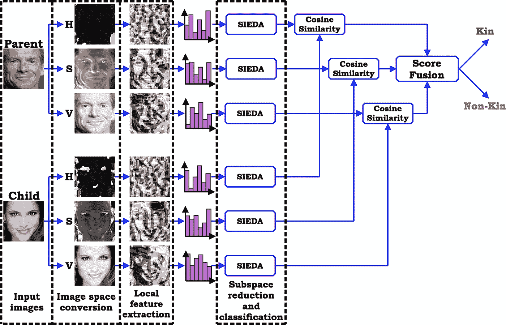

这里，我们使用从预训练模型 VGGFace 获得的特征。我们同时经过两张脸，得到他们有亲属关系的概率。获得两个图像特征，然后将它们组合以传递到密集层。下面是网络的架构。

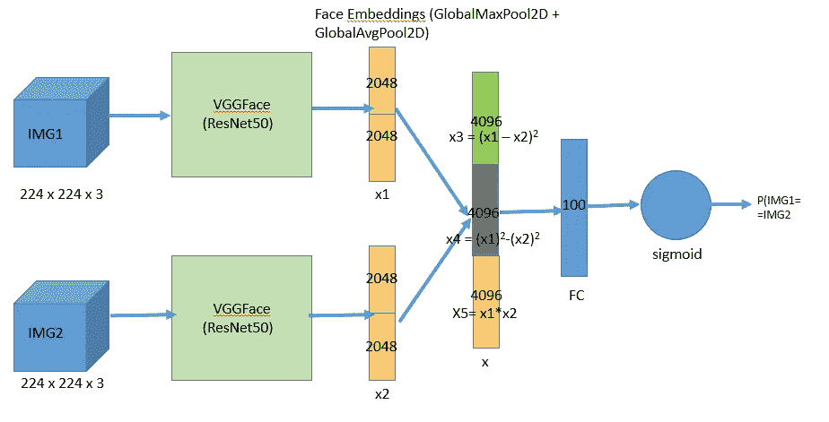

(模型架构)

这些功能的组合方式参考了 kaggle 笔记本。

# **VGGFace**

牛津大学的视觉几何小组(VGG)开发了一个深度卷积神经网络模型，并在非常大的人脸数据集上进行人脸识别任务的训练。在基准人脸识别数据集上对它们进行了评估，证明了该模型在从人脸生成广义特征方面是有效的。

我们有 VGGFace 的 Keras 实现。点击 https://github.com/rcmalli/keras-vggface[的链接](https://github.com/rcmalli/keras-vggface)，了解如何安装以及如何使用不同的型号。对于这个任务，我们将使用 VGGFace 的“ResNet50”模型。

# **数据**

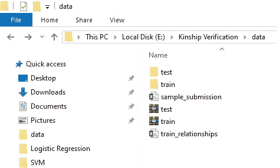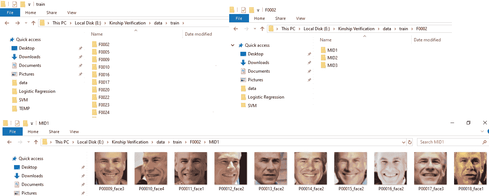

我们有培训、测试目录和关系 csv 文件。关系 csv 文件由具有亲属关系的一对人组成。train 文件夹包含不同系列的目录。每个家庭目录都有属于该家庭的每个人的子目录。测试目录只有人的图像。我们必须核实提交文件中的亲属关系。

# **代码**

首先安装 Keras-vgg face 模型(参考上面的链接)

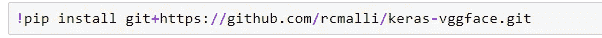

然后我们导入所需的库

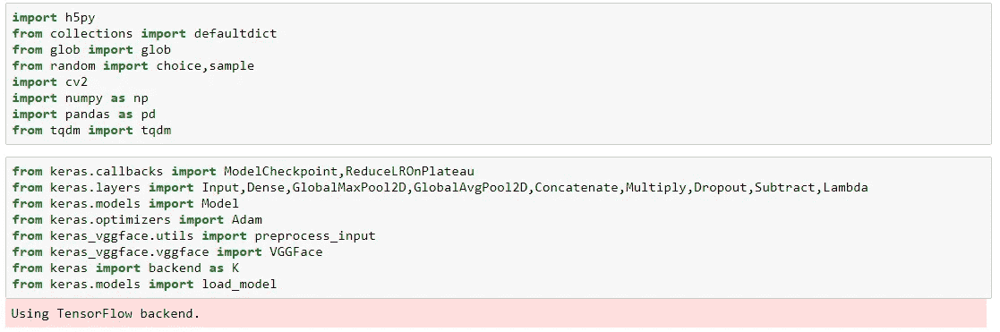

下面这段代码获得了不同的人和他们的图像的路径。它构建了一个字典，其中键是 persons(格式为 F002/MID1 ),值是属于那个人的图像列表。

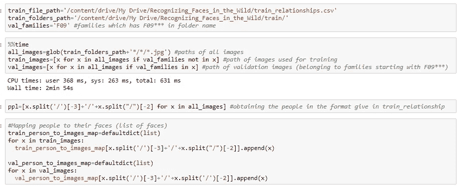

然后，我们读取关系文件，并以元组列表的形式生成关系。根据选择的验证系列，这些关系分为训练集和验证集。“img2arr”函数获取图像的路径，并以(224，224，3)的形式返回相应的数组。Keras VGGFace 实现提供了一个方法“preprocess_input ”,它按照 VGGFace 输入的形状输出图像。VGGFace 模型接受形状(224，224，3)的输入。

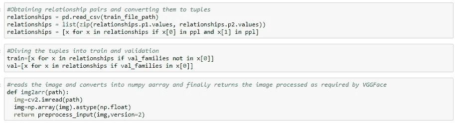

下面这段代码是一个 python 生成器，它与 fit_generator 方法一起使用，以指定的批处理大小生成图像。

我们有有亲属关系的夫妇的数据。但是为了训练模型，我们还应该提供没有亲属关系的夫妇的数据。这个逻辑也包含在定义的 python 生成器中。该批中的一半将具有有亲属关系的图像对(比如类 1 ),而剩余的一半将具有没有亲属关系的图像对(比如类 0)

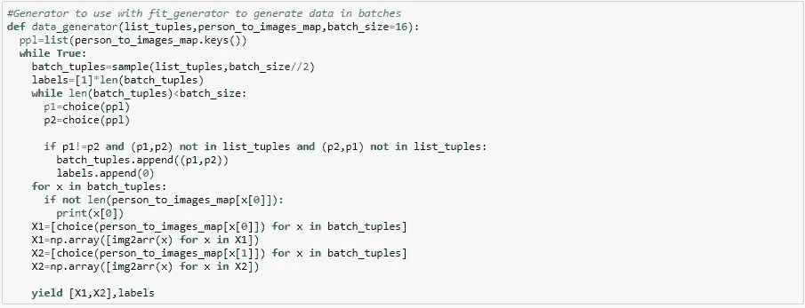

下面的代码是为了建立一个模型。该模型是按照上面所示的体系结构构建的。我们利用函数式 API 进行建模。这两个图像被传递到 VGGFace 模型中。我们移除了 VGGFace 的顶层，这样我们得到的输出就是人脸嵌入。然后，我们使用这些特征的不同组合(x1 -x2)、(x1-x2)、(x1*x2)。这些被连接并通过 relu 激活传递到密集层，然后传递到 softmax 层。

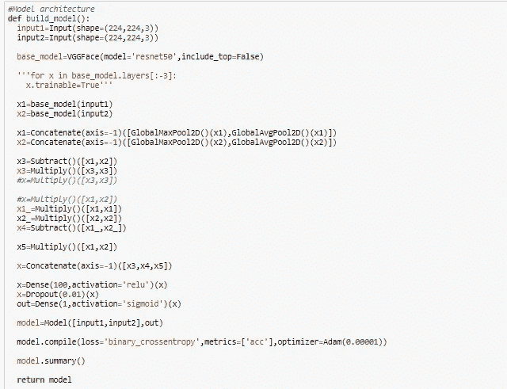

我们使用二进制交叉熵损失进行最小化和 Adam 优化。

在训练时使用回调*模型检查点*和 *ReduceLROnPlateau* 。只有当验证精度与前一个历元相比有所提高时，模型检查点才会在每个历元后保存模型。当验证精度在相当长的时期内没有提高时，ReduceLROnPlateau 将降低学习率。

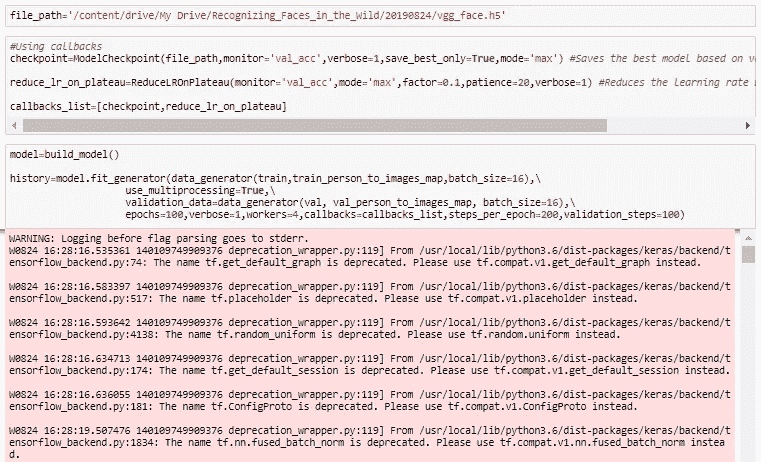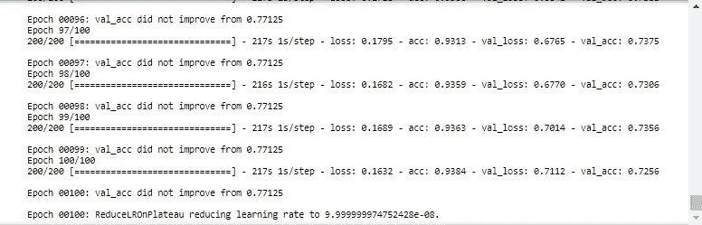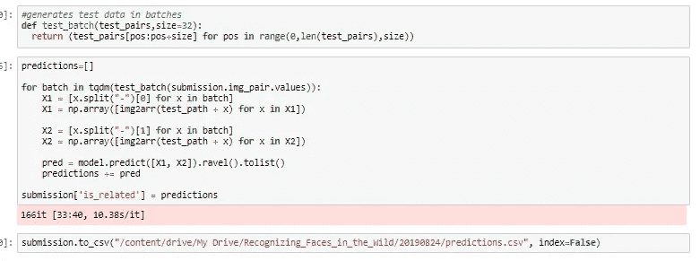

然后，我们读取生成示例提交 csv 文件中给出的图像对，以进行测试，如上面的代码所示。

为了做出更好的预测，我们可以为不同的验证集训练模型，然后取所有模型预测的平均值。

GitHub 链接:

[https://github . com/bhargavasatyamani/ka ggle-competitions/blob/master/recogniting % 20 faces % 20 in % 20 th % 20 wild . ipynb](https://github.com/bhargavasatyamani/kaggle-competitions/blob/master/Recognizing%20faces%20in%20th%20wild.ipynb)