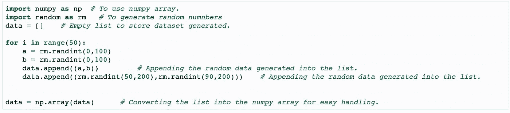
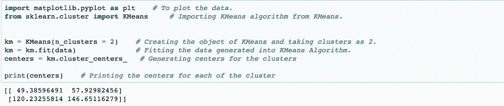
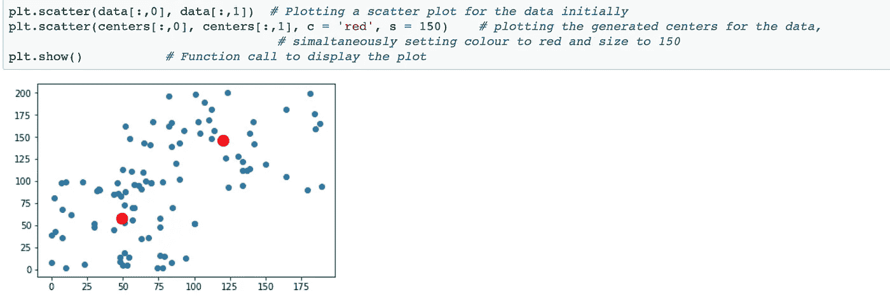

# KMeans 算法

> 原文：<https://medium.com/analytics-vidhya/kmeans-algorithm-8fdde54b0fa9?source=collection_archive---------15----------------------->

机器学习中非常重要的聚类算法！

首先从 KMeans 的基础开始，为了理解 KMEANS，我们需要首先理解什么是 KMeans。单词 K 是指，我们有两个单词 K 和 Means，分别对应于聚类数和它们的平均值。

***算法的目标:*** —通过取每个聚类中存在的所有点的平均值来计算每个给定聚类的中心。

***本算法的步骤:-***

1)首先根据簇的数量随机选择点作为它们的质心。

2)现在，我们必须通过计算该点与各个聚类中存在的所有点的距离，将每个点分配到其最近的聚类。像这样，所有的点将被分配到一个特定的集群。

3)通过取相应聚类中所有点的平均值来找到聚类的新中心，并将该平均值分配给该随机点。所以，从现在起每个随机点将成为每个集群的中心。

4)重复上述 2 个步骤，直到聚类中心的值不再有变化。

***应用:-***

1)在我们必须进行聚类的任何地方使用，

2)欺诈检测，

3) Web 数据聚类，

4)各种动物的各种品种的聚类，

5)居住在特定城市的人的聚集，

***代码使用 scikit-learn: -***

首先，我使用 numpy 为算法创建了一个数据集，其代码如下:

为算法实践创建专门的数据集。

使用 sklearn 实现 k means:-

使用 Sklearn 库实现 KMeans。

算法的输出:-

KMeans 算法的输出。

***希望你喜欢！***