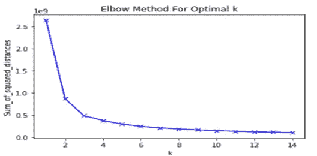

# 掌握 KMeans 聚类基础知识

> 原文：<https://medium.com/analytics-vidhya/kmeans-clustering-basics-96fb7c4279ef?source=collection_archive---------18----------------------->

## 什么是集群？

聚类是机器学习中无监督算法的一部分。与线性回归、逻辑回归等监督算法不同，聚类处理未标记的数据或没有目标变量的数据。

> 聚类的任务是对相似的数据点进行分组。

## 聚类的类型:

聚类属于数据挖掘主题，并且在该领域中有许多研究正在进行，并且存在许多聚类算法。

以下是聚类算法的主要类型。

1.  *K-表示*
2.  *层次聚类*
3.  *DBSCAN*

## 聚类的应用:

以下是集群的一些应用

1.  客户细分:这是销售和营销领域中最重要的集群用例之一。这里的目的是根据一些相似性对人员或客户进行分组，以便他们可以为不同组中的人员提出不同的行动项目。一个例子是，亚马逊根据不同人的购买模式提供不同的优惠。
2.  图像分割:聚类用于图像分割，将相似的图像像素组合在一起。图像中不同对象的像素被分组在一起。

3.预处理步骤:有监督的机器学习算法比无监督的算法更健壮，更容易解释，但是除非你已经标记了数据，否则你不能使用有监督的算法。在这种情况下，聚类被用作预处理步骤，其中聚类被用于将未标记的数据分组，然后将标记分配给它，然后该数据可以用于监督算法。

## k-表示:

K- means 也叫劳氏算法。

K-中的步骤表示:

1.  随机初始化 k 形心。
2.  将每个点指定给其最近的质心。
3.  重新计算所有 k 个质心
4.  重复步骤 2 和 3，直到质心不变。

> 质心是群集中心的一个点。

## 距离函数:

在第二步，每个点被指定为最近的质心，现在明显的问题是模型如何找出最近的质心？

有许多方法可以计算数据点和质心之间的距离，一些距离函数如下:

*   **类内距离:**同一类内点之间的距离。
*   **簇间距离:**不同簇内点之间的距离

## **如何挑选最佳 K？**

K 是 K 均值算法中的超参数，我们必须在模型开始训练之前提供它。

*   **惯性**:这是每个数据点与其最近质心之间的均方距离。

使用不同的 K 值运行模型，并检查惯量值，惯量值越小，K 值越大。

*   **轮廓尺寸**:

b:簇间距离。
a:类内距离。

*   1≤s≤1:**剪影得分越高，聚类越好。**

## 如何初始化 K？

我们已经看到了如何使用惯性或轮廓分数来选择 K 的最佳值。一旦我们选定了 K 的最佳值，接下来的问题就是如何初始化它？

1.  **随机初始化:**在这种情况下，每个数据点有相等的概率被选为质心。
2.  **K-means++** :在这种情况下，从给定的数据点中随机选择第一个质心，并根据其与其他质心的距离选择下一个质心。数据点离质心的距离越高，被选为下一个质心的概率就越高。

## K 均值的局限性:

1.  如果原始数据中的自然聚类大小不同，效果就不太好。

2.如果原始数据中的自然聚类具有不同的密度，那么它就不会工作得很好。

3.如果原始数据中的自然聚类是非球形的，则效果不太好。

# 分层聚类:

K-means 算法的一个主要问题是，我们必须在训练开始之前向模型提供 K 的值。为了克服这个问题，使用了分层聚类。

## K 模式和 K 原型:

K-means 算法仅适用于数值数据。如果你只有分类数据，那么使用 **K 模式**算法。如果你有分类数据和数字数据，那么使用 **k-prototype** 算法。

感谢您的宝贵时间。如果你觉得这很有用，请点赞并评论。

*快乐阅读！*