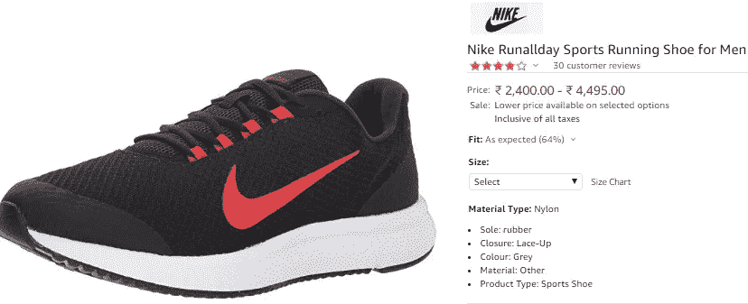
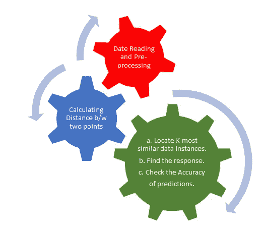
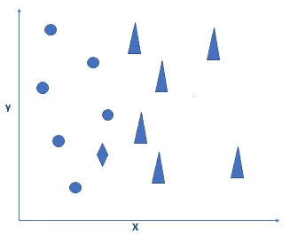
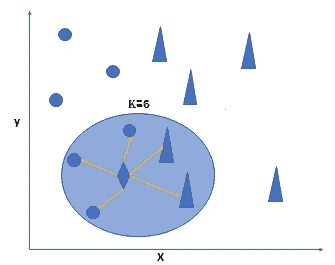
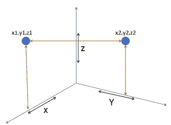
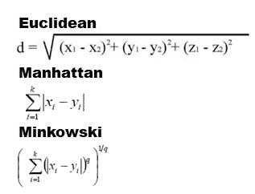
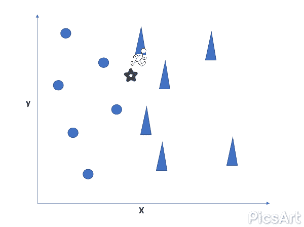
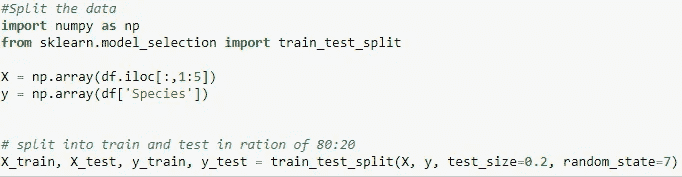
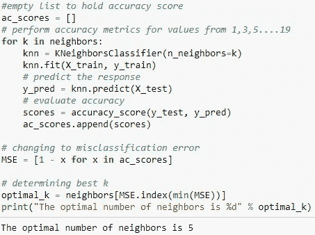
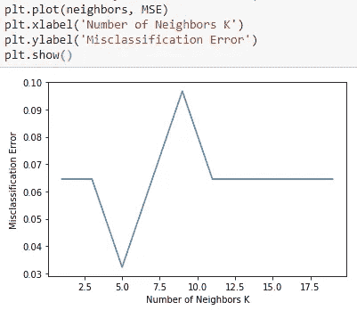

# KNearestNeighbor 算法

> 原文：<https://medium.com/analytics-vidhya/knearestneighbor-algorithm-8fb57b877b5d?source=collection_archive---------6----------------------->

k 近邻算法是机器学习中用于分类和回归问题的算法之一。KNN 算法使用现有数据，并根据现有数据点的相似性和特征对新数据点进行分类。

KNN 算法的用途之一是在“搜索”。当你在网上购物时，你会发现，当你在你的商品展示的同一页面上看到相似的选项时。也就是说，你的任务是某种形式的“寻找与此相似的物品”。
你会称这为 **KNN** 搜索。

**KNN** 属于监督学习领域，在模式识别、数据挖掘和入侵检测中有着广泛的应用。

> KNN 是一个非参数的，懒惰的学习算法。它的目的是使用一个数据库，其中的数据点被分为几类，以预测一个新的样本点的分类。

1.  KNN 算法建立模型的第一步是在生成训练和测试数据之前处理数据并对其进行预处理。
2.  选择 **k** 非常关键——k 值小意味着噪声对结果的影响更大。较大的值会导致计算开销很大，并且违背了 KNN 背后的基本原理(相邻的点可能具有相似的密度或类)。

选择 k 的一种简单方法是设置 k = n^(1/2).

这在很大程度上取决于你的个人情况，有时最好是浏览一下 k 的每个可能值，然后自己决定。”

当我们将数据记录绘制到数学空间中时，基于分类，我们将得到如图所示的数据。在这里，圆和三角形是两种不同的记录。

现在使用 KNN，当我们在数学空间中提出一个新的数据点时，它将首先计算已经存在的数据点和在数学空间中引入的新数据点之间的距离，以找到 k 个相似的数据实例。

*为了更好地理解…..*
假设经过观察和处理数据，我们得出 k 值为 6，那么使用 KNN 算法这个新的数据点将会找到 6 个最近或最短的数据点。

菱形是新的数据点

为了计算数学空间中两个数据点之间的距离，我们有不同的距离计算公式:

一旦我们获得了 k 个最近邻，新的数据点将使用最近邻的类别标签来确定未知记录/数据的类别标签。
这是通过在 k 个最近邻居之间进行**多数投票**来完成的。

在这里。gif 动画中，我们将 k 值设为 3，在找到新数据点的最近邻居后，新记录将倾向于基于多数投票转移到三角形类，因为三角形数据记录更多地出现在 k 最近半径中。

KNN 被称为**懒惰算法**，因为它不从训练数据中学习判别函数，而是“记忆”训练数据集。

例如，逻辑回归算法在训练期间学习其模型权重(参数)。相比之下，K-NN 没有训练时间。虽然这听起来非常方便，但是这种属性不是没有代价的:K-NN 中的“预测”步骤相对来说是很昂贵的！每次我们想要做一个预测，K-NN 在整个训练集中搜索最近的邻居！

**姑且代号:**
*【KNN】属于监督学习算法家族。非正式地说，这意味着我们给定了一个由训练观察值(X，Y)组成的带标签的数据集，并且想要捕捉 X 和 Y 之间的关系。更正式地说，我们的目标是学习一个函数 h:X→Y，以便给定一个看不见的观察值 X，h(x)可以自信地预测相应的输出 Y。"*

*   首先，我们需要获得数据读取、数据预处理和数据可视化所需的所有必要的库。
*   现在，数据已准备好用于构建机器学习模型，让我们现在将数据分为训练数据和测试数据。

*   用不同的 k 值建立模型，检验最佳的最优值。
*   检查交叉验证的错误分类误差 vs k。

## 在这里找到 Python 代码

谢谢大家！
保持支持