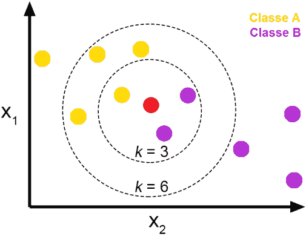
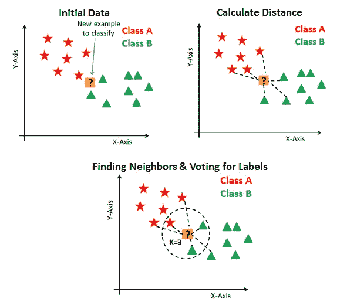
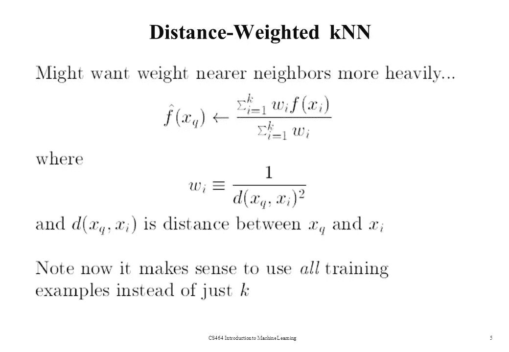
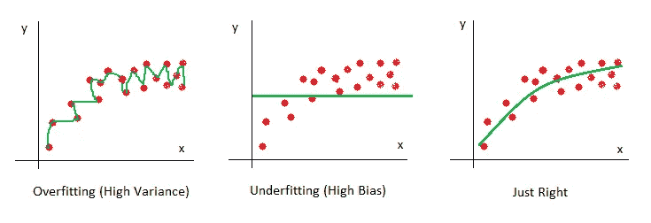

# KNN(K _ 最近邻)

> 原文：<https://medium.com/analytics-vidhya/knn-k-nearest-neighbors-1add1b5d6eb2?source=collection_archive---------10----------------------->

KNN 是一种受监督的机器学习算法(已标记的数据集),用于二元以及多类分类问题，尤其是在经济预测、数据压缩和遗传学领域。

KNN 的简单类比

## 目录:

1.  KNN 的先决条件
2.  直觉
3.  KNN 分类器如何工作？
4.  加权 KNN
5.  偏差—方差权衡
6.  时间和空间复杂性
7.  KNN 概述

## 1.KNN 的先决条件:

由于 KNN 算法是在已知邻居的情况下完美工作的算法，因此它借助于距离矩阵(欧几里德距离、曼哈顿距离)或相似性矩阵(余弦相似性)。

为了深入和完善地了解它的工作，我们应该知道上面提到的距离或相似性矩阵是如何计算的。

## 2.直觉:

假设我们想要预测查询点的类别标签(下图中显示的红色星号)

**案例一:**

如果我们认为 KNN 的 k 值是 3，如上面的圆圈所示，则查询点属于 B 类，因为 B 类数据点更多地位于 k(3)个邻居中

**案例二:**

以与上述相同的方式，如果 k 的值是 6(6 个邻居),则认为查询点属于 A 类，因为 k 个邻居中的大多数属于 A 类

## 3.KNN 分类器如何工作？

KNN 中的查询点根据所选 K 值(最近邻)中的多数投票被分类到其所属的类别。如前所述，从使用的距离矩阵中已知邻居，主要使用欧几里得距离，也称为 L2 范数。因此，尽管没有给出数据点，而是给出了相似性矩阵或距离矩阵，但我们可以使 KNN 工作。

**现在有趣的问题来了，我们如何选择 K 的正确值？？？**

为了使 KNN 完美地工作，这是需要知道的最重要的事情，也就是说，如果我们直观地观察上述情况，我们可以观察到当 k=3 时查询点属于 B 类，当 k=6 时属于 A 类。那么我们怎么能说它属于一个特定的类主要取决于正确的 K 值。现在让我们看看如何确定 k 的正确值。

基本上，我们会将数据集分为训练数据集和测试数据集，但为了确定 K 的正确值，我们会将数据集分为训练数据集、交叉验证数据集和测试数据集(最好分别为 60%、20%、20%)。在使用训练数据集训练模型之后，我们将使用交叉验证数据集，以便使用不同的 K 值来测试模型，并且针对每个 K 值获得交叉验证准确性，并且正确的 K 值是具有最高准确性的值。

**KNN 算法中要遵循的步骤有:**

1)将数据集分成训练、交叉验证和测试数据集。

2)选择要使用的距离度量。

3)使用训练数据集建立模型

4)使用交叉验证数据集准确性来确定 K 的正确值。

5)对于给定的查询点，计算距所有数据点的距离，并按升序对它们进行排序，并应用所获得的 K 值，即 K 个最近邻。

6)基于其 k 个邻居的多数投票将查询点分配给该类。

## 4.加权 KNN:

这只是对我们上面讨论的 KNN 算法的一点更新。

在上面讨论的算法中，我们基于 k 个最近邻居中的多数投票来标记查询点，这在某些情况下存在一个小问题。我们举个例子，了解一下问题是什么。假设 k=5，并且在 5 个最近的邻居中，有 2 个 A 类点非常靠近查询点，比如分别相距 0.1 和 0.2，以及 3 个 B 类点，相距 0.5、0.9、1.2。

现在，根据上面解释的 KNN 算法，查询点属于 B 类，因为大多数(5 个中的 3 个)点属于 B 类。但是根据加权 KNN，查询点属于 a 类。让我们深入研究它的主题，看看它是如何说查询点属于 a 类的

由于我们知道所有 k 个邻居与查询点的距离，现在我们计算权重，以便使用我们所拥有的距离来说明它属于哪个类。属于 A 类的权重为((1/0.1)+(1/0.2))=15，属于 B 类的权重为((1/0.5)+(1/0.9)+(1/1.2))=3.944。通过分别取 A 类和 B 类的距离的倒数之和来获得权重。当 A 类权重大于 B 类时，根据加权 KNN，查询点属于 A 类。

当 K 的值是偶数并且两个类数据点在最近邻中相等时，主要使用加权 KNN，即，如果 K=6 并且 A 类点是 3，B 类点是 3，则在这里使用两个类中的任何一个加权 KNN 而不是标记查询点，这有利于决定它所属的类。

## 5.偏差—方差权衡:

**情况一:**如果 K 值很低。

由于 K 的值非常低，它可以将查询点标记为靠近它的点，只考虑小的点，因此有可能出现高方差(也称为过拟合)，在高方差中，训练误差较低，但是测试误差相对较高。

**情况 2:** 如果 K 值非常高，实际上几乎等于数据点的数量。

由于 K 的值非常高，它可以将查询点大部分标记为在给定数据集中占多数的类别标签。因此存在高偏差(也称为欠拟合)的可能性，在高偏差中，训练误差和测试误差都非常高。

**案例 3:** 如果 K 值不高也不低，并且使用交叉验证数据准确性正确获得，那么它是一个没有高偏差和方差的良好平衡。

## 6.时间和空间复杂性:

**训练阶段:**在训练阶段，因为我们需要存储所有的数据点。

空间复杂度将是 O(n*d ),其中 n 表示数据点的数量，d 表示确定每个数据点的特征的数量。

计算具有 d 个特征的 n 个数据点所需的时间将是 O(n*d)。

**测试阶段:**测试阶段或运行时间复杂度为 O(n*k*d)，其中 k 代表需要考虑的最近邻的数量。

## 7.KNN 概述:

今天我们学习了 KNN 模型，它主要有三个步骤

1.  计算距离(例如欧几里德距离、汉明距离等。)
2.  查找 k 个最近的邻居
3.  为标签投票或计算平均值(在回归的情况下)

很少有人支持和反对 KNN。

**优点:**

*   没有关于数据分布的假设，在实际应用中有用
*   简单的算法来解释和理解
*   它可以用于分类和回归

**缺点:**

*   计算量很大，因为该算法存储了所有的训练数据
*   高内存需求，同样，它存储所有的训练数据
*   预测阶段可能较慢(N 较大)。

**注意:**为了降低 KNN 的时间复杂度，做了一些小的修改，其中一些是 LSH(位置敏感散列)、K '-折叠交叉验证、Kd 树算法，只是为了更深入的理解而检查它们。

恭喜你！我们已经学习了第一个分类模型。我希望这篇文章能帮助你理解什么是 K-最近邻算法，以及我们如何基于交叉验证的准确性来选择 K。一如既往，我欢迎问题，笔记，建议等。享受旅程，继续学习！