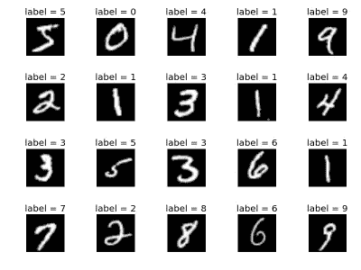
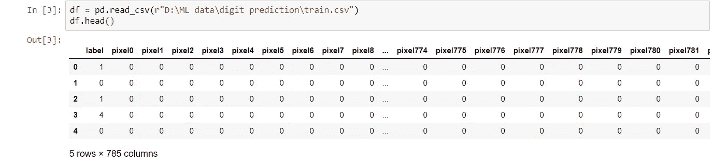
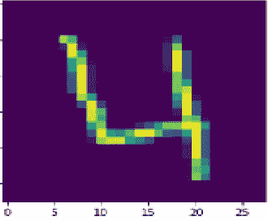
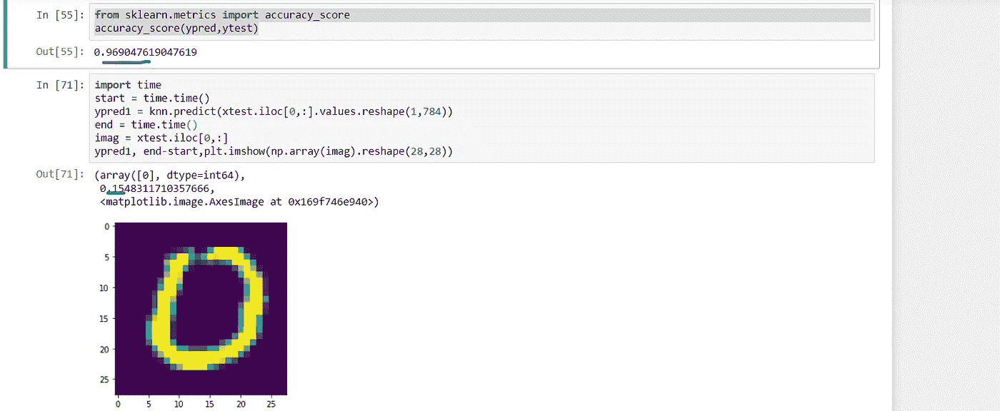

# 手写数字识别的 KNN vs 决策树 vs 随机森林

> 原文：<https://medium.com/analytics-vidhya/knn-vs-decision-tree-vs-random-forest-for-handwritten-digit-recognition-470e864c75bc?source=collection_archive---------4----------------------->



取自 MNIST 数据集的手写数字

在这篇文章中，我试图比较三种机器学习算法的性能，即决策树，随机森林和 k 最近邻算法，用于从著名的 MNIST 数据集中识别手写数字。

开始编码…

导入模块，加载我们的数据集

```
import numpy as np
import pandas as pd
import matplotlib.pyplot as plt
df = pd.read_csv(r"D:\ML data\digit prediction\train.csv")
df.head()
```



这里，每个像素属性指定图像像素的像素强度

```
**#visualising our dataset using matplotlib**
image0 = df.iloc[3,1:]
image0                                                
plt.imshow(np.array(image0).reshape(28,28))
```



创建我们的培训和测试数据

```
x = df.iloc[:,1:]
y = df.iloc[:,0]
from sklearn.model_selection import train_test_split
xtrain , xtest ,ytrain, ytest = train_test_split(x,y,test_size =0.2,shuffle = False,random_state =7)
```

**决策树**🌲

```
from sklearn.tree import DecisionTreeClassifier 
dtree = DecisionTreeClassifier()
dtree.fit(xtrain , ytrain)from sklearn.metrics import confusion_matrix
cmdtree = confusion_matrix(ytest,ypred)
cmdtree ,dtree.score(xtest , ytest)
```


带有准确度分数的混淆矩阵

85 %的准确率！咩！，肯定能做得更好

**随机森林**🌴🌳🌳🌳

使用随机森林算法，我们可以肯定地期望精确度的增加，因为它可以被认为是决策树算法的优化版本。

用通俗的语言来说，随机森林算法考虑了我们训练数据的几个具体实例，将它们分成不同的组(在我的例子中是 10 个)，然后对这些组做出决定。

在这些投票中，多数人投票决定最终结果。

```
from sklearn.ensemble import RandomForestClassifier
rforest = RandomForestClassifier()
rforest.fit(xtrain , ytrain)
```

使用 seaborn 库更好地可视化混淆矩阵

```
cmrforest = confusion_matrix(ytest , ypred)
import seaborn as sn
plt.figure(figsize=(10,7))
sn.heatmap(cmrforest ,annot=True , fmt = 'd')
plt.xlabel('Predicted')
plt.ylabel('Truth')
rforest.score(xtest,ytest)
```


更好看的混淆矩阵

是的，准确度如预期的那样显著提高，准确度很高


**KNN ( K 个最近邻居)**

```
from sklearn.neighbors import KNeighborsClassifier
knn = KNeighborsClassifier()
knn.fit(xtrain ,ytrain)
ypred = knn.predict(xtest)
from sklearn.metrics import accuracy_score
accuracy_score(ypred,ytest)
```



因此，准确率再次提高到 96 %，但代价是什么呢？

众所周知，KNN 是一个懒惰的学习者，它会记住数据，因此训练时间为 0。因为它不针对参数或权重进行训练。

它实际上在预测的时候做了所有的工作。其复杂度为 n * m *d，其中 n 是训练数据的大小，m 是测试数据的大小，d 是每次测试要执行的操作的数量。

大约 10 多分钟后，它完成了预测。

**结论**

如上所述，决策树以 85 %的准确率瞬间完成，随机森林以 94 %的准确率用很少的运行时间完成，KNN 以 96 %的准确率用相当多的运行时间完成，并且一直占用资源。

完整的代码请参考我的 github 库[https://github.com/kashish07/](https://github.com/kashish07/)

注意:没有使用神经网络，因为那样会破坏竞争。