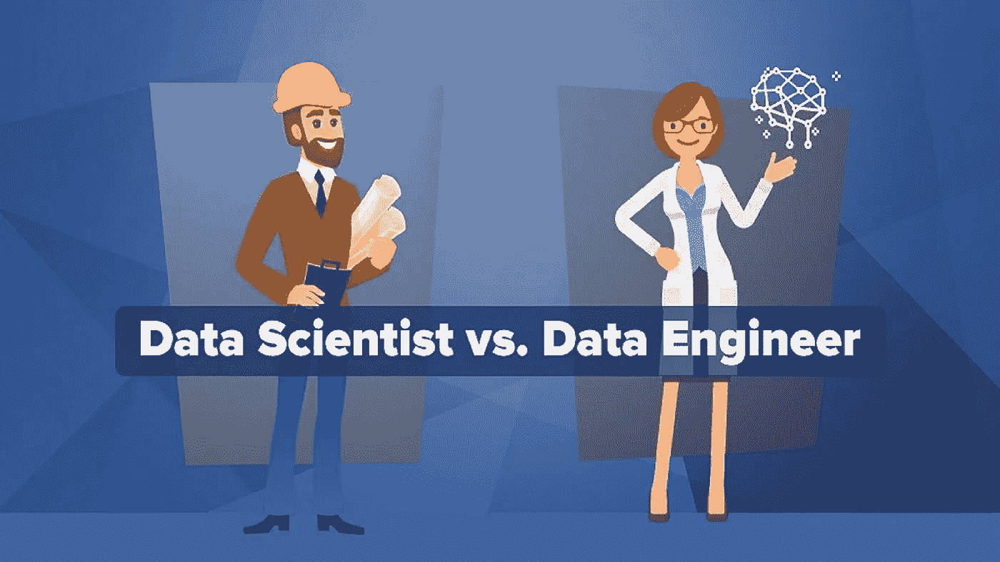
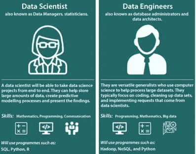
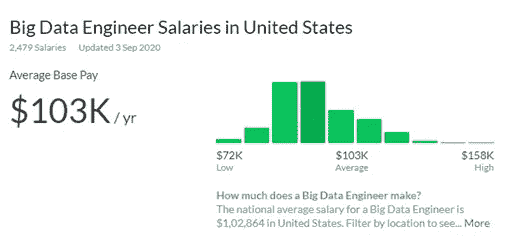
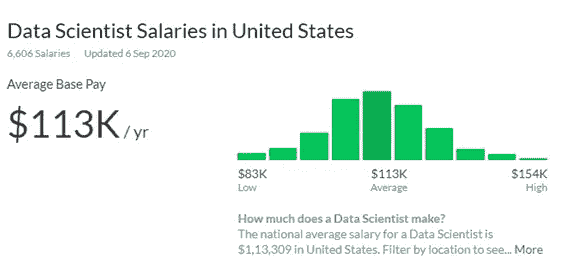

# 知道数据科学家和数据工程师之间的区别

> 原文：<https://medium.com/analytics-vidhya/know-the-difference-between-a-data-scientist-and-a-data-engineer-87194c0d1917?source=collection_archive---------18----------------------->

随着数据成为我们生活中无处不在的力量，大数据领域的工作将前所未有地蓬勃发展。大数据工程师认证和数据科学认证计划为那些希望进入数据领域的人提供了丰富的资源。

# MarketsandMarkets 表示，到 2025 年，全球对大数据分析的需求将增长约 4.5 倍，收入增长将达到 680.9 亿美元。

随着数据以极快的速度增长，组织已经开始意识到数据在全球各行各业的用途和应用。随着大数据向前飞跃，对数据科学家和数据工程师的需求稳步增长。

让我们探索一下🔗 [**数据科学知识**](https://www.dasca.org/about-data-science-council-of-america) 和大数据，看看随着公司期待采用数据科学，其效果如何变得更加突出。

👉 **1.0。** **了解数据科学家和数据工程师的区别**

当一家公司生产一种产品时，他们还需要关于当前市场形势和竞争对手的额外信息，以了解他们的产品如何对他们有价值。即使在全世界收集信息或数据之前，企业也别无选择，只能首先进行产品分析，并利用直觉做出商业决策。

要进入这个市场，你需要能够满足市场期望的熟练专业人士。最重要的是，您还需要能够使用大数据技术的人，这也是数据工程师和数据科学家在每个希望从数据中获得洞察力的组织中扮演重要角色的原因。

# **大数据工程师与数据科学家**

数据工程师处理原始数据，而数据科学家探索数据以找到可行的见解

他们充当后台协调员，而数据科学家仍然是第一线的演示者

负责构建数据管道和基础设施，同时数据科学家利用机器学习、算法和分析

处理大规模数据处理，而数据科学家试图从数据中找出意义

数据工程师监控和管理系统，而数据科学家解释结果

数据工程师收集相关数据，将这些数据转化为管道，为数据科学团队做好准备。

来源:谷歌

大数据工程师à数据管理系统中大数据的出现要求数据工程师使用大数据工具处理和管理数据(数据工程师和大数据工程师并没有太大的区别)。难怪许多数据工程师开始从事🔗 [**大数据工程师认证**](/@taylor.mark110/top-4-data-analytics-certifications-to-enrol-into-in-2020-aaa2e3d0fdff) 计划加速他们在大数据领域的职业生涯。

数据科学家分析数据测试数据汇总数据优化数据将数据以可操作的洞察形式呈现给组织。

👉 **2.0。** **工作职能—大数据工程师和数据科学家**

这两种工作角色在公司中有不同的职能。我们将进一步看到他们能够处理的任务和责任。

# **大数据工程师**

大数据工程师拥有三大职能领域的专业知识——设计、构建和维护管道。

转换来自不同来源的原始数据，以满足功能性和非功能性业务需求。

自动化流程，优化数据交付，并重新设计整个架构以提高性能。

使用 SQL 数据库和大数据框架等技术处理、管理和转换大数据。

构建完整的基础架构是为了进一步接收、转换和存储数据，以供将来进行分析或满足其他业务需求。

# **数据科学家**

分析、测试、创建并呈现数据

以下是大多数数据科学家的做法:

清理和组织数据—60%

收集数据集—19%

挖掘模式数据—9%

改进算法——4%

构建训练集—3%

其他任务—5%

数据工程师和数据科学家都提供独特和不同的工作职能。然而，他们需要一起工作。如果你现在更喜欢向雇主推销你的技能，你可能需要查阅一些🔗 [**最佳数据科学家认证项目在线**](https://www.dasca.org/) 。

👉 **3.0。** **工作前景——工资和报酬**

# 根据 Glassdoor 的数据，2020 年 9 月 3 日更新的数据显示，美国大数据工程师的平均年薪为 1，02864 美元。

# 根据 2020 年 9 月 6 日更新的 Glassdoor 数据，美国的数据科学家年收入约为 1，13309 美元。

你可以做出选择，选择最符合你标准的职业。正如你所看到的，这两种工作都提供了丰厚的薪水。然而，你需要记住的是，薪酬会根据经验、专业知识甚至地理位置而变化。

**结束语**

随着数据成为业务不可或缺的一部分，每个公司都需要能够处理和管理数据的专业人员。如今，雇主寻求在统计和编程语言(如 Python 和 R)方面有深入知识的专业人士担任数据科学职位。考虑到寻找独角兽(大多是高级数据科学家)已经变得具有挑战性。然而，拥有出色编程技能的专业人士仍然可以从初级数据科学家开始他们的职业生涯。大数据工程师和数据科学家在公司中都扮演着不可或缺的角色。那么，今天你更希望成为什么，大数据工程师还是数据科学家？你挑吧。