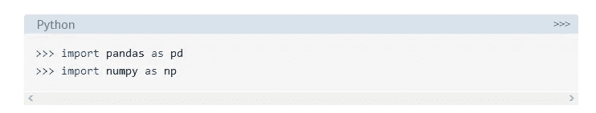

# 了解基础知识—使用 Python 进行数据科学[第 1 部分]

> 原文：<https://medium.com/analytics-vidhya/knowing-basics-data-science-with-python-part-1-5c4a4e8a2713?source=collection_archive---------16----------------------->

非技术人员学习数据科学的方式

我们经常会遇到像数据操作、数据处理和各种技术术语这样的术语。嗯，你可能知道熊猫的功能，但我们真正不知道的是——(我们在某种意义上说，大多数人都喜欢我)有哪些特定的术语。我的一个朋友面试了一家基于顶级技术的初创公司，他们问了他一个基本问题:什么是数据操作，你如何对熊猫进行数据操作？他简单地解释了什么是数据操作，以及当他问数据操作有什么功能时。他不知道。猜猜原因是什么——大多数时候，我们学习东西甚至不知道它有什么用。同样的，我们在年级数学课上学习杰克如何带着 500 个苹果。但是我们都知道，没有人会把 500 个苹果拿出来给别人玩。好了，回到这里正在讨论的主题，我们在这一项中——看看有哪些不同的关键词，我们应该知道哪些东西。

我们跳吧！！

**数据角力:**

数据争论包括处理各种格式的数据，如合并、分组、连接等。以便分析或准备好与另一组数据一起使用。简单来说，我们使用 merge、concat、groupby 函数。

**数据操作:**

数据操作用于添加、删除和修改数据库中的数据。例如，使用数据透视表、合并数据帧、排序数据帧是我们在熊猫中使用的数据挖掘功能。我们还可以通过使用 fillna 之类的函数来输入缺失的值，我们可以用它来填充空值。

**数据清洗:**

填充缺失值、删除不需要的列、更改数据框的索引、使用 map 函数清理整个数据集、跳过 csv 文件中不必要的行-一切都属于数据清理。甚至重命名列也包括在数据清理方法中。就像打扫我们的房子一样，在这种情况下，数据正在被清理。

让我们进入函数，了解更多信息:



进口熊猫和熊猫

**在数据帧中丢东西——数据清理**

*   Drop vs Dropna！

下降:

*   drop()函数用于从行或列中删除指定的标签。
*   通过指定标签名和相应的轴，或者通过直接指定索引名或列名来删除行或列。
*   使用多索引时，可以通过指定级别来删除不同级别上的标签。

```
DataFrame.drop(self, labels=None, axis=0, index=None, columns=None, level=None, inplace=False, errors='raise')
```


drop()的参数


这里我用的是 profit1nan 文件。

让我们删除“EmpCnt”列:


这里我们删除了 empcnt 列

**注:此处 df 表示保存的数据帧，标签表示位置，轴表示行或列。轴 0 是行，轴 1 是列。**

dropna:dropna()函数用于删除丢失的值。


dropna()的参数

```
DataFrame.dropna(self, axis=0, how='any', thresh=None, subset=None, inplace=False)
```

我再次使用名为 dfn 的数据帧，并使用 dropna 删除空值列和行。


删除了包含空值的行


删除了包含空值的列

how = 'any' —这意味着我们基于任何空值进行删除。

**改变数据帧的索引:**

使用一个或多个现有列或数组(长度正确)设置 DataFrame 索引(行标签)。该索引可以替换现有索引或对其进行扩展。Pandas `Index`扩展了 NumPy 数组的功能，允许更多的切片和标记。在许多情况下，使用数据的唯一值标识字段作为索引是很有帮助的。通俗地说，它只是将列转换为索引，也就是您指定的列，您可以看到它被转换为索引。


注意 df 中的 name 列


请注意，名称列作为索引进行了更改

因此，通过使用集合索引，我们可以更改项目的索引，这些项目在本质上是唯一的，如名称、id，以确保我们建立正确的索引。

set_index 的语法:`DataFrame.set_index` (self，keys，drop=True，append=False，inplace=False，verify_integrity=False)


参数取自 pandas.org

**清理数据！！！**

我们得到的数据有时相当混乱。为了摆脱混乱的数据，我们需要清理数据——这就像打扫我们的房子一样，但这里我们用熊猫来清理数据。

**重命名列:**

我们可以通过两种方法重命名列。一种是使用创建的字典，并将它直接插入函数中。

**方法** 1:


给定数据框架—收入

在这里，我们使用扩展列标签和扩展行标签作为变量来分配字典。


列，行已重命名。

现在是在函数中应用这些东西的时候了。


重命名的数据框

如您所见，数据框根据 exp 行标签和列标签中提供的给定输入进行了重命名。

方法二:


这里的字典是在函数内部给出的

语法:`DataFrame.rename` (self，mapper=None，index=None，columns=None，axis=None，copy=True，inplace=False，level=None，errors='ignore ')


重命名功能的参数

改变`pandas.DataFrame`的索引/列名(标签)有以下几种方法。

使用`pandas.DataFrame.rename()`

*   使用`dict`单独更改任何索引/列名
*   用函数更改所有索引/列名

添加前缀和后缀

*   使用`pandas.DataFrame.add_prefix()`、`pandas.DataFrame.add_suffix()`
*   向列名添加前缀和后缀

替换所有索引/列

*   更新`pandas.DataFrame`的`index` / `columns`属性
*   替换所有索引/列名

`set_index()`还提供了将现有列设置为索引的方法。详见下面的帖子。

感谢阅读。