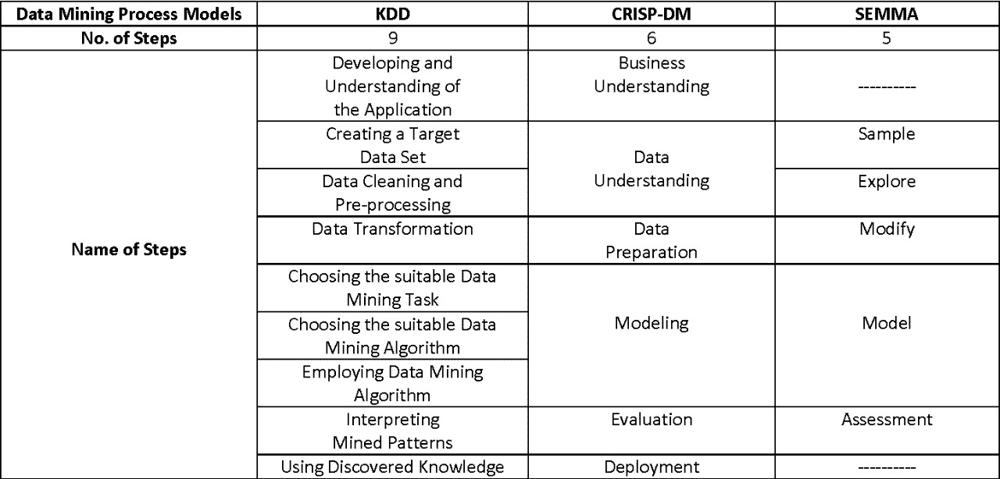
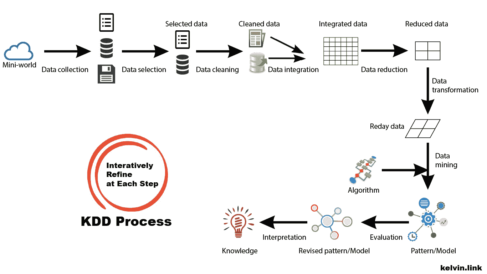
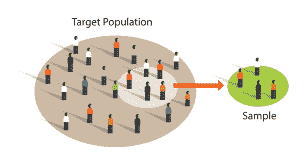

# 知识发现数据(KDD)

> 原文：<https://medium.com/analytics-vidhya/knowledge-discovery-data-kdd-a8b41509bff9?source=collection_archive---------5----------------------->

# 抽象

从数据中发现知识(KDD)；是从大量数据中提取模式或知识的连续过程。通常，我们感兴趣的点是那些不平凡的、隐含的、先前未知的和潜在有用的数据。KDD 的核心是“数据挖掘”，是一种应用不同类型的算法从数据中提取模式的方法。在当今世界，很容易找到拥有数百万条记录的大型数据库；例如，如果我们以病人记录数据库为例，属性可以很快增长到 10，记录可以增长到 10⁹.因此，为了持续分析数据，旧的数据利用方式不再适用；因为数据的增长率是指数级的。归根结底,( KDD)的存在是为了解决数字化转型时代带来的一个问题。

# 背景

那么，为什么是 KDD 呢？KDD 与其他框架如 **CRISP-DM 或 SEMMA** 之间的一个显著区别是，KDD 超越了 IT 应用，并将商业背景应用于搜索。团队由拥有广泛业务领域知识和 It 知识的人组成是非常重要的。下表分别说明了框架步骤之间的显著差异。

# 该过程

查看图 2，我们注意到 KDD 有主流程和子流程。我们从识别和描述它们开始。我们不打算深入研究每个子流程，因为这里的情况并非如此；我们仅仅触及 KDD 框架的不同类型的阶段和子阶段。

1—KDD 会议前—问题识别:

这是 KDD 中非常基本的一步，因为我们正在尝试确定问题陈述。当我们制定目标和结果时，我们总是从客户的角度将它们联系起来。这一步将是着陆区或零步，因为它是所有即将到来的阶段的基石。参与这个过程的人需要从构思到开始直到交付(数据源、转换、呈现)都进行识别。值得注意的是，根据后续步骤中正在进行的更改，可以随时重新访问和修改该流程。

2 —数据选择(提取):

数据选择是识别和选择需要处理的数据集的阶段；我们还识别数据及其类型。当我们深入研究数据时，我们开始提出以下问题:

1.  范围是什么？(这将定义研究的论点)
2.  预期结果是什么？它们应该如何被可视化？
3.  有没有针对数据选择的实践？
4.  我们要考虑定量数据吗？定性数据？两者都有？

*采样:*

有多种取样方法，我们不打算在本文中深入探讨，因为我们只关注 KDD 过程的概述。然而；在“数据选择”过程中，我们尝试使用不同的抽样技术来选择需要为研究选择的数据。

*仪表的选择:*

如果我们要建立在已有历史实践的基础上，我们必须确定以下问题，因为这些问题的答案对于样本的选择至关重要:

*   在之前的练习中，收集数据的过程是怎样的？
*   仪器是否经过测试？已验证？靠谱吗？
*   该工具适合收集本研究所需的所有数据吗？
*   我们是否应该寻找不同类型的工具来收集，或者我们现有的工具是否足够？

*数据清洗*

在确定数据类型和数据集之后，这是数据选择的一部分，我们必须验证它已准备好进行处理。这里的主要问题是我们如何将遥测技术应用于数据？

*   监控错误
*   标准化您的流程
*   验证准确性
*   擦除重复数据
*   分析
*   与团队沟通

*数据还原&投影*

在进行数据归约和投影时，不丢失数据是一个关键要素。在一篇名为“投影损失:无损降维”的文章中有一项研究，它详细描述了什么是投影损失。这里的关键因素是如何在高维空间中建立预测模型。

3 —数据预处理

在 KDD 和 CRISP-DM 框架中，数据预处理也是必不可少的阶段之一，因为我们正在应用 ETL(提取、加载和转换),我们的目标是移除脏的/有噪声的数据，并移除任何离群值以提高数据效率。除了确定处理缺失数据属性以及将数据映射到其相关数据类型的策略之外。根据目标和任务，我们将找到一个有用的特征来表示数据；

我们可能会应用转换，因为每个转换都会产生不同类型的结果。此外，我们使用数学程序来消除冗余数据，称为维数约简技术。

一旦构建了合适的工作数据集，挖掘阶段就可以开始了。

4 —数据挖掘
数据挖掘是使用不同类型的技术(如回归、聚类、序列建模、相关性、直线分析)从大量数据中生成有用信息的过程。数据挖掘包括实例化模型并拟合后者，以及确定从数据中记录的模式。改编后的模型扮演假定知识的角色。数据挖掘技术也被认为是基本方法和原理的综合。但是数据挖掘的核心组件包括以下内容(模型、偏好标准和搜索算法)。

5 —模式解释

数据解释是对模型应用数据挖掘技术收集的结果进行解释的过程，并确保从数据中获得有用的知识。在这个阶段，我们试图评估和解释挖掘出的模式(规则、可靠性等..)相对于第一步中定义的目标。

这一步非常注重所生产的模型的有用性和可理解性。

6 —数据显示

KDD 过程的最后一步是利用发现的知识。在这个阶段，我们准备将获得的知识引入其他系统进行更多的处理和操作。这一步是表示层，通常是在前面的步骤中做了大量工作之后。当我们将 KDD 过程应用于生产数据时，很可能会发生一些变化，例如缺少属性；数据变得动态，数据结构可能改变，数据域可能被修改。这就是为什么这个阶段的成功依赖于前人的成功。

总之，KDD 是一个已经广泛证明其能力的框架；此类领域非常受关注，如医疗保健、欺诈检测。然而，没有展示阶段的成功，整个生命周期就变得毫无用处。这就是为什么如果我们延迟表示层，它很有可能失败的原因，而这样的事情可以用敏捷方法来减轻，在我看来，敏捷方法在 KDD 过程中是可行的。

# 参考资料:

{1} U. Fayyad、G. Piatetsky-Shapiro 和 P. Smyth，“从数据挖掘到数据库中的知识发现”， *AIMag* ，第 17 卷，第 3 期，第 37 页，1996 年 3 月。

{2} Lee，Sun-Mi & Abbott，Patricia。(2003).大型数据集中知识发现的贝叶斯网络:护理研究人员基础。生物医学信息学杂志。36.389–99.10.1016/2003 年 9 月 22 日

{3} Oded Maimon 和 Lior Rokach,《知识发现和数据挖掘简介》,第 1-15 页，Springer US，波士顿，马萨诸塞州，2010 年。

{ 4 } .梅纳德、H.P .塞尔克、J.R .贝尚斯基..Griffith、J.L .、Schmid、C.H .、Califf、R.M .、D'Agostino、R.B .、Laks、M.M .、Lee、K.L .、Wagner、G.S .等人(1995 年)。女性被排除在溶栓治疗临床试验之外:发展溶栓预测工具数据库的意义。医学决策:医学决策学会的国际期刊，15(1):38–43。

{ 5 } ICML 2010:第 27 届国际机器学习会议论文集，2010 年 6 月，第 1223-1230 页

{6}乌萨马·法耶兹。格雷戈里·皮亚泰茨基-夏皮罗和帕德拉·史密斯。特里·威德纳。提取有用信息的 KDD 过程。知识来自。大量的数据。

{7} Maimon O .，Rokach L. (2005)数据库知识发现简介。载于:Maimon O .，Rokach L .(编辑)《数据挖掘和知识发现手册》。马萨诸塞州波士顿斯普林格

{ 8 } '[https://kelvin.ink/2018/10/20/DM_Note1/](https://kelvin.ink/2018/10/20/DM_Note1/)'数据挖掘注释 1 数据挖掘基础'