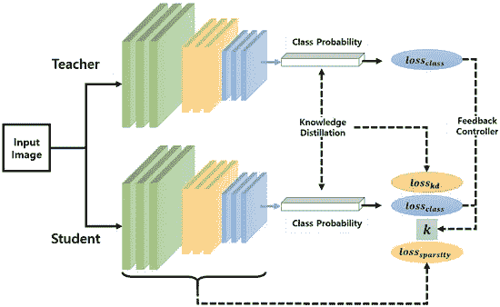
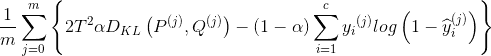

# 卷积网络的知识蒸馏

> 原文：<https://medium.com/analytics-vidhya/knowledge-distillation-for-convolutional-networks-e73682c611e8?source=collection_archive---------6----------------------->


帕特里克·托马索在 [Unsplash](https://unsplash.com?utm_source=medium&utm_medium=referral) 上的照片

## “知识蒸馏”到底是什么？

最近，神经网络被证明是学习各种任务的好方法。然而，这些神经网络越来越深，参数数量增加到数百万甚至数十亿，这将这些网络的使用限制在高计算设备上。随着智能手表、增强现实眼镜和各种其他设备等智能移动设备的兴起，当前的需求是拥有参数数量更少的网络。

知识蒸馏就是这样一种技术，它可以传递像雷斯内特、VGG 等预先训练好的大型模型的知识。到更小的网络。正如*Geoffrey hint on 2015*【1】的论文*在神经网络*中提到的，将知识从教师模型转移到学生模型的一种“显而易见”的方式是通过对学生模型的训练过程使用“软目标”。

## 好吧，我对它的用途深信不疑，但是它到底是怎么做的呢？



师生模式概述[2]

如上图所示，损失函数使用教师和学生的类别概率的 KL 散度以及实际标签的损失。

现在让我们来看看用于知识提炼的损失函数。



损失函数

我们来分析一下。 *m* 是批量大小。 *Dₖₗ* 是 *P* (来自教师网络的“软标签”)和 *Q* (来自学生网络的 softmax 分数)的输出之间的 KL 散度。 *T* 这里是温度软化概率分布；α 是根据数据[1]训练 w.r.t 硬目标时，教师指导的相对重要性。

## 理论讲够了，让我们来看一些代码。

让我们从一些基本的东西开始。导入必要的库

```
import time
import copy
import numpy as np
import pandas as pd
import matplotlib.pyplot as plt
import torch
import torchvision
from torchvision import datasets, transforms
from torchsummary import summary
from torch.optim import lr_scheduler
import torch.nn.functional as F
import torch.nn as nn
import torchvision.models as models
from torch import nn, optim
```

现在让我们导入数据集。我使用的是 CIFAR10 数据集。您可以尝试使用任何数据集进行知识提炼。我将图像大小调整为(224，224)，因为预训练模型 Resnet 是在 ImageNet 上训练的，ImageNet 的图像大小为(224，224)。

```
transform = transforms.Compose([transforms.Resize((224,224)),
                                transforms.ToTensor(),
                                transforms.Normalize([0.485,0.456,  
                                0.406], [0.229, 0.224, 0.225])])trainset = datasets.CIFAR10(‘/content/train/’, download=True, train=True, transform=transform)
valset = datasets.CIFAR10(‘/content/val/’, download=True, train=False, transform=transform)trainloader = torch.utils.data.DataLoader(trainset, batch_size=64, shuffle=True)
valloader = torch.utils.data.DataLoader(valset, batch_size=64, shuffle=True)len_trainset = len(trainset)
len_valset = len(valset)classes = (‘plane’, ‘car’, ‘bird’, ‘cat’,‘deer’, ‘dog’, ‘frog’, ‘horse’, ‘ship’, ‘truck’)device = torch.device(“cuda:0” if torch.cuda.is_available() else “cpu”)
```

作为健全检查的形状的图像和标签

```
dataiter = iter(trainloader)
images, labels = dataiter.next()
print(images.shape)
print(labels.shape)
```

现在，让我们定义教师网络，即 ResNet50，并冻结其内层。

```
resnet = models.resnet50(pretrained=True)
for param in resnet.parameters():
   param.requires_grad = Falsenum_ftrs = resnet.fc.in_features
resnet.fc = nn.Linear(num_ftrs, 10)
resnet = resnet.to(device)
criterion = nn.CrossEntropyLoss()
optimizer = optim.Adam(resnet.fc.parameters())
```

太好了！让我们来训练这个预先训练好的模型。

```
def train_and_evaluate(model, trainloader, valloader, criterion, optimizer, len_trainset, len_valset, num_epochs=25):
   model.train()
   best_model_wts = copy.deepcopy(model.state_dict())
   best_acc = 0.0
   for epoch in range(num_epochs):
      model.train()
      print(‘Epoch {}/{}’.format(epoch, num_epochs — 1))
      print(‘-’ * 10)
      running_loss = 0.0
      running_corrects = 0
      for inputs, labels in trainloader:
         inputs = inputs.to(device)
         labels = labels.to(device)
         optimizer.zero_grad()
         outputs = model(inputs)
         loss = criterion(outputs, labels)
         _, preds = torch.max(outputs, 1)
         loss.backward() 
         optimizer.step()  
         running_loss += loss.item() * inputs.size(0)
         running_corrects += torch.sum(preds == labels.data)
      epoch_loss = running_loss / len_trainset
      epoch_acc = running_corrects.double() / len_trainset
      print(‘ Train Loss: {:.4f} Acc: {:.4f}’.format(epoch_loss,
             epoch_acc)) 

      model.eval()
      running_loss_val = 0.0 
      running_corrects_val = 0
      for inputs, labels in valloader:
         inputs = inputs.to(device)
         labels = labels.to(device)
         outputs = model(inputs) 
         loss = criterion(outputs,labels)
         _, preds = torch.max(outputs, 1)
         running_loss_val += loss.item() * inputs.size(0)
         running_corrects_val += torch.sum(preds == labels.data)

      epoch_loss_val = running_loss_val / len_valset
      epoch_acc_val = running_corrects_val.double() / len_valset

      if epoch_acc_val > best_acc:
         best_acc = epoch_acc_val
         best_model_wts = copy.deepcopy(model.state_dict())

      print(‘ Val Loss: {:.4f} Acc: {:.4f}’.format(epoch_loss_val,
             epoch_acc_val))

      print()
      print(‘Best val Acc: {:4f}’.format(best_acc))
      model.load_state_dict(best_model_wts)return model
```

现在运行该函数来训练 ResNet。

```
resnet_teacher = train_and_evaluate(resnet,trainloader,
                                   valloader,criterion,optimizer_ft,
                                   len_trainset,len_valset,10)
```

太好了！我们的工作已经完成了一半。现在，让我们继续定义我们的学生网络，这将从我们刚刚培训的教师网络中学习。

```
class Net(nn.Module):“””
   This will be your student network that will learn from the 
   teacher network in our case resnet50.
   “””
   def __init__(self):
      super(Net, self).__init__()
      self.layer1 = nn.Sequential(
         nn.Conv2d(3, 64, kernel_size = (3,3), stride = (1,1), 
         padding = (1,1)),
         nn.ReLU(inplace=True),
         nn.Conv2d(64, 64, kernel_size = (3,3), stride = (1,1), 
         padding = (1,1)),
         nn.ReLU(inplace=True),
         nn.MaxPool2d(kernel_size=2, stride=2, padding=0, 
         dilation=1, ceil_mode=False)
      )
      self.layer2 = nn.Sequential(
         nn.Conv2d(64, 128, kernel_size = (3,3), stride = (1,1), 
         padding = (1,1)),
         nn.ReLU(inplace=True),
         nn.Conv2d(128, 128, kernel_size = (3,3), stride = (1,1), 
         padding = (1,1)),
         nn.ReLU(inplace=True),
         nn.MaxPool2d(kernel_size=2, stride=2, padding=0, 
         dilation=1, ceil_mode=False)
      )
      self.pool1 = nn.AdaptiveAvgPool2d(output_size=(1,1))
      self.fc1 = nn.Linear(128, 32)
      self.fc2 = nn.Linear(32, 10)
      self.dropout_rate = 0.5

   def forward(self, x):
      x = self.layer1(x)
      x = self.layer2(x)
      x = self.pool1(x)
      x = x.view(x.size(0), -1)
      x = self.fc1(x)
      x = self.fc2(x)
   return xnet = Net().to(device)
```

再次对网络的输出进行健全性检查。

```
dataiter = iter(trainloader)
images, labels = dataiter.next()
out = net(images.cuda())
print(out.shape)
```

好吧！让我们定义我在开始描述的损失函数和一个辅助函数。

```
def loss_kd(outputs, labels, teacher_outputs, temparature, alpha):
   KD_loss = nn.KLDivLoss()(F.log_softmax(outputs/temparature, 
             dim=1),F.softmax(teacher_outputs/temparature,dim=1)) * 
             (alpha * temparature * temparature) + 
             F.cross_entropy(outputs, labels) * (1\. — alpha)
   return KD_lossdef get_outputs(model, dataloader):
   '''
   Used to get the output of the teacher network
   '''
   outputs = []
   for inputs, labels in dataloader:
      inputs_batch, labels_batch = inputs.cuda(), labels.cuda()
      output_batch = model(inputs_batch).data.cpu().numpy()
      outputs.append(output_batch)
   return outputs
```

现在，进入整个事情的主要训练循环。

```
def train_kd(model,teacher_out, optimizer, loss_kd, dataloader, temparature, alpha):
   model.train()
   running_loss = 0.0
   running_corrects = 0
   for i,(images, labels) in enumerate(dataloader):
      inputs = images.to(device)
      labels = labels.to(device)
      optimizer.zero_grad()
      outputs = model(inputs)
      outputs_teacher = torch.from_numpy(teacher_out[i]).to(device)
      loss = loss_kd(outputs,labels,outputs_teacher,temparature, 
                     alpha)
      _, preds = torch.max(outputs, 1)
      loss.backward()
      optimizer.step()
      running_loss += loss.item() * inputs.size(0)
      running_corrects += torch.sum(preds == labels.data)

   epoch_loss = running_loss / len(trainset)
   epoch_acc = running_corrects.double() / len(trainset)
   print(‘ Train Loss: {:.4f} Acc: {:.4f}’.format(epoch_loss, 
          epoch_acc))def eval_kd(model,teacher_out, optimizer, loss_kd, dataloader, temparature, alpha):
   model.eval()
   running_loss = 0.0
   running_corrects = 0
   for i,(images, labels) in enumerate(dataloader):
      inputs = images.to(device)
      labels = labels.to(device)
      outputs = model(inputs)
      outputs_teacher = torch.from_numpy(teacher_out[i]).cuda()
      loss = loss_kd(outputs,labels,outputs_teacher,temparature, 
                     alpha)
      _, preds = torch.max(outputs, 1)
      running_loss += loss.item() * inputs.size(0)
      running_corrects += torch.sum(preds == labels.data)
   epoch_loss = running_loss / len(valset)
   epoch_acc = running_corrects.double() / len(valset)
   print(‘ Val Loss: {:.4f} Acc: {:.4f}’.format(epoch_loss,
          epoch_acc))
   return epoch_accdef train_and_evaluate_kd(model, teacher_model, optimizer, loss_kd, trainloader, valloader, temparature, alpha, num_epochs=25):
   teacher_model.eval()
   best_model_wts = copy.deepcopy(model.state_dict())
   outputs_teacher_train = get_outputs(teacher_model, trainloader)
   outputs_teacher_val = get_outputs(teacher_model, valloader)
   print(“Teacher’s outputs are computed now starting the training 
         process-”)
   best_acc = 0.0
   for epoch in range(num_epochs):
      print(‘Epoch {}/{}’.format(epoch, num_epochs — 1))
      print(‘-’ * 10)

      # Training the student with the soft labes as the outputs 
      from the teacher and using the loss_kd function

      train_kd(model, outputs_teacher_train, 
               optim.Adam(net.parameters()),loss_kd,trainloader, 
               temparature, alpha)

      # Evaluating the student networkepoch_acc_val = eval_kd(model, outputs_teacher_val, 
                          optim.Adam(net.parameters()), loss_kd, 
                          valloader, temparature, alpha)
      if epoch_acc_val > best_acc:
         best_acc = epoch_acc_val
         best_model_wts = copy.deepcopy(model.state_dict())
         print(‘Best val Acc: {:4f}’.format(best_acc))
         model.load_state_dict(best_model_wts)
   return model
```

瞧啊。！！！你完了。最后要做的就是运行函数来训练你的学生网络。:)

```
stud=train_and_evaluate_kd(net,resnet_teacher,
optim.Adam(net.parameters()),loss_kd,trainloader,valloader,1,0.5,20)
```

PS:我已经把温度设置为 1，alpha 设置为 0.5。这些是你可以调整的超参数。

这篇关于卷积网络的知识蒸馏的文章到此结束。希望您喜欢您刚刚阅读的内容，感谢您的宝贵时间。

✌️

## 参考

辛顿、杰弗里、奥里奥尔·维尼亚尔斯和杰夫·迪恩。"从神经网络中提取知识."arXiv:1503.02531 (2015)。

[2] Cho，Jungchan 和 Lee，Minsik。“使用组稀疏性和知识蒸馏为嵌入式智能传感器系统构建紧凑的卷积神经网络”【https://doi.org/10.3390/s19194307(2019)