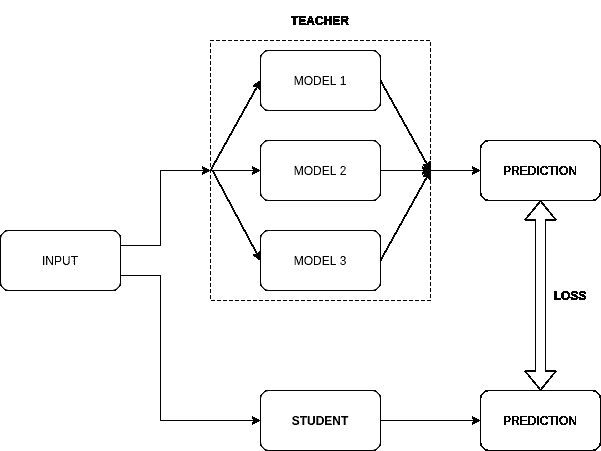
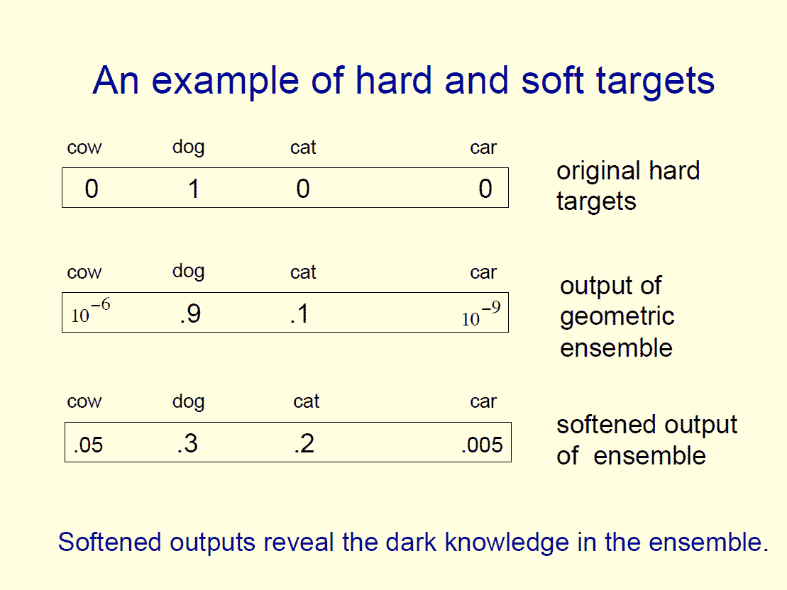
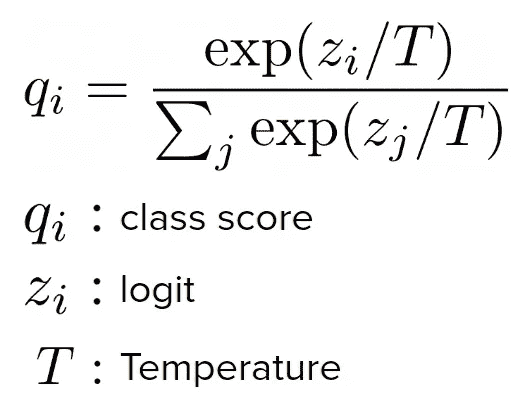
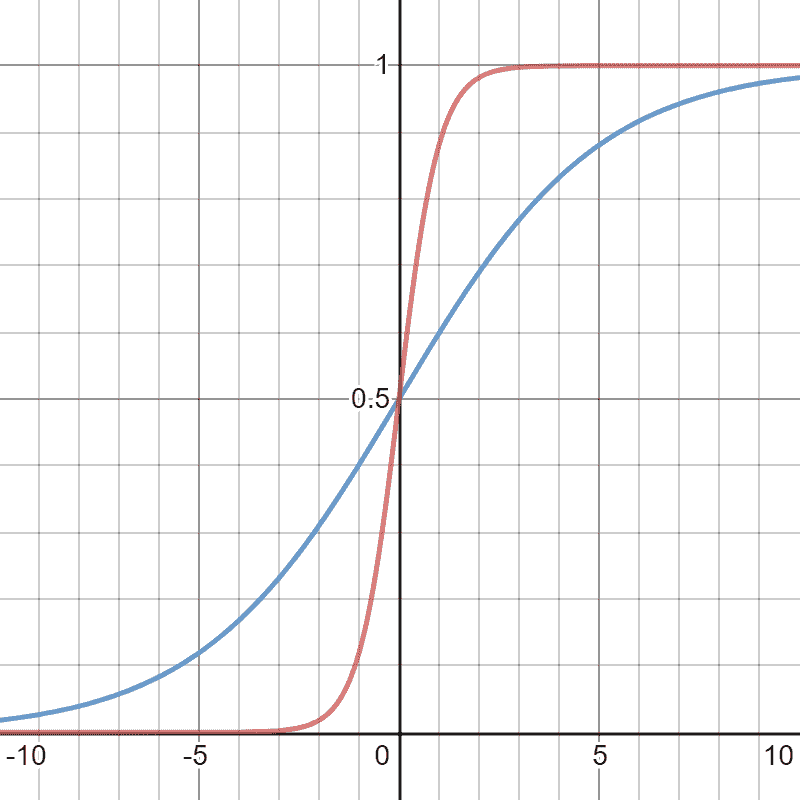
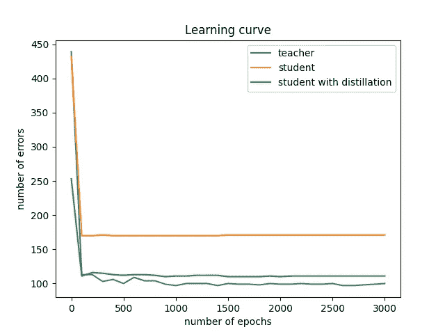

# 用于对象检测的知识蒸馏 1:从简单分类模型开始

> 原文：<https://medium.com/analytics-vidhya/knowledge-distillation-for-object-detection-1-start-from-simple-classification-model-921e1b2bfed2?source=collection_archive---------6----------------------->

知识蒸馏的概念

# 动机

知识蒸馏(KD)是一种通过转移由大型网络(教师)产生的提炼知识来提高小型网络(学生)的准确性的技术。我们也可以说 KD 是为了压缩模型(教师→学生)而损失最小的精度。

本系列的最终目标是将这项技术应用于我的轻量级对象检测模型。在这个故事中，作为第一步，我将实现一个简单的分类模型，并测试 KD 的能力。

关于这个话题的参考论文是这样的: [Hinton 等人。艾尔。“在神经网络中提取知识”。NIPS2014](https://arxiv.org/abs/1503.02531) 。([1])他们介绍了知识提取的基本概念，并表明应用它可以提高分类精度。我将重新实现本文中的实验，并检查它实际上是否工作良好。

# 为分类器提取知识:软目标

在这篇论文中，他们展示了关于“如何概括”的知识可以通过**软目标**从教师转移到学生。与传统的**硬目标**相比，软目标对所有阶层都有评分。

***参考:**[**https://www.ttic.edu/dl/dark14.pdf**](https://www.ttic.edu/dl/dark14.pdf)**(【3】)**

# 软目标损失

为了训练具有软目标的模型，他们用新的 softmax 公式修改了传统的损失函数。

Softmax 随温度变化

在更高的温度(T)设置中，课堂分数变化更平稳，并且将转移更大量的知识。在本文中，他们选择 20 作为温度值。

用于二进制分类的 Softmax，(红色:T=1，蓝色:T=20)

为了训练有软标签和硬标签学生，他们使用了两个损失的加权和。第一个损失是预测和给定硬标签之间的常规交叉熵损失。第二个损失是预测和给定软标签之间的交叉熵损失，softmax 的温度较高。第一次损失的权重是 1，第二次损失的权重是 T(文中解释了原因)。

# 实验:真的提高了准确率吗？

这是这个故事的主要部分。我写了代码来复制论文[1]的结果。你可以找到这个实验的完整代码:[https://github.com/poperson1205/knowledge_distillation](https://github.com/poperson1205/knowledge_distillation)

## 1.实现一个大(老师)和一个小(学生)网络进行分类

*   教师:
    784→ReLU→1200→ReLU→1200→10
    (丢失 20%的输入，两个隐层输出的 80%)
*   学生:
    784 →热卢→ 800 →热卢→ 800 → 10

## 2.使用 MNIST 数据集训练网络(教师和学生独立进行)

基本上，我遵循了本文中描述的训练设置[2](见附录 A)。

培训老师和学生的主要区别如下。

*   教师:抖动输入图像，并约束权重范数为 15.0
*   学生:香草反向传播

## 3.从老师那里提炼知识给学生

正如在这个故事的前面部分所写的，我改变了培训学生网络的损失项，并给出了从教师网络生成的软标签。

## 4.评估网络(教师、学生、学生+蒸馏)

每个网络的错误率如下。

*   老师:100 / 10000 (1.00%)
*   学生:171 / 10000 (1.71%)
*   患有 KD 的学生:111 / 10000 (1.11%)

我们可以看到，通过应用知识发现，学生的错误率显著降低(1.71% → 1.11%)。

# 结论

通过我自己的代码来观察知识升华的结果给我留下了非常深刻的印象。现在我相信真的管用了！…我的下一步将是实现简单的对象检测网络。如果您对此实施有任何疑问，请随时提问:)

你可以在这里得到这个实验的完整代码:[https://github.com/poperson1205/knowledge_distillation](https://github.com/poperson1205/knowledge_distillation)

# 参考

[1]辛顿等人。艾尔。[“在神经网络中提取知识”。NIPS2014。](https://arxiv.org/abs/1503.02531)

[2]辛顿等人。艾尔。“通过防止特征检测器的共同适应来改进神经网络”。[https://arxiv.org/abs/1207.0580](https://arxiv.org/abs/1207.0580)

[3]论文[1]的演示材料:[https://www.ttic.edu/dl/dark14.pdf](https://www.ttic.edu/dl/dark14.pdf)