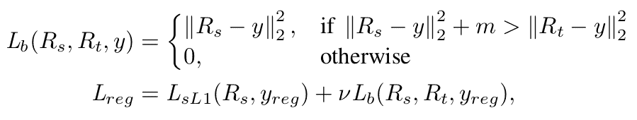

# 对象检测的知识蒸馏 2:(调查)“用知识蒸馏学习有效的对象检测模型”

> 原文：<https://medium.com/analytics-vidhya/knowledge-distillation-for-object-detection-2-survey-learning-efficient-object-detection-a7749971b5ae?source=collection_archive---------13----------------------->

2017 年，陈等人。艾尔。提出了一个用知识提炼训练目标检测网络的框架[1]。他们的工作是有意义的，因为这是第一次成功地演示了多类对象检测问题的知识提取。

# 整体结构

[1] [陈等。艾尔。“用知识蒸馏学习有效的目标检测模型”。NIPS2017](https://papers.nips.cc/paper/6676-learning-efficient-object-detection-models-with-knowledge-distillation.pdf)

在这项工作中，他们采用了更快的 RCNN [2]作为目标检测框架。主要观点如下。

*   加权交叉熵损失
*   带教师界限的回归
*   **具有特征适应的提示学习**

特别是，第三种思想在最近的论文中被广泛用作基本网络结构。

# **学习目标**

总体学习目标

**加权交叉熵损失**

> 知识提炼的常规使用已经被提议用于训练分类网络。学生 *s* 被训练来优化下面的损失函数。[1]

分类损失

然而，与简单的分类问题不同，检测问题需要处理不同类别之间的严重不平衡，因为与目标对象的数据相比，背景数据要多得多。为了解决这个问题，他们建议在损失计算中对背景类使用更大的权重。他们称之为类别加权交叉熵:

类别加权交叉熵损失

在他们的实验中，他们为背景类选择 1.5，为其他类选择 1.0。

## 带教师界限的回归

由于教师的回归输出可以提供非常错误的指导，他们建议使用教师的回归输出作为上限。只有当学生的回归比教师的回归更糟糕时，他们才会给学生增加额外的损失。

教师有界回归损失

**具有特征适应的提示学习**

罗梅罗等人。艾尔。提出了一种新型的知识升华，称为提示学习[2]。在他们的方法中，教师的中间特征图被提供作为提示，以指导学生的特征图。这个损失项可以写成如下形式。

具有特征适应的提示学习(我们可以用 L1 代替 L2 范数)

然而，在许多情况下，教师和学生之间的特征图的形状并不完全相同。为了解决这个问题，陈等人。艾尔。建议插入额外的图层，以将学生特征地图的形状更改为教师特征地图的形状[1]。例如，当特征层是卷积的时，适应层可以是 1x1 卷积以匹配通道的数量。

此外，插入适配层还有另一个优点。他们发现，即使提示层和引导层中的通道数量相同，拥有一个适应层对于实现有效的知识转移也很重要。

# 实验

整体表现如下。我们可以看到，对于所有测试数据集(PASCAL，COCO，KITTI，ILSVRC)，所有学生网络(Tucker，AlexNet，VGGM)的精度都得到了提高。

*参考:陈等。“用知识蒸馏学习有效的目标检测模型”。*神经信息处理系统的进展*。2017.[1]

他们还对架构相同的教师和学生对测试了他们的方法，但教师的输入分辨率更高。下表显示了所有组合的精确度提高。

# 结论

他们提出了一个提取目标检测网络知识的新框架。通过给出教师的中间特征图作为提示来指导学生的特征提取，他们可以证明知识提取不仅适用于分类问题，也适用于对象检测问题。

# 参考

[1]陈等。艾尔。“用知识蒸馏学习有效的目标检测模型”。*神经信息处理系统的进展*。2017.

[2]罗梅罗等人。艾尔。“薄而深的网的提示”。arXiv 预印本 arXiv:1412.6550。2014.