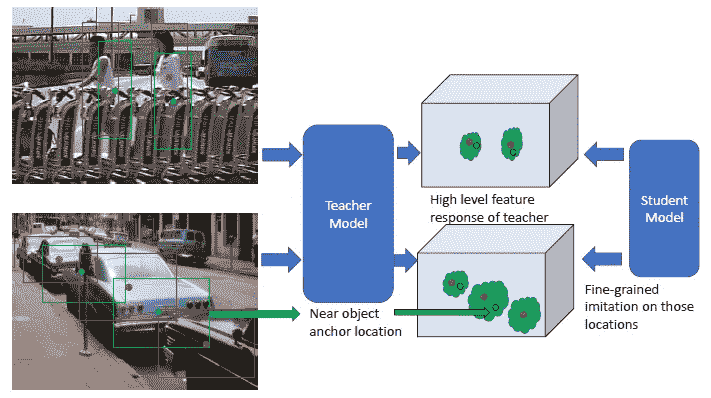
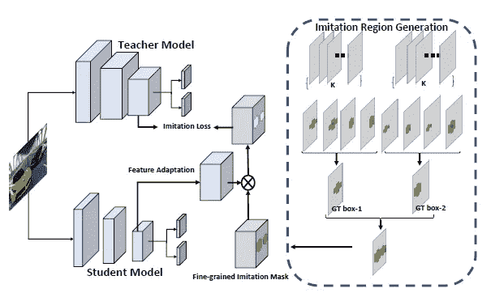
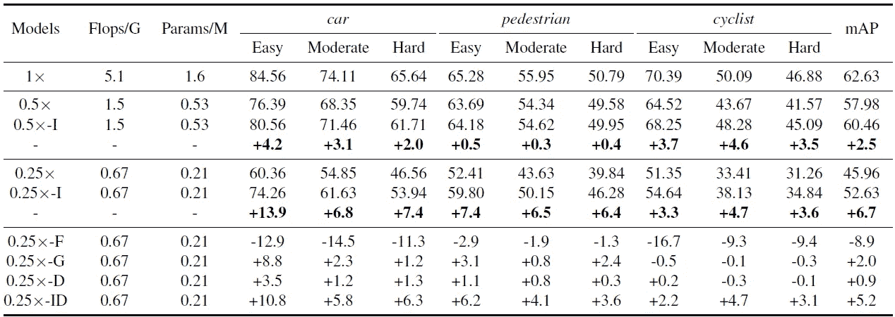
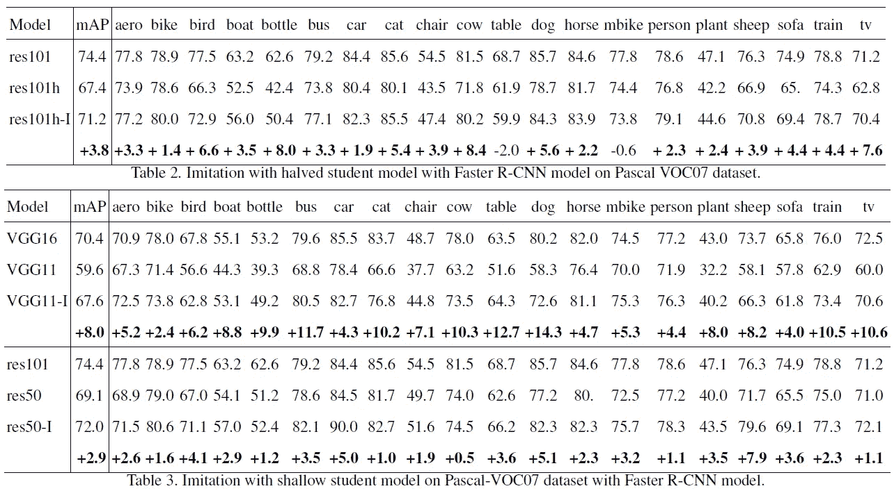

# 对象检测的知识蒸馏 3:(综述)“用细粒度特征模仿提取对象检测器”

> 原文：<https://medium.com/analytics-vidhya/knowledge-distillation-for-object-detection-3-survey-distilling-object-detectors-with-7b9e4f6fbb5e?source=collection_archive---------19----------------------->

这篇论文给人留下了深刻的印象，因为他们用一个非常简单的想法极大地提高了对象检测器的性能。他们没有使用整个特征图区域，而是选择近物区域进行提示学习。让我简单回顾一下这个主要观点，并介绍他们令人印象深刻的实验结果！

# 整体结构

*参考:王等。艾尔。“用细粒度特征模仿提取对象检测器”。 *CVPR* 2019。[1]

这种方法的总体结构非常类似于传统的对象检测器知识提取方法[2]。然而，他们不使用整个引导特征地图(在学生中)，而是仅使用掩蔽区域。

提出的细粒度特征模拟方法的说明[1]

那我们如何生成遮罩呢？对于整个像素中的每个锚框，它们计算 IoU 值，以获得 IoU 图。(此处，IoU 表示两个框之间的交集超过并集。更多细节请参考 fast R-CNN 论文)当有 K 个不同的锚框分配给每个像素，并且特征图由 W×H 像素组成时，IoU 图的形状将是 When。之后，他们找到最大 IoU 值，并将其乘以一个常数(对于该常数，他们使用 0.5)，以获得阈值。为了产生掩模，它们首先过滤掉 IoU 值低于阈值的像素。然后，他们通过整个通道(不同的锚点)和所有地面真相框(在一个输入图像中可以有多个框)合并这些像素。

# 实验

玩具检测器上的模拟结果。I:细粒度模仿(提出方法[1])，F:全特征模仿，G:用地面真值盒做掩膜，D:香草知识提炼

上表显示了他们的实验结果。他们设计了一种基于 shuffle-det 网络的单级玩具检测器。然后他们减少每一层的输出通道数量，得到一个更小的学生模型。0.5x 表示通道数量减少到一半，0.25x 表示变成四分之一。这里，-I 表示他们的细粒度特征模仿，-F 表示常规的全特征模仿。当他们只是为提示学习制作完整区域的特征图时，mAP 显著下降(-8.9%)。另一方面，通过对特征地图应用蒙版，地图显著增加了！(+6.7%)

他们还表明，他们的方法对于更快的 R-CNN 非常有效。他们选择 Resnet101 作为老师，选择它的减半模型作为学生。学生地图在 Pascal-VOC07 数据集上提高了约 4%。当选择 VGG16 作为老师和 VGG11 作为学生时，他们也获得了 8%的地图改进。最后，对于 Resnet101(教师)和 Resnet50(学生)，他们获得了大约 3%的准确性提高。

# 结论

hey 表明，空间注意力对于提取对象检测器的知识非常重要，尽管它们可能是比它们的掩模生成算法更好的提供空间注意力的更复杂的方式。(我计划对此进行更多的调查！)他们还在 github 上上传了自己的代码:[https://github.com/twangnh/Distilling-Object-Detectors](https://github.com/twangnh/Distilling-Object-Detectors)，你可以自己尝试实验。

# 参考

[1]王等.艾尔。“用细粒度特征模仿提取对象检测器”。 *CVPR* 2019。

[2]陈等。艾尔。“用知识蒸馏学习有效的目标检测模型”。*神经信息处理系统的进展*。2017.