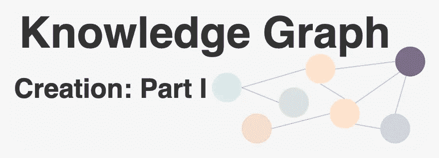
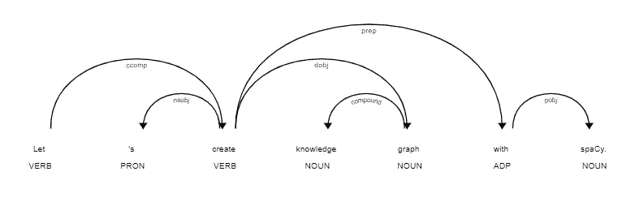

# 知识图创建:第一部分

> 原文：<https://medium.com/analytics-vidhya/knowledge-graph-creation-part-i-27c7c13c2560?source=collection_archive---------6----------------------->

## 如何构造知识图？



在之前的[故事](/analytics-vidhya/knowledge-graphs-an-overview-2d0d250dd3b9?source=friends_link&sk=f15177c03a3f889b829523f4f0f4e7a5)中，我们对知识图做了一个温和的介绍，并获得了一些关于它们的直觉。这篇文章将由两部分组成:在第一部分，我们将做一些自然语言处理，并使用 spaCy 从非结构化数据中提取信息，在第二部分，我们将使用这些信息构建我们的知识图。

## 带有空间的自然语言处理

**自然语言处理(NLP)** 是人工智能的一个子领域，它试图将计算机和人类语言联系起来。 [**spaCy**](https://spacy.io/usage/spacy-101) 是 Python 中 NLP 的免费开源库。它有很多内置功能。因为从非结构化中处理和获得一些见解是很重要的，而 spaCy 通常用于此目的。

> 装置

人们可以使用 Python 包管理器 **pip** 轻松安装 spaCy。

```
$ pip install spacy
```

> 下载模型和数据

spaCy 中有各种不同类型的模型，让我们下载并加载其中一个。我们将把模型存储在一个 **nlp** 对象中，该对象是一个由 *en_core_web_sm 加载的语言模型实例。*

```
$ python -m spacy download en_core_web_sm>>> import spacy
>>> nlp = spacy.load('en_core_web_sm')
```

> 使用空间

让我们使用 spaCy 读取一个文本并存储在一个 **doc** 对象中，该对象是一个用于访问语言注释的容器。

```
>>> doc = nlp("This story is about Natural Language Processing using spaCy and creating knowledge base.")
```

> 标记化

标记化是一个允许我们识别文本中基本单位的过程。让我们提取给定文档的基本单元，即令牌:

```
>>> print ([token.text for token in doc])
['This', 'story', 'is', 'about', 'Natural', 'Language', 'Processing', 'using', 'spaCy', 'and', 'creating', 'knowledge', 'base', '.']
```

> 实体提取

我们还可以进行进一步的分析，比如获取句子的句法结构。**词类**或**词性**是一个语法角色，解释一个特定的单词在句子中是如何使用的。有八种词性:

1.  名词
2.  代词
3.  形容词
4.  动词
5.  副词
6.  介词
7.  结合
8.  感叹词

为了从文本中提取实体，让我们获取 POS 标签。

```
>>>for token in doc: 
...   print(token.text, "-->", token.pos_)This --> DET
story --> NOUN
is --> AUX
about --> ADP
Natural --> PROPN
Language --> PROPN
Processing --> PROPN
using --> VERB
spaCy --> NOUN
and --> CCONJ
creating --> VERB
knowledge --> NOUN
base --> NOUN
. --> PUNCT
```

> 关系抽取

对于各种情况，仅使用 POS 标签是不够的，还需要进一步的分析，如依赖解析。依存句法分析是提取句子的依存句法来表示其语法结构的过程。现在，让我们提取实体之间的依赖关系:

```
>>>for token in doc: 
...    print(token.text, "-->",token.dep_)This --> det
story --> nsubj
is --> ROOT
about --> prep
Natural --> compound
Language --> compound
Processing --> pobj
using --> advcl
spaCy --> dobj
and --> cc
creating --> conj
knowledge --> compound
base --> dobj
. --> punct
```

> 形象化

使用 spaCy 的内置可视化工具 **displaCy** 也可以实现可视化。让我们看看给定文本的位置标签:

```
>>>from spacy import displacy>>>about_interest_text = ('Let\'s create knowledge graph with ...spaCy.')
>>>about_interest_doc = nlp(about_interest_text)
>>>displacy.serve(about_interest_doc, style='dep')
```

您可以通过在浏览器中打开`http://127.0.0.1:5000`来查看可视化效果:



> 句子分割

通常，文本由几个句子组成，句子检测是将文本划分成有语言意义的单元的重要特征。让我们摘录课文中关于阿达·洛芙莱斯的句子:

```
>>>text_ada = ('Ada Lovelace was an English mathematician and' 
            ' writer, chiefly known for her work on'
            ' mechanical general-purpose computer, the'
            ' Analytical Engine. She was the first to'
            ' recognise that the machine had applications'
            ' beyond pure calculation, and published the'
            ' first algorithm intended to be carried out' 
            ' by such a machine. As a result, she is'
            ' sometimes regarded as the first to recognise'
            ' the full potential of a computing machine and'
            ' one of the first computer programmers.')
>>>doc_ada = nlp(text_ada)
>>>sentences = list(doc_ada.sents)
>>>print('Number of sentences: ' + str(len(sentences)))>>>for sentence in sentences:
...    print ('-' + str(sentence))Number of sentences: 3
-Ada Lovelace was an English mathematician and writer, chiefly known for her work on mechanical general-purpose computer, the Analytical Engine.
-She was the first to recognise that the machine had applications beyond pure calculation, and published the first algorithm intended to be carried out by such a machine.
-As a result, she is sometimes regarded as the first to recognise the full potential of a computing machine and one of the first computer programmers.
```

从上面的例子可以看出，spaCy 使用句号(`.`)作为句子分隔符，能够正确地识别英语中的句子。

## 总而言之…

现在，我们知道如何执行一些基本的自然语言处理任务，如标记化和句子分割。此外，我们有足够的知识如何获得实体和实体之间的关系。我们将在这个故事的第二部分使用这些知识，这样，每个实体将被表示为节点，这些实体之间的关系将是我们的知识图中的边。让我们看看如何！敬请期待！