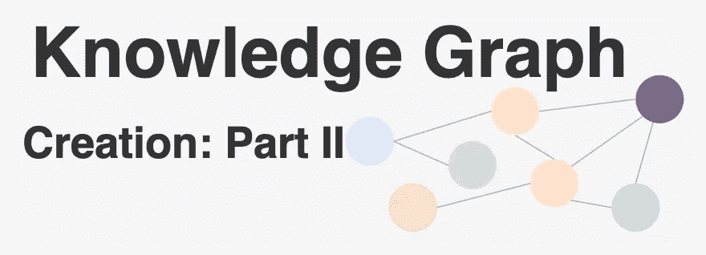
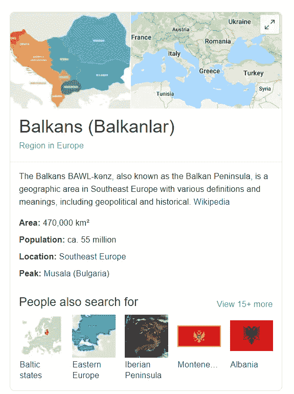
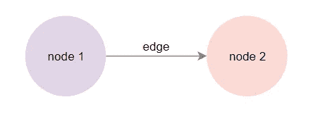
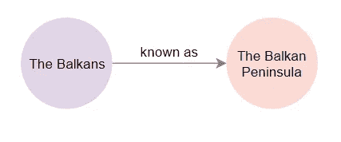
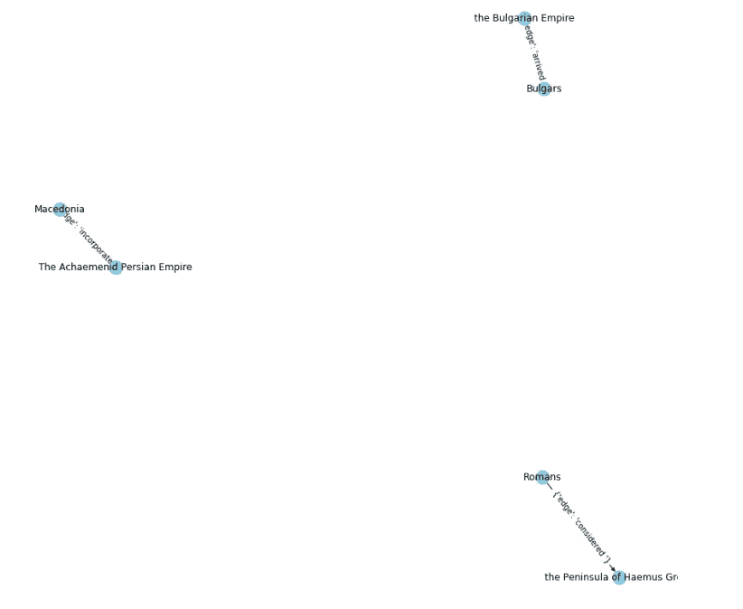

# 知识图创建:第二部分

> 原文：<https://medium.com/analytics-vidhya/knowledge-graph-creation-part-ii-675fa480773a?source=collection_archive---------2----------------------->

## 如何从文本中构造知识图？



从前面的故事中，我们知道了[什么是](/analytics-vidhya/knowledge-graphs-an-overview-2d0d250dd3b9?source=friends_link&sk=f15177c03a3f889b829523f4f0f4e7a5)知识图，并且我们获得了所需的信息，以便[提取信息](/analytics-vidhya/knowledge-graph-creation-part-i-27c7c13c2560?source=friends_link&sk=0f4d7eeab81cb71042c1ba6bd0fb83fc)来创建知识图。在这个故事中，我们将结合这两条信息，创建我们自己的知识图！

## 介绍

即使对地理或历史不感兴趣的人也听说过巴尔干半岛。这里是[维基百科页面](https://www.wikizeroo.org/index.php?q=aHR0cHM6Ly9lbi53aWtpcGVkaWEub3JnL3dpa2kvQmFsa2Fucw):



正如你所看到的，那里有很多信息，不仅有文本形式的，还有超链接和图片形式的。

大多数信息对巴尔干半岛的研究都是相关和有用的。然而，我们不能在程序中直接使用这个数据源。为了使这些数据对我们的机器可读，也可以被我们解释，我们将把它转换成知识图！

在开始构建我们的知识图表之前，让我们看看如何在这些图表中嵌入信息。在大多数图中，我们将实体表示为节点以及它们之间的连接，即边。



如果我们直接将巴尔干半岛维基百科页面中的第一句话*“巴尔干半岛”，映射到我们的图表中，我们会得到下面这个简单的图表:*



这个例子是我们手工制作的，但是手工构建一个完整的知识图是不可行的，也是不可扩展的，因此我们需要用机器来提取实体和关系！然而，挑战来了:**机器无法解读自然语言**。为了让我们的机器理解我们的文本，我们将利用自然语言处理技术，即 NLP，如句子分割、依存分析、词性标注和实体识别。我们已经在前面的故事中讨论并体验了这些技术。让我们在这里使用这些！

## 知识图创建

知识图由基于连接实体的关系的事实组成。事实的形式是三元组，主-宾-谓。比如说；

> "巴尔干半岛被称为巴尔干半岛."

作为三元组，上述事实可以表示为 *isKnownAs(* 巴尔干半岛*，*巴尔干半岛 *)* 其中，

*   主题:*巴尔干半岛*
*   谓词: *isKnownAs*
*   对象:*巴尔干半岛。*

从文本中提取三元组有几种可能的方法。用户可以为特定的数据源创建自己的规则集。在这个故事中，我们将使用一个已经存在的库， [Krzysiekfonal](https://github.com/krzysiekfonal/textpipeliner) 的 textpipeliner，它是为高级文本挖掘而创建的。让我们从使用[空间](https://spacy.io/)创建一个[文本](https://www.wikizeroo.org/index.php?q=aHR0cHM6Ly9lbi53aWtpcGVkaWEub3JnL3dpa2kvQmFsa2Fucw)开始:

```
import spacynlp = spacy.load('en_core_web_sm')
doc = nlp(u"The Balkans, also known as the Balkan Peninsula, \
            is a geographic area in Southeast Europe with \                                                                                           
            various definitions and meanings, including \ 
            geopolitical and historical. The region takes its name \ 
            from the Balkan Mountains that stretch throughout the \ 
            whole of Bulgaria from the Serbian–Bulgarian border \ 
            to the Black Sea coast..."
```

现在我们可以在 *textpipeliner* 中使用 spaCy 生成的这些句子，它提供了一种从非结构化文本中以结构化元组的形式提取句子部分的简单方法。 *textpipeliner* 提供 2 个主要部分:管道和管道引擎。从管道中，您可以创建一个结构，用于从文档的每个句子中提取部分。引擎将使用这种管道结构，并对所提供的文档中的每个句子应用它的处理，并返回提取的元组列表。

```
pipes_structure = [
              SequencePipe([
                 FindTokensPipe("VERB/nsubj/*"),
                 NamedEntityFilterPipe(),
                 NamedEntityExtractorPipe()]),
                 FindTokensPipe("VERB"),

              AnyPipe([
                 SequencePipe([FindTokensPipe("VBD/dobj/NNP"),     
                    AggregatePipe([NamedEntityFilterPipe("GPE"), 
                    NamedEntityFilterPipe("PERSON")]),
                    NamedEntityExtractorPipe()]),                          

                 SequencePipe([FindTokensPipe("VBD/**/*/pobj/NNP"),                                         
                    AggregatePipe([NamedEntityFilterPipe("LOC"), 
                    NamedEntityFilterPipe("PERSON")]),
                    NamedEntityExtractorPipe()])])]
engine = PipelineEngine(pipes_structure, Context(doc), [0, 1, 2]) process = engine.process()
```

提取的元组是:

```
[([The, Achaemenid, Persian, Empire], [incorporated], [Macedonia]),
 ([Romans], [considered], [[the, Peninsula, of, Haemus], [Greek]]),
 ([Bulgars], [arrived], [the, Bulgarian, Empire])]
```

我们可以根据[空间](https://spacy.io/api/annotation#named-entities%20entity%20types)中列出的实体类型改变参数。让我们使用这些提取的元组来创建我们的知识图。为此，首先，我们需要确定什么是源节点、目标节点和关系。使用简单的 python 操作，您可以直接获得以下列表并将它们存储到数据帧中:

```
source = ['The Achaemenid Persian Empire', 'Romans', 'Bulgars'] target = ['Macedonia', 'the Peninsula of Haemus Greek', 'the Bulgarian Empire']
edge = ['incorporated ', 'considered ', 'arrived ']kg_df = pd.DataFrame({'source':source, 'target':target, 'edge':edge})
```

提取列表并创建数据框架后，我们可以使用 [NetworkX](https://networkx.github.io/) 包中的数据框架来绘制我们的知识图:

```
G=nx.from_pandas_edgelist(kg_df, "source", "target", edge_attr=True, create_using=nx.MultiDiGraph())plt.figure(figsize=(12,12))
pos = nx.spring_layout(G)nx.draw(G, with_labels=True, node_color='skyblue', edge_cmap=plt.cm.Blues, pos = pos)nx.draw_networkx_edge_labels(G, pos=pos)
plt.show()
```

最后，我们可以看到最终的图表:



这里，我们得到的图非常小，因为我们只使用了一种类型的管道，它只考虑了 location 和 people 类型的命名实体。如果您丰富您的管道以及原始文本，您将获得一个更大的图形，其中您还可以执行推理！

## 总而言之…

在这一系列故事中，我们学习了如何使用 NLP 技术从给定文本中提取三元组形式的信息，然后从中构建知识图。尽管我们只使用了一个小的数据集并创建了一个非常有限的知识图，但是我们能够利用我们当前的经验来构建非常丰富的知识图。**知识图**是数据科学中最迷人的概念之一。我鼓励你更多地探索这个信息提取领域。

## 参考

*   [巴尔干维基百科](https://www.wikizeroo.org/index.php?q=aHR0cHM6Ly9lbi53aWtpcGVkaWEub3JnL3dpa2kvQmFsa2Fucw)
*   [textpipeliner](https://github.com/krzysiekfonal/textpipeliner)
*   [空间](https://spacy.io/)
*   [网络 X](https://networkx.github.io/)