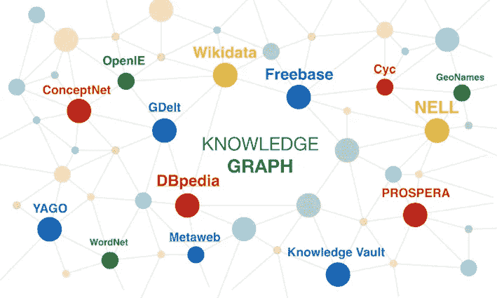
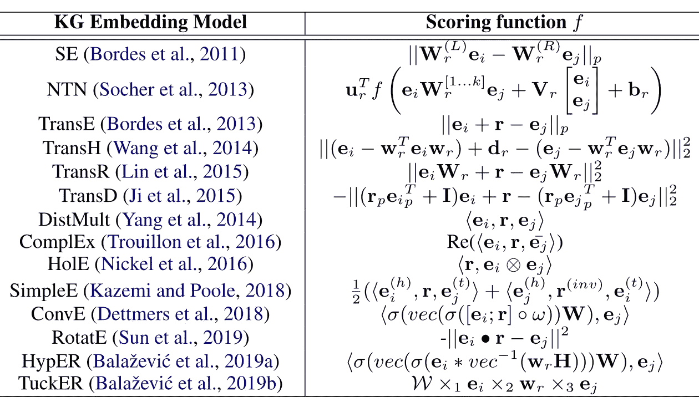

# 知识图表示及其在人工智能中的应用

> 原文：<https://medium.com/analytics-vidhya/knowledge-graph-representation-and-applications-in-artificial-intelligence-333099d7f1dd?source=collection_archive---------18----------------------->

# 什么是知识图？

一个**知识图(KG)** 是一个以图形结构表示的知识库。知识图通常用于存储世界知识和实体之间的关系，这些实体可以是现实世界中的对象、事件或概念。kg 通常被形式化为一组三元组“ *(h，r，t)* ”，其中“ *h* ”和“ *t* ”是头尾实体，“ *r* ”展示了。研究者推出了很多流行的 kg，比如[*WordNet*](https://wordnet.princeton.edu/)[*DBpedia*](http://dbpedia.org/)[*Freebase*](http://citeseerx.ist.psu.edu/viewdoc/download?doi=10.1.1.538.7139&rep=rep1&type=pdf)*。WordNet* 提供了单词之间语义关系的信息(同义词、下义词等。)， *DBpedia* 包含来自维基百科页面的事实信息， *Freebase* 是由各种公共数据集构建的大规模 KG，包含一般知识事实。

流行的 KGs。取自 [glass.ai](https://www.glass.ai/glass-news/2020/4/13/building-the-business-knowledge-graph-machine-reading-comprehension-at-web-scale) 。

研究人员还提出了 KGs 的其他变体。例如，*知识超图*是在任意数量的实体之间发生关系的超图，而*不确定知识图*提供了每个关系事实的置信度得分，通常由众包构建。

# KGs 在 AI 中有哪些应用？

KGs 在人工智能的几个领域有不同的应用，包括问题回答、自然语言处理、推荐系统等。我们在这个故事中引用了一些流行的。

知识图可能是不完整的，因为存储和限定世界上所有的事实是困难的。为此，出现了一些关于**知识图补全**的研究性学习，旨在基于给定的【不完全】KG 发现新的事实。**链接/关系预测**也是另一个流行的任务，它预测输入三元组在 KG 中是有效链接的概率。**实体对齐**是另一项任务，它将不同 kg(可能是不同语言)中语义相同的实体关联起来。这个任务是最重要的任务之一，因为 KGs 在某些语言中提供了丰富的信息(比如英语),而在其他不太常用的语言中却没有。研究人员有时使用这种对齐方法来构建从一种语言到另一种语言的过渡。

kg 也可以用在不同的 NLP 任务中。有时，人类可以轻松地胜过经过训练的模型(甚至是最复杂的神经网络)，这是因为人类保留了大量关于世界的知识作为先验知识。研究人员认为，KGs 可以成为这种可以注入到我们模型中的外部知识的完美替代品。**问答**是使用 kg 执行的常见任务。该研究可以作为图中的一跳或多跳推理来进行。**文本分类**和**【屏蔽】语言建模**是其他可以在 KGs 帮助下改进的 NLP 任务。将明确定义的概念或知识(KG 实体)与自然语言文本相关联的任务(称为**文本到实体映射**)是 NLP 中的另一个常见问题。

此外，知识图在计算机视觉任务中发挥着重要作用。例如，它们可以用在**零/少镜头识别**中，其中有一些类别没有(或只有几个)训练示例，而 kg 可以提供关于类别名称、它们的单词嵌入以及它们与其他类别的关系的丰富信息。

# 怎么才能代表 KGs？

学习 KG 嵌入的目标是学习 KG 中每个实体的向量表示(也可能是每个关系的关系嵌入)。几乎所有的 KG 嵌入模型都由两个主要模块组成:嵌入模块和评分模块。前者是将每个实体(可能是每个关系)映射到其对应的向量表示的模型，而后者是定义任何给定三元组的分数的函数。然后用特定的损失函数训练整个模型，该损失函数通常鼓励有效三元组的分数高于无效三元组的分数(通常由负采样生成)。下面提供了一些最流行的 KG 嵌入方法的评分函数。

一些流行的 KG 嵌入方法的评分函数。摘自[1]。

# 参考

[1]姆林迈亚·萨昌。"知识图嵌入压缩." *ACL* ，2020。
[2]里沙卜·戈埃尔、赛义德·迈赫兰·卡泽米、马库斯·布鲁贝克和帕斯卡尔·普帕特。“时态知识图完成的历时嵌入”。 *CoRR* ，2019。赛义德·麦兰·卡泽米和大卫·普尔。"知识图中链接预测的简单嵌入." *NeurIPS* ，2018。
[4]张庆恒，孙泽群，，陈慕豪，，郭，瞿玉忠。“用于实体对齐的多视图知识图嵌入”。 *IJCAI* ，2019。
[5]包、南段、赵岩、、。“基于约束的知识图问答”。*科灵*，2016。
[6]迪米特里·卡尔察克里斯、穆罕默德·塔赫尔·皮列瓦尔和奈杰尔·科利尔。“使用多义 LSTMs 将文本映射到知识图实体”。 *ACL* ，2018。
[7]陈日泉、陈天水、辉、吴鹤峰、、。“用于少镜头识别的知识图转移网络”。 *AAAI 出版社*，2020 年。