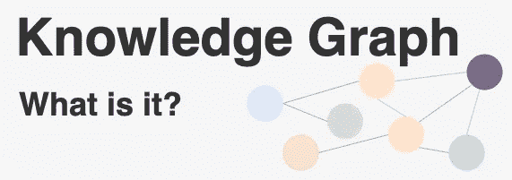
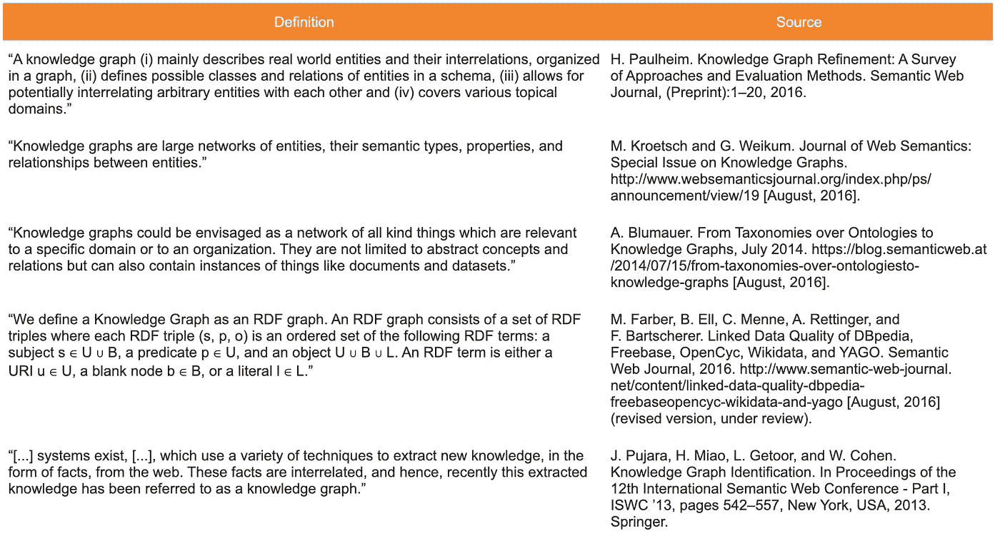
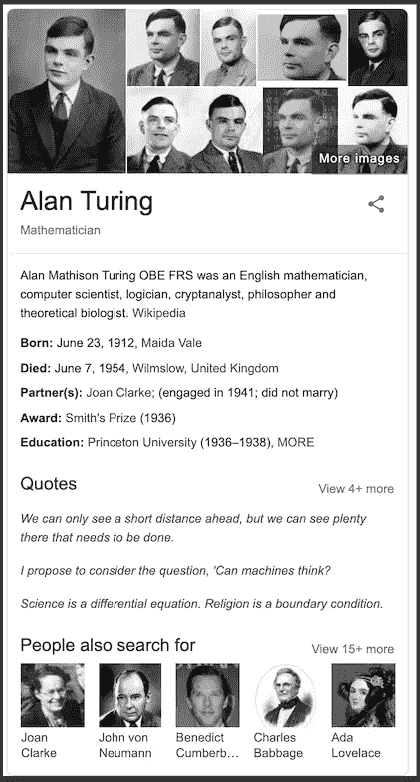

# 知识图:概述

> 原文：<https://medium.com/analytics-vidhya/knowledge-graphs-an-overview-2d0d250dd3b9?source=collection_archive---------6----------------------->

## 什么是知识图谱？

在我之前的帖子中，我们已经讨论过[图](/analytics-vidhya/introduction-to-graphs-44c4356212c7?source=friends_link&sk=6ba643a730d5ee6bb0f75a0c3b9b4609)，本体[简而言之](/analytics-vidhya/ontologies-an-overview-b23ccc7e976?source=friends_link&sk=b816f2f444986e134923fd658d34da9c)和[细节](/analytics-vidhya/ontologies-in-detail-2916f9226133?source=friends_link&sk=254b816dcb6bf3e10429e322ffc8eb84)。在本帖中，我们将从一个鸟瞰的角度来看知识图表，并获得一些关于它们的直觉。

本体论被描述为对哲学中存在的东西的研究，而被描述为人工智能中意义的规范。也就是说，本体规定了概念化，描述了信息系统中实体之间的类型、属性和相互关系。四十多年来，我们一直在人工智能研究中使用本体，但在过去的几十年里，知识图已经成为该领域的焦点。它们受欢迎的主要原因是被谷歌等众多科技巨头使用。但是，什么是知识图呢？

## 什么是知识图谱？

像*分类法*或*本体论*一样，*知识图*的定义也是不一致的。甚至有一篇关于知识图定义的论文[1],它记录了几个描述并把它们列表。

从走向知识图的定义[1]

上述论文接着提出了知识图的如下定义:

> 知识图获取信息并将信息集成到本体中，并应用推理器来获取新知识。

让我们讨论一下表中提到的一些**常见因素**:

*1。一个知识图是一个* ***图***

知识图被组织成利用数据中的关系的图，并为用户提供了巨大的灵活性。

*2。一个知识图是* ***语义***

在知识图中，数据的含义以本体的形式随数据一起出现。也就是说，数据可以用它所属的实体或它与其他实体的关系来表示。因此，查询更容易。

*3。一个知识图提供了* ***推理***

因为知识图是基于本体的，所以它们提供了某种形式的推理，也就是说，通过利用各种图计算技术，可以从显式数据中导出一些隐式信息。

## 本体与知识图

知识图是表示本体的方式之一，本体由实体的集合组成，其中类型和属性具有为它们声明的值，并且它们之间的关系被映射。

通常，本体处理概念，而不是这些概念的实例。例如，可能存在这样的关系，即*桃红* **是** *葡萄酒*，而不是**桃红**在我们当地市场的货架上。如果用知识图来表示一个本体，那么就有可能扩展这个知识图，因为它是从某个来源提取的，可以帮助解释给定的来源。

## 谷歌的知识图谱

知识图谱是谷歌搜索体验的重要组成部分。它通过各种来源收集数据，如关于人、事件、动物、事件、历史和其他主题的[维基百科](https://www.wikipedia.org/)、[、*中情局世界实况手册*、](https://www.cia.gov/library/publications/the-world-factbook/)和[免费数据库](https://en.wikipedia.org/wiki/Freebase)，以增强其搜索引擎的结果。

如果你搜索一个特定的人，谷歌知识图谱会显示一个几乎完整的个人资料，这取决于这个人有多好。

*   例如，在艾伦·图灵的案例中，除了左边的搜索结果，我们可以看到他的职业、出生和死亡日期、已知的合作伙伴、获得的奖项、教育历史、一些属于他的引文，以及右边作为面板的一些相关人员推荐。

谷歌的知识面板/卡片显示了知识图表背后最明显的工作结果。

*   例如，搜索一部最近上映的电影， *Joker* 会显示海报、评论、你当地的放映地点以及你当前 GMT 的放映时间。

当谷歌在 2012 年发布知识图谱时，他们制作了一个非常具有介绍性和解释性的视频。这解释了知识图是如何工作的，以及当你搜索一个特定的术语时，它如何影响你得到的结果。

谷歌推出知识图表

## 总而言之……

大多数时候，知识来自多个来源，必须进行整合，而知识图在这方面做得很好。一些公司或团体创建了他们自己版本的知识图，将信息组织成数据和知识，如知识库、微软的 Satori、脸书的实体图和谷歌知识图。在这篇文章中，我们对知识图表做了一个概述，并试图理解它的实际意义。更多详情，敬请关注！

## 参考

1- [“走向知识图的定义”，Lisa Eherlinger 和 Wolfram Wó，CEURWorkshop Proceedings](http://ceur-ws.org/Vol-1695/paper4.pdf) 。

2- [知识图谱](https://en.wikipedia.org/wiki/Knowledge_Graph)