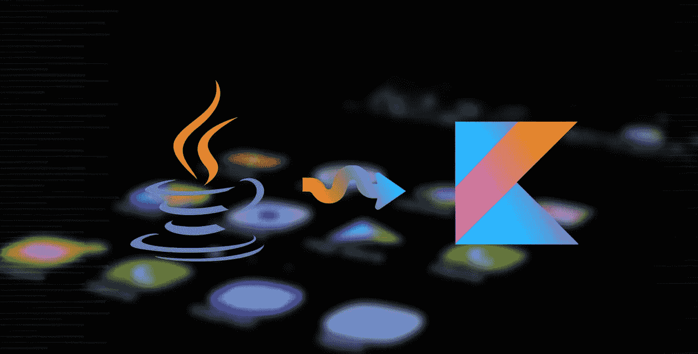
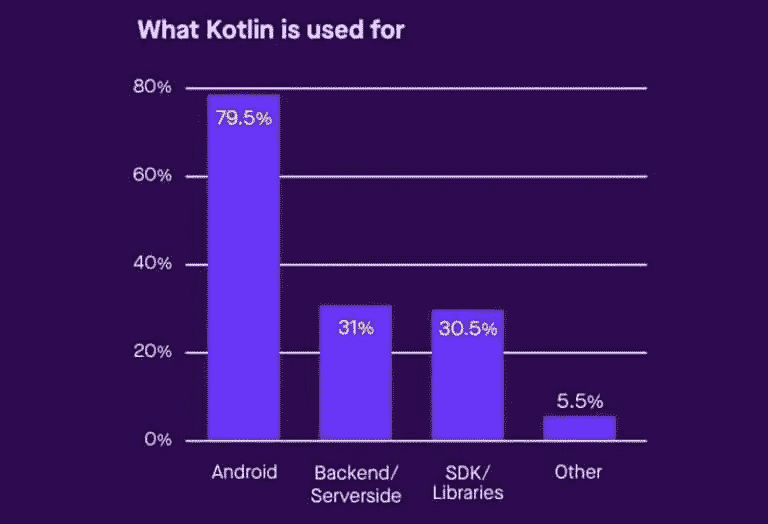

# Kotlin Vs Java:更好的编程语言。一场大辩论！

> 原文：<https://medium.com/analytics-vidhya/kotlin-vs-java-the-better-programming-language-a-big-debate-6c0a4f145309?source=collection_archive---------10----------------------->


# kot Lin——发展世界中的新野兽:

Java 可能是用于 Android 应用程序开发的第一种编程语言，但我们现在有了一个可能吸引所有人注意力的竞争对手，那就是 Kotlin！

Kotlin 是一种静态类型的通用编程语言，专为与 Java 和 JavaScript 完全互操作而设计。这是一种由 Jetbrains 设计的非常强大的编程语言。它主要针对 JVM，但也使用 LLVM 编译器编译 JavaScript。

Kotlin 于 2019 年 5 月 7 日被谷歌公布为 Android 应用程序开发的首选编程语言，从那时起，这种语言在开发者中变得更加流行。Kotlin 的主要焦点是用更好、更精确、更强大的样板代码来帮助混合语言项目。然而，许多人仍然更喜欢用 Java 来开发 Android 应用程序，从而使 Java 成为编程行业中的一种重要语言。

# Kotlin 如何确保相对于 Java 的优势？


1.  ***柯特林的短句:***

Kotlin 以简洁著称，这是这种强大的语言比 Java 更胜一筹的重要因素之一。它在很大程度上减少了样板代码，从而降低了出现更多错误的风险，因为样板代码越少，代码的可读性就越好。

举一个用 Java 和 Kotlin 编写的数据类的语法的例子来进行清楚的比较:

**Java 语法:**

```
public class ChapterTeamFragModel  {private String ChapterName;private String ChapterFullForm;private  int ChapPhoto;public ChapterTeamFragModel(){}public ChapterTeamFragModel(String chapname, String chapterfullform, int chapterphoto){ChapterName=chapname;ChapterFullForm=chapterfullform;ChapPhoto=chapterphoto;}public int getChapPhoto() { return ChapPhoto; }public String getChapterName() { return ChapterName; }public void setChapterFullForm(String chapterFullForm) { ChapterFullForm = chapterFullForm; 
}public String getChapterFullForm() { return ChapterFullForm; }public void setChapterName(String chapterName) {
ChapterName = chapterName;
}public void setChapPhoto(int chapPhoto) {ChapPhoto = chapPhoto;}}
```

**科特林语法:**

```
data class ChapterTeamFragModel(val ChapterName :String , val ChapterFullform :String , val ChapPhoto :Int)
```

上面的代码例子清楚地强调了 Kotlin 的简洁。

除此之外，使用委托、KotlinLib 和单行函数，不使用“findViewbyids”，使用“setOnClickListener”的较短代码，这些例子有助于减少样板代码，使 Kotlin 成为一种强大的语言。

***2。Kotlin 的互操作性:***

互操作性是 Kotlin 的首要目的。从一开始，引入这种语言的意图就是它与 Java 的互操作性。开发人员可以有效地编写与项目中现有 Java 代码文件兼容的代码段。通过共享字节码，Kotlin 编译器解决了两种语言同时运行的问题。

***3。它把你从空指针异常中拯救出来:*十亿美元的错误！**

空指针令人沮丧，可能是项目中最大的错误来源，并且在调试过程中浪费了大量时间。这就是科特林出手相救的地方！默认情况下，Kotlin 支持所有不可空的数据类型，即。与 Java 不同，数据类型不能包含空值，这让 Kotlin 占了上风。

***4。没有原始数据类型:***

Kotlin 通过使用泛型来赋予代码更高的安全性，而 Java 通过使用原始数据类型来运行，这可能会导致编译时错误。Kotlin 泛型确保类型安全(一次只允许一种类型的对象)、编译时错误安全，并且不需要类型转换。

***5。摆脱检查异常！***

如果你厌倦了在代码中堆积 try 和 catch 块，那么这可能会把你吸引到 Kotlin。Kotlin 没有检查异常，所以没有声明异常的麻烦。很多时候，不存在的异常可能有点棘手，所以 Kotlin 完全消除了检查异常，这最小化了冗长性并提高了类型安全性。

**⑥*。功能编程:***

科特林强调面向对象和函数式编程。它由各种有用的函数组成，如大量的高阶函数、lambdas、内联函数、惰性求值、lateinit 变量初始化等。虽然 Java 不支持函数式编程，但它在 Android 应用程序开发期间支持 Java 8 规范的子集。

**7。合作套路:**

长时间运行的任务可以用 Kotlin 协同例程来处理，它会在某一点暂停执行，而不会阻塞线程，然后在其他线程上继续执行。协程是 Android 上异步编程的推荐解决方案。而 Java 使用创建后台线程的传统方法来处理这些操作，并且多线程的管理变得很麻烦。

# 改编——从 Java 到 Kotlin:



如果你擅长 Java，切换到 Kotlin 对你来说会容易很多。在转换到 Kotlin 的过程中，应首先关注以下事项:

1.当然是基本语法。

2.命名参数

3.科特林仿制药

4.数据类别

5.空安全和安全调用

6.智能转换

7.扩展功能

从 Java 过渡到 Kotlin 的判断应该主要取决于您适应一种新语言和从头开始探索基础的意愿。如果您正在考虑对现有的项目进行切换，那么您必须弄清楚您的代码结构及其组织将会受到怎样的影响，因为这将需要在您的代码中进行大量的添加和删除。

# 科特林的现状及其可能的未来:



科特林不是镇上的新人了。它已经存在一段时间了，尽管它直到 2015 年才准备好生产。开发它主要是为了它的互操作性，减少样板代码和编写代码时引起的其他问题。目前，大多数开发人员仍然坚持使用 Java，因为它非常受欢迎，他们有用 Java 编写代码的经验，也因为对 Java 的大量支持，但是随着像 Google 这样强大的科技巨头开始使用 Kotlin，人们很可能会完全过渡到 Kotlin。

# 这是 Java 的末日吗？


尽管就其优势而言，Kotlin 极大地证明了自己比 Java 更有优势，但当涉及到在两种语言之间进行选择时，开发人员仍然有一种矛盾的感觉。有些人更喜欢坚持使用 Java，因为他们对这种语言有经验，也很熟悉，而且他们对从头开始使用一种新语言持批评态度，而许多人则倾向于探索一种强大的替代方法来减轻他们的工作负担，同时牢记 Kotlin 提供的额外津贴。

以我的观点来结束这场辩论，我想说，Java 仍然是许多开发人员广泛使用和首选的语言，并且由于其大量的资源和可供参考的文档，它将在业界坚持更长的时间，尽管 Kotlin 可能会很快成为一种更受欢迎和广泛使用的语言。

谢谢你阅读它。如果你喜欢这篇文章，请不要忘记点击👏按钮，请在下面留下你的评论，并在评论区告诉我你对此的看法。