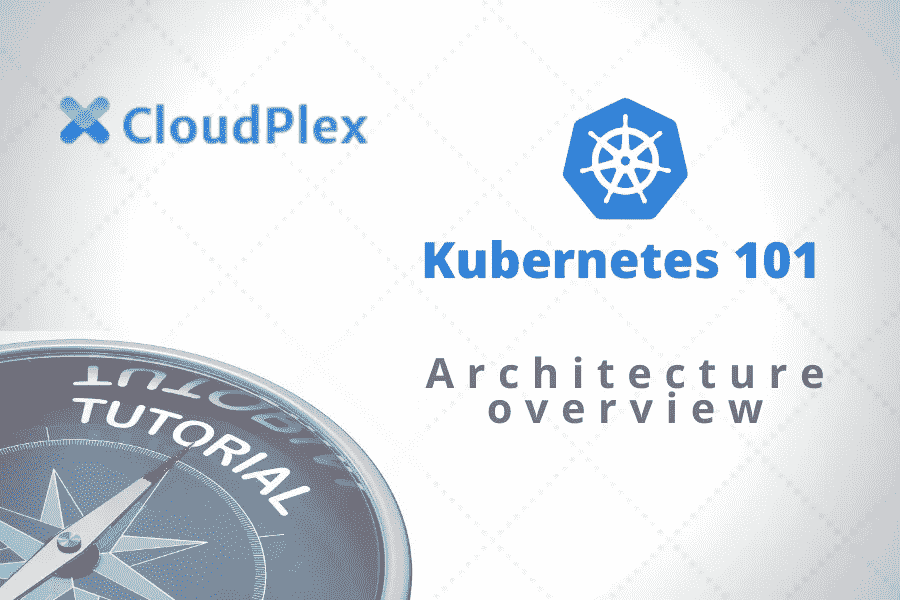

# Kubernetes 101 第 1/4 部分:架构概述

> 原文：<https://medium.com/analytics-vidhya/kubernetes-101-part-1-4-architecture-overview-a8fa31b09f9e?source=collection_archive---------24----------------------->

# 概观

Kubernetes 是一套强大的 DevOps 工具，帮助您以可靠、可伸缩的方式部署代码。你可能已经听说过 Kubernetes，以及相关的技术，如容器和微服务。在这组教程中，我们将深入了解 Kubernetes，并通过实践教程了解它的能力。

# Kubernetes 集群架构

Kubernetes 在节点上运行，这些节点是更大的 Kubernetes 集群中的独立机器。如果您运行自己的硬件，节点可能对应于物理机，或者更有可能它们对应于云中运行的虚拟机。节点是部署应用程序或服务的地方，也是 Kubernetes 完成工作的地方。

在节点完成工作的同时，Kubernetes 还提供了一种复杂的机制来管理节点并确保它们处于正确的状态。这被称为控制平面。控制平面是您与 Kubernetes 集群进行大部分交互的地方。当您想要部署应用程序、获取有关集群健康状况的信息或更改配置时，您可以通过与控制平面进行交互来实现。

在本教程的其余部分中，我们将通过检查控制平面主节点的内部结构以及工作节点的样子，进一步了解集群的主要组成部分。

# 主节点

主节点是控制平面的核心。一方面，它与集群中的任何其他节点一样，这意味着它只是另一台机器或虚拟实例。另一方面，它运行控制集群其余部分的软件。它向集群中的所有其他节点发送消息，为它们分配工作，它们通过它运行的 API 进行报告。

主节点软件的核心是 API 服务器。这个 API 是从节点到控制平面通信的唯一端点。API 服务器是节点和主节点就 pod、部署和所有其他 Kubernetes API 对象的状态进行通信的地方。

关于这些对象的当前状态的信息存储在 etcd 中，这是一个高可用性的键值存储。Etcd 是集群的真实来源，旨在随着集群规模有效地扩展，以便来自工作节点的大量 API 更新可以有效地转换为关于系统的更新。

通常，这些更新需要更改集群的状态。例如，您可以向 API 服务器发送部署新版本代码的请求。API 服务器验证该请求，然后在 etcd 中设置更新后的状态。最后，必须执行更新。这是管理员的工作。控制器管理器是一个后台守护程序，它在一个循环中持续监视系统的状态。当新的更改请求到来时，它会将该请求转换为必须在集群上执行的一系列操作，以便实现所需的状态。

最后，调度程序是主节点的一部分，负责在工作节点上部署预定义的服务并管理它们的正常运行时间。调度器查找已经定义但尚未分配的 pod(我们将在下一次讨论),并找到一种方法将它们分配给工作节点。

# 工作节点

顾名思义，工作者节点在 Kubernetes 中做真正的工作。当您在应用程序中部署容器或 pod 时，您正在将它们部署为在工作节点上运行。工人拥有运行一个或多个容器的资源，经理告诉他们运行哪些容器。

节点运行一个名为 kubelet 的进程，这是将工作分配给节点的主要方式。当它启动时，kubelet 向管理器注册，以指示节点准备好工作。然后，kubelet 定期检查管理器，通常是通过管理器的 API 服务器，查看是否有 pods 分配给这个节点。如果有，它会提取这些 pod 的 PodSpec，告诉 worker 节点要运行什么。

在 Kubernetes，工作是通过容器完成的。容器是用于执行代码的自包含环境。最广为人知的容器类型是 Docker，但是 Kubernetes 可以配置为与许多现有的容器技术一起工作。这是在容器运行时设置的，它告诉工人您将使用哪种类型的容器。因为一个工作节点可能运行几个容器，这些容器在不同的端口上托管服务，所以工作节点的最后一个组件是 kube-proxy 服务，它将流量导向节点。代理服务使用容器定义中的端口定义来选择要公开的端口，并发送流量。它还可以进行一些基本的负载平衡，比如循环流量。

阿萨德·法伊兹
创始人、首席执行官
CloudPlex.io

*原载于 2020 年 5 月 14 日*[*https://cloud plex . io*](https://cloudplex.io/tutorial/kubernetes-101-tutorial/)*。*