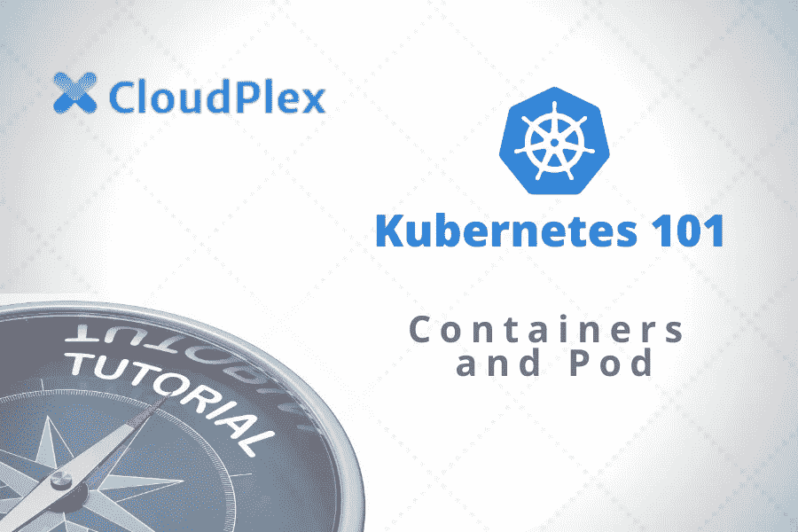

# Kubernetes 101 第 2/4 部分:集装箱与豆荚

> 原文：<https://medium.com/analytics-vidhya/kubernetes-101-part-2-4-containers-vs-pods-2ab486c748a4?source=collection_archive---------25----------------------->



# 概观

我们已经看到了 Kubernetes 如何通过将工作分配给 Kubernetes 集群中的不同工作节点来构建可伸缩的分布式应用程序。但是你如何定义工作呢？您如何确保不同工作单元的依赖关系得到管理？

这就是豆荚和容器进入故事的地方。许多开发人员已经通过使用 Docker 或类似工具熟悉了容器。容器允许您创建定义良好的运行时，将您编写的代码及其操作系统和运行时依赖项打包到一个隔离的上下文中。例如，用 Node.js 编写的 web 服务器将包括由开发人员编写的服务器代码以及运行它所必需的 Node.js 二进制文件，以及对操作系统版本的所有依赖。

容器允许您创建可以独立运行的独立工作单元。要创建复杂的应用程序，通常需要组合多个容器。例如，上面的 web 服务器可能需要一个数据库来存储长期信息，这将是 web 服务器所依赖的一个单独的容器。或者，使用机器学习来标记照片的 web 应用程序可能有单独的容器用于核心服务器、标记模型和处理照片。

这就是吊舱的设计目的。pod 允许您使用多个容器，并指定它们如何组合在一起创建您的应用程序。pod 允许您指出哪些容器依赖于哪些其他容器，以及它们期望在哪个接口上进行通信。

在本教程中，我们将仔细研究如何构造容器并将它们组合成 pod。这些组件是 Kubernetes 架构的核心构建块，因此即使您熟悉基础知识，也值得花一些时间来真正理解这些概念。

# 容器

在本质上，容器是一个受控的执行环境。它们允许您从头定义环境:从操作系统开始，到您想要使用的库的各个版本，到您想要添加的代码版本。您还可以指定要运行的命令。

开发人员通过 Docker 最熟悉容器，Docker 是最著名的管理和运行容器的软件。Docker 允许您创建遵循上述模式的 docker 文件。在下面的 docker 文件中，我们从 Ubuntu 操作系统开始，添加 NodeJS 的依赖项，并在文件“app.js”中添加我们的代码

```
FROM ubuntu 
RUN apt-get update 
RUN apt-get install -y nodejs 
RUN mkdir /var/www ADD myapp.js /var/www/myapp.js CMD ["/usr/bin/node", "/var/www/myapp.js"]
```

要构建它，只需使用 docker build 命令，并使用-t 标志添加一个名称:

```
docker build -t my-app/node-server .
```

Docker 并不是 Kubernetes 允许的唯一容器工具。您可以使用其他工具，如 CRI-O 或 Containterd，但这些工具不太为人所知。您使用的容器工具称为容器运行时，它由运行 Kubernetes 时的环境变量设置。

# 分离舱

Kubernetes 中的一个工作单元不是一个容器，而是一个 Pod。pod 接受一个容器，并告诉 Kubernetes 如何部署和运行它。您可以通过编写一个 YAML 文件来定义一个 pod，该文件指定 pod 中的容器、如何运行它以及任何附加内容，如附加的存储卷或网络参数。

运行我们的节点服务器容器的示例 YAML 文件是:

```
apiVersion: v1 
kind: Pod 
metadata: 
   name: myapp-pod 
   labels: 
      app: myapp 
spec: 
   containers: 
     - name: myapp-container 
     image: my-app/node-server 
     command: ["/usr/bin/node", "/var/www/myapp.js"]
```

这定义了一个名为 myapp-pod 的 pod。规范很简单，只有一个我们之前创建的容器。该规范还包括我们运行应用程序所需的命令。这是最简单的 pod 规范，只有一个容器，没有任何特殊的网络或卷。


使用 cloudplex.io 开始可视化构建您的 Kubernetes 应用程序

阿萨德·法伊兹
创始人兼首席执行官
CloudPlex.io

*原载于 2020 年 5 月 14 日*[*https://cloud plex . io*](https://cloudplex.io/tutorial/pods-and-containers-tutorial/)*。*